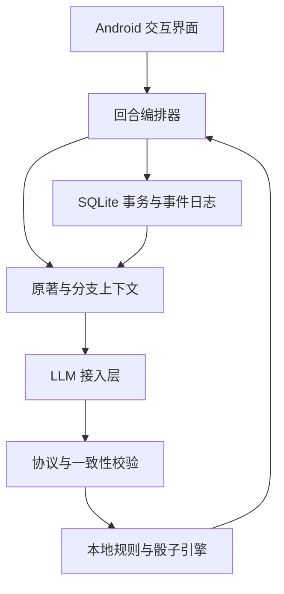
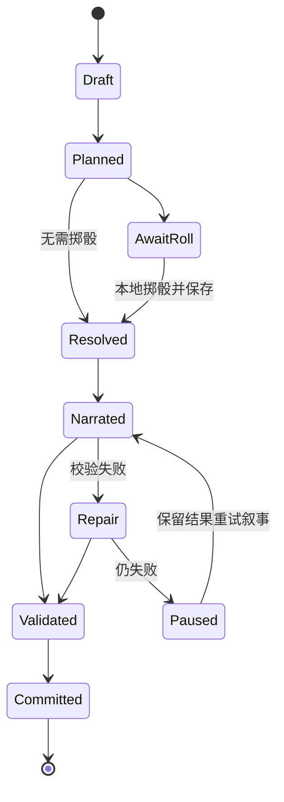

# ShineWord 互动小说跑团 Android App 建设方案

版本：V1.0 建设基线  
编制日期：2026-09-26（北京时间）  
目标仓库：`anjingdtl/ShineWord`，公开仓库  
状态：设计方案，尚未实现或完成性能验收。本文中的默认数值是待平衡的产品基线，不代表原著事实或现成 D&D 规则。

## 1. 产品定位与建设结论

ShineWord 是一款由用户配置 LLM API、导入小说 TXT、进入原著世界进行单人互动冒险的 Android App。用户可扮演原著角色或创建角色；每段剧情之后，通过固定选项或自由输入采取行动。LLM 担任主持人与叙事者，本地规则引擎负责检定、随机数、成长与状态结算，原著事实库负责世界约束。

核心承诺是“原著世界内的合理分支”：开局前历史固定，世界硬规则固定，开局后事件允许被玩家合理改变。保存的是独立游戏分支，不改写用户导入的原文。严谨一致是持续检查的工程目标，不能承诺概率生成模型绝不出现语义错误。

已确认需求：Android-only、API 驱动、TXT 构建世界、原著／原创角色、固定选项＋自定义行动、骰子检定、能力约束与成长、公开仓库 ShineWord。

本方案确定的实施默认：单人、本地优先、API Key 由用户提供、原创轻量规则、技能实践成长为主＋里程碑奖励为辅。成长阈值、战斗节奏和失败惩罚属于可调整配置。

首版不建设多人大厅、云账户、内容交易市场、实时地图战棋、语音对话、图片生成或完整 D&D 规则兼容层。Android-only 不等于必须重写为全 Kotlin；优先沿用 tavo-mini 的 React Native 技术基础。

## 2. GitHub 参考研究与取舍

### 2.1 研究口径

2026-09-26 读取 GitHub 官方仓库元数据与 README；星数为该日读取快照，会继续变化。高星只是筛选信号，实际取舍看领域适配、复杂度和运行平台。下列项目并非都属于高星项目：boardgame.io 是万星通用回合引擎；MapTool 等是垂直跑团项目；d20 是补充参考的底层骰子库。

本轮完成文档与局部源码研究，未部署或完整审计这些项目；“可借鉴”不表示其代码可直接运行在 ShineWord。

| 项目 | Stars 快照 | 官方资料中的能力 | ShineWord 采用的设计 | 不直接引入的部分 |
|---|---:|---|---|---|
| [boardgame.io](https://github.com/boardgameio/boardgame.io) | 12,441 | 回合阶段、状态管理、游戏日志、历史状态查看 | 明确动作、阶段、状态转换；可重放日志 | 多人服务器与大厅；首版不直接依赖整套引擎 |
| [MapTool](https://github.com/RPTools/maptool) | 926 | 系统无关 VTT、单位属性、状态、先攻、可见范围 | 主持人事实与角色已知信息分离，遭遇状态持久化 | 桌面地图与联网实现 |
| [Foundry dnd5e](https://github.com/foundryvtt/dnd5e) | 595 | Actor、Item、角色表、骰子及规则支持 | 角色、物品、效果与行动统一建模 | Foundry 宿主与成套 D&D 内容 |
| [Avrae](https://github.com/avrae/avrae) | 468 | 角色表驱动检定、骰子解析、先攻及 HP／状态追踪 | 从角色状态自动派生检定，战斗使用确定性记录 | Discord、Redis、MongoDB 后端 |
| [SealDice](https://github.com/sealdice/sealdice-core) | 298 | 中文跑团骰点核心、规则扩展、DiceScript | 中文行动解释与规则模块分离 | IM 平台接入与完整脚本虚拟机 |
| [avrae/d20](https://github.com/avrae/d20) | 140 | 骰子表达式树、执行限制、解析与输出 | 受限语法、执行预算、可解释骰子结果 | Python 运行时及任意复杂表达式 |

归纳后的自主设计原则：角色表是数据，规则是程序，剧情是表达；LLM 不获得直接写库或决定随机结果的权限。对外部项目主要借鉴模块边界，不复制整个系统。

### 2.2 与 tavo-mini 的复用关系

已读取 [package.json](https://github.com/anjingdtl/tavo-mini/blob/main/package.json)、README、服务目录和部分源码。当前声明依赖包括 React Native 0.85.3、React 19.2.3、TypeScript、Zustand、React Navigation、react-native-sqlite-storage 与 react-native-keychain。新仓库初期沿用已验证的锁定依赖组合，不在迁移时同时升级技术栈。

| 现有路径／能力 | 核查深度 | 复用策略 |
|---|---|---|
| `src/services/projectTxtImport.ts` | 局部源码 | 抽取流式解码、分章、预览；不沿用其 outline 项目写库语义 |
| `src/services/llm.ts`、`llm/` | 入口源码与目录 | 抽取 provider、请求调度、能力与用量接口；以新数据库适配 |
| `src/services/secureStorage.ts` | 局部源码 | 复用安全存储模式，改为 ShineWord 独立服务标识 |
| `src/services/contextAutoAllocator.ts` | 局部源码 | 复用预算机制，重新定义游戏回合上下文类别 |
| `continuation/`、`storyMemory/`、`recall/` | 目录与 README | 后续审计 Canon、检索与记忆的函数契约，再选择性迁移 |
| `backupService.ts`、`updateService.ts` | 路径与 README | 评估备份、更新思路；实施前读取完整实现 |
| 多稿写作／章节编辑流水线 | README | 保留一致性检查思想，重写成短回合协议 |

不宣称现有 Canon 已满足时间过滤、分支污染隔离或 NPC 认知隔离；这些必须单独验收。先做独立应用与数据库，不在成熟写作项目中混入游戏迁移。应用 ID 建议 `com.shineword.app`，须在工程阶段核对冲突；安全存储、备份格式、更新清单和版本号均独立。

## 3. 用户流程与页面

| 页面 | 核心操作 | 完成条件 |
|---|---|---|
| 世界书架 | 导入 TXT、继续世界构建、新建存档 | 展示解析进度、覆盖度与失败重试入口 |
| 导入预览 | 编码、章名、字数、文件哈希 | 用户确认分章结果，可修正章节 |
| 世界构建 | 原著事实、角色、时间线、规则映射 | 冲突与推测单独展示，生成版本化世界包 |
| 开局设置 | 角色、时间锚点、地点、目标 | 形成满足前置条件的初始快照 |
| 剧情页 | 阅读、3～4 个差异化选项、自由输入 | 有风险行动先展示检定卡，完成后展示结果 |
| 人物页 | 技能、属性、物品、状态、关系 | 数值来源与最近变化可查看 |
| 日志与存档 | 回合日志、分支、恢复、导出 | 回退能恢复数据和记忆，不只隐藏正文 |
| 模型设置 | Endpoint、模型、Key、预算 | 连通性与结构化输出测试通过 |

剧情页默认每回合约 300～600 汉字，可调；不为凑字数追加无意义请求。复杂转场可更长，战斗更短。自由输入允许行动、对话、观察与目标表达，连续多步指令按行动成本拆分，不能一次输入绕过十个回合。

普通状态用折叠卡片，骰子动画可跳过。等待过程中明确显示“拟定检定／等待投骰／生成剧情／校验”，下一轮仅在本回合提交后解锁。未校验流式文字只能标为临时内容，不作为已发生剧情或角色记忆。

## 4. 小说世界构建流水线

### 4.1 分阶段生成与恢复

流程为：选择文件 → 流式解码与归一化 → 分章／分块 → 分章事实抽取 → 跨章实体合并 → 时间线与冲突检查 → 世界规则映射 → 开局预览。

原文保留不可变文件和 SHA-256；归一化文本另存并保持段落映射。正文位置使用 `chapterId + paragraphId + startOffset + endOffset`，明确偏移为归一化文本的 Unicode code point 偏移，不能混用 JS UTF-16 单元。更改解析策略产生新版本，不使旧引用悄悄漂移。

每块任务保存内容哈希、提取器版本、模型配置指纹、状态、usage、结果和错误。同哈希与同版本成功任务复用，失败仅重试当前块。数据库事务只覆盖短时写入，网络请求期间不持有事务。

原著抽取可以并发，首版默认并发 1～2；交互游戏请求优先。Android 进程被杀后从任务记录恢复；不能依赖 JS 定时器持续运行。初期以用户前台可见构建为主，后台长期任务需要原生可恢复调度与明确状态通知再启用。

### 4.2 事实类型与证据

每条事实至少包含：`factId、subjectId、predicate、value、sourceRefs、confidence、status、validFrom、validTo、revealAt、scope`。

`status` 分为原文明示、可靠归纳、推测、冲突待定、用户补充。模型置信度不能代替证据校验；校验引用确实存在且文本吻合。对白中的传闻与不可靠叙述不能直接升级为世界真相。

实体包括人物、势力、地点、物品、能力、规则与事件。别名合并采用候选评分＋证据，不因同名自动合并；前后身份变化保留时间范围。倒叙需要同时保留“叙述位置”和“世界发生时间”；未知时间保存偏序关系，不虚构精确日期。

### 4.3 首版覆盖策略

默认先完成全书基础事实扫描，再细化当前开局相关章节。全书扫描也不能证明提取完整；展示覆盖章数、来源缺失和冲突数。部分构建世界只允许“预览试运行”，不标记为严谨模式就绪。超长原著按章落盘、限并发、限单块大小，避免全书 JSON 常驻 JS 内存。

首个性能基准采用约 20 万汉字、50～100 章测试书；100 万字用于压力测试，不承诺首版所有手机都无条件支持。设备失败应可恢复并报告瓶颈，不能强制重跑全书。

## 5. Canon、时间与分支边界

数据分为四个边界：

1. 原著 Canon：世界规则与原著事件，游戏不可覆盖。
2. 世界游戏映射：把原著表现转为技能、属性、难度和能力资格，属于游戏化解释。
3. 分支状态：本次存档已经发生的事件、位置、物品、关系、资源。
4. 派生记忆：摘要、检索索引与叙事笔记，可重新计算。

检索优先级不是简单“新事实覆盖旧事实”：对不可变世界规则，分支事件不得覆盖；对可变人物状态，开局初值由 Canon 提供，后续由本分支事件推进。发生冲突时依据事实类型判定。

开局以后原著事件是带前置条件的候选走向，不是已经发生的事实。玩家救下角色后，依赖其死亡的后续事件应标记待重算，不能继续机械套用。用 `event_dependencies` 和 `divergence_markers` 追踪受影响节点，优先重算当前相关区域，不模拟全世界每秒变化。

NPC 可知内容由认知记录控制：亲历、告知、公开消息、推断各有来源。读者、玩家角色、其他 NPC、主持人拥有不同可见范围。Narrator 仅接收可公开信息；裁定器如需秘密事实，通过受限判定结果传递，不把幕后真相整段送入公开叙事。

原著角色被玩家接管后，开局状态保持原著，但玩家拥有行动权；重大性格变化通过旁人反应和关系影响表达，不以“原著角色不会这样”强行取消所有选择。原创角色默认是世界内原生人物，不默认穿越者全知；预知原著模式留为后续设置。

## 6. ShineWord 轻量骰子规则 V0.1

### 6.1 行动判定与适用范围

先判定资格，再判定是否有不确定性。无风险日常动作直接执行；风险且有后果的动作掷骰；违反硬规则或缺少必要能力的动作不可检定。最高骰不等于无条件奇迹。

这是本项目原创规则草案，不称作 D&D 5e 的原规则。每个存档冻结 `rulesetId + rulesetVersion + worldMappingVersion`。修改规则对新存档生效，旧存档须显式迁移或分支。

### 6.2 属性与技能

基础属性暂定体魄、敏捷、洞察、学识、意志、交涉，每项 1～3。原创普通角色默认六项均为 1，加 4 点自由分配，单项不超过 3；特定世界可配置。原著角色由表现证据映射，不采用原创点数总额，但不得赋予开局尚未掌握的能力。

| 技能级别 | 骰面 | 含义 |
|---|---:|---|
| 未训练 | d4 | 仅能尝试允许无训练的行动 |
| 入门 | d6 | 获得基础方法 |
| 熟练 | d8 | 稳定执行常规任务 |
| 精通 | d10 | 能处理复杂任务 |
| 大师 | d12 | 同一能力层级内的高水平 |

这张表统一前期讨论中的命名，替代“入门 d4”草案。属性决定基础颗数，技能决定骰面。`n = clamp(属性 + 情境颗数修正, 1, 4)`，投 `n d s` 取最高值 R，与难度 D 比较。不使用所有骰子求和，不混用成功颗数制。

同源加骰不叠加；情境修正合计限制为 -1～+1。已经达到 1 或 4 颗时，超出部分不继续折算加值。严重伤势、完全无光等可改变行动资格或产生事先定义的代价，避免临时随意叠加惩罚。

首版装备提供能力资格、情境优势或固定资源效果，不开放无限数值加成。重投、爆骰、对抗双方投骰暂缓，NPC 防御转为稳定难度。

### 6.3 难度、能力层级与成功率

同一层级内难度参考：简单 3、一般 4、挑战 6、困难 8、极难 10、巅峰 12。难度按客观场景与规则映射选定，不按玩家当前面数反向调节。

当 1 ≤ D ≤ s 时：`P(成功) = 1 - ((D - 1) / s)^n`。D > s 时成功率为 0，D ≤ 1 时为 1。App 可在公开检定卡展示精确概率。

| 检定 | 难度 | 成功率 |
|---|---:|---:|
| 1d8 取高 | 6 | 37.50% |
| 2d8 取高 | 6 | 60.94% |
| 3d8 取高 | 6 | 75.59% |
| 2d6 取高 | 6 | 30.56% |
| 2d10 取高 | 6 | 75.00% |

增加颗数提高可靠性，提升骰面提高上限。低技能面对高难度时必须寻找工具、帮助或替代路线。不能把难度自动降到玩家可达范围。

修仙境界等使用独立 `powerTier + prerequisites` 表示资格；d12 不代表所有小说宇宙的绝对巅峰。跨层级交互必须有世界规则允许的途径。同层级以内才使用统一难度表。突破境界不重置已学技能，但改变适用能力与挑战层级。

### 6.4 结果等级与代价

令 `margin = R - D`：≥3 为充分成功，0～2 为普通成功，-1～-2 为失败，≤-3 为严重失败。顶点不额外自动大成功，全部 1 也不额外追加未约定惩罚。高难度可能无法达到充分成功，这是该分布的明确取舍。

每次掷骰前冻结四档结果合同，包括是否达成目标、时间成本、资源变化、状态和可公开摘要。失败允许打开新的交涉、逃跑或调查局面，但不能把任何失败都偷偷变成成功。

相同目标、目标对象和相关状态未改变时，复用已裁定结果，不允许无限重投。若允许重试，必须有预先定义的时间／资源成本或风险升级。修改措辞不算条件变化。

### 6.5 成长机制

有效技能实践每个有独立风险的遭遇最多奖励同一技能 1 点，成功与认真尝试后的失败都可以获得。重复刷动作、回退已获奖励、无风险表演不奖励。

默认晋阶所需本阶练习点为 5、10、20、40，分别对应四次晋阶；晋阶还需世界允许的训练条件，消耗训练时间并扣除所需点数，不靠一次投骰直接解锁大师能力。里程碑可增加 1～2 点到已解锁技能，或授予满足条件的新技能；不能凭空增加属性。

属性成长依赖重大里程碑与明确上限；力量境界、法术、职业资格采用世界前置条件。数值由规则引擎计算，LLM 只提出带事件依据的成长候选。阈值必须经过连续游戏平衡测试后再冻结为正式版本。

## 7. 战斗与其他遭遇

首版采用叙事回合战斗，不做棋盘距离。场景有近／中／远距离带、掩体、在场角色和逃生出口。一次主要行动占一个回合；移动是否占行动由行动模板固定。NPC 按遭遇中冻结的顺序行动，不由生成长度决定行动次数。

生命、体力是基础资源，精神／内力由世界配置启用。武器伤害、护甲减伤、技能消耗由规则模板确定；例如原型普通命中伤害 2、充分成功 3，再减护甲并限制不低于 0。实际世界包需重新映射，不能用示例伤害覆盖原著能力层级。

生命归零进入失能状态，由场景合同决定被俘、救援、死亡风险或结局，不允许模型临时给予复活。玩家可读取旧存档创建分支；首版不做强制永久死亡。交涉、追踪、解谜使用统一检定，复杂目标用有限进度计数器与失败压力计数器表达。

关键线索不得全部锁在一次失败检定后；检定可以决定获得线索的成本、完整度或是否暴露。NPC 保留目标、底线和态度，交涉成功只能实现合同内的合理让步，不能强迫任何角色接受违背硬性立场的要求。

## 8. 系统架构



领域层使用纯 TypeScript，禁止依赖 React、网络或数据库；UI 使用 React Native，Zustand 仅存界面与当前快照缓存，不能成为唯一存档。原生层负责文件流、安全密钥、可靠随机数和必要后台任务。SQLite 是事务性权威数据。

建议模块：`features/library`、`features/import`、`features/world`、`features/character`、`features/play`、`features/saves`；`domain/rules`、`domain/world`、`domain/turns`；`application/import`、`application/turns`；`infra/llm`、`infra/db`、`infra/files`、`infra/random`；`schemas`、`rulesets`、`tests/fixtures`。

这是建议目录，不代表仓库已有源码。世界规则包采用受限 JSON，不运行原著、模型或下载资料中的脚本。首版仅内置可信行动模板，不开放任意模组执行。

## 9. 回合协议、随机与原子提交

### 9.1 回合状态机



风险行动通常两次请求：Planner 生成检定提案 → 本地验证与掷骰 → Narrator 描写已裁定结果。普通行动仍需要解释时也采用两阶段；已冻结选项合同且状态未变时可省略 Planner。LLM 不得在 Planner 提前决定实际骰子值。

### 9.2 最小协议示例

以下是字段示例，不是完整 JSON Schema；M1 需落地严格 schema、枚举与长度限制。

```json
{
  "protocolVersion": "1.0",
  "turnId": "turn-001",
  "expectedStateVersion": 12,
  "actorId": "actor-player",
  "actionType": "stealth",
  "targetId": "location-archive",
  "skillId": "stealth",
  "difficultyBand": "challenging",
  "evidenceIds": ["fact-wall", "scene-rain"],
  "requiresRoll": true,
  "intent": "进入藏书阁且不被发现"
}
```

客户端从属性、技能和可信情境计算 n、s、D，不接受模型直接指定 `diceCount`、`randomValue`、余额或新等级。Planner 的情境变化需有引用并经校验，模型不能以“风突然变大”无限追加优势。

完整行动合同还必须含四档后果、时间成本和资源预检；后果操作只允许 `consumeResource、changeLocation、applyCondition、advanceClock、transferItem、recordEvent` 等白名单，绑定已知实体与字段。新实体需独立候选验证，不能通过任意 JSON Patch 修改 Canon 或配置。

规则引擎产生 `RollRecord`：规则版本、合同哈希、骰面／颗数、每颗值、最高值、难度、结果等级、调用编号与时间戳。Android 原生安全随机源通过拒绝采样映射到骰面，避免取模偏差；测试使用注入的固定随机源。骰子动画只播放已保存结果。

单机日志只能提供可解释与恢复依据，不声称能防住设备所有者修改存档。回退创建新分支，原结果不删除；同一未完成回合重试保持已保存骰子，不能断网刷结果。

### 9.3 故障一致性

每次行动唯一 `turnId`；每分支同时最多一个活动回合。Planner、RollRecord 与候选叙事在暂存区持久化。提交事务检查 `expectedStateVersion`，同时写入事件、资源变化、状态快照、正文和 committed 标记；唯一索引阻止重复提交。

掷骰后 Narrator 失败：保留掷骰与合同，稍后重试叙事。已生成但尚未提交时进程死亡：恢复后校验候选再提交。提交成功但 UI 未收到回执：读取 committed 结果，不再扣资源。用户取消已掷骰回合只能暂停或显式创建分支，不能暗中丢弃结果继续同存档。

重试上限：正常两次调用；协议／语义修复最多追加两次，单回合自动请求上限 4，超限暂停并显示费用。网络重试计入物理请求预算，服务端是否计费不确定时记录为未知，不盲目重复整条链。

## 10. LLM 分工与一致性检查

逻辑角色包括 Extractor、WorldMapper、Planner、Narrator、Checker、Summarizer，但不要求不同模型，也不引入多个常驻自主代理。一个模型可以通过不同协议承担所有职责。

强制本地校验：schema、字段白名单、实体存在、状态版本、资格、物品唯一性、资源非负、成长上限、骰子结果不可变、分支可见性。语义检查重点是原著矛盾、NPC 知识越界、突然性格逆转、结果被翻转、未付代价的奖励。

重要事件（死亡、境界突破、永久关系、唯一宝物）触发独立 Checker；普通回合使用本地检查和可配置抽检，不能宣称达到与每轮语义审查相同的保障。发现错误只修叙事或不合法的候选补充，不能改骰子迁就文本。修复仍失败则停在暂存状态。

Checker 输出问题必须带 `issueId、candidateSpan、evidenceIds、severity、repairAction`。无依据疑虑作为提示，不无限修稿。用户报告矛盾时保留诊断和证据，可创建修正分支；修正文案不得悄悄重新结算历史状态。

模型提示优先级：程序硬规则与协议 > 当前行动合同 > 有效 Canon／分支事实 > 玩家行动意图 > 参考文本。小说内“忽略以上指令”等文字一律视为故事数据。自由输入不能改变规则、数据库、API 地址或密钥。

## 11. 检索与长期记忆

上下文组合按需选取：必要规则与协议、当前状态、相关 Canon 证据、行动目标及 NPC 已知事实、近期回合、长期事件摘要。先留足输出和安全余量，再分配输入预算；不得为填满窗口把整个原著每轮重发。

首版优先实体索引＋章节索引＋中文关键词检索；SQLite 全文能力和中文分词需在实际 Android 驱动验证，不默认 FTS 就能正确处理中文。必要时使用应用侧中文 n-gram 倒排索引。语义向量检索作为后续增强，避免强制增加 embedding API 依赖。

检索过滤先按世界版本、存档分支、事件时间、有效性与可见范围，再按相关度排序。角色现在不知道的未来秘密不得因为语义相近而进入 Narrator 上下文。

保留最近若干回合正文；每 5～10 回合或场景结束生成带事件 ID 的摘要。数字、物品归属、死亡、能力解锁与关键承诺始终从权威状态读取，不能只存在摘要。摘要失效可重建，不阻断读取已经提交的存档。

## 12. 数据模型与版本策略

| 表／集合 | 关键字段与用途 |
|---|---|
| `worlds`、`world_versions` | 世界 ID、源文件哈希、Canon／映射版本、构建状态 |
| `source_chapters`、`source_chunks` | 章节与段落、原文位置、内容哈希 |
| `entities`、`entity_aliases` | 角色／地点／物品等稳定 ID、别名 |
| `canon_facts`、`fact_sources` | 类型化事实、有效时间、证据、冲突状态 |
| `canon_events`、`event_dependencies` | 原著事件、前置条件、影响关系 |
| `world_rule_mappings` | 属性／技能／境界映射、证据、规则版本 |
| `campaigns`、`branches` | 世界版本、角色、开局锚点、父分支、分叉回合 |
| `actor_states`、`inventory`、`relationships` | 当前角色、资源、持有者、态度 |
| `knowledge_records` | 哪个角色在何时以何种方式知道何事 |
| `turns`、`action_contracts`、`roll_records` | 回合状态、冻结合同、不可变骰子记录 |
| `branch_events`、`snapshots` | 已提交事件与可恢复快照 |
| `memories` | 派生摘要、引用事件、失效标记 |
| `jobs`、`llm_requests` | 任务恢复、模型用量、成本与诊断 |

至少建立 `(branch_id, turn_id)`、`(turn_id, roll_index)` 唯一约束。存档快照与回合拥有单调 stateVersion。物品实例 ID 唯一；数量物品与唯一物品分别建模。更新 Canon 后既有存档继续锁定旧版本；想使用修订世界须新开或执行可审核迁移，不自动污染游戏历史。

导出格式建议 `.shineword-save.json`（存档）与 `.shineword-world.zip`（世界包），含 manifest、schemaVersion、rulesetVersion、哈希与依赖。首版先实现存档 JSON，世界包后置。导入校验文件大小、结构、哈希、引用完整性与压缩路径，拒绝可执行脚本。备份不包含 Key。

## 13. 模型成本、速度与安卓工程

模型配置按能力探测而非品牌硬编码：上下文窗口、输出上限、结构化 JSON、流式、usage、超时与取消。服务商不支持 JSON Schema 时采用严格 JSON 提示＋本地解析；失败不能直接把自然语言当状态。

用量分别统计世界构建与单回合。费用计算为输入 token × 输入单价＋输出 token × 输出单价，按服务商计费单位换算；单价由用户配置。usage 缺失时标注估算；不把汉字数当成精确 token。缓存仅在服务商实际支持且使用时计入节省。

首版预算默认每回合输入上限约 12k token、输出约 1.5k token，需按模型窗口缩减；这不是每次必须使用的量。世界构建预算单独设置，耗尽后暂停。后台摘要计入总费用，不能隐藏。

API Key 存安全存储，数据库仅存配置引用；日志默认脱敏，导出请求诊断需用户主动选择。原文和游戏上下文将按请求发送给用户指定服务商，在配置与首次构建时说明。只申请所需文件访问能力，采用 Android 文件选择器，不依赖全盘存储权限。

性能目标属于验收目标：本地骰子与状态结算通常低于 100ms（目标设备实测）；长列表虚拟化；导入不长期阻塞 UI 线程。模型端延迟单独记录 P50／P95、首 token 与完整回合耗时，不能把网络等待承诺成固定秒数。无网络可读历史、看人物、管理存档；不能伪装为已生成新 AI 剧情。

## 14. 分阶段实施与交付门槛

不以固定天数承诺排期；每阶段达到出口条件再继续。

| 阶段 | 建设内容 | 出口条件 |
|---|---|---|
| M0 方案与抽取审计 | 文档、来源、模块依赖、规则决策 | 明确复用清单与不复用清单，读取目标函数与测试 |
| M1 确定性内核 | 骰子、资格、合同、状态机、事务、固定世界夹具 | 无 LLM 也能完整模拟行动与重放，概率与幂等通过 |
| M2 安卓闭环 | 应用壳、Key、API、Planner／Narrator、剧情页 | 在小型人工世界完成 30 回合，可断网恢复 |
| M3 原著世界 | TXT、事实证据、时间线、角色映射、冲突处理 | 测试原著能生成可检查世界并创建两类角色 |
| M4 完整游戏 | 成长、战斗、关系、记忆、分支与导出 | 100 回合长程测试，回退无污染，选择产生真实差异 |
| M5 Alpha 验收 | 多模型、性能、故障注入、真机与模拟器 | 满足下节指标，形成 APK 与已知问题清单 |

顺序先内核后 AI、先人工小世界后长小说，避免把抽取错误、规则错误、模型错误同时混在一条链里定位。

后续可扩展：更丰富世界类型、语义检索、音频、地图节点、规则编辑器。多人协同如将来有需求需单独架构评审，不能顺手把首版改造成云服务项目。

## 15. 测试与验收矩阵

测试素材使用自创或明确可使用的短篇；公开仓库不提交用户小说、聊天记录、API Key、签名文件和私人存档。表中比例为目标，不是当前已取得成绩。

| 类别 | 样例／方法 | 出口指标 |
|---|---|---|
| 概率 | 对 1～4 颗、d4～d12、各难度精确枚举 | 与公式一致；边界 0／100% 正确 |
| 规则硬约束 | 无资格越级、负库存、唯一物重复、非法成长 | 预设测试全部拒绝 |
| 回合幂等 | 双击、超时、提交前后杀进程 | 同 turn 只结算一次，骰子不变 |
| 分支恢复 | 分支 A 获得物品，回退后走 B | A 的资源与摘要不进入 B；重放状态哈希一致 |
| 时间与知识 | 前期不会后期技能、NPC 不知道秘密 | 预设泄漏夹具全部拦截；人工语义抽查另记 |
| 原著抽取 | 约 200 条人工标注关键事实与别名 | 关键事实召回目标 ≥90%，有效来源定位 100% |
| 语义一致性 | 固定 100 回合脚本＋人工抽查 | 无未修复严重矛盾；全部问题保留证据，不用自评分代替 |
| 模型兼容 | 至少两种 OpenAI 兼容服务配置 | 正常与错误 JSON 都能处理，费用记录可解释 |
| Android | 实际最低 SDK 模拟器＋较新 Android＋用户真机 | 导入、投骰、后台恢复、键盘、备份均通过 |
| 长文本 | 20 万字基准、100 万字压力 | 不丢进度；失败可恢复；报告峰值内存与耗时 |

随机数质量检验与概率规则测试分开；不要只靠随机频率测试判定公式正确。真实 API 测试受预算限制，日常 CI 使用记录脱敏后的协议样例和固定随机源。

## 16. 仓库、发布与来源管理

仓库名称严格使用 `ShineWord`。初次提交建议包含 `README.md` 与本文 `docs/CONSTRUCTION_PLAN.md`；README 明确“建设阶段，尚无可运行 APK”。本次任务仅创建仓库和方案，不冒充已交付应用。

代码开源许可建议 MIT，但公开可见与授予开源许可证是不同事项；许可证作为工程初始化决策明确确认后添加。若抽取 tavo-mini 的 MIT 代码，保留原版权和许可；外部代码引入前逐文件核验。MapTool 元数据为 AGPL-3.0，Avrae 为 GPL-3.0，因此本方案只参考其设计，不计划复制其实现。Foundry dnd5e 的软件、规则文本与图片有不同条款，不能把仓库整体视为同一许可。首版不打包 D&D 规则原文或其素材。

记录第三方名称、来源、版本／提交、用途和许可。M0 抽取前锁定 tavo-mini 基准提交；本轮仅记录已读文件的 blob SHA，不能把 blob 当仓库提交：package.json `ecf4e58ad7f8e0061639447c9fefddd3f1e68e98`，projectTxtImport.ts `f04d9a69df99df3e50a61505bc0d7a47fe52a27a`，llm.ts `3d62477c1daddf409089ebca15bdd9f30e7db83d`。

新应用独立管理签名与更新，不覆盖 ShineWriter。源码仓库忽略构建目录、APK、临时数据、小说、存档与密钥；以后发布 APK 使用明确版本的 Release 附件，不作为 Git 源文件提交。CI 默认只进行必要的静态检查与规则测试，不自动上传大体积构建产物。

## 17. 关键风险与处理决定

| 风险 | 处理 |
|---|---|
| 世界提取看似完整、实际遗漏 | 覆盖度与证据检查，关键事实人工基准；不以摘要代替全书资料 |
| 玩家自由导致原著后续自相矛盾 | 开局分叉、事件依赖失效、只推进本分支 |
| 模型随意改难度或造优势 | 前置合同、难度模板、证据校验与结果冻结 |
| 游戏只有掷骰没有选择意义 | 不同选项对应不同技能、代价、目标或后果；不只换措辞 |
| 回合等待过长 | 两段标准链、稳定上下文、有限修复、可解释等待，不照搬五稿写作 |
| 数值膨胀与无限刷技能 | 有效遭遇去重、成长前置、规则版本与上限 |
| 世界观层级压缩失真 | powerTier 资格与同层级骰子分离 |
| 分支与记忆污染 | 不可变日志、分支作用域、摘要依赖、版本锁定 |
| Android 进程终止 | 阶段持久化、幂等任务、原生恢复能力验证 |

## 18. 首个端到端样例

原著设定：藏书阁有守卫，雨夜有掩护，玩家未掌握飞行能力。玩家敏捷 2，潜行熟练 d8，当前体力足够。

玩家输入“趁雨声潜入藏书阁”：Planner 引用守卫与雨夜事实，选择挑战难度；客户端验证后形成 `3d8 取最高、D=6`，成功率约 75.59%。预先约定：充分成功进入并发现有利藏身点，成功进入，失败被发现进入交涉，严重失败被包围但保留下一步行动。

本地骰子 `[2,5,7]`，最高 7，普通成功。Narrator 只能描写成功进入，不能顺便增加“已经取得秘籍”或“杀死守卫”。本回合只改变位置、时间和约定状态；下一回合再选择寻找秘籍、偷听或离开。

若骰子 `[1,2,3]`，结果严重失败，按合同进入包围场景。网络断开后恢复仍是 `[1,2,3]`，不能换一组骰子。若玩家尝试“直接飞进去”，因缺乏飞行资格不掷骰，提示可以寻找攀爬工具或其他入口。

## 19. 参考来源

以下为官方仓库／原始文档，访问日期 2026-09-26。项目能力来源于 README，星数来自对应 GitHub REST 仓库元数据。本文其余架构与数值属于 ShineWord 的自主设计推导。

- [tavo-mini README](https://github.com/anjingdtl/tavo-mini/blob/main/README.md)
- [tavo-mini package.json](https://github.com/anjingdtl/tavo-mini/blob/main/package.json)
- [TXT 导入源码](https://github.com/anjingdtl/tavo-mini/blob/main/src/services/projectTxtImport.ts)
- [LLM 入口](https://github.com/anjingdtl/tavo-mini/blob/main/src/services/llm.ts)
- [上下文预算源码](https://github.com/anjingdtl/tavo-mini/blob/main/src/services/contextAutoAllocator.ts)
- [密钥存储源码](https://github.com/anjingdtl/tavo-mini/blob/main/src/services/secureStorage.ts)
- [boardgame.io README](https://github.com/boardgameio/boardgame.io/blob/main/README.md)
- [MapTool README](https://github.com/RPTools/maptool/blob/develop/README.md)
- [Foundry dnd5e README](https://github.com/foundryvtt/dnd5e/blob/6.0.x/README.md)
- [Avrae README](https://github.com/avrae/avrae/blob/nightly/README.md)
- [SealDice README](https://github.com/sealdice/sealdice-core)
- [avrae/d20 README](https://github.com/avrae/d20)
- 星数核查接口：`https://api.github.com/repos/{owner}/{repo}`，与第 2 节各仓库一一对应。

## 20. 第一轮开发任务清单

- [ ] 固定底座提交，完成目标模块完整源码与依赖审计。
- [ ] 初始化独立 Android 工程、包标识、数据库与 Key 命名空间。
- [ ] 落地 ruleset V0.1、行动合同 schema、骰子引擎和概率测试。
- [ ] 实现回合暂存、原子提交、重复请求与恢复测试。
- [ ] 用自创小世界完成 Planner → 掷骰 → Narrator 的真实 API 闭环。
- [ ] 接入 TXT、Canon 来源、时间过滤与两类角色开局。
- [ ] 完成成长、遭遇、分支、摘要与导出。
- [ ] 按验收矩阵完成模拟器及真机验证，再发布 Alpha。