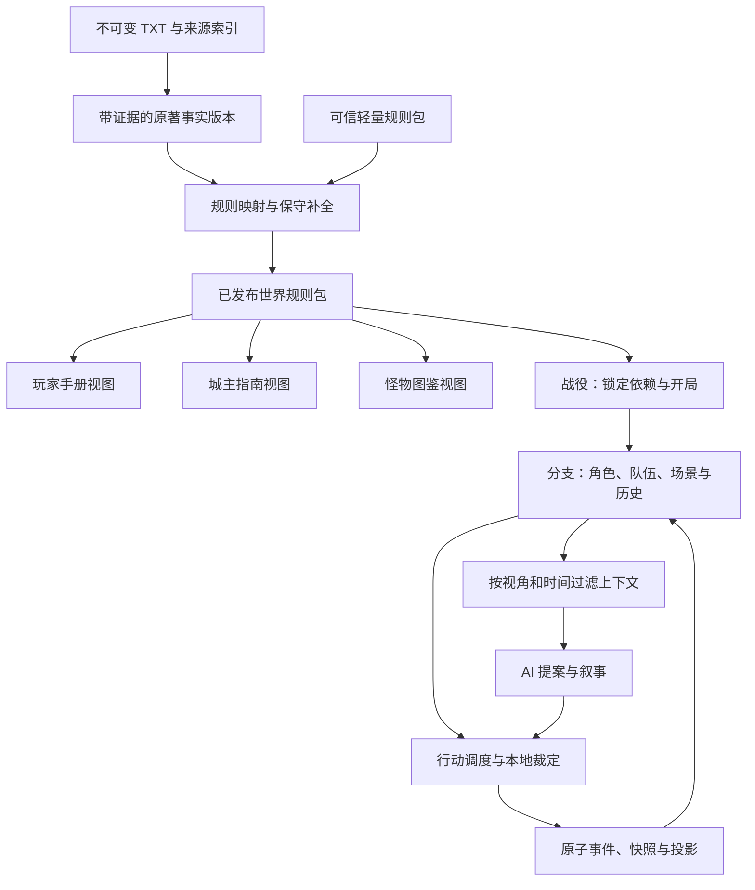

# ShineWord 二阶段建设方案：小说三宝书与完整 TRPG 战役

版本：V2.0 设计基线  
编制日期：2026-09-27  
代码核查基线：`1364c40`  
状态：关键方向已与用户确认；本文是待实施方案，不表示功能已经交付。数值默认值需经过测试平衡后发布。

## 1. 目标、确认决策与范围

二阶段目标：用户导入小说后，得到可阅读、可校验、可执行的《玩家手册》《城主指南》《怪物图鉴》，创建具有规则约束的角色卡，开启拥有独立队伍、场景、任务、遭遇、时间、资源与历史的单人 TRPG 战役。

2026-09-27 用户已明确选择：

| 决策 | 已确认内容 | 架构影响 |
|---|---|---|
| 规则方向 | 参考 D&D 三宝书组织与机制，保留现有轻量规则，预留独立 d20 规则包 | 二阶段只交付一套完整可玩轻量规则；不混合两套骰制，不宣称 D&D 兼容 |
| 小说补全 | 自动生成可玩的保守补全，区分原文事实与游戏设定，关键冲突再确认 | 建设来源分类、补全策略、冲突门禁与版本化发布 |
| 队伍和战斗 | 单人玩家＋AI 同伴，叙事战斗、距离带、严格行动顺序 | 统一多角色状态、行动成本与调度；不建设格子地图 |

保留一期：Android、React Native＋TypeScript、本地 SQLite、用户自配模型 API、原著与游戏分支隔离、本地确定性裁定、失败后复用骰点。

二阶段包括基础的探索、社交、战斗、休整、成长及战役恢复。暂不建设多人联机、云账户、内容市场、任意脚本模组、格子战棋、完整 SRD 内容包和批量图片生成。

以下是本方案的**设计默认值，并非用户逐项确认的要求**：初始最多 2 名 AI 同伴；单个标准战斗最多 3 名友方、6 名敌方；玩家默认只查看已知资料；允许在世界编辑模式查看与修改完整资料；普通原创角色初始选 3 项入门技能、准备 4 项特殊主动能力。默认值均作为规则/产品配置，验收前允许调整并记录原因。

## 2. 一期完整性复核

详细依据见 [二阶段建设前核查](PHASE2_BASELINE_REVIEW.md)。本次实际重跑核心检查 82/82 通过，移动端类型检查通过；未重跑 APK、真机或真实 API 验收。

一期具备可复用模块，但还没有完成“导入用户小说 → 角色建卡 → 在该小说世界持续游戏”的手机端闭环。README 和阶段文档的“全部完成”应在实施时校正为分层状态：模块实现、集成完成、设备验收分别记录。

| 类别 | 已有基础 | 二阶段必须补齐 |
|---|---|---|
| 规则与回合 | 骰池、合同、随机记录、事务与恢复 | 卡片驱动数值、可信行动模板、多角色调度、完整结算 |
| TXT 与世界 | 分章、证据、实体、事实、事件、任务记录 | 端上解码与长文处理、重启续建入口、世界包与三宝书 |
| 手机游戏 | 演示世界 Planner/Narrator 闭环 | 移除生产路径固定 demo-main、固定上下文、固定 2d8 参数 |
| 角色 | ActorProfile、基础 ActorState | 玩家/NPC/生物统一卡片、能力、装备、有效期与派生数值 |
| 分支 | 快照恢复与复制 | 历史技能/关系正确恢复，所有分支状态事务一致；禁止修改共享 Canon |
| 成长与遭遇 | 独立领域函数及部分存储 | 接入实际游戏；遭遇去重、训练条件、效果生命周期 |
| 存档 | JSON 导出和基础结构检查 | 摘要计算、完整依赖校验、原子导入、遭遇中恢复 |
| 验收 | 单测与历史运行报告 | 独立真实抽取基准、最低 SDK/真机、端上性能与多游戏隔离 |

阻塞性缺陷先修：历史回退复制当前技能与关系、原著事件被全局置 pending、开局没有强制时间过滤。成长按 turnId 去重而非 encounterId、里程碑授予等级而非原方案练习点，也必须明确纠正，不将偏差默认为既定规则。

## 3. D&D 参考方式与三宝书定位

D&D 三宝书分别承担玩家规则、主持与冒险组织、生物资料的职责。本项目采用这一职责划分，并针对小说改编：职业可变为门派/修行路径，法术可变为功法/异能，怪物资料也覆盖人类对手模板。参考依据见 [官方三宝书说明](https://marketplace.dndbeyond.com/sourcebooks/dungeon-masters-guide?icid_campaign=finddndgroup&icid_content=dmg&icid_medium=newplayer&icid_source=article) 与 [城主指南目录](https://www.dndbeyond.com/sources/dnd/dmg-2024)。

二阶段仍使用 ShineWord 自有六属性与骰池。优势/劣势、行动经济、先攻、状态、遭遇、休整等借鉴为设计概念，具体机制以本方案的轻量规则为准。

未来 d20 内容以明确版本的 SRD 为参考。当前官方页面提供 SRD 5.2.1 及 5.1；选用时记录版本、文件哈希和署名。SRD 的可用范围不等于整套商业规则书或 D&D 世界设定；二阶段不打包商业书全文、插画或专有生物资料。[官方 SRD](https://www.dndbeyond.com/srd)、[Creator FAQ](https://www.dndbeyond.com/creator-faq)。

**三宝书是同一世界规则包的三个视图，同时也是 AI 与本地引擎的结构化资料入口。** 不采用三次独立长文生成后直接塞入提示词的做法。每个条目具有稳定 ID，说明文字引用同一条规则定义；不能在手册、图鉴和角色卡中分别维护三份伤害数值。

## 4. 领域边界与依赖关系



| 对象 | 职责及拥有关系 |
|---|---|
| SourceAsset | 原始文件、真实字节 SHA-256、编码、规范化版本与段落映射；不可变 |
| CanonRevision | 对原著的实体、事实、时间线与证据解释；发布后不可变，纠错生成新版本 |
| RulesetPackage | 引擎支持的公式、行动模板、成长、状态与效果；由应用内可信代码执行 |
| WorldPackageRevision | 引用 Canon 和规则版本；包含世界选项、技能、物品、能力、生物、场景模板及三书目录 |
| Campaign | 一次游戏的身份、依赖锁、开局时间/地点、目标、角色创建政策与玩法设置 |
| Branch | Campaign 内一个独立历史；拥有角色实例、队伍、场景、任务、遭遇、时间、物品、关系与知识 |
| SessionView | 当前打开的战役与分支的 UI 镜像；不是权威存档 |
| MemoryProjection | 从已提交历史产生的检索与摘要，可重建，有作用域与来源依赖 |

一本小说可以发布多个世界包版本，一个世界包可以开多个 Campaign，一个 Campaign 可以产生多个 Branch。每个游戏通过不可变引用“拥有”其小说和三宝书，不需要复制整本 TXT；所有可变状态按分支隔离。

世界层实体 `entityId`、规则模板 `templateId` 和游戏实例 `actorId` 分开。唯一人物在同一分支最多一个有效实例；普通生物可以多次实例化。分支复制保留稳定人物身份但变更 branchId。

## 5. 三宝书的具体目录与执行接口

### 5.1 《玩家手册》

| 章节 | 内容 | 对应结构化数据/调用 |
|---|---|---|
| 世界与扮演约定 | 玩家可知地理、常识、力量体系、禁忌、冒险基调 | publicLore、worldConstraints |
| 创建角色 | 原著/原创、出身、所属、路径、初始技能与装备 | characterCreationPolicy、origin/path 定义 |
| 属性与检定 | 六属性、技能、资格、骰池、难度、结果与帮助 | attribute/skill 定义、check 模板 |
| 技能与特殊能力 | 用途、前置条件、消耗、射程、目标、效果、升级条件 | SkillDefinition、AbilityDefinition |
| 装备与资源 | 武器、防具、工具、消耗品、货币与携带 | ItemDefinition、resource/capacity 规则 |
| 冒险流程 | 探索、交涉、旅行、休整、训练、队伍指令 | ActivityDefinition |
| 战斗与伤势 | 先攻、主要行动、移动、距离、掩体、失能与救援 | CombatPolicy、ConditionDefinition |
| 成长与查阅 | 实践点、训练资格、阶段突破、数值来源 | ProgressionPolicy、角色变化记录 |

手册显示当前世界可选项，不把所有小说统一强塞成 D&D 职业与法术。适用范围、必要工具、是否允许未训练尝试必须写入技能定义。

### 5.2 《城主指南》

| 章节 | 内容 | 运行用途 |
|---|---|---|
| 世界公理 | 不能被游戏行动直接违反的力量与物理规则 | 资格门禁与编译约束 |
| 时间与原著走向 | 已发生历史、未知偏序、锚点、未来候选事件及依赖 | 开局过滤、分支偏离 |
| 地点与势力 | 地点连接、通行条件、资源、势力目标与响应 | 场景状态、旅行与势力时钟 |
| 人物主持资料 | 目标、底线、关系、秘密、知识来源、可谈判条件 | NPC 决策上下文 |
| 冒险结构 | 目标、任务、关键线索、分支路径、成功/失败状态 | 任务状态机 |
| 遭遇工具 | 战斗、社交、探索挑战、环境危险、难度与结果模板 | EncounterDirector 与规则引擎 |
| 奖励与节奏 | 实践、里程碑、战利品、休整、威胁升级 | 确定性结算 |
| 冲突与补全记录 | 原文证据、游戏映射、未知项、采用理由与人工裁定 | 编辑审核、追溯与重建 |

“主持人”不是单一超长提示词：资料选择器、提案器、规则裁定器、NPC 策略、叙事器承担不同权限。规则裁定器是本地程序，不另设一个可随意改数值的 LLM。

### 5.3 《怪物图鉴》

每条生物/对手模板包括：身份与分类、力量层级、体型与生态、属性技能、生命与其他资源、防御和抗性、感官、移动方式、攻击/能力列表、行为目标、撤退条件、战利品政策、出处、有效时间与公开条件。

图鉴收录野兽、异兽、亡灵、构装体及守卫/盗匪等人类对手。重要有名 NPC 的个人档案归人物资料，其战斗模板可被图鉴引用；阵营与敌对状态由场景决定，不能因为位于图鉴中就自动敌对。

采用本项目 `threatProfile`（伤害、耐久、行动数、控制、环境优势）辅助遭遇评估，不直接把 D&D CR 套到自有骰池。评估必须结合队伍规模、能力层级和资源，不承诺一个总分足以保证公平。

## 6. 世界包与内容模型

世界包发布单元为 manifest＋结构化条目＋证据引用＋三书目录＋校验报告。阅读 Markdown/HTML 是可重建产物，不能反向覆盖权威数据。

```ts
// 领域契约草案；实施时落成严格 schema，禁止多余字段与任意脚本。
interface WorldPackageManifest {
  packageId: string;
  revision: number;
  schemaVersion: 'world-package-2';
  sourceAssetId: string;
  sourceSha256: string;
  canonRevisionId: string;
  ruleset: { id: string; version: string; hash: string };
  mappingVersion: string;
  contentHash: string;
  status: 'draft' | 'validating' | 'needs_review' | 'published' | 'retired';
}

interface Provenance {
  kind: 'explicit' | 'inferred' | 'rule_mapping' | 'design_fill' | 'user_override';
  sourceFactIds: string[];
  policyId?: string;
  rationale: string;
}

interface ContentEntry {
  entryId: string;
  kind: 'skill' | 'ability' | 'item' | 'condition' | 'actor_template'
    | 'origin' | 'path' | 'scene' | 'quest' | 'lore' | 'constraint';
  revision: number;
  provenance: Provenance;
  fieldProvenance: Record<string, Provenance>;
  visibility: 'public' | 'gm' | 'discoverable';
  revealPolicyId?: string;
  dependencyIds: string[];
  definition: unknown; // 必须再由 kind 对应 schema 校验。
}
```

条目级来源不足以解释混合内容，因此允许字段级来源：例如“守卫属于黑鹰堂”为原文明示，“HP=8”为规则映射，不能给整个条目统一标记“原著事实”。

依赖引用包含条目 ID 与版本，并验证种类，例如 ability 的消耗只能引用 resource，武器动作只能引用已编译行动模板。禁止悬空引用、循环派生公式和不支持的效果；依赖图用于增量构建及编辑影响分析。

`published` 表示在声明的范围内通过结构与可玩性门槛，不表示抽取覆盖原著每个事实。manifest 的校验报告记录已处理章节、关键实体覆盖、未决缺口及适用开局范围。

## 7. TXT 自动构建流水线

### 7.1 阶段与恢复

| 阶段 | 输入 → 输出 | 本地校验/中断恢复 |
|---|---|---|
| 导入 | 文件 → SourceAsset、章节/段落/分块索引 | 原始字节哈希、编码预览、位置可逆；复制到应用持久目录 |
| 提取 | 文本块 → 候选实体、事实、事件、能力表现 | 原文引文定位、状态/传闻区分；逐块落盘 |
| 归并 | 候选 → 稳定实体、别名与事实版本 | 同名不自动合并，保留证据与审查项 |
| 时间建模 | 事件 → 发生顺序/有效区间/揭露时机 | 区分叙述章节与世界时间；未知使用偏序 |
| 世界分类 | 事实 → 力量体系、资源类型、路径与硬约束 | 模型提出类别，使用受支持规则组件装配 |
| 规则映射 | 原著表现 → 技能、能力、装备、生物模板 | 前置条件、层级、预算、来源完整性 |
| 保守补全 | 必要缺口 → 明确标注的游戏默认项 | 只补可玩所需字段；不发明与原著冲突的历史 |
| 三书编译 | 同一条目图 → 三书目录与视图 | 章节、跨书引用、权限、字段一致性 |
| 可玩性验证 | 世界包 → 校验报告与允许开局集合 | 建卡、检定、资源消耗、基础遭遇、恢复干跑 |
| 发布 | 通过验证的草稿 → 不可变版本 | 原子发布、内容哈希、依赖锁、旧版本保留 |

任务复用键至少包含：source/chunk hash、parser/normalizer/extractor 版本、提示词版本、模型配置指纹、规则版本与直接依赖哈希。仅文本哈希一致不能跨规则版本复用映射。任务状态包含 pending/running/succeeded/failed/paused/needs_review，重启将未完成 running 恢复为可重试。

构建可暂停、取消、续建和按失败块重试；重新进入书架继续同一个 buildId/worldId。前台优先，并发 1～2；所有阶段逐批持久化，不依赖 JS 在后台常驻，不在网络请求期间占用 SQLite 事务。

### 7.2 保守补全与冲突决策

可以自动补：普通人缺少的基础资源、常规工具用途、标准动作、低风险遭遇模板、可由世界规则支持的简单恢复方式。

不能自动新增：原文明确禁止的能力、重大人物的隐藏身份、推翻历史的因果关系、跨境界捷径或复活机制。跨层级能力必须有世界依据。

关键冲突进入待确认队列，例如同一时间既死亡又在场、两个互斥的力量来源、唯一物品归属矛盾、开局角色是否已经掌握关键技能。可选择采用某证据、保留不确定、添加用户设定或改选开局；给出影响条目与预估重建范围。一般不影响当前开局的未知项继续构建并显示覆盖缺口。

不确定条目不参与硬规则执行。用于当前开局或遭遇的机械字段必须完整；未完整的生物不能直接进入战斗。默认全书基础扫描成功后允许发布；扫描未完成仅能进入明确标注的预览试运行，沿用一期覆盖政策。

### 7.3 可玩性与质量门禁

发布必须满足：支持的 schema/规则版本、引用完整、硬规则无未决冲突、所选开局能生成有效卡片、可用地点连通、常规行动有可执行模板、关键任务有可继续的失败路径、所有执行数值有来源分类。

真实抽取评估另建独立标注集，不能让 FixtureExtractor 的固定模式召回率代替真实模型质量。引文可定位只证明来源存在，还要抽查该引文是否支持提取结论。

## 8. 角色卡、技能与能力体系

### 8.1 一套模型与不同视图

| 区域 | 字段与规则 |
|---|---|
| 身份 | actorId、entityId/templateId、姓名、原著/原创、背景、势力、路径、controller |
| 版本 | rulesetId/version、worldPackageRevision、cardRevision、初始锚点 |
| 属性 | 体魄、敏捷、洞察、学识、意志、交涉，轻量版基础值 1～3 |
| 技能 | skillId、rank、practicePoints、训练前置、来源；检定必须由技能定义绑定属性 |
| 特殊能力 | abilityId、已习得/已准备、资格、消耗、目标、距离、效果、冷却/次数 |
| 派生数值 | 资源上限、防御档位、感知、移动资格、携带容量及计算明细 |
| 动态状态 | 当前资源、位置、状态效果、装备、物品、行动额度、遭遇参与状态 |
| 角色扮演 | 目标、底线、性格、关系、个人已知信息；秘密按字段过滤 |
| 追溯 | 来自原文、模板、装备、成长或状态的数值贡献，最近变更事件 |

PC、同伴、NPC 和生物共享 Actor 核心。卡片采用 `public`、`self/party`、`gm` 投影；敌人不会默认向玩家暴露准确生命、秘密技能和底线。同伴加入队伍不自动公开其全部秘密。

普通路人使用简卡：身份、目标、基础模板和知识；成为检定目标前升级所需参数并冻结。重要 NPC 建完整卡。系统不得根据投骰结果反向生成 NPC 防御。

资源权威值只存一处。encounter_actors 记录参战资格、先攻和行动额度，生命/体力读取 ActorState；不得战斗表与角色表各自维护一份 HP。

### 8.2 基础数值与派生字段

继续采用六项初始 1＋4 自由点、单项最高 3。正式原创角色要求分配完成，或用户显式选择保存未用点；不得悄悄丢点。属性基础上限与情境加骰分别处理。

普通人模板初始 HP=10、体力=10，作为当前原型的保守延续，并标记为游戏设定；不凭空称其源自小说。世界可通过有版本的资源模板调整。资源值满足 `0 ≤ current ≤ effectiveMax`，减少上限时裁切并记录事件。

派生计算顺序固定为基础模板 → 合法成长 → 装备 → 状态效果 → 上下限；同源效果不叠加，未知 op 拒绝。只支持白名单计算节点（常量、加法、上下限、查表等），不执行模型生成 JS 或自由公式字符串。

### 8.3 技能数量与个人技能边界

技能是可反复使用的熟练程度，特殊能力是有独立效果/消耗的招式，两者分开。例如“潜行”是技能，“敛息诀”是要求潜行入门、消耗真气的特殊能力。

| 项目 | 二阶段默认政策 |
|---|---|
| 世界技能目录 | 建议先保持 8～16 项有明确用途的基础技能，再增加少量世界专属技能；不是硬性小说事实 |
| 普通原创角色初始技能 | 3 项入门 d6；背景奖励计入这 3 项，不另外无限叠加；未学习但允许无训练的技能按 d4 |
| 原著角色 | 由锚点前证据映射，不强行套原创点数或 3 项上限；强角色可作为高难度开局选项 |
| 已习得技能数量 | 不设任意终身硬上限，靠训练资格、时间与实践限制；技能列表按用途折叠 |
| 特殊能力准备 | 普通原创模板默认 4 个主动能力槽；只限制需要准备的特殊能力，普通攻击、观察、交谈不占槽 |
| 被动能力 | 不占主动槽，但受路径前置、同源不叠加和模板预算限制 |
| 原著能力例外 | 原文明确可同时使用的能力不得被通用槽数随意取消，世界路径须显式覆盖并展示原因 |

每个技能/能力定义有使用条件、适用属性、可否无训练尝试、工具需求和力量层级；名称相似不等于同一个 skillId。只能学习当前世界存在并且角色可获得的能力。

### 8.4 成长、训练与防刷

保留 d4/d6/d8/d10/d12 与晋阶练习点 5/10/20/40。有效风险尝试成功或失败均可获实践点；同一独立遭遇同一角色同一技能最多 1 点，键为 `(branchId, encounterId, actorId, skillId, rewardKind)`。

未达到正式遭遇规模的探索/社交挑战也生成稳定 challengeId，并归入统一遭遇标识。客户端不得因玩家换措辞或重新打开场景创建新奖励机会。

满练习点只进入“可训练”状态；训练检查导师/资料/环境、资源、时间与路径前置，完成后扣点晋阶。里程碑默认授予已解锁技能 1～2 **练习点**，不能直接跳 1～2 个技能等级。属性与境界提升通过独立世界前置与里程碑，不由普通检定直接提升。

分支回退恢复当时练习点、训练进度和奖励台账；旧分支的奖励不叠加到新分支。同一分支重试提交不能重复奖励。允许用户在另一个分支重新体验挑战，不把跨分支游玩混成一个全局成长账本。

## 9. 轻量规则 V0.2 与未来 d20 边界

V0.2 保留核心概率：`n = clamp(属性 + 情境修正, 1, 4)`，投 n 颗技能骰取最高，与预先冻结难度比较。简单/一般/挑战/困难/极难/巅峰仍为 3/4/6/8/10/12；结果档位沿用一期。情境修正总计 -1～+1。

V0.2 新增并冻结角色卡驱动、能力前置、行动额度、状态生命周期、遭遇奖励与休整规则。未知目标、无资格、越层级、资源不足均先阻断；最高骰不能创造原著没有的能力。

数值不能从 LLM 合同自由写入：AI 选择有资格的 actionDefinitionId、目标和情境证据；本地按定义编译难度、消耗、四档效果和骰子规格。叙事解释不能变成随意扣血/赠物的通道。

预留 `RulesetAdapter`：validateCharacter、qualifyAction、compileAction、buildRollRequest、resolveRoll、deriveStats、validateEffects、settleProgress。二阶段只实现 LightPoolAdapter，规则集合由内置信任代码注册。

骰子记录升级为带 discriminator 的协议，例如 `kind: light_pool | d20_check`，公共部分保存 contractHash、规则版本、原始随机结果和结算。d20 分支仅预留 schema/接口，不实现假适配。当前数据库中固定 dieSides、highest、rank 枚举必须通过新增版本表/字段演进，不能简单将 d20 加到 d4～d12 枚举就声称兼容。

旧 V0.1 游戏继续使用旧公式和旧协议。跨规则游戏不能共享一张未经迁移的角色卡，未来 d20 的属性、熟练、护甲等级、豁免和施法资源都由独立规则定义。

## 10. 每一局游戏的完整架构

### 10.1 开局与运行清单

Campaign 创建必须在同一事务写入：依赖锁、开局锚点、队伍、初始角色卡、起始地点/场景、已知信息、初始资源物品、主目标、初始分支和完整快照。

```text
Campaign
  dependencyLock: source + canonRevision + worldPackageRevision + ruleset
  opening: anchor + location + protagonist + goal + playPolicy
  Branch
    actors / party / inventory / effects
    scene / worldClock / travel / factionClocks
    quests / clues / encounter / pendingActions
    relationships / knowledge / discoveries / divergence
    events / rolls / snapshots / rewardLedger / memories
```

`campaignId`、`branchId`、`worldPackageRevision` 由应用会话传入所有服务，禁止仓库层隐含读取“当前游戏”。版本依赖缺失时明确阻止继续，不能静默退回演示世界。

### 10.2 开局向导

选择已发布世界包 → 选择时间锚点与地点 → 原著/原创角色 → 填写/检查角色卡 → 选择目标与同伴政策 → 预览已知世界与初始资源 → 确认开局。

原著角色必须按发生时间、能力有效期和身份筛选；章节顺序只能作为揭露顺序线索。精确时刻未知时使用锚点间偏序；无法确认某关键能力是否存在则提示补充或选择保守版本。

不默认给玩家原著读者的全知知识。用户可在编辑模式阅读完整资料，但游戏内 NPC 与玩家角色的知识仍取决于 knowledge ledger，不能从用户界面访问记录自动解锁。

### 10.3 模式、场景和时间

运行模式：exploration、social、combat、downtime，均受同一状态机和事务体系约束。场景包含地点、出口及连接、在场人物、可见物、危险、互动点、目标和公开线索。

世界钟升级为整数 `elapsedSeconds`，锚点单独记录；旧 clockMinutes 精确乘 60 迁移。旅行/训练可按分钟或小时定义，编译成秒。

探索动作按模板推进世界钟；战斗标准轮默认 6 秒，每轮结束推进一次，不能每名角色行动都加 6 秒。并行训练或休息按活动起止推进一次，不按队员重复计时。持续效果可使用世界秒、目标回合结束、轮结束、遭遇结束等明确时钟，禁止混用。

### 10.4 任务、线索与世界响应

任务状态为 available/active/succeeded/failed/abandoned，具有触发条件、目标计数、截止条件、奖励政策与关联事件。提交满足条件的规则事件后推进，不能仅因 Narrator 说“任务完成”就发奖励。

线索分存在、发现、理解与传播。关键主线线索默认允许以代价获得，失败可以增加时间、暴露度或敌意；可选秘密仍能因失败错过。失败后保留撤退、改道、谈判或接受后果等合乎世界的选择。

势力与追兵通过有限时钟在旅行、休息、关键事件后推进，只更新相关区域。原著开局后的事件为条件性候选；分支事实导致依赖失效时，写 branch divergence overlay，不能修改共享 canon_events。

## 11. AI 同伴与 NPC 行为

同伴默认最多 2 名，由招募条件与关系决定加入。玩家可设置跟随、支援、保护、节省资源、撤退等意图；玩家只控制自己的主行动，同伴按自身目标、知识与可用能力执行。关键剧情中拒绝命令须有底线或状态依据，不能随机制造失控。

采用两层决策：AI 在场景变化时提出目标/战术，确定性策略在每个行动槽从合法动作中选取。通常无需每个 NPC 行动独立调用一次模型。涉及重大谈判或战术变化可请求 NPCPlanner，输出仍须严格验证。

每个 NPC 决策上下文按该 NPC 的视角构建；主持人知道秘密不等于该 NPC 知道。玩家、队友和敌人的动作统一走 ActionDefinition、资格校验与资源结算，不能为同伴免费施法、让敌人在叙事中多行动。

同伴退出、失能、死亡风险、分队或重新入队均是显式事件；物品归属和知识保留来源。不将“队友知道”自动视为“全队知道”，需要通信事件与可用通信条件。

## 12. 遭遇、距离带与战斗规则

### 12.1 遭遇模型

Encounter 包含类型、参与者、目标、场景、危险、初始资源政策、结束条件、奖励与失败合同。战斗为其中一种，追踪和谈判也可以使用进度/压力计数器。

标准战斗范围先限制为最多 9 个独立行动者；更大群体使用明确的群体模板或分波进入，不隐藏额外行动。阵营采用 party/hostile/neutral 等关系，不再用 player/npc 二分等同于敌我。

### 12.2 行动顺序与成本

V0.2 默认先攻按敏捷降序，同值按洞察降序，再按稳定 actorId 排序，入场时冻结。意外袭击用有证据的 surprised 状态处理，不私自改顺序。该确定性顺序属于 ShineWord 规则，并非 D&D 原版先攻。

每名清醒角色每轮获得 1 次主要行动、1 次标准移动。标准移动跨一个相邻场景区域；疾行消耗主要行动再移动一次；攻击、支援、施法/功法、使用物品和脱离接触均消耗主要行动。言语仅在不产生额外机械收益时视为附带表达。

二阶段不实现完整反应链和额外行动堆叠。需要这些机制的原著能力映射为受限自动触发效果，或标记暂不支持并阻止使用，不能偷偷免费执行。触发链预算固定：单行动最多 8 个触发效果，同一触发实例不可递归触发自身。

新参战者默认下一轮加入，当前轮不插队；失能者跳过行动，援救恢复后按被冻结顺序等待合法槽位。退出和战斗结束必须检查所有参与者与结束条件。先攻列表要求无重复、无遗漏、只引用实际参战者。

### 12.3 距离与目标

采用小型区域图：区域含掩体、入口和环境；演员位置指向区域。距离带由**施动者与目标的区域关系**计算，不能给每人一个全局 near/mid/far 就推断所有人的距离。

同区域默认 near，相邻为 mid，相隔两个连接为 far，更远为 out_of_range；接触/近战还可要求 engaged 关系。闭门、悬崖、可见性和阻挡单独约束，不能只靠图距离穿墙射击。默认每场景 3～7 个区域，仅以文字与简图展示，不建设格子坐标。

所有能力声明 targetPolicy、range、lineOfSight、areaSelector。移动后重新验证目标距离，场景切换同步解除失效 engagement。群体效果按目标 ID 稳定顺序裁定并记录各效果。

### 12.4 攻击、防御与效果

攻击按技能骰对目标预设防御档位检定；防御由模板、状态、掩体政策推导。装备护甲默认只减伤，避免同一件护甲未经声明同时提升防御难度并减伤。

普通武器原型命中 2、充分成功 3，减护甲后最小 0，延续一期示例；世界能力必须定义自己的完整四档效果。失败不命中，严重失败的暴露/资源代价在投骰前冻结。不得掷完后新增反伤或永久伤势。

效果实例包含来源、目标、开始时点、到期时点/触发、叠加政策、驱散条件和执行 op。常用状态优先提供失能、受伤、隐蔽、受惊、束缚、流血等有限集合；小说特殊状态必须映射到支持的机制或仅作叙事标签。

HP 归零进入失能；是否被俘、获救、死亡风险或结局由世界规则和遭遇合同确定。默认不强制永久死亡，保留从历史创建分支；不得凭叙事自动复活。战利品在遭遇结束时按冻结政策生成一次，唯一物品不可重复生成。

### 12.5 休整、旅行与资源循环

普通人保守模板：安全短休 30 分钟，体力恢复 2、HP 不自动恢复；安全长休 8 小时，体力回满、HP 恢复 2；按资源上限裁切。这些是可调游戏默认值，非 D&D 短休/长休规则。治疗能力与药物另外按定义结算，原著恢复机制优先映射。

休息推进世界钟、消耗配置的补给、触发追兵/截止条件；被打断按已定义中断政策处理。日常饥渴默认低复杂度，只在世界/场景启用补给机制时执行。旅行按地点连接与路线模板推进，允许触发已编译的危险和遭遇。

## 13. 回合协议、AI 权限与原子结算

### 13.1 V2 回合流程

1. UI 发起 intent，带 campaignId、branchId、actorId、expectedStateVersion 与幂等 intentId。
2. 会话服务确认当前行动者、模式、规则版本与可用动作。
3. 上下文服务读取角色、公开场景及适用规则；秘密裁定走独立受限通道。
4. Planner 提出动作定义、目标和情境证据；已有菜单动作可免 Planner。
5. 本地编译器验证资格、知识、目标、规则约束和资源，生成四档合同，冻结规则与卡片版本、成本、结果和哈希。
6. 风险行动展示公开检定卡后本地掷骰；自动行动直接得出结果。随机结果先持久化，断线不重掷。
7. 本地生成权威事件批次与 proposedState；Narrator 仅得到过滤后的结果与所需公开上下文。
8. 校验叙事协议和结构化声明，失败最多一次修复；仍失败则暂停或使用已审定的本地简短结果模板。
9. 同一 SQLite 事务提交行动、事件、角色/物品/效果/任务/奖励/知识变化、行动游标、完整快照及叙事状态。
10. 提交成功后刷新 UI，推进下一个 AI 行动或等待玩家；摘要任务通过 outbox 异步调度。

一个物理动作是一个 action transaction，`stateVersion` 每次递增。玩家看到的一段“我行动后大家响应”可聚合多个动作，但不能将其中已提交的 NPC 动作重复执行。叙事轮、战斗轮和数据库状态版本分别标识。

### 13.2 合同与提案分离

V2 PlannerProposal 不允许包含权威任意效果数组；仅选择允许的定义和参数。本地 FrozenActionContract 包含：协议/规则/世界包版本、actor 与目标、预计状态版本、定义 ID、资格证据、骰子规格、成本、四档效果、公开投影与隐藏裁定引用。

多角色场景禁止自动将未知 actorId 重映射到玩家。所有 ID 必须来自请求允许集合，目标角色必须有当前动作资格。旧 V1 方言归一化仅用于旧协议路径，不扩散到 V2。

自由行动找不到模板时可选择受限通用模板（观察、交涉、操作、移动等）；若无法表达，说明限制并请求换方案。模型提出的新能力/效果进入草稿构建流程，不能在正在执行的回合即兴安装。

### 13.3 崩溃、重试与后台任务

主回合内成长、关系、物品和任务不得使用互相独立的 post-commit 写入。使用一个 UnitOfWork 事务更新所有权威投影；网络、叙事生成和大规模摘要位于事务外。

冻结合同、投骰记录和待提交结果均可恢复；恢复必须绑定相同包版本与 hash。竞争状态更新造成 CAS 失败时，不把旧投骰套在新场景；暂停过期动作并保留审计，新的合法动作拥有新 ID。

摘要、索引刷新等派生任务进入事务性 outbox。执行幂等、成功后标记完成，失败可重试；摘要不能发奖励或改变角色状态。所有派生项记录依赖事件范围与可见性，不能把主持人秘密摘要送入公开叙事。

### 13.4 请求预算与生成质量

维持玩家风险行动通常 Planner＋Narrator 两次请求、最多 4 次物理请求的初始上限；重试也计数。单轮 NPC 可通过确定性策略完成机械行动，按需要合并呈现短叙事，不逐角色机械追加两次 LLM 请求。

用户可见响应批次另设默认 8 次物理请求总预算，包含 NPC 战术请求和修复；达到预算后 NPC 使用合法本地策略、叙事用本地结果模板，不能跳过敌人回合。世界构建、交互与摘要分别计量，并受总预算约束。

结构化一致性由程序校验，开放自然语言的语义正确性仍需抽查，不能承诺完全阻断所有幻觉。Narrator 返回关联公开 eventIds 的段落，越权事实声明拒绝；模型审阅仅作辅助，不替代本地规则。

## 14. 时间、知识与版本隔离

可见性判断同时考虑 world/package、campaign/branch、世界发生时间、事实有效期、揭露条件、角色知识和内容状态，再进行相关度排序。不同来源没有统一“后写覆盖前写”规则。

| 冲突对象 | 处理政策 |
|---|---|
| 世界硬约束 | 游戏分支不得覆盖；用户改设定产生新的世界包版本 |
| 人物当前生命、位置、归属 | 开局取 Canon，之后由该分支事件推进 |
| 原著未来剧情 | 候选，不视为已经发生；失去前置后在分支标记失效 |
| 秘密与传闻 | 保留事实真实性与角色认知两条轴；听到传闻不升级世界真相 |
| 摘要与记忆 | 派生缓存，不能压过结构化状态或放宽权限 |

图鉴采用未发现/已观察/已研究层级，逐字段披露外观、已观察能力与弱点。模型不能因为完整图鉴中存在毒性就让未见过它的同伴精准避毒，除非角色背景与知识记录支持。

世界编辑提供全局草稿视图、证据跳转、字段来源、冲突与影响清单。保存不影响已发布版本；发布新 revision 后，正在进行的战役继续锁定原 revision。角色卡直接改数值仅允许在开局前或显式管理分支中，并记录用户覆写事件。

## 15. SQLite、快照与迁移

### 15.1 数据模型演进

新增表名为建议，实施前对照现有 001～004 迁移锁定；不得改写已发布迁移。

| 组 | 建议表/改造 | 核心约束 |
|---|---|---|
| 原文与版本 | source_assets、canon_revisions、world_package_revisions、package_entries、entry_dependencies、entry_sources | 发布版本不可变；哈希、来源与依赖齐备 |
| 三书与构建 | book_sections、book_entry_refs、build_runs、build_tasks、validation_reports、review_issues | 三书引用相同 entry；任务复用键含版本依赖 |
| 战役 | campaigns 扩展依赖锁、branches 扩展 runtime/schema 版本 | branch 必须属于 campaign；不能跨世界混用 |
| 角色与能力 | actor_instances、actor_profiles、actor_abilities、actor_skills、active_effects、party_members | `(branchId, actorId)`；成长与能力引用规则版本 |
| 物品 | item_instances、inventory、equipment | 实例唯一归属；数量非负；装备资格与槽位校验 |
| 场景与任务 | branch_scenes、scene_zones、scene_links、quest_states、clue_states、faction_clocks、activities | 所有运行字段均有 branch 作用域 |
| 遭遇 | encounters、encounter_participants、action_slots | 冻结先攻、轮号、游标、每轮额度；无第二份 HP |
| 认知与偏离 | knowledge_ledger、discoveries、branch_canon_overrides | 不修改共享 Canon；记录知道的时间及来源 |
| 一致性 | action_journal、roll_records_v2、branch_events、snapshots_v2、reward_ledger、outbox | 幂等键、CAS、完整快照、事务性派生任务 |
| 成本 | request_ledger | requestId 唯一；build/action/batch 关联；记录估算标志 |

JSON 字段用于类型稳定的定义与小型快照；检索、权限、关系和版本关键字段必须独立索引。避免将百万字原文、整个世界包或所有历史放进单个 JSON 行。

主外键尽量包含 branchId，防止存在但属于另一分支的 actorId 被误引用。应用层验证与数据库约束共同生效。存档格式使用 UTF-8 字节长度限制，不能用 JS 字符串长度假装文件字节大小。

### 15.2 权威状态与重放

事件为不可变变更记录，完整快照覆盖演员、技能/能力、物品、队伍、场景、任务、遭遇游标、世界钟、关系、知识、奖励和分支偏离。数据库各业务表是当前状态投影。

二阶段初版每个已提交动作保存一份完整的运行状态快照（不含世界包和原文），并保存 canonical hash，优先保证正确性。达到性能基准后才考虑稀疏快照＋事件重放；无论哪种方式，回退都不得复制源分支最新表行来伪装历史。

历史分支从目标快照建立全部权威投影，单事务完成；记录 parentBranchId 和 forkStateVersion。查询祖先叙事只允许读取分叉点之前的区间。重放不调用模型、不消耗随机数、不重新发奖。

### 15.3 旧数据处理

迁移分两层：存储 schema 升级不改变规则行为；进入 V0.2 则是显式创建升级分支。

现有 V0.1 存档缺少完整历史技能/关系，不能凭当前值伪造过去。允许继续旧模式、只读历史，或从当前可验证状态创建 V0.2 新基线；对无法可靠恢复的历史点禁用“完整迁移回退”，说明缺失字段。

演示 demo-main 可能没有真实小说世界依赖，保留为独立旧演示存档，不自动挂到某一本用户小说。旧原著事件若已被全局改写，保留原数据并根据原文/提取结果生成新 CanonRevision；不能猜测原状态后覆盖。

迁移前备份、写迁移日志，单版本事务化；失败保留旧数据。提供新装、004→新版本、重复执行、失败恢复四类测试。保持迁移 SQL 与 builtinMigrations 的内容一致，CI 检测漂移。

## 16. 存档、世界包与恢复

二阶段交付两个层次：完整游戏存档 `.shineword-save.json` 与可移植世界包 `.shineword-world.zip`。存档锁定原文/世界包/规则版本，包含恢复所需的权威状态、事件、必要祖先历史及未完成动作，不包含 API Key。

世界包导出允许包含或不包含原文；用户自行选择。无原文模式明确提示证据定位受限，若缺少继续生成必需的资料则仅允许阅读/补齐依赖，不静默再生成一套不同世界。

导出在一致读视图中生成 manifest 与规范化 payload 摘要；跨表读取不能拼成不同 stateVersion 的混合存档。哈希用于检测损坏，不作为可信作者签名。

导入顺序：文件/解压上限 → 路径穿越和压缩炸弹防护 → JSON schema → 哈希 → 版本能力 → 依赖完整性 → 引用/数值/权限一致性 → 临时区构建 → 单事务创建新 campaign/branch。遇到相同 ID 不覆盖原游戏，统一重映射并修复内部引用。

未完成行动必须恢复同一 frozenContract 和 RollRecord；无法验证依赖时暂停，不能重掷。导出后在干净数据库恢复，验证完整状态 hash、接下来的合法行动及分支隔离；只通过 JSON 解析不算存档验收。

## 17. 页面与模块落地

### 17.1 产品页面

| 页面 | 二阶段可操作闭环 |
|---|---|
| 世界书架 | 持久列出已导入小说、版本、构建状态、继续构建、三书、开局 |
| 导入与构建 | 编码/分章预览、覆盖度、预算、暂停续建、失败重试、冲突确认 |
| 三宝书阅读 | 目录、搜索、关联技能/生物、来源标签、原文定位、已知内容过滤 |
| 世界编辑 | 草稿修改、原文/映射/补全区分、差异预览、验证与发布新版本 |
| 开局向导 | 世界/锚点/角色/目标/同伴政策 → 初始状态预览 → 创建游戏 |
| 角色与队伍 | 卡片、技能与训练、能力准备、装备、同伴指令和可见关系 |
| 游戏页 | 场景、3～4 个合法且有差异的行动选项、自由输入、检定卡与结果 |
| 遭遇面板 | 当前行动者、顺序、距离/区域、公开状态、动作成本与撤退入口 |
| 日志与存档 | 已提交历史、数值变化来源、继续/恢复、分支、导出与导入 |
| 模型与预算 | 能力探测、连通性、用量分类、取消与错误恢复 |

普通玩家流程不暴露 Planner、schema、turnId 等工程词；检定使用属性/技能/骰点与结果解释。用户点击后到提交前禁用重复输入，明确区分临时叙事与已发生事实。

### 17.2 代码拆分与复用

| 当前模块 | 改造方向 |
|---|---|
| domain/rules、turns、state | 保留纯 TS；增加 RulesetAdapter、V2 合同、完整 BranchState 和确定性 reducer |
| application/world/buildWorld、extraction | 保留来源校验，扩展构建 DAG、版本化任务、发布门槛 |
| application/world/opening | 接入锚点过滤与统一 CharacterFactory，不再分散拼初始数值 |
| application/game/llmTurn | V1 保留；V2 使用提案→本地编译→结算→公开叙事，严格目标 ID |
| application/game/turnSettlement | 合并进 UnitOfWork 内的确定性结算；去除非幂等独立写入 |
| application/branch、export | 完整快照恢复、依赖锁、事务导入与包管理 |
| infra/sqlite | 新 Repository/UnitOfWork 与读模型；规范 schema 迁移 |
| mobile/src/runtime.ts | CampaignSessionService，所有调用显式传入会话与卡片 |
| mobile/src/worldImport.ts | 原生字节哈希/增量解码、持久化 buildId、进度与恢复 |
| mobile/App.tsx | 拆为 library/books/worldEditor/character/campaign/play/encounter/saves 等功能页面 |

新增领域目录建议：domain/content、characters、abilities、effects、campaign、scenes、quests、knowledge；应用服务建议：application/books、worldPackage、campaign、encounters、context、save。领域层不导入 SQLite/React/网络，应用层通过端口编排，避免继续让业务服务直接依赖 SqliteGameStore 具体类。

## 18. 实施阶段与出口条件

阶段按依赖推进，不用固定天数代替验收。先完成一份手工自创小世界的全闭环，再接入自动生成，避免同时调试抽取与游戏机制。

| 阶段 | 内容与交付物 | 出口条件 |
|---|---|---|
| P2-0 基线整改 | 修正一期状态说明；历史恢复、共享 Canon、时间过滤、哈希/编码与成长差距清单；失败复现 | P0 缺陷有复现并修复；旧测试继续通过；旧模式可以读取 |
| P2-1 包与三宝书骨架 | 世界包 schema、规则版本、条目/目录、发布验证器、手工世界与阅读页 | 同一技能在三书/卡片引用一致；版本不可变；未知 op、悬空引用拒绝 |
| P2-2 建卡与真实战役 | CharacterFactory、角色卡、开局、CampaignSession、移动端实际接线 | 从书架选择手工世界，两类角色均能开局；同时创建两局不串数据；游戏检定随卡片变化 |
| P2-3 完整规则闭环 | V0.2 行动、场景、任务、同伴、战斗、休整、成长、完整事务/快照 | 单人＋2 同伴完成探索→社交→战斗→休整→训练；崩溃/回退不重复结算 |
| P2-4 小说自动三书 | 增量抽取、归并、映射、补全、冲突队列、编译与发布 | 自创测试小说自动生成可玩三书，来源可查；断点续建；关键冲突阻止发布 |
| P2-5 编辑与迁移交付 | 世界草稿编辑、旧版本隔离、世界包/存档往返、升级分支 | 干净库恢复后继续游戏；旧存档不被新包污染；缺失依赖可解释处理 |
| P2-6 Beta 验收 | 多模型、100 行动长程、设备性能、故障注入、APK 与已知问题 | 下节门槛通过，文档和运行证据一致；未达项不能标“全部完成” |

基础数据库、事件与完整快照从 P2-1 开始设计，在 P2-2/P2-3 随功能扩展。不得等到 P2-5 才补事务或历史恢复。

每阶段产出：代码/schema、迁移、功能操作入口、必要测试、实际运行证据、遗留问题及文档更新。里程碑评审区分“领域函数可用”“App 可操作”“设备实测通过”。

## 19. 验收矩阵与性能目标

| 范围 | 核心场景 | 出口标准 |
|---|---|---|
| 三宝书一致性 | 同一能力跨手册/图鉴/卡片 | ID、版本、消耗、效果同源；所有引用完整 |
| 角色与规则 | 不同属性技能、缺资格、资源耗尽 | 不使用固定演示值；非法行动全部拒绝；来源可解释 |
| 世界构建 | 自创武侠、奇幻、低魔悬疑各一套 | 不强套职业/魔法；每套能创建角色并完成一段冒险 |
| 真实抽取 | 独立 ≥200 条关键事实，含别名/倒叙/传闻 | 关键事实召回目标 ≥90%；发布的 explicit 字段引文定位 100%；语义支持率单独人工记录 |
| 自动补全 | 缺 HP/技能参数与原文冲突 | 补全标识 100%；硬冲突不自动发布；生成内容不伪装原文 |
| 认知 | NPC 秘密、敌人弱点、未来技能 | 预设泄漏夹具全部拦截；公开提示词与图鉴投影一同检查 |
| 同伴与行动 | 3 友方＋敌方、失能/援救/新加入 | 无跳次、重复行动、免费资源或重复推进世界钟 |
| 距离 | 多区域、掩体、堵门、移动后射程改变 | 逐对目标资格正确；不穿墙；三人相对距离无矛盾 |
| 原子性 | 主回合、奖励、任务、物品间杀进程 | 整体提交或不提交；恢复骰点/游标一致，无漏奖/双奖 |
| 回退 | 训练/关系/知识变化后回到旧版本 | 所有字段与历史 hash 对齐；新分支不带未来能力/记忆 |
| 多游戏隔离 | 同一小说两个战役，分别改事件走向 | Canon hash 不变，战役/分支互不污染 |
| 存档 | 遭遇中、已投骰未叙事、缺依赖、损坏文件 | 干净数据库往返可继续；损坏拒绝；不覆盖旧局 |
| 成长 | 同遭遇多回合使用同技能，回放/回退 | 只发一次点；无训练不升级；里程碑按点结算 |
| 长程 | ≥100 个提交动作，包含多种模式与至少一次分叉 | 本地重放状态一致；真实模型拒绝/重试/成功如实计数；无未处理严重一致性问题 |
| 模型 | 至少两种已配置服务，含无 JSON 模式路径 | 结构化失败可恢复；不把拒绝回合算成功；不会丢失已投骰 |
| Android | minSdk 24 模拟器、较新版本模拟器、至少一台真机 | 导入、后台杀进程恢复、键盘、战斗、保存/恢复全部实测 |

性能作为目标，不提前声称成绩：目标设备本地裁定＋提交 P95 ≤100ms（标准最多 9 参战者）；角色卡和已缓存书页交互 P95 ≤200ms。模型网络延迟另报首 token、完整响应 P50/P95，不纳入本地指标。

使用 20 万字基准与 100 万字压力素材记录端上导入/构建各阶段耗时、内存峰值、UI 卡顿和恢复成功率；压力测试允许设备资源不足时受控暂停，但不能丢进度或崩溃。独立记录模型 token 与耗时，不能把固定提取器的秒级数据包装成真实模型性能。

真实性测试使用自创/可授权素材；私有小说与 Key 不进入仓库。未能取得真机或某模型预算时将该项标为待验收，发布说明保留限制。

## 20. 贯通样例：雨夜进入藏书阁

以下为自创测试夹具，数值是本项目游戏设定。

1. TXT 写明：藏书阁雨夜有守卫，沈青懂潜行，苏禾擅医术，二人不会飞行。提取为可定位事实，绑定章节、段落与码点范围。
2. 玩家手册引用“潜行”技能、普通移动、帮助和包扎能力；城主指南记录守卫目标、入口、失败暴露与关键线索；怪物图鉴引用“藏书阁守卫”模板。HP 等小说未写的数值标为规则映射/补全。
3. 创建 Campaign A，锁定包 revision 1 与 V0.2。在锚点前为沈青生成敏捷 2、潜行 trained d8，苏禾作为同伴拥有医术与包扎；两人不获得飞行资格。
4. 玩家尝试借雨潜入。本地根据雨声证据给予 +1 情境骰，冻结 3d8、D=6 与四档合同。苏禾未执行帮助，不能额外赠送帮助加成；总修正也不能超过 +1。
5. 本地骰点 `[2,5,7]`，普通成功，只移动进书阁并推进模板时间，不自动取得秘籍。行动提交时记录事件、位置、时间和本遭遇潜行实践点。
6. 下一行动被巡逻守卫发现后进入战斗：创建区域与参与者，冻结先攻。玩家逃脱、苏禾支援、守卫追击各占自己的合法行动；苏禾必须按距离和消耗才能治疗。
7. 战斗结束发一次预先定义奖励，休息推进世界时间；技能满点只提示可训练。玩家发现关键线索后知识与任务一同更新。
8. 从战斗前快照创建分支 B，B 没有之后的伤势、线索、成长和敌意；A 保持不变，Canon 不被改写。同一本书新开的 Campaign C 也不继承 A 的追兵状态。
9. Narrator 断网时恢复 `[2,5,7]` 及冻结合同，不重掷；模型持续失败可显示“你借雨声进入藏书阁”的本地结果模板并继续规则流程。

该样例必须从手机 UI 执行，并用数据库事件/hash 验证，不只以文字展示代替运行。

## 21. 风险、降级与最终交付

| 风险 | 控制/降级策略 |
|---|---|
| 三书长文漂亮但规则不可执行 | 先结构化编译与干跑，后渲染说明；无合法模板不执行 |
| 小说数值缺口太多 | 可信基线模板＋字段来源；原著强约束优先；关键冲突确认 |
| 复杂能力超出引擎 | 显示暂不支持或提供经确认的简化映射，不靠叙事冒充机制 |
| 同伴导致请求成本激增 | 场景级战术＋本地逐动作策略、批次预算、合法降级 |
| 手机长文 OOM | 原生流式读取/增量解码、分块索引、持久任务、窗口化页面 |
| 旧数据缺少历史 | 保留旧模式，从可验证当前状态建新基线，不伪造历史 |
| 玩家查看编辑器后的剧透 | 阅读模式默认按知识过滤；编辑模式明确显示完整资料，角色知识仍独立 |
| 任意生成内容污染程序 | 严格 schema、效果白名单、受限参数；小说文本只作数据 |

最终交付物：二阶段源代码与版本迁移；V0.2 规则包；三宝书模板与至少三类测试世界；角色卡与实际战役 UI；自动小说构建、冲突审核与发布；完整存档/世界包工具；验证报告、性能数据、APK 和已知问题清单。

本方案落地成功的判断：用户从自己的 TXT 出发，在可检查的三宝书和角色卡约束下完成一次有同伴、有代价、有世界响应、能够中断恢复和历史分叉的冒险；数值与历史在界面、AI 上下文和 SQLite 中保持同一含义。
