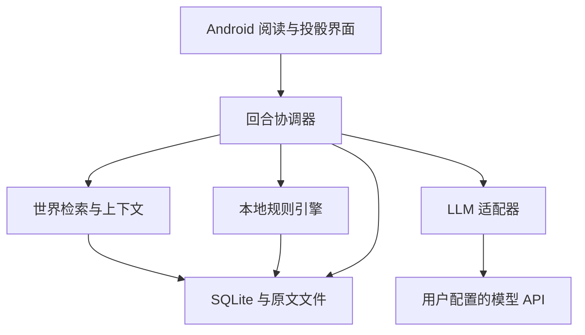

# ShineWord 互动小说跑团 App 建设方案

- 版本：v1.0（建设基线，尚未实现）
- 编制日期：2026-09-26
- 项目：ShineWord
- 目标仓库：https://github.com/anjingdtl/ShineWord
- 平台：仅 Android App
- 参考底座：https://github.com/anjingdtl/tavo-mini
- 文档定位：产品、领域规则、技术架构、实施顺序和验收依据；文中拟定数值不代表已经完成平衡测试。

## 1. 项目定位与建设结论

ShineWord 是面向个人玩家的 AI 互动小说跑团应用。用户通过 API 配置 LLM，导入小说 TXT，构建可追溯的世界资料，选择原著角色或原创角色，从选定时点进入世界。每段剧情之后可以选择系统选项或输入自由行动，由本地规则引擎裁定、掷骰和结算，再由 LLM 描写结果。

采用“原著定义世界、玩家决定行动、规则引擎决定机械结果、LLM 负责主持与叙事”的结构。世界规则与开局前的事实不能被游戏悄悄覆盖；开局后的事件可以因玩家行动分叉。原著后续事件是带条件的参考走向，不是强制命运。

独立建立 ShineWord 仓库、应用包名、数据库、版本号和发布流水线。评估并抽取 tavo-mini 的适用能力，不在原应用内堆叠大型游戏模式，不覆盖原用户作品。

### 1.1 已确认需求

1. 仅支持 Android。
2. 通过用户配置的 API 接入 LLM。
3. 支持 TXT 小说导入并生成世界观、角色等世界资料。
4. 支持扮演原著角色与创建原创角色。
5. 每段剧情提供固定选项和自定义输入。
6. 世界规则约束剧情，玩家路线形成自己的经历。
7. 引入跑团检定，人物技能与属性约束骰子面数和数量。
8. 成长以有意义的使用、训练和关键经历为主，关键节点辅以少量自由成长奖励。
9. 建立公开仓库并以本文作为建设起点。

### 1.2 本方案默认决策

以下是为了可实施而提出的默认值，可通过后续版本讨论调整：自定义骰池而非完整 D&D 规则；本地优先、无业务后端；默认允许改变开局之后的原著事件；默认角色不能直接获得读者的全书知识；首版使用轻量场景冲突，不建设战棋地图。规则版本在创建存档时冻结，不能更新 App 后静默改变旧局。

## 2. GitHub 参考调研与取舍

调研日期为 2026-09-26。星数为当次检索到的 GitHub 页面显示值，页面可能来自搜索缓存，不是实时 API 精确统计，也不是全球排名。跑团领域项目与相邻高星叙事/回合引擎分列，避免把低星垂直工具包装成万星项目。此次检查官方仓库介绍、可见结构与底座依赖，未完成全量源码审计。

| 项目与来源 | 页面星数 | 类型 | 可借鉴机制 | ShineWord 取舍 |
| --- | ---: | --- | --- | --- |
| [boardgame.io](https://github.com/boardgameio/boardgame.io) | 约 12.4k | 回合游戏状态引擎，并非专门跑团软件 | 用动作描述状态变化，回合与阶段、日志和历史状态 | 借鉴纯函数 reducer、阶段推进和重放；首版不引入联机服务器 |
| [ink](https://github.com/inkle/ink) | 约 4.9k | 互动叙事语言 | 分支、条件和叙事结构 | 借鉴选择条件和分支组织；动态小说不预生成整棵剧情树，首版不要求运行 Ink |
| [Yarn Spinner](https://github.com/YarnSpinnerTool/YarnSpinner) | 约 2.8k | 对话工具核心 | 将对话流程与游戏集成分开 | 借鉴叙事输出协议；不引入 Unity 或 C# 运行时 |
| [MapTool](https://github.com/RPTools/maptool) | 926 | 成熟虚拟跑团桌面 | 角色属性、状态、先攻和场景管理 | 借鉴状态可视化；地图、格点和桌面系统不搬入首版 |
| [Avrae](https://github.com/avrae/avrae) | 468 | D&D Discord 跑团机器人 | 骰点解析、角色卡联动、生命与状态跟踪、自动结算 | 借鉴规则与角色数据绑定；不移植 Discord、Python 服务及完整 5e 内容 |
| [SealDice](https://github.com/sealdice/sealdice-core) | 285 | 中文 TRPG 骰点工具 | 规则模块、角色与会话隔离、骰子表达式 | 借鉴中文检定反馈、可扩展规则；不移植 IM 适配和 Go 后端 |

### 2.1 调研后的设计修正

- 从 Avrae/MapTool 的角色状态管理得到启发：能力、物品和伤势必须是结构化字段，不能只存在于主持人的文字中。
- 从 boardgame.io 得到启发：动作、结算、状态更新和展示拆开，支持可重放的事件序列。
- 从 ink/Yarn Spinner 得到启发：选项须有前置条件和明确意图，叙事结构独立于 UI。
- 从 SealDice 得到启发：世界规则包与掷骰内核分离，给未来不同小说类型留下扩展点。
- 上述均为 ShineWord 的设计推导，不意味着这些项目已经实现小说导入或 AI 主持能力。

### 2.2 复用边界

官方仓库页面显示：boardgame.io、ink、Yarn Spinner、SealDice 标示 MIT；Avrae 标示 GPL-3.0；MapTool 标示 AGPL-3.0。当前阶段只参考设计，不复制第三方实现或规则正文。实际引入代码前逐项核验对应文件和版本的 LICENSE、依赖及素材来源，建立 THIRD_PARTY_NOTICES。ShineWord 的许可证由维护者明确选择；“公开仓库”不自动等同于授予开源许可。首批文档不代替维护者添加许可证。

不内置整本商业小说、官方规则书、第三方角色数据或图像。测试采用原创或明确允许使用的文本。

## 3. tavo-mini 底座复用方案

当次读取的 [README](https://github.com/anjingdtl/tavo-mini/blob/main/README.md) 将项目标为 ShineWriter V3.0.9，描述 Canon 原著分析、长期记忆、上下文分配、一致性审查、本地备份和 API Key 安全存储。

当次读取的 [package.json](https://github.com/anjingdtl/tavo-mini/blob/main/package.json) 包含 React Native 0.85.3、React 19.2.3、TypeScript、Zustand、SQLite、文件选择与 Keychain 等依赖。该依赖文件说明已有相关技术组件，不证明每项业务能力已测试通过。构建参考：[正式 APK 指南](https://github.com/anjingdtl/tavo-mini/blob/main/docs/RELEASE_APK_BUILD.md)。

| 能力 | 处理方式 | 开工前验证 |
| --- | --- | --- |
| API 配置、请求、流式响应 | 抽取适配层 | 超时、取消、代理服务差异、结构化输出能力 |
| TXT 导入、分章 | 抽取并加强 | 编码、超长章节、异常标题、内存峰值 |
| Canon 事实与资料 | 改造 | 来源锚点、时间有效性、角色认知、分叉后过滤 |
| 上下文预算与记忆 | 改造 | 必须保留硬规则，不能被摘要挤掉 |
| 续写审查 | 改造为回合审查 | 不照搬多稿长篇链路；保留有证据的冲突检查 |
| SQLite、备份、Keychain | 优先复用接口经验 | 新库独立迁移、事务能力、恢复一致性 |
| 编辑器和章节工作流 | 不直接复用产品流程 | 重建阅读、投骰、选项与存档界面 |
| 发布与更新 | 抽取通用机制 | 新包名、新发布元数据；禁止直接复制签名凭据 |

第一阶段产出真实文件路径、接口、测试情况、目标模块、许可证和上游 commit 的复用清单。当前不虚构可直接复制的源码路径。

## 4. 产品范围与用户流程

### 4.1 MVP 功能

- 模型连接配置、连接测试与请求费用记录。
- 世界书架，TXT 导入、章节预览、分析进度、暂停和恢复。
- 世界资料预览、来源查看、冲突标记和用户修订。
- 原著角色/原创角色、开局章节和时间点、人物数值确认。
- 剧情阅读、3～4 个有区别的选项、自定义行动。
- 检定预览、投骰结果、角色成长与关键状态展示。
- 自动保存、分支存档、回退、导出与恢复。
- 本地规则日志、原著依据和请求用量的可选详细视图。

不做：多人联机、账号商城、跨平台客户端、完整 D&D 5e、战棋地图、自动配图、复杂经济模拟、实时语音主持、用户自执行脚本市场。接口可扩展，但不为远期功能先建设基础设施。

### 4.2 主流程

导入 TXT → 校正章节 → 基础分析 → 检查世界与人物 → 完成开局所需资料 → 选择角色及开局 → 开场剧情 → 行动/检定 → 结果剧情 → 持续游玩。

没有 API 时仍可阅读已导入文本、已生成资料和历史存档；新的 AI 分析和剧情生成需要网络。掷骰与既定规则结算本地运行。

### 4.3 安卓界面

| 页面 | 主要内容 |
| --- | --- |
| 世界书架 | 世界卡片、分析完成度、最近游玩、创建入口 |
| 导入工作台 | 编码预览、章节列表、估算用量、分析任务 |
| 世界档案 | 规则、人物、地点、时间线、证据与冲突 |
| 开局向导 | 身份、背景、目标、时间点、规则版本 |
| 游戏页 | 剧情正文、底部选项、自定义输入、检定卡 |
| 人物页 | 属性、技能、物品、关系、伤势、成长记录 |
| 旅程页 | 已知事件、目标、分支、存档和恢复 |
| 设置 | 模型、输出长度、费用上限、备份、可访问性 |

默认采用阅读式界面，机械细节按需展开。支持字号与深色模式、长列表分页、触屏投骰和屏幕阅读器。按钮不以颜色单独区分风险。

## 5. 世界构建与原著一致性

### 5.1 数据分层

1. 原著事实层：世界规则、人物经历、原文证据、时间线；游戏不可覆盖。
2. 存档状态层：玩家与 NPC 的当前状态、已发生事件、物品归属、世界时钟。
3. 叙事记忆层：近期片段、阶段摘要、伏笔与承诺；是检索辅助，不是状态权威。
4. 游戏扩展层：原著未写明但游戏生成的地点细节、NPC、事件；标明来源为游戏生成，不伪装原著事实。

### 5.2 TXT 处理

- 初始文件上限建议 32 MiB，可配置；不把字符数简单当作 token。
- 检测 BOM/UTF-8；对 GB18030 等提供解码预览和手动选择。保留原始文件与规范化文本的独立哈希。
- 章节规则支持“第X章”、卷、序章及无标题文本；无法识别时按段落分段，供用户修正。
- 规范化后以 chapterId、segmentId 和字符偏移定位原文；字符偏移约定统一为 Unicode 码点，跨 JS 实现建立转换测试。
- 以模型 token 预算切块，尽量保留段落；重叠区按证据位置去重。
- 任务以 sourceHash + chunkHash + extractorVersion + modelConfigHash 作为缓存键；修改某章只使关联提取和合并任务失效。

### 5.3 分阶段分析

先全书轻量索引，提取章节摘要、实体提及与关键事件；再构建世界规则和人物基础档案；最后深化开局附近与相关人物资料。用户可选择完整深化后再开局。

“基础分析完成”与“深度分析完成”必须区分。开局门禁要求关键世界规则、玩家角色、起始地点和直接相关事件已完成分析且无阻断冲突。缺失信息明确标 unknown；不得用模型确信语气替代证据。

分析任务持久化，保存每块状态、重试次数、输出版本和消耗；低并发开始，限制自动重试，达到用户预算后暂停。用户离开前台时可安全暂停；需要后台长任务时再用经过安卓适配验证的原生任务调度，不依赖 JS 定时器常驻。

### 5.4 事实结构与时间

每条事实包含：subjectId、predicate、object/value、sourceSpans、confidence、status、validFrom、validTo、revealedAt、knownBy、provenance。

- validFrom/validTo 表达世界内生效时间；revealedAt 表达读者何时得知，二者不能混用。
- 原文“传闻”“人物猜想”“不可靠叙述”保留事实类型，不强制升级为客观事实。
- 小说回忆和倒叙采用局部事件先后关系；不能直接将章节序号等同世界时间。
- 实体合并采用稳定 ID 与别名；同名人物不自动合并，冲突进入待核对队列。
- 模型 confidence 只是辅助排序；证据匹配、冲突检查与人工抽查共同决定可用性。

### 5.5 分叉与未来事件

开局前历史冻结；开局后的原著事件存为“条件事件模板”，包含参与者、前提、最早发生时间及依赖事件。玩家救下原著死者后，死亡相关的后续模板应失效或重新评估，不能仍以“死者”状态被检索注入。

已有存档绑定 worldVersion。用户修订世界资料形成新版本；旧局继续绑定旧版，或经迁移预览创建新分支，不静默更改。

NPC 只能依据自己的 knownFacts 行动。默认采用角色内视角；可选读者先知模式，但其知识不自动传给 NPC。计划器可检索幕后信息，叙事器只接收本回合允许公开的最小信息，减少秘密泄露。

## 6. ShineWord 轻量规则 v0.1

此规则是自定义跑团草案，不宣称兼容某一版 D&D。先完成概率与体验验证，再发布稳定 rulesetVersion。

### 6.1 行动分类

- 条件满足且无风险：直接执行。
- 结果不确定且失败有代价：检定。
- 世界规则不允许或缺少必要能力：不可执行，给出替代路径。
- 目标不清：先澄清行动，不消耗骰点。
- 条件未变化的重复行动：复用既定失败状态或要求承担新增代价，不允许无限重投。

自由输入是行动意图，不是已发生结果。“我取得秘籍并成为宗师”须拆解为可尝试的步骤。玩家输入和小说文本均不得改变系统规则或执行代码。

### 6.2 属性、技能和骰池

核心属性建议为体魄、敏捷、心智、感知、意志、交涉，初始范围 1～3。世界规则包可以调整显示名称，但不随意改变算法。原创角色默认六项各 1 点，再分配 4 点，每项最多 3；特殊背景与原著角色采用单独模板并展示强度。

技能决定骰子面数：入门 d4、熟练 d6、精通 d8、大师 d10、宗师 d12。未训练时，仅基础可尝试技能使用 d4；专业技能必须先满足知识、工具或师承门槛。

基础骰数等于相关属性，环境修正 -1/0/+1，最终骰数限制为 1～4。多个优势不无限叠加，优劣势先抵消。首版不加入通用数值加值、爆骰和任意重投，减少不可解释组合。

检定为 N 颗 S 面骰取最高值：R = max(d1, ..., dN)。目标难度 T 在掷骰前锁定。R >= T 为成功。

| 难度档 | 目标值 | 用途 |
| --- | ---: | --- |
| 容易但有风险 | 3 | 有时间压力的基础操作 |
| 标准 | 5 | 需要一定熟练度 |
| 困难 | 7 | 明显障碍 |
| 极难 | 9 | 高阶能力 |
| 传奇 | 11 | 顶尖水平且满足世界前提 |

难度依据行动模板、障碍等级和场景证据确定，不能为了照顾玩家每次自动下调。工具优先改变行动资格或提供骰数优势。若 T > S，成功率为 0，掷骰前提示改换路线，不能让最高点变成无视规则的万能成功。

### 6.3 概率与平衡

对于独立均匀骰子且 1 <= T <= S：
P(成功) = 1 - ((T - 1) / S)^N。
T <= 1 时为 1；T > S 时为 0。

| 检定 | 成功率 |
| --- | ---: |
| 1d6，T=5 | 33.33% |
| 2d6，T=5 | 55.56% |
| 3d6，T=5 | 70.37% |
| 2d8，T=6 | 60.94% |
| 3d8，T=6 | 75.59% |
| 2d8，T=7 | 43.75% |

增加骰数主要提高稳定性，提高面数提高上限。需监测高属性是否压过技能成长、低阶是否过度锁死。平衡调整只能通过规则版本，不在同一局中暗改概率。

### 6.4 结果与风险合同

M = R - T。默认 M >= 3 为充分成功；0～2 普通成功；-1～-2 失败；<= -3 严重失败。某些低面数检定不可能充分成功，这是该草案的显式取舍，需用原型验证。

每次检定提前冻结四档结果对应的 mechanicalEffects 和 narrativeConstraints；严重失败的代价仍受已声明风险上限约束。不能在潜行小失败后临时宣布角色死亡。最高骰点不额外自动暴击，所有骰子为 1 也不额外无条件致死。

失败应推进局势：警觉增加、时间流逝、失去机会、资源耗损或进入新冲突，不默认卡死任务。关键线索至少设计另一条合理路径。

### 6.5 战斗与对抗

MVP 使用场景冲突：每回合一个主要行动，可进攻、防御、逃跑、交涉或使用物品。敌方威胁由冻结模板转换为目标难度，暂不使用两套对掷算法。

伤害、护甲、资源消耗与状态变化由规则包中的有界公式或枚举效果决定。例：普通攻击成功造成 1 点创伤，充分成功 2 点；角色伤势达到模板阈值后失能。此为测试模板，武侠或修仙不能直接把所有强度压成同一数值。敌我境界、免疫和行动资格先判定。

冲突回合包含玩家行动与敌方响应，敌方响应也必须经过规则流程，不能由叙事器任意补伤害。全局时间只由已结算行动推进；NPC 幕后活动按事件触发、时间阈值和前提处理，不逐秒模拟所有人物。

### 6.6 成长

- 每项技能每个有效场景最多记 1 次实践，成功或有代价的失败都可计入。
- 场景不是仅由 LLM 任意起名；使用 encounterId、目标、地点和世界时间窗口组成去重键。
- 同条件刷操作、无风险重复行动、回退重放不得重复获益。
- 测试门槛：d4→d6 需 8 次有效实践及 1 次训练；d6→d8 需 20 次及导师/资料；更高等级绑定世界内突破条件，暂不设通用自动升级。
- 关键里程碑可授予 1 个成长点，使用上限和用途由世界规则包定义，不能跳过专业门槛。
- 原著人物初始数值以开局当时表现映射；标为 gameMapping，不冒充原文精确数字。

## 7. 回合引擎与 LLM 协作

### 7.1 状态机

ready → planning → awaitingRoll → rolled → narrating → validating → committed。
非检定行动跳过 awaitingRoll/rolled，但仍记录 resolvedAction。异常进入 recoverableError，恢复时从持久化检查点继续。

- planning：解析意图，检索依据，提议检定合同与有界后果。
- awaitingRoll：本地校验并冻结合同，展示技能、骰池和公开风险。
- rolled：本地生成骰点，持久化 RollRecord，规则引擎算出结果。
- narrating：将不可变结果和可公开事实交给 LLM 生成正文和下一轮候选选项。
- validating：校验 JSON、实体引用、数值、禁改字段、来源与叙事冲突。
- committed：事务提交结果、正文、事件、状态和成长；开放下一回合。

### 7.2 权限边界

| 组件 | 可做 | 不可做 |
| --- | --- | --- |
| Planner | 理解行动、选择规则模板、提出难度依据和后果合同 | 生成随机结果、直接改数据库 |
| Rules Engine | 校验资格、冻结难度、掷骰、计算机械效果 | 让模型控制随机数、越界修改 Canon |
| Narrator | 描写已确定后果、提出下一步选择和非机械细节 | 改骰点、奖励技能、复活角色或暗扣资源 |
| Checker | 给出带片段、依据和修订动作的冲突报告 | 没有证据就推翻已结算检定 |
| Committer | 校验版本、原子保存、更新投影 | 在结果不完整时发布下一回合 |

新 NPC、地点等非机械扩展也须先通过实体与规则校验才能写入游戏扩展层。数值 changes 只能来自已批准合同与 reducer；模型输出不得使用任意 JSON Patch 修改整个存档。

### 7.3 请求预算

默认风险回合两次 LLM 请求：规划合同一次、结算后叙事一次；关键人物命运、罕见能力、复杂因果等触发一次审查，必要时最多一次定点修复。因此常规 2 次，高风险最坏 4 次，不含显式网络重试。

普通无风险、已有合法动作模板的行动可在本地裁定后只请求一次叙事。已生成的固定选项只有绑定当前 stateVersion、已预检完整合同时才能省略新规划；状态变动则失效。自定义行动通常需要规划。

拒绝“单次请求先写骰点再写剧情”的捷径。正文建议每回合 300～600 汉字，可调；先展示投骰结果和进度，再展示通过检查的正文。流式文字如展示须标为生成中，结束前不开放下一回合。

### 7.4 一致性门禁

硬校验：状态版本、实体存在、技能门槛、物品唯一性、资源上下限、死亡/失能状态、骰数范围、结果一致、必需字段、禁止修改原著。

语义校验：人物动机、知识边界、世界规则、因果、承诺和伏笔。机器不能保证任意长小说零矛盾；高风险冲突阻断，低置信问题标记并给用户查看，保留原文证据。修复只改叙事或未提交扩展，不改骰点、难度和机械结算。

### 7.5 中断与幂等

turnId + branchId 为幂等主键，stateVersion 乐观锁防止并发提交。掷骰结果先持久化并绑定合同哈希，再进行叙事请求。网络失败、App 被杀、取消动画、重试叙事都复用同一结果。

随机数使用经过验证的 Android 安全随机源，均匀映射采用拒绝采样；测试可注入确定性随机源。保存实际骰点用于重放，不以重新调用随机数重建历史。骰子动画只表现已确定结果。

取消掷骰前的行动不消耗骰点；掷骰后取消只暂停后续展示，不能重新抽签。客户端单机不承诺防篡改竞技公平。分支可探索不同路线，但重放同一已记录事件使用旧骰点。

## 8. 技术架构

采用 React Native + TypeScript 安卓客户端，沿用底座技术经验，具体版本通过可构建验证后锁定。领域引擎为纯 TypeScript，原生层负责安全存储、文件与必要后台任务。SQLite 保存业务权威数据，Zustand 仅承担 UI 投影与短期交互状态。



拟建目录：

```text
src/
  app/                 导航与装配
  features/            书架、导入、角色、游戏、存档、设置
  domain/
    canon/             事实、来源、时间与冲突
    rules/             骰池、门槛、成长、效果
    sessions/          状态机、事件、分支
    narrative/         叙事协议、可见性、选择
  application/         回合协调、导入任务、恢复任务
  infrastructure/
    llm/               供应商适配和预算
    db/                SQLite、迁移、事务
    files/             原文、备份
    android/           Keychain、随机数、后台适配
  shared/              通用类型与校验
rulesets/              受控声明式规则包
docs/                  方案、ADR、协议和验收
tests/                 规则、状态、恢复、原著一致性样本
```

不在世界包中运行 eval 或任意脚本。首版规则包是版本化 JSON，效果类型为白名单枚举；导入包需限制大小、实体数、嵌套深度、路径和文件哈希。将来支持扩展需另行设计沙箱。

### 8.1 核心接口

```typescript
interface RuleEngine {
  validateAction(state: SessionState, draft: ActionContract): ValidationResult;
  resolve(contract: FrozenContract, roll: RollRecord | null): ResolvedAction;
  reduce(state: SessionState, action: ResolvedAction): StateChangeSet;
}
interface WorldRetriever {
  retrieve(query: RetrievalQuery, scope: KnowledgeScope): Promise<EvidenceBundle>;
}
interface LlmAdapter {
  capabilities(): ModelCapabilities;
  plan(request: PlanningRequest, signal: AbortSignal): Promise<ActionContract>;
  narrate(request: NarrationRequest, signal: AbortSignal): Promise<NarrativeDraft>;
}
```

接口为拟定协议，尚非仓库已实现 API。模型能力包括结构化输出、上下文窗口、流式响应、usage 字段和缓存支持；连接测试探测并记录，不根据模型名称猜测。

## 9. 数据模型与存档协议

| 表/实体 | 关键字段与职责 |
| --- | --- |
| worlds / world_versions | 世界标识、原文哈希、分析状态、绑定规则版本 |
| source_chapters / source_segments | 文本位置、章节、哈希与索引 |
| entities / aliases | 人物、地点、组织、物品类型与稳定身份 |
| canon_facts / evidence_spans | 事实、时间、置信、来源和冲突 |
| event_templates / event_dependencies | 原著候选未来事件及依赖 |
| sessions / branches | 世界版本、角色、开局、父分支与分叉事件 |
| actor_states / actor_knowledge | 属性、技能、伤势、认知、关系 |
| item_instances / ownership | 唯一物品实例与归属 |
| turns / action_contracts / rolls | 幂等回合、冻结合同和骰点 |
| events / snapshots | 追加事件与可恢复快照 |
| memories / goals / clocks | 摘要、目标、伏笔、警觉等进度 |
| analysis_jobs / llm_requests | 断点任务、预算、状态、脱敏诊断 |

事件日志是已提交状态变化的权威记录；当前状态表是事务维护的投影，快照用于加速恢复。原著资料由 worldVersion 引用，不复制到每个回合。

事件包含 eventId、branchId、turnId、sequence、type、payload、rulesetVersion、worldVersion、createdAt。重放不调用 LLM；正文也保存原结果。摘要缓存须绑定 branchId 与事件边界，回退后不能混入未来摘要。

每 20 个回合及关键事件保存快照，数值为初始配置。分支采用父分支+分叉事件引用，不必复制整个数据库。

### 9.1 回合合同示例

```json
{
  "schemaVersion": 1,
  "turnId": "turn-001",
  "stateVersion": 12,
  "rulesetVersion": "shineword-lite-0.1",
  "actorId": "actor-player",
  "intent": "借雨声掩护潜入藏书阁",
  "actionType": "check",
  "skillId": "stealth",
  "attributeId": "agility",
  "dice": {"count": 3, "sides": 8, "keep": "highest"},
  "target": 6,
  "evidenceIds": ["fact-guard", "event-rain"],
  "outcomes": {
    "strongSuccess": [{"type": "move", "locationId": "library-inner"}],
    "success": [{"type": "move", "locationId": "library-door"}],
    "failure": [{"type": "advanceClock", "clockId": "alert", "amount": 1}],
    "severeFailure": [{"type": "advanceClock", "clockId": "alert", "amount": 2}]
  }
}
```

本地校验后添加 contractHash 和冻结时间。示例地点与事实 ID 只表示协议结构，必须存在于实际存档。对于结果 2、5、7，R=7、M=1，适用 success；模型只能描写玩家到达门口，不能宣布已拿到秘籍。

### 9.2 备份与迁移

建议备份为 .shineword.zip：manifest.json、版本化世界资料、存档事件、快照及可选原文。默认不包含 API Key；原文是否随包导出由用户选择。恢复前校验版本、哈希、引用与路径，先建立保护性备份，再事务替换。旧规则包随存档保留，缺失时阻止继续计算并提示恢复所需版本。

## 10. 检索、记忆和费用

检索顺序：硬规则与当前状态 → 当前人物/地点及依赖事件 → 近期剧情 → 相关原文 → 阶段摘要。硬规则、冻结结果和知识可见性不可因上下文预算不足被静默裁剪；放不下时缩小任务或提示模型窗口不足。

首版可采用 SQLite 全文检索加实体/时间过滤。中文分词与 FTS 可用性必须在目标构建实测；不可默认英文 token 化对中文有效。可采用预分词字段或字符 n-gram 的小型索引作为回退。向量检索可在后续加入，但不能绕过时间和认知过滤。

每 5～10 回合尝试更新阶段摘要，重要事实即时事件化。摘要异步任务绑定已提交事件区间，失败不阻断规则状态。人物关系变化、物品转移和死亡永不只记摘要。

费用按服务商实际 usage 和用户配置单价计算；缺少 usage 时标为估算。公式为输入 token × 输入单价 + 输出 token × 输出单价，加缓存/嵌入等单独费用。显示本次、导入累计和当前存档累计；设置单次输出上限、导入总预算与日预算，无法取得价格时不显示虚假的确定金额。

记录总等待、规划、叙事、审查、修复耗时，以及物理请求数。不能将两次请求宣传为一次，也不能为提升质量无上限自动重试。

## 11. 安卓可靠性与数据边界

- 单存档同一时刻只允许一个回合写入；SQLite 事务包含事件、投影、正文与成长。
- 长小说分块读取，列表分页，避免将全书和历史聊天常驻 JS 内存。
- App 生命周期变化先保存阶段；后台任务优先暂停可恢复，不承诺所有安卓厂商允许常驻。
- Key 存入系统安全存储，数据库与日志只保存配置标识；备份排除密钥。
- 首次远程分析明确显示会发送小说片段及相关上下文到用户选择的服务商。
- 日志默认脱敏，完整请求查看由用户主动打开；不启用默认远程遥测。
- 不导入第三方脚本；小说中的提示注入作为文本处理。
- Android 最低版本以 React Native、原生依赖和实机构建验证结果确定，不继承 README 的旧兼容承诺。
- 首次发布建立 ShineWord 自己的包名和签名保管流程，不复制目标底座的密钥、密码或本地路径。

## 12. 实施里程碑

按可验收成果推进，不在尚未审计底座前承诺固定工期。

| 阶段 | 建设内容 | 交付门槛 |
| --- | --- | --- |
| M0 基线与复用审计 | 仓库、方案、上游版本、模块清单、技术构建验证 | 可独立构建安卓空壳，明确可复用源码和风险 |
| M1 本地规则内核 | 骰池、资格、合同、事件、成长、恢复 | 不接 LLM 也能完成确定性 100 回合模拟 |
| M2 世界构建 | TXT、分章、事实来源、时间线、分析任务 | 原创样本文本完成世界化，可暂停恢复和追溯 |
| M3 AI 闭环 | 模型适配、规划、检定、叙事、校验、提交 | 两种角色入口各完成 30 回合，错误可恢复 |
| M4 一致性与分支 | 未来事件失效、认知隔离、分支、备份 | 100 回合基准、回退无未来记忆污染 |
| M5 安卓内测 | 性能、生命周期、触屏体验、费用上限 | 模拟器和实机验收，发布可安装 APK |

第一条可运行纵向切片：原创短篇样本、一个地点、两名 NPC、原著与原创角色各一个、潜行/交涉/调查三项技能、一次关键事件分叉、20～30 回合。再扩展成长和长文本，不以页面完成数量代替闭环质量。

建议后续建设文档：ADR-001 规则与叙事分离、ADR-002 分叉与时间语义、RULESET.md、DATA_SCHEMA.md、LLM_PROTOCOL.md、REUSE_AUDIT.md、TEST_PLAN.md、THIRD_PARTY_NOTICES。

## 13. 验收与测试

以下为目标与门禁，不是已达到的实测结论。

| 范围 | 场景 | 验收标准 |
| --- | --- | --- |
| 骰池 | 面数/数量/阈值边界、非法值、概率 | 确定性枚举与公式一致；生产随机源分布冒烟测试 |
| 资格 | 无武功挑战宗师、缺少钥匙/知识 | 世界禁令与门槛不被高骰绕过 |
| 幂等 | 连点、断网重试、杀进程恢复 | 同回合只有一个骰点记录和一组结算 |
| 事务 | 在掷骰后、叙事中、提交前后中断 | 恢复到可解释阶段，无重复扣除与奖励 |
| Canon | 同名人物、倒叙、传闻、角色后期能力 | 不合并错误实体，不提前发放能力 |
| 分叉 | 救下原著死者 | 依赖死亡的未来事件不作为已发生事实 |
| 认知 | NPC 未见过秘密、玩家读过原著 | 默认不泄露幕后知识 |
| 物品 | 唯一宝物、买卖、丢失、回退 | 无重复实例，归属一致 |
| 成长 | 刷重复行为、训练、分支重放 | 不重复记实践，突破条件生效 |
| LLM 协议 | 非 JSON、缺字段、伪造实体、改骰点 | 拒绝或有界修复，状态不污染 |
| 长局 | 3 类原创样本各 100 回合 | 机械不变量违规为 0；记录语义冲突率 |
| 备份 | 导出后新安装恢复、旧规则版本 | 状态哈希与事件边界一致，密钥不在包内 |
| Android | 真机和模拟器、前后台、低存储 | 可恢复、可安装、无阻断崩溃 |

语义抽检按固定 rubric 评估：世界规则、时间、角色认知、人物动机和行动结果各项是否冲突。记录问题数/抽检回合数、阻断率、修复率和用户申诉，不用一次模型“通过”冒充客观正确率。

建议性能目标：已加载存档的本地检定 p95 小于 100 ms；首屏/翻页不因全书解析阻塞；API 等待不设无依据承诺，按模型记录 p50/p95、token 和费用。M0 指定参考手机与 Android 版本，M5 在同一基准上报告结果。

## 14. 风险、限制与应对

| 风险 | 应对 |
| --- | --- |
| 全书提取遗漏或事实冲突 | 来源锚点、待核对队列、开局门禁、渐进深化 |
| 大模型改写结算 | 不可变结果协议、本地白名单 reducer |
| 骰池失衡 | 概率枚举、失败分布测试、规则版本化 |
| 选择只是表面变化 | 每项选择绑定不同意图、成本或后果，日志可比较 |
| 角色境界数值难映射 | 原著证据与游戏化数值分开，世界模板与能力资格优先 |
| 一致性审查很慢 | 常规两次请求、高风险按需审查，预算封顶 |
| 手机后台被回收 | 持久化任务、检查点、恢复而非强行常驻 |
| 原著未来污染玩家支线 | 前提依赖、分叉失效与存档覆盖层 |
| 公开资料与许可证不清 | 仅提交原创方案和授权素材，代码引入逐文件审查 |
| 复用底座耦合严重 | M0 文件级审计，抽取适配器，不全仓改名复制 |

## 15. 建设优先级与最终原则

P0：规则确定性、原著来源与时间、回合幂等、两类角色、行动与选项、存档恢复。
P1：长文本增量、成长平衡、NPC 事件、审查优化、分支体验。
P2：可选向量检索、语音、立绘、可视化关系与地点图。
P3：更复杂规则包与创作者工具；多人和跨平台不在本项目范围。

后续实现必须保持以下不变量：

1. 原著事实与游戏经历分离。
2. 掷骰前锁定难度、条件和风险。
3. LLM 不生成权威随机结果、不直接修改游戏状态。
4. 失败产生合理后果，不能靠重试偷偷洗骰。
5. 回退恢复状态、事件和记忆，不只删文字。
6. 世界未知信息可扩展，但必须标识来源且遵守硬规则。
7. 每一项对玩家重要的成长、得失和关系变化可追溯。
8. 先验证可玩的安卓闭环，再扩大模拟规模。

## 16. 参考来源

所有链接为官方项目仓库或底座文件；访问/检索日期 2026-09-26。

1. https://github.com/boardgameio/boardgame.io — 回合状态、阶段和日志设计。
2. https://github.com/inkle/ink — 互动叙事结构。
3. https://github.com/YarnSpinnerTool/YarnSpinner — 对话工具与引擎集成分离。
4. https://github.com/RPTools/maptool — 跑团桌面、角色属性与状态管理。
5. https://github.com/avrae/avrae — 骰点、角色卡、自动结算。
6. https://github.com/sealdice/sealdice-core — 中文跑团与模块化规则。
7. https://github.com/anjingdtl/tavo-mini/blob/main/README.md — 原著续写和 Canon 能力描述。
8. https://github.com/anjingdtl/tavo-mini/blob/main/package.json — 技术依赖核查。
9. https://github.com/anjingdtl/tavo-mini/blob/main/docs/RELEASE_APK_BUILD.md — 安卓构建参考。

本文为 ShineWord 原创建设方案；参考项目的设计启发与 ShineWord 自定义规则已分开说明。仓库当前阶段是规划，不代表已有可用 App。
