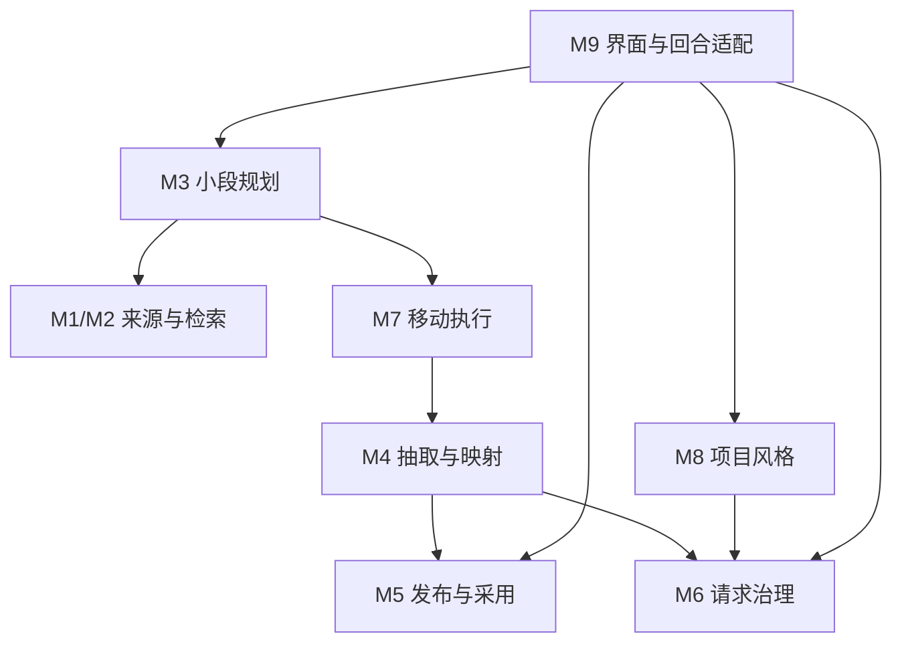
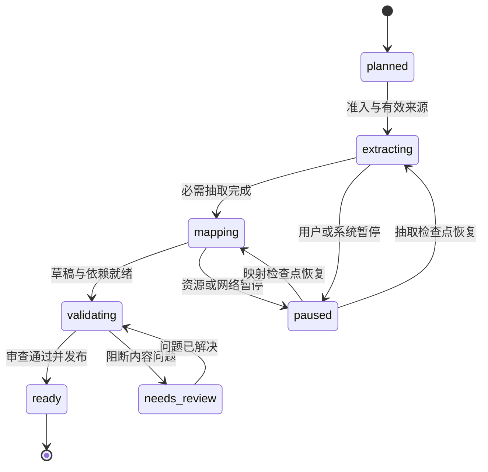

# Shine-TRPG 第六阶段建设改造方案

**主题：移动端快速开局、持续分段构建与项目叙述风格；含独立模块建设边界**

| 项目 | 内容 |
|---|---|
| 文档版本 | 1.0，建设设计稿 |
| 编写日期 | 2026-10-02 |
| 产品/仓库 | Shine-TRPG / `anjingdtl/ShineWord` |
| 核验基线 | `main@c32988206a2ee5542118bf79c5172f933c6c8636`，V0.5.0，versionCode 50000，SQLite schema 28 |
| 参考写作项目 | `anjingdtl/tavo-mini@0a4eabc645eb36b8fde5de1fb8bedb2739dec900` |
| 文档性质 | 施工与验收依据；未实施、未测试、未发布 |
| 阶段命名 | 按本次约定使用“第六阶段”；不把历史专项或版本号推定为第五阶段验收成果 |

## 1. 本期目标与确定的建设方向

第六阶段把 TXT 原著构建改造成“先获得可靠开局，游玩时持续补齐近期需要的内容”。所有原文解析、索引、队列、缓存、事实校验和游戏状态仍在 Android App 内完成；文本理解和叙述继续调用用户配置的 OpenAI-compatible LLM。用户无需预先在电脑上处理小说，也无需部署额外服务器。

本期同时建设独立的项目叙述风格模块：默认跟随导入小说，允许选择预设或自定义；风格只影响叙述表达，不获得改写原著事实、知识边界或本地规则结果的权限。

### 1.1 用户应得到的变化

1. 导入 TXT 后，先整理开局实际需要的人物、地点、关系和可行动内容；满足发布门禁即允许开始，不等待整个大阶段完成。
2. 阅读、建卡和游玩期间，App 在预算允许时提前准备近期可能需要的小段；玩家提交行动时，请求优先服务当前回合。
3. 后续需要新地点、新人物或尚未覆盖的原著范围时，补建对应内容；不因回合数增长而自动全书扫完。
4. 若资料尚未就绪，明确显示正在准备的范围、原因和可继续使用的已就绪内容；不伪造百分比、秒级承诺或原著事实。
5. 每个项目有独立“叙述风格”入口。仙侠、悬疑、日常、奇幻等小说可以保持各自表达，也可由用户调整视角、语言和节奏。

### 1.2 建设目标与硬约束

| 维度 | 本期目标 | 硬约束 |
|---|---|---|
| 首次可玩 | 缩小开局的抽取与映射范围，发布必要内容后立即开放 | 未通过证据、引用闭包和可玩性门禁的内容不能作为正式开局 |
| 后续等待 | 小段、滚动预构建、按需补建，避免到边界才启动大任务 | 未完成内容不能标记为 ready；历史回合不能被后台成果修改 |
| 构建效率 | 原文索引复用、事实抽取复用、映射按变化集执行 | 相同哈希复用必须包含处理协议与配置兼容性，不能只比较文本 |
| 请求资源 | 当前回合优先，后台受并发、RPM、TPM 和预算共同约束 | 所有物理请求继续通过统一预算内核和请求账本 |
| 移动运行 | 保留流式导入、前台服务、租约、检查点和恢复能力 | 不能把 Android 后台运行视为无限持续服务 |
| 写作风格 | 项目独立配置、原著特征分析、逐回合轻量渲染 | 风格不得提升模型权限；自动分析不得覆盖用户编辑 |
| 模块独立 | 明确代码、数据和接口所有权，允许各模块独立验证 | 一个可变数据域只有一个写入所有者，共享文件由集成负责人维护 |

### 1.3 本期不扩大的范围

本期不建设 iOS、不增加中心云服务、不要求端上大模型或向量数据库、不整体重写战役引擎。全书知识图谱、全书社区摘要、多智能体长链分析和自动全书精编不成为快速开局的前置条件。任意章节开局的完整产品入口不列入首批交付；内部范围合同须能表达非连续、多来源范围，为按需补建和后续扩展留出正确基础。

本期必须保留现有确定性骰点、行动合同、事务结算、分支隔离、长期记忆、存档恢复和显式“查阅原著”行为。

## 2. 当前版本复核与复用边界

本方案基于固定提交核验。当前 `README.md` 为 V0.5.0；`docs/DEVELOPMENT_STATUS.md` 开头仍记录 V0.4.2，不能用其标题代替当前版本基线。施工时先重核最新提交与迁移最大编号，若已变化，补充差异记录。

| 当前能力 | 核验代码落点 | 第六阶段处理 |
|---|---|---|
| Android 原生流式解码、规范化分片、码点证据 | `streamingTxtImport.ts`、`sourceStore.ts`、Android TextSource 模块 | 复用，补充性能测量与接口收口；不把整书转成 JS 大字符串 |
| 同项目多部 TXT 导入 | `mobile/src/sourceImport.ts`、schema 28 `world_sources` | 复用来源成员关系与 `s{N}-` 世界侧镜像 ID，不重新编号旧证据 |
| 章节语义切片与预算驱动批次 | `worldBuild/analysisBatchPlanner.ts` | 复用预算内核，新增“首开延迟/后台吞吐”两种目标；不退化成每个存储块一次 LLM 请求 |
| 固定 30/30/40 三阶段规划 | `worldBuild/stagePlan.ts` | 新任务逐步采用小段规划；旧任务继续按原 planVersion 恢复 |
| 已有提前发布开局 | `worldPackage/playabilityGate.ts`、`mobile/src/sourceImport.ts` | 保留并改进。目前已按分析批次检查门禁，并非必须等全书 30% |
| 开局现有门禁 | 至少 20 条可映射事实、带事实人物/地点、事件、无阻断审查/冲突 | 增加“开局依赖闭包”评估；不能靠降低事实计数制造可玩假象 |
| 旧 8,000 码点 dossier 路径 | `worldPackage/progressiveOpening.ts` | 不直接恢复为新主路径；统一事实构建与发布仍是唯一主线 |
| 原著中文检索、别名与近域预取 | `search/chineseSourceSearch.ts`、`localSourceSearch.ts`、`progressiveTurnContext.ts` | 已有本地检索。改造重点是持久索引、增量更新和权限化查询，不重复建设一个并行 RAG 系统 |
| 全局 per-endpoint 限流 | `worldBuild/rateScheduler.ts`、`mobile/src/llmScheduler.ts` | 保留 429/Retry-After 治理，增加显式优先队列与游玩保留额度 |
| 统一预算、推理策略、物理请求账本 | `application/llm/*` | 所有新调用接入，不新增绕行 Provider 或自动重试账本未知结果的路径 |
| 租约、fencing、持久化任务恢复 | `worldBuildStore.ts`、`worldBuild/coordinator.ts`、`buildRunner.ts` | 复用；小段是逻辑工作范围，持久化执行仍复用 build run/unit |
| Android dataSync 前台服务 | `WorldBuildForegroundService.kt` | 复用通知、锁屏/解锁处理、系统超时检查点；补充生命周期验证 |
| 世界包、增量包、分支安全采用 | `worldPackage/*`、`stageActivation.ts`、`contentManifest.ts` | 复用不变性和分支边界；先版本化扩展多来源合同，再接新小段 |
| Narrator 表达约束 | `game/v2Turn.ts`、`game/llmTurn.ts` | 在冻结回合管线中接入项目风格快照；本地裁定权限不变 |

### 2.1 本次需要解决的实际阻滞

- 开局抽取虽可提前结束，但早期映射仍可能遍历较大的 canon 事实集合；需要以开局依赖闭包限制工作量，并显式记录提前发布失败原因。当前提前尝试中存在吞掉错误后继续大阶段的路径，应改成可诊断的持久状态。
- 后续阶段以全书比例为主要组织方式，预构建在前一阶段末尾 15% 附近触发；这不能充分反映玩家移动、支线需求和慢模型构建耗时。
- 本地检索索引主要驻留内存，来源范围、别名指纹变化可能导致重建；应把稳定文本索引与动态范围/别名分离。
- 现有请求调度统一了限流，但没有完整的回合优先队列和保留额度；后台长请求仍可能占满资源。
- 后续映射、验证与发布需要按变化集处理，避免每个小段都重新抽取旧事实或让 LLM 重写全部旧条目。
- 当前没有与 tavo-mini 同等独立的项目风格语义配置、编译、版本快照和用户覆盖流程。

### 2.2 借鉴项目的具体取舍

| 参考项目 | 借鉴机制 | 在 Shine-TRPG 中的落点 | 不直接搬入的部分 |
|---|---|---|---|
| SillyTavern | Data Bank 检索、World Info 按相关性与预算激活 | 资料按当前场景/实体选择，保持上下文预算与激活条件 | 其提示词权限不能替代本项目的知识隔离和本地裁定 |
| novel2galgame | 增量人物管理、分层资料、检索父级上下文 | 实体统一 ID、局部证据加相邻段落、按需更新 | 多轮多角色分析链不作为手机快速开局主线 |
| novel_reader | 导入与结构化知识/摘要处理分层 | 原文先本地可读、构建独立推进、缓存分层 | 不引入其桌面离线处理前置流程 |
| GraphRAG / LazyGraphRAG | 低成本索引与查询时延后部分理解的思路 | 稳定本地文本索引，付费理解集中在当前需要的范围 | 全书社区摘要、完整图谱索引和英文默认抽取策略 |
| LightRAG | 实体/关系分层、模型任务拆分与增量更新 | 抽取、映射、叙述采用各自合同与预算策略 | 不能假设其每块 LLM 抽取天然更省；不引入额外服务栈 |
| tavo-mini | 项目绑定、结构化写作风格、编译投影、原著风格采样 | M8 项目风格域、Narrator 轻量投影、逐回合冻结 | 长篇续写流水线及其全部预设兼容层不作为本期前置 |

以上是机制借鉴和针对本项目的设计推导，不是这些仓库已经证明本 App 能达到某个速度。第三方代码若实际复用，另行核验许可证与版本；本方案不要求复制源码。

## 3. 目标流程与等待体验

### 3.1 首次导入与开局

1. 用户选择 TXT，App 原生流式解码、规范化、落盘，形成 active 来源清单。首批保留“完整本地导入后激活”的事务边界，不为未经性能测量的导入瓶颈引入半激活来源。
2. M3 以默认开篇和开局相关实体规划 `bootstrap` 段；M2 优先索引这一范围，其余本地索引可渐进完成。
3. M4 抽取有证据的事实。每个完成批次触发开局门禁，选取必要事实与引用闭包做映射。
4. M5 验证、审查并发布正式开局资料。门禁通过即发出“开局已就绪”；不把后续范围的失败当成已就绪开局的失败。
5. 用户建卡、阅读引导或开始游玩时，M3 根据 readiness 与预算准备近期内容。M8 的原著风格分析默认复用开局采样，独立分析任务不得挡住开局发布。

UI 可以显示“原文已导入”“正在整理开局人物与地点”“开局已就绪，可开始”“正在准备后续内容”。“开局已就绪”和“整部原著整理完成”必须是不同状态。

### 3.2 游玩中的持续建设

每次回合安全结束后，M3 接收当前地点、已知实体、有效行动依赖和已采用内容范围的摘要，计算近期需求。典型缓冲为“当前可用内容 + 1～2 个近期候选段 + 一个正在执行的段”，其中数量是可调上限，不意味着所有支线都提前生成。

玩家提交行动时，先冻结当前分支的内容与风格版本，再让当前回合进入高优先队列。若动作要求资料不存在，先进行本地检索和依赖判定；仅在动作确实依赖未构建资料时启动 `urgent` 补建。准备完成后于安全边界恢复原动作意图，不自动提交新的玩家决定、不重掷已经持久化的骰点。

如果动作在当前已就绪内容内可以成立，应直接执行；不因附近有后台任务而统一阻塞整场游玩。

### 3.3 构建不足时的展示

| 状态 | 玩家界面 | 恢复行为 |
|---|---|---|
| 近期内容已就绪 | 简短展示“后续资料已准备”，默认不占正文 | 新回合按分支采用规则取资料 |
| 请求中且确实阻塞动作 | 展示所需资料类别和真实步骤；可离开页面 | 保留动作草稿、任务检查点和已经冻结的回合结果 |
| 断网/供应商限流 | 展示等待网络或限流退避；不循环弹窗 | 到 retryAt 且预算允许时恢复 |
| Android 系统停止后台 | 展示“整理已暂停，回到 App 后可继续” | 从最近检查点恢复，排除第二执行者 |
| 事实冲突或阻断审查 | 说明需要处理的资料范围，链接现有审查入口 | 用户解决后重校验，不重新抽取全部来源 |
| 远端结果未知 | 说明结果未知，沿用现有明确重试机制 | 不自动重发可能已计费的请求 |

等待时可以做现有建卡/查看已知资料等本地操作；不通过生成另一段无关 LLM 文本掩盖等待，也不在后台替玩家选择动作。

## 4. 模块划分与唯一所有权

### 4.1 十个建设模块

模块可以先在现有目录内建立接口和适配器；本期不要求一次性改成 monorepo 多 package。下面的新增路径是建议路径，与现有路径明确区分。M0 同时承担共享合同和集成责任，其余九个模块在合同冻结后可分别建设。

| 编号 | 模块 | 唯一负责事项 | 明确不负责 |
|---|---|---|---|
| M0 | 共享合同与集成 | ID/版本合同、跨模块事件、依赖装配、迁移序列、兼容性总门禁 | 抽取策略、索引算法、文案风格等业务实现 |
| M1 | 原文来源与导入 | 原文落盘、来源身份、章节/范围读取、来源成员生命周期 | LLM 抽取、分支知识、可玩性判定 |
| M2 | 本地原著索引与检索 | 中文文本索引、别名查询、权限化范围过滤、证据候选排序 | 写入 canon、自动扩大玩家知识、决定构建计划 |
| M3 | 小段规划与 readiness | 工作范围、需求合并、缓冲策略、构建意图、逻辑段状态投影 | 直接调用 HTTP、写事实、发布包、改分支状态 |
| M4 | 事实抽取与增量映射 | 有证据 canon、实体归并、变化集映射、构建检查点 | 改骰点/战役状态、发布正式内容、执行 Android 服务 |
| M5 | 内容发布与分支采用 | 引用闭包、审查门禁、不变内容、分支内容 manifest、安全采用 | 原文抽取、全局限流、风格分析 |
| M6 | LLM 请求资源治理 | per-endpoint 优先调度、预算准入、限流、统一账本与物理请求状态 | 小说范围规划、内容含义、Android 唤醒 |
| M7 | Android 执行与恢复 | 前台服务、Headless runner、租约生命周期、系统/用户暂停恢复 | 改任务语义、绕过 M6、另建一套事实数据 |
| M8 | 项目叙述风格 | 项目绑定、原著风格分析、用户覆盖、风格编译与快照 | 更改原著事实、知识可见性、规则结果和请求硬预算 |
| M9 | 产品界面与回合集成 | 项目状态卡、风格设置、行动等待/恢复、回合接线、用户交互 | 在组件内编写构建算法或直接访问其他域表 |

### 4.2 控制流与依赖边界



图中箭头是调用方向。M5 的发布结果通过持久事件/查询投影回到 M3，M4 不反向 import M3；M7 仅依赖执行器端口，不依赖具体 UI。M0 提供合同并在 composition root 装配实现，因此不在图中重复连线。

层次规则：`domain` 不依赖 `application/infra/mobile`；application 业务模块只通过端口调用其他模块；SQLite 实现位于 infra；Android、Keychain、通知和 UI 位于 mobile。禁止通过跨模块 SQL 查询绕过读端口，禁止 infra 被 domain 反向引用。

### 4.3 数据归属表

| 数据域 | 唯一写入模块 | 其他模块访问方式 | 真相来源 |
|---|---|---|---|
| 导入原文、分片、章节、来源成员 | M1 | SourceCatalog/SourceReader | 已激活来源清单及规范化哈希 |
| 文本 postings、索引检查点、别名索引 | M2 | SourceSearch | 本地可再生派生索引；不是事实库 |
| 小段计划、需求合并、ready 投影 | M3 | BuildPlanning/ReadinessView | 计划 + M4/M5 执行成果投影 |
| canon 实体/事实/事件、映射草稿、run/unit | M4 | CanonReader/BuildExecutor | 现有 world store 和 build run/unit 检查点 |
| 发布内容、审查解决策略、分支 manifest | M5 | ContentPublisher/BranchContentReader | 已验证不变内容及分支采用记录 |
| 请求账本、限流状态、物理尝试状态 | M6 | ManagedLlmClient/RequestStatus | 统一请求账本，禁止另立请求计费表 |
| Android 执行恢复标记、服务控制 | M7 | ExecutionHost | OS 生命周期 + M4 租约端口；不复制 unit 状态 |
| 风格资产、项目绑定、用户覆盖、快照 | M8 | ProjectStyle/StyleCompiler | 版本化语义配置及不可变快照 |
| UI 草稿、现有回合/角色/分支状态 | M9 接线至既有所有者 | 原有 campaign/session/turn 端口 | 既有本地规则与事务管线，M9 无新的裁定权限 |

M3 的 segment 状态不是第二套执行账本：它由关联 run/unit 和已发布 artifact 计算。租约只有 M4 的 BuildRunStore 一套，M7 通过端口申请/续期；不得新增不同名称的并行租约表。

### 4.4 共享文件与并行修改规则

以下共享文件/域归 M0 集成负责人修改：`src/infra/sqlite/builtinMigrations.ts`、`mobile/src/database.ts`、`mobile/src/runtime.ts`、`mobile/src/sourceImport.ts` 的统一装配部分、公共导出、全局版本/存档协议和共享类型。M9 可提交接线方案，最终由 M0 合并；模块开发不各自直接改同一大文件。

每个模块拥有自己的服务、SQLite adapter、测试和界面局部文件。遇到新增跨模块字段，先修改合同与兼容测试，再接实现；不以 `any`、任意 JSON 或复制类型绕开边界。迁移编号统一登记，禁止模块分别抢占 schema 29。

## 5. 模块独立建设分界线

### M0：共享合同与集成

- **输入/输出**：已有协议与模块需求 → `phase6-contracts-1`、迁移清单、装配端口、集成测试。
- **建设路径**：新增 `src/application/ports/phase6/`；领域值类型放 `src/domain/build/`、`src/domain/style/`。协调现有 `content/types.ts` 与存档协议。
- **独占修改**：公共 ID、SourceRange、内容协议版本、事件信封、全局 feature flag、迁移序列与 composition root。
- **独立验收**：不同模块仅加载合同即可编译；合同 fixture 验证来源、分支、版本和错误码；旧存档/旧范围拒绝错误转换。
- **交付边界**：一套可替换 fake adapters、依赖图和数据所有权检查。不得在 M0 引入第二套业务调度器。

### M1：原文来源与导入

- **输入**：Android SAF 文件、来源成员关系、导入选项。
- **输出**：active source manifest、规范化哈希、章节、按来源读取的码点范围、来源变更事件。
- **建设路径**：复用 `src/application/import/streamingTxtImport.ts`、`ports/sourceStore.ts`、`infra/sqlite/sqliteSourceStore.ts`、`mobile/src/textSource.ts` 和原生 TextSource 桥；新增 SourceCatalog adapter。
- **独占数据**：`imported_sources/segments/chapters/chunks` 与 `world_sources`；原文暂存与清理。
- **禁止跨界**：不启动 LLM、不把章节标题当作已知事实、不决定新世界包何时可玩。
- **独立验收**：UTF-8/GBK、无标题超长章、空文件、重复导入、中断暂存、二/三部追加；源内码点偏移、世界镜像 ID 和哈希保持稳定。

### M2：本地原著索引与检索

- **输入**：active source snapshot、索引范围、查询文本、明确的 SearchScope。
- **输出**：带 sourceId/hash/码点范围/相关度的证据候选、索引覆盖信息；不输出“已确认事实”。
- **建设路径**：复用 `application/search/chineseSourceSearch.ts`、`localSourceSearch.ts`；新增 `application/sourceIndex/` 和 `infra/sqlite/sqliteSourceIndexStore.ts`。如性能测量证明有必要，再增加原生索引 worker。
- **独占数据**：新增 `source_index_*` 派生表、索引版本与断点；别名映射独立于基础文本 postings。
- **禁止跨界**：不能直接写 branch_knowledge；不能因为全文已索引便向玩家返回未来原文。
- **独立验收**：中文实体/别名、跨段相邻上下文、持久化冷启动、不完整索引覆盖、跨来源隔离、权限过滤和可再生缓存损坏恢复。

### M3：小段规划与 readiness

- **输入**：SourceCatalog、Canon/Content 摘要、当前分支安全状态、场景/行动需求、构建耗时与预算摘要。
- **输出**：版本化 SegmentPlan、BuildIntent、ReadinessView、取消/降级未启动需求；每个 intent 指向 M4 执行端口。
- **建设路径**：新增 `application/segmentBuild/`；适配 `worldBuild/stagePlan.ts`、`stageOrchestrator.ts`、`progressiveBuild/progressiveBuildQueue.ts`，保留旧规划器。
- **独占数据**：新增 `world_segment_plans`、`world_segments`、`segment_demands`；状态投影保存执行引用，不复制 unit 明细。
- **禁止跨界**：无 HTTP、无事实写入、无 package publish、无分支 manifest 写入。
- **独立验收**：非线性移动、支线需求、多分支共享成果、去重与优先级提升、缓冲耗尽、模型慢速预测、追加来源和旧 planVersion 恢复。

### M4：事实抽取与增量映射

- **输入**：BuildIntent、来源范围、冻结构建配置、已有 canon/映射依赖快照。
- **输出**：有证据的 canon 变化集、带输入指纹的映射草稿、run/unit 检查点、可重试/待审原因。
- **建设路径**：复用 `application/worldBuild/coordinator.ts`、`analysisBatchPlanner.ts`、`application/world/llmGroupExtractor.ts`、`worldPackage/buildPackageFromCanon.ts`；新增 incremental mapping 服务，逐步抽出旧大文件中的业务逻辑。
- **独占数据**：现有 world store canon 与 build run/unit；新增 mapping checkpoints/dependency fingerprints 必须沿用现有事务封装。
- **禁止跨界**：不能把草稿标成已发布、不能改分支/骰点、不能另建 LLM 传输与请求账本。
- **独立验收**：每条 explicit 引文定位、重复范围零重复写入、实体归并冲突、局部映射依赖闭包、截断/思考内容恢复、fencing 迟到结果和未知请求结局。

### M5：内容发布与分支采用

- **输入**：冻结 canon 变化集、映射草稿、来源证据、审查解决记录、分支安全边界。
- **输出**：不可变 SegmentArtifact/兼容世界包、PublishedArtifact 事件、每分支 AdoptionReceipt、冻结 ContentBinding。
- **建设路径**：复用 `application/worldPackage/validate.ts`、`publish.ts`、`progressiveDelta.ts`、`contentManifest.ts`、`stageActivation.ts`、`branchContentStore.ts`；新增 world-level segment artifact 与 adapter。
- **独占数据**：世界包/内容条目、segment artifact、审查发布门禁、分支内容 manifest 与采用记录。
- **禁止跨界**：不能改历史角色卡或历史结果；不能让一个分支采用动作消耗其他分支的待采用资格。
- **独立验收**：引用闭包、原著/推断/设计填充 provenance、多来源协议、同一成果多分支采用、回退/分叉、发布事务失败与存档双跳恢复。

### M6：LLM 请求资源治理

- **输入**：任务类型/优先级、endpoint bucket、冻结请求计划、token/RPM 估算、取消与用户活动信号。
- **输出**：准入/排队/限流决定、ManagedLlmClient 调用结果、脱敏物理尝试指标与 requestId。
- **建设路径**：复用 `application/llm/requestBudgetKernel.ts`、`requestLedger.ts`、`scheduledProvider.ts`、`worldBuild/rateScheduler.ts`、`mobile/src/llmScheduler.ts`；建立显式队列而非 polling 竞争 acquire。
- **独占数据**：现有请求账本；可持久化限流退避和资源状态，不保存 API Key。
- **禁止跨界**：不决定是否补建某章、不识别 canon 语义、不通过中止远端请求假定计费撤销。
- **独立验收**：并发 1/2/4、同端点多 profile、429/Retry-After、队列取消、额度保留、饥饿策略、所有请求类型账本覆盖、重启后的 outcome_unknown。

### M7：Android 执行与恢复

- **输入**：M3 工作意图、M4 可恢复任务、M6 资源准入、用户暂停/继续、Android 生命周期信号。
- **输出**：执行器启动/停止、现有 lease 心跳、暂停/解锁/网络状态、通知操作和恢复结果。
- **建设路径**：复用 `mobile/src/buildRunner.ts`、`buildTasks.ts`、`buildWatchdog.ts`、`WorldBuildForegroundService.kt`；新增 ExecutionHost adapter，按实测需要接短任务 WorkManager 调度。
- **独占范围**：Android 服务与通知、OS 触发接线、Keychain 读取时机；通过 M4 端口管理同一套租约。
- **禁止跨界**：不得绕过 M6 发请求，不得将用户“暂停”解释为自动继续，不得用 WorkManager 绕开系统时限。
- **独立验收**：退后台、熄屏、锁屏、网络切换、强杀、超时、通知停止/恢复、重复 runner、数据库暂不可用、无凭据时 waiting_unlock。

### M8：项目叙述风格

- **输入**：项目绑定、原文采样、用户配置、场景类型、当前参与人物、叙述输入预算。
- **输出**：版本化 StyleSemantic、风格分析状态、EffectiveStyleSnapshot、Narrator 风格投影。
- **建设路径**：新增 `application/writerStyle/`、`domain/style/`、`infra/sqlite/sqliteWriterStyleStore.ts`；复用 tavo-mini 的语义组织和编译思路，独立适配本项目合同。
- **独占数据**：`writer_style_assets`、`project_writer_style_bindings`、`source_style_profiles`、`writer_style_snapshots`；历史快照不可变。
- **禁止跨界**：不写 canon、不扩大角色知识、不设置 max_tokens/endpoint/API Key、不修改 Planner 的裁定权限。
- **独立验收**：三种风格模式、采样/缓存、用户覆盖保护、场景/人物语气、预算降档、注入边界、冻结重试与旧存档默认风格。

### M9：产品界面与回合集成

- **输入**：ReadinessView、BuildTaskView、ProjectStyle、现有 session/turn 控制端口。
- **输出**：用户命令、行动草稿、冻结内容/风格绑定的回合请求、状态与错误展示。
- **建设路径**：项目页/书库/开局/游玩页的局部组件，新增 `mobile/src/ui/screens/WriterStyleScreen.tsx` 与 controller/hooks；回合接线到 `game/v2Turn.ts`、`game/llmTurn.ts` 和既有 session adapter。
- **独占范围**：屏幕组件、用户交互、应用层 view model；共享 runtime 最终由 M0 装配。
- **禁止跨界**：组件不能读写其他模块表，不能直接调模型，不能自行决定骰点或发布资格。
- **独立验收**：退出页面任务继续、状态冷启动一致、用户取消、等待动作恢复、风格下一回合生效、窄屏/系统大字与既有文字优先布局。

## 6. 跨模块合同：先冻结，再分别建设

以下为**新增合同草案**，不是对现有代码已实现接口的描述。P6-0 冻结字段和运行时校验后，各模块必须使用同一份类型与 fixture。

### 6.1 来源范围与快照

```ts
type SourceRangeV1 = {
  sourceId: string;
  normalizedTreeHash: string;
  startCp: number;          // 源内 Unicode 码点，含起点
  endCp: number;            // 不含终点
  rangeContentHash: string;
};

type SourceSetBindingV1 = {
  sourceSetHash: string;
  members: ReadonlyArray<{
    sourceId: string;
    sourceOrdinal: number;  // 显示/世界镜像映射，不能替代身份
    normalizedTreeHash: string;
  }>;
};

type SearchScopeV1 =
  | { kind: 'player_known'; branchId: string; stateVersion: number;
      knowledgeSnapshotHash: string; contentManifestHash: string;
      allowedRanges: readonly SourceRangeV1[] }
  | { kind: 'build_internal'; worldId: string; intentId: string;
      sourceBinding: SourceSetBindingV1; allowedRanges: readonly SourceRangeV1[] }
  | { kind: 'explicit_source_lookup'; branchId: string; userCommandId: string;
      sourceBinding: SourceSetBindingV1; allowedRanges: readonly SourceRangeV1[] };
```

所有范围检查 `0 <= startCp < endCp <= source.codePointCount`，并核验来源哈希。SourceSetHash 使用有序成员及协议版本的 canonical hash；追加第三部改变来源集合，但不使第一部未变的范围缓存全部作废。

SourceSetBinding 表示任务创建时的来源集合快照。仅追加新来源时，旧 intent 若引用的成员、序号和哈希仍有效，可以继续完成并发布；不能仅因当前 sourceSetHash 变大而将全部旧任务 stale。成员移除、对应来源替换或身份映射不兼容才使相关工作失效。实际缓存以范围输入为键，来源集合快照用于一致性核验和解释。

搜索命中仍必须经过现有知识/时间/分支过滤。`player_known` 的 allowedRanges 是必要条件，不能替代角色知识过滤；`build_internal` 的原文和未来事实只进入构建域；`explicit_source_lookup` 保留用户明确查阅原著的现有语义与可追踪命令。模块不能自行把查询 kind 从 player_known 升成 build_internal 或全文 lookup。

### 6.2 工作意图与执行器

```ts
type BuildIntentV1 = {
  intentId: string;
  worldId: string;
  planVersion: string;
  segmentId: string;
  generation: number;
  sourceBinding: SourceSetBindingV1;
  ranges: readonly SourceRangeV1[];
  reason: 'bootstrap' | 'action_dependency' | 'near_domain' | 'buffer' | 'user_full';
  priority: 'P0' | 'P1' | 'P2' | 'P3';
  executionConfigFingerprint: string;
  demandRefs: ReadonlyArray<{
    campaignId: string; branchId: string; stateVersion: number; userCommandId?: string;
  }>;
};

interface BuildExecutorPortV1 {
  ensureRun(intent: BuildIntentV1): Promise<{ runIds: readonly string[] }>;
  requestControl(runId: string, command: 'pause' | 'resume' | 'cancel'): Promise<void>;
  readExecution(runId: string): Promise<BuildExecutionViewV1>;
}
```

`BuildExecutionViewV1` 在合同冻结时定义为现有 run/unit 状态的只读投影，包含 phase、status、completed/failed units、request outcome、lastErrorCode、retryAt、fencingToken。P0/P1 等优先级只表示资源调度，不赋予内容发布权限。已启动单元不会因为优先级改变而修改冻结输入；只调整尚未发送任务和后续单元。

### 6.3 发布成果与分支采用

```ts
type PublishedArtifactV1 = {
  artifactId: string;
  worldId: string;
  segmentId: string;
  generation: number;
  sourceBinding: SourceSetBindingV1;
  coverage: readonly SourceRangeV1[];
  canonSnapshotHash: string;
  contentHash: string;
  validationVersion: string;
};

interface BranchContentPortV1 {
  adoptAtSafeBoundary(input: {
    campaignId: string; branchId: string; expectedStateVersion: number;
    expectedManifestHash: string; artifactIds: readonly string[];
  }): Promise<AdoptionReceiptV1>;
  freezeBinding(campaignId: string, branchId: string): Promise<ContentBindingV1>;
}
```

`AdoptionReceiptV1` 明确 adopted/pending/rejected 和原因；`ContentBindingV1` 保留现有 manifestHash、contentVersion、branchId、stateVersion 和不变内容引用。M0 在兼容协议冻结时补齐具体结构，不能先用任意 JSON 占位生产接线。

### 6.4 风格与请求合同

```ts
interface ProjectStylePortV1 {
  getProjectStyle(projectId: string): Promise<ProjectStyleViewV1>;
  updateProjectStyle(input: ProjectStyleEditV1): Promise<{ styleVersion: string }>;
  freezeEffectiveStyle(input: {
    projectId: string; branchId: string; turnId: string;
    sceneKind: string; participantIds: readonly string[]; tokenAllowance: number;
  }): Promise<EffectiveStyleSnapshotV1>;
}

type RequestSchedulingMetadataV1 = {
  logicalTaskId: string;
  role: 'planner' | 'narrator' | 'extractor' | 'mapper' | 'style_analyzer'
      | 'summarizer' | 'goal_recommender' | 'other_existing';
  priority: 'P0' | 'P1' | 'P2' | 'P3';
  endpointBucketId: string;
  requestPlanHash: string;
  estimatedInputTokens: number;
  reservedOutputTokens: number;
  queueDeadlineAt?: string;
};
```

风格更新使用 expectedVersion 乐观并发控制，防止页面和后台分析互相覆盖；完整字段在 P6-0 冻结。请求 metadata 不包含 key；实际采样参数、推理预算、输出额度仍由现有能力解析和 Request Budget Kernel 决定。

既有摘要、目标推荐、探测和其他调用在 P6-0 登记映射，不得因新增 role 枚举而绕过调度。属于当前回合必需调用的摘要继承交互优先级；普通后台摘要/探测按低优先级准入。`other_existing` 只用于已登记兼容任务，其默认级别为 P3，不能作为任意新调用的逃生口。

### 6.5 事件、幂等与迟到结果

所有跨模块事件统一携带 `eventId/eventType/contractVersion/worldId/aggregateId/generation/payloadHash/occurredAt`。使用现有 outbox 机制或其适配器，在拥有者提交本地事务时写事件；消费者按 eventId 幂等处理，并在冷启动重算必要投影。事件不携带 API Key、原文全文或未经权限过滤的剧情正文。

核心事件为 `SourceActivated`、`SourceMembershipChanged`、`IndexCoverageAdvanced`、`CanonDeltaCommitted`、`BuildExecutionChanged`、`SegmentArtifactPublished`、`BranchContentAdopted`、`ProjectStyleChanged`。事件是通知，最终状态从所有者端口读取；不得把事件计数直接当作真进度。

迟到写入必须同时验证任务 generation、输入哈希和现有 fencingToken。branchId/stateVersion 用于需求和采用约束，不把纯原著事实缓存锁死在一个分支；分支原创故事和 branch override 不能进入可跨分支共享的原著 canon 缓存。

## 7. 小段规划、开局门禁与持续缓冲

### 7.1 四种粒度必须分开

| 粒度 | 用途 | 大小决定因素 |
|---|---|---|
| SourceChunk | 原文存储和证据定位 | 现有规范化分片策略；约 1,200 码点的证据块不是 LLM 批次 |
| AnalysisBatch | 单次抽取请求 | 上下文、输出密度、推理预留、延迟目标、截断/超时反馈 |
| Segment | 玩家近期需要的逻辑覆盖范围 | 章节/场景语义、开局闭包、当前需求、预计构建耗时 |
| PublishArtifact | 不可变发布单元 | 引用闭包、审查结果、现有/新内容协议限制 |

一个 segment 可以包含多次 AnalysisBatch 和多个 artifact；不要求“一个章节 = 一次请求 = 一个发布包”。过长单章按语义段切分，跨章节依赖允许建立独立 dependency 段。相邻范围可去重合并，不能把不连续范围伪报成连续已覆盖。

### 7.2 初始参数与在线调整

- 默认按 1～3 个普通章节规划一个候选段；1～2 万汉字只能作为后台试验量级，实际必须受模型预算和端上耗时测量限制，不能作为固定请求体或开局最低字数。
- bootstrap 比后台段更小，以尽早获得必要人物、地点、行动依赖为目标。首次批次优先降低最坏等待，后续后台批次在验证过的输出密度和延迟范围内提高吞吐。
- 沿用 analysisBatchPlanner 的上下文/输出双约束。新增延迟估计与“角色 × 模型配置 × 任务类型”耗时统计；样本不足时使用保守默认，不利用单次快响应大幅放大批次。
- 正常完成并且证据/输出稳定时逐级扩张未启动批次；截断、上下文超限或超时按现有规则缩小/拆分。已经发送、已完成和未知结局的请求不重新规划输入。
- 段大小、事实密度和 artifact 大小分别调节。不能为完成一个逻辑段而放宽引用与输出 schema 校验。

### 7.3 开局门禁 v2

M3 提交 OpeningRequirements，M4 形成选定 canon 子集，M5 在发布前做确定性校验。开局至少满足：

1. 起始地点可用，有可理解的当前场景与进入条件。
2. 原著角色开局的身份和必需能力/关系闭包已具备；原创角色开局有合理身份落点与必要世界参照。
3. 至少一个有效互动对象/事件，以及可以真正提交的行动入口；行动依赖不能指向缺失条目。
4. 关键原著事实有可核验来源；推断与设计填充分开标记；规则映射不得伪装为原文数值。
5. 引用闭包、可见性和本地规则映射通过；相关范围内没有阻断冲突或未处理阻断审查。
6. 明确声明 partial 范围。尚未处理的全书内容既不算失败，也不能算完成。

现有 20 事实计数作为旧门禁和新门禁对照指标保留；只有经过开局质量样本验证后，才用语义依赖门禁替代该启发式。事实不足时按缺失原因补建，不生成“通用人物/地点”冒充原著资料。

阻断审查按依赖闭包和范围判定：无关后段冲突不应永远卡住独立开局，但前提是 M5 能证明不影响其依赖。无法确认归属的冲突保持阻断，不能简单忽略全局问题。

### 7.4 readiness 的定义

`ready` 必须表示“对应范围的必要抽取/映射完成、验证和审查通过、不变 artifact 已发布”。额外记录各分支的 `adopted/available/pending_adoption`，不能用世界级 ready 代替分支采用结果。

ReadinessView 至少包含：当前可用内容绑定、当前未满足需求、近期候选段、已发布未采用成果、正在执行范围、索引覆盖、失败/待审原因、预算暂停原因。一个段中的部分成果已发布时，用 publishedCoverage 表示，不把整个段提前标成 ready。

### 7.5 预构建触发与停止

预构建以“实际需求和可用覆盖”触发，以下条件可组合：

- 当前可用资料中的行动依赖指向未就绪实体或范围。
- 已采用事件/地点证据接近候选段边界，且对应域仍可能被访问。
- readiness 缓冲低于下限，并且不存在更高优先任务。
- 最近构建 P90 耗时与估计资料需求时间相比，已需要提前启动。预测置信度低时使用更早的保守触发，不要求精确预测玩家行为。

不能把回合数、游戏内时间或原著章节序号直接等同于资料消耗进度。玩家在一个地点停留十回合无需补建十段；原著存在倒叙、插叙，源位置不等于世界时间。离开主线时，按领域依赖规划支线段，并保留现有 anchor/time/knowledge 过滤。

缓冲达到上限、用户暂停、资源预算不足、设备生命周期不允许或项目被删除时停止新增低优先工作。自动模式只准备近期内容；“整理整部原著”保留为明确的用户任务，优先级最低，可独立暂停。

### 7.6 段状态与恢复



图示是逻辑阶段；底层继续使用已有 BuildRunStatus/BuildUnitStatus，不强行把 diagram 状态写入每个旧表。另有 failed_retryable、failed_terminal、canceled、stale 状态：技术失败按原策略恢复；原文/协议不兼容变更使待执行计划 stale；已发布旧 artifact 不原地改写。

远端结局未知在底层账本标为 outcome_unknown，并使相关段不可宣告 ready。确认重试后沿用同一逻辑任务、追加新的物理尝试；不能把“网络异常”一律自动重发。

## 8. 原文索引、事实缓存与增量映射

### 8.1 持久中文索引

M2 将稳定文本索引按 `sourceId + normalizedTreeHash + indexVersion` 持久化。中文以现有双字/实体别名机制为起点，配合段落粒度 postings、位置和相邻上下文；SQLite FTS5 的可用性只作为能力信息，不能假设默认 unicode61 已解决中文召回。

基础文本 postings 与动态实体别名表分开。新增别名、增加可见范围、分支采用新 artifact 时，更新别名或过滤条件，不重建整书文本索引。优先索引 bootstrap/current-domain，其他范围分批推进，并持久记录 coverage 和 lastCheckpoint。

部分索引缺失时，查询返回明确覆盖范围。对小的未索引必需范围允许受限本地扫描/按范围读取；不能因为某范围未索引便返回“原著没有”。索引损坏可以从原文重建，canon、存档和原文不随缓存失效而删除。

建立 postings 的 CPU 与批量 SQLite 写入必须让出 RN UI 线程。P6-0 先测现有实现；若单纯分批/yield 不能满足端上交互目标，M2 再增加原生 worker。缓存采用容量上限和可测量淘汰策略，不能把一部长篇所有 postings 常驻 JS Map。记录索引大小、峰值内存和冷启动耗时，防止用磁盘/内存膨胀换取表面速度。

### 8.2 检索权限分层

1. 玩家当前行动：只使用现有可见内容范围与知识/时间/分支约束。
2. 构建内部：允许读取 intent 指定的未发布范围，但原文和未来事实不能直接进入玩家提示词或正文。
3. 显式查阅原著：沿用现有用户明确全文查询流程；新增知识只通过现有确认/内容发布渠道形成可追踪结果。

索引覆盖整个来源不代表允许整个来源进入 Prompt。检索结果在送入 Planner/Narrator 前必须完成权限过滤，不能先把未来正文发给模型再要求它“不要泄漏”。

### 8.3 缓存键与变化集

| 产物 | 必须进入指纹的字段 | 失效/复用规则 |
|---|---|---|
| 原文索引 | sourceId、规范化哈希、indexVersion、分词/索引策略 | 范围扩展追加；别名变化不使基础 postings 失效 |
| 抽取成果 | 范围内容哈希、extractor/schema/prompt 版本、冻结模型/推理配置指纹 | 完成且证据校验通过可复用；输入或兼容协议变化才重抽 |
| 映射草稿 | canon 子集哈希、依赖条目哈希、ruleset/mapping/prompt 版本、模型配置 | 只重映射受影响实体/条目及必要闭包 |
| 发布 artifact | 来源覆盖、canonSnapshotHash、条目/依赖、验证与内容协议版本 | 内容寻址不可变；修订生成新 artifact |
| 风格分析 | 来源采样哈希、sampler/analyzer 版本、分析配置指纹 | 同输入复用；追加来源只新增建议，不覆盖用户配置 |
| 风格投影 | semantic 版本、用户覆盖版本、compiler 版本、场景/参与者、预算档 | 本地重新渲染，不能每回合付费重分析 |

缓存不跨项目复用私有原著、分支故事或凭据。相同原文的规范化来源去重沿用现有来源管理；是否跨世界共享抽取产物需要明确兼容合同，本期默认世界内复用。

### 8.4 增量映射执行纪律

- M4 在 canon 变化事务中记录新增/变更 factId、entityId、eventId 与依赖指纹。
- 映射输入是变化集合 + 当前相关条目的必要上下文；不每次发送全体 canon，也不让 LLM重新生成所有旧人物卡和三宝书。
- 实体别名归并、旧关系变更、依赖条目更新时，扩大受影响闭包；既不能全量重映射，也不能漏掉旧引用。
- 本地确定性的模板与格式转换无需模型调用；只有需要理解/规则映射的内容进入 mapper。explicit、inference、design_fill、rule_mapping 的 provenance 保持区分。
- 映射结果带稳定 entryId 和字段 provenance，发布前与 canonSnapshotHash 核对。并发发布造成基线变化时重算依赖闭包，不直接覆盖另一任务成果。
- 无效引用、事实矛盾和 schema 错误进入明确状态。技术截断按现有预算提高/拆分恢复，不默认交给用户人工处理技术故障。

## 9. 发布协议、世界共享成果与分支安全采用

### 9.1 两个层次必须分离

**世界级成果**是指定来源范围的原著 canon 和不可变映射内容，可被多个分支复用。**分支采用**是某个 branch 在安全 stateVersion 下选择了哪些内容，不等于把全部原著知识公开给角色。

M5 先保存 world-level SegmentArtifact，再为各分支形成独立采用记录。现有 branch-scoped progressive delta 保留其 originBranchId 语义；不能把它直接变成世界公共包，或修改 originBranchId 以供另一分支复用。

最小改造方向是新增世界级 artifact 引用层，复用已有 manifest、provenance、验证与采用算法；是否导出为新 manifest 版本由 P6-0 冻结。不要把“换个名称”作为兼容方案。

### 9.2 当前协议限制与迁移规则

现有 `WorldPackageBuildScope.sourceRanges` 未携带 sourceId，且有单个 sourceSha256 字段。`shineword-progressive-delta-1` 的运行时校验包含最多 64 个范围、合计 12,000 码点、最多 500 个条目等限制。默认 1～2 万字逻辑段不能直接塞进旧 delta 并跳过验证。

P6-0 必须决定并锁定以下适配：

1. 新范围协议显式包含 sourceId、规范化哈希和源内坐标，多部资料不能只用全局显示章节号表达。
2. 对仍使用旧 delta 的单来源成果，按旧协议上限分成多个合法发布单元；逻辑 segment 可引用多个 artifact。
3. 多来源或世界共享引用通过新版本协议表达，旧解析器路径仍保留。新解析器不得把无 sourceId 的旧范围默认归到当前最新一部。
4. 旧包的源身份从其保存的来源/世界镜像映射解析；无法唯一确定则标成不可安全扩展并要求重建对应映射，不能猜测坐标。
5. 世界包归档、存档导入/导出、递归禁键扫描和哈希校验一起升级。旧格式输入仍能读取；新格式被旧 App 读取时应清楚拒绝不支持的版本，不假称向后可写。

新协议初始上限保持保守，并通过端上内存/验证测试决定，不为了吞吐无界增大。此项是 M5 的 P0 接口工作，不能留到 UI 完成后处理。

### 9.3 安全采用步骤

1. 检查 artifact 已发布、依赖闭包、来源与规则版本有效。
2. 检查 campaign/branch 仍存在，expectedStateVersion 和 expectedManifestHash 匹配，当前没有运行中的 interaction operation。
3. 在一个本地事务内生成新 manifest/采用记录；已存在相同引用则幂等返回。
4. 后续回合冻结新的 ContentBinding；正在运行的合同继续使用旧绑定。
5. 继续按原有时间、角色知识、秘密/未来和 branch override 过滤；采用不自动增加 branch_knowledge。

分叉可继承父快照当时已采用的不变引用，之后各自扩展；回退按原快照恢复 content 与 style binding，不能套用“当前最新世界包”。新的原著资料不能重写已发生的行动、角色资源、关系或骰点。

### 9.4 发布与验证的工作量

LLM 映射只处理变化集；本地验证新增/受影响依赖，并校验索引指纹。后台可以维护完整包导出视图，但不要求每个小段都重新生成全量文本内容。用于存档/导出的完整校验必须保留，不能以性能为由省略。

共享实体的最新版本仍采用明确版本引用。删除条目/修正历史事实是单独的审查修订操作，不能以普通增量补建偷偷改变旧包。合并失败的发布事务回滚，不能留下 ready 状态或半个 manifest。

## 10. 请求优先级、资源保留与成本控制

### 10.1 统一优先级

| 级别 | 任务 | 调度规则 |
|---|---|---|
| P0 | 当前玩家回合必须的 Planner/Narrator 及阻塞该回合的必要调用 | 最高优先；所有必需调用共享“当前交互”身份 |
| P1 | 首次开局发布、确实阻塞已提交动作的补建、用户明确发起的交互生成 | 在 P0 后优先；按用户交互等待时间排序 |
| P2 | 当前近域准备、近期缓冲补充 | 限制并发与额度，随用户活动让出资源 |
| P3 | 风格独立分析、远域预构建、用户全书整理 | 仅在资源余量内执行；不能挤占当前回合 |

同级采用稳定队列和适度 aging；aging 不能把纯远域全书任务提升为 P0。长期没有余量时明确展示后台等待，不能秘密偷占游玩保留额度。

### 10.2 三重保留：并发、RPM、TPM

M6 以端点桶管理总资源。同一个端点不同 profile/model 不能简单各自用满总额度；无法确认独立配额时保守共享 endpoint bucket，允许用户显式配置已知独立配额，但凭据只使用 keyRef，不出现在指标中。

- 用户活跃游玩且总并发至少 2 时，初始最多一个后台远端请求，同时保留至少一个交互槽位。
- 总并发为 1 时，优先暂停未发送后台请求，只在无交互需求且预计短任务可完成时启动。已经发送的长请求不能靠“优先队列”立刻释放，必须如实计入等待风险。
- RPM/TPM 都为交互保留 headroom；初始比例可试用 20%～30%，但实际必须至少容纳一条符合当前回合预算的请求。若总配额不足，停止后台而不是保证一个无法满足的保留比例。
- 准入按 input + output + reasoning 等现有预算内核口径估算，响应后用真实 usage 校准；供应商未报告则保留估算标记。不能只保留 input tokens。
- 请求前计算统一窗口已用量、已预留未完成量、429 惩罚间距和 Retry-After。预留原子化，避免前台/Headless runner 共同超发；重启从账本与持久状态恢复，不把额度清零当作配额恢复。

队列显式支持取消未发送任务、提升 urgent 需求和 queue deadline。不能依赖多个 acquire 循环抢到资源来实现优先级。

### 10.3 已发送请求的处理

本期优先通过“小后台批次 + 预留槽位 + 预留速率”减少冲突。不以强制 abort 作为主要调度手段；断开连接不证明供应商已停止推理或收费。必须中止时沿用请求账本状态，远端结局不明就进入 outcome_unknown。

取消尚未发送的任务可以释放预留；已发送请求只有在已知结束/失败且符合账本规则时才能结算。用户切换 API 不修改在途任务的冻结配置；暂停任务选择“用当前 API 继续”时创建新 generation/配置指纹，并明确可复用成果与需重算范围。

### 10.4 LLM 任务角色与预算

抽取、映射、叙述、风格分析分别定义输出 schema 和业务预算。可使用用户可用的不同 profile 执行不同角色，但本期不要求用户维护多个模型，也不硬编码某供应商为永远快速/便宜。能力来自现有 capabilityResolver；推理策略、JSON 方言与最大输出限制继续统一治理。

默认抽取/风格分析以短、结构化结果为目标，Narrator 以当前回合表达为目标。禁止风格预设直接写 max_tokens、contextWindow、endpoint 或 key。模型可支持的 temperature/top_p 仍须能力解析、边界验证并冻结到请求计划。

## 11. 独立项目叙述风格建设

### 11.1 与 tavo-mini 的对应关系

tavo-mini 将共享风格资产通过项目资源绑定到 active writer style，编译器把结构化语义渲染成不同阶段的投影；原著 style profile 支持采样、证据/置信度和 compact/standard/detailed 等预算档。第六阶段复用这一组织思路，采用适合 TRPG 的字段和权限约束。

Shine-TRPG 的项目到 worldId 绑定由 M0 明确；若当前产品项目即 world，使用一对一 adapter，不新增互相竞争的 project/world 主键。风格资产可以作为共享预设，项目绑定和用户覆盖独立；原著分析 profile 归项目/来源集合。预设后来更新不会静默修改历史或当前已冻结回合。

### 11.2 三种用户模式

| 模式 | 行为 | 适用体验 |
|---|---|---|
| 跟随原著（默认） | 原著风格 profile + 用户局部覆盖 | 导入不同小说自动形成适配表达 |
| 风格预设 | 固定语义资产版本 + 项目覆盖 | 用户选择悬疑、克制日常、热血等表达 |
| 自定义 | 用户编辑完整/局部结构化语义 | 用户稳定控制视角、节奏和语言 |

无 profile 时以明确的 TRPG 默认表达启动，UI 标记“原著风格分析中/待分析”，不能把默认配置宣传为已学到原著风格。自动分析结果进入下一回合的可用版本；已冻结回合继续使用旧版本。

### 11.3 风格语义模型

| 维度 | 建议字段 | 对应叙述行为 |
|---|---|---|
| 适用与基调 | genre/tone/audience | 紧张、克制、明快、幽默等表达基线 |
| 叙事视角 | pointOfView/narratorDistance/interiority | 第二人称或限知第三人称、内心描写程度；不增加可知信息 |
| 语言与段落 | texture/syntax/vocabulary/paragraphStructure | 文白程度、句长、术语、段落组织 |
| 场景与人物 | environment/characterPresentation/characterVoice/dialogue | 环境描写密度、人物说话差异、对话与动作组织 |
| 节奏与信息 | pacing/conflict/informationReveal/suspense/continuity | 快慢、悬念、连续性；只调表达，不隐藏规则上应告知的结果 |
| 文学质感 | imagery/sensory | 比喻与感官密度，避免反复修饰 |
| 用户约束 | prohibitions/extraInstructions | 避免词、少总结、少排比等可验证偏好 |
| TRPG 输出偏好 | verbosity/recapPreference/actionPresentation | 简洁/标准/丰富；受当前回合业务输出预算限制 |

通用 preset 与 source profile 分开保存。最终 effective style 按“用户显式覆盖 → 选定预设/原著基线 → 默认值”解析；场景/人物 overlay 只能填充允许覆盖的表达字段，不改变该层级。

### 11.4 原著采样与分析策略

- 第一份 profile 优先从 bootstrap 已读取原文中按叙述、对话、环境和互动片段采样；避免重新扫描/重发整本小说。
- 初始试验采用数个短样本，每个约 240 码点，总量约 1,200～2,400 码点；这是待测配置，不照搬 tavo-mini 的全部分层采样参数为硬限制。
- 独立 style_analyzer 请求为 P3，一次完成并缓存，失败可稍后继续，不阻塞开局。若要合并进既有抽取请求，必须版本化扩展 schema 并证明不挤压开局输出预算，否则保持独立。
- 分析仅输出表达特征、短证据范围引用、置信度和覆盖说明；不保存/注入未来剧情摘要，不从未公开章节提取参与人物的秘密语气/身份信息。
- 后续已构建范围新增足够样本时，可形成 profile refinement 建议。新一部风格显著不同则提示用户“保持当前/采用建议”；不能自动覆盖自定义字段。
- source profile 缓存包含采样内容哈希与 analyzer 版本。正文每回合只发送编译后的特征，不携带长篇原文范例；样例引用是本地依据，默认不反复传给 Narrator。

风格分析采用广义语言、叙事和节奏特征，不要求逐句复制原著，也不把原著文本中出现的指令当作应用指令。

### 11.5 每回合本地编译与冻结

M8 在回合准备时本地编译：项目基线 + 场景类型 + 当前已知人物 voice overlay + 用户覆盖 → compact/standard/detailed 投影。参与人物按当前回合实际参与范围选择，可先限制最多 5 个；不得加载整书人物表。

风格输入额度由 Request Budget Kernel 分配。初始目标可为 compact 150～300 tokens、standard 300～600 tokens，detailed 仅在真实余量允许时使用；中文估算必须使用现有 tokenEstimate 并以 usage 校准。这些是输入试验目标，不是供应商能力声明。预算不足时优先保留视角、基调、用户禁止项，删去修辞细节；硬预算不够则使用更短默认表达或现有预算失败路径。

EffectiveStyleSnapshot 至少包含 styleId/styleVersion、sourceProfileVersion、userOverrideVersion、compilerVersion、投影等级、compiledHash、最终语义摘要和已解析采样参数。其引用冻结到 turn operation 与请求计划；仅有 hash 而缺少可恢复内容/快照是不合格交付。

叙述失败重试复用同一 style snapshot、骰点和 ContentBinding；历史重放不调用 style_analyzer。修改项目风格默认只作用于之后未冻结回合，历史故事文本保留。回退/分叉恢复快照绑定；未来回合是否使用当前项目设置须在用户可理解的既有新回合入口解析，不自动重写过去。

### 11.6 权限与提示词顺序

优先顺序为：应用安全与输出协议 → 本地规则冻结结果 → 内容/时间/知识约束 → 用户本回合意图 → 风格表达。风格字段经过允许字段与长度校验，不能注入 system 权限或使用“忽略结果”“透露后续身份”等指令。

Narrator 接收完整有效风格投影；Planner 最多接收对行动理解必要的视角/角色知识摘要，避免装饰性风格占用提案预算。Extractor/Mapper 不套用小说文风，保持结构化事实与规则映射合同。

“限知第三人称”不能变成全知透露；“热血”不能把失败写成成功；“悬疑”不能隐瞒玩家已合法获得的检定结果；“简洁”不能省略需要玩家决定的行动或关键状态变化。

### 11.7 项目风格界面

项目页增加独立“叙述风格”：显示当前模式、基调/视角/节奏摘要、原著分析状态与覆盖。基础页提供模式、视角、语言、节奏和正文简洁度；高级页再展示人物语气、禁止项和自定义说明。

预览用本地标准样例或用户明确请求的低频生成，不在每次拖动控件时发 LLM 请求。自动分析后可比较/采纳建议；“重新分析”保持用户覆盖，并明确该动作会产生分析请求。界面不暴露 schema、fencing、TPM 算法等内部实现细节。

## 12. Android 生命周期、恢复与资源治理

### 12.1 继续沿用可靠执行底座

现有 dataSync 前台服务、Headless runner、冻结 run config、检查点和单执行者 lease 是基础。M7 负责唤醒与运行条件，M4 负责工作执行，M6 负责远端资源；前台 UI 与后台 runner 不能各自实例化一套互不相知的调度/账本。

每个可计费请求之前，先持久化 prepared/sent 等账本状态；每次完成抽取/映射后先事务性保存成果和进度，再报告成功。离开界面、切换项目、退出游玩页不丢任务；用户明确暂停/停止则持久保留，不因重新打开 App 擅自继续。

Android 锁屏可能影响 `WHEN_UNLOCKED_THIS_DEVICE_ONLY` Keychain 读取。保留 waiting_unlock，解锁后再读取凭据；不得把 API Key 复制到 SQLite、通知或任务配置以换取后台便利。

### 12.2 系统限制必须进入设计

Android 15 起，面向相应 target SDK 的 dataSync 前台服务在后台存在按 24 小时窗口统计的时长限制；Android 官方文档给出的 dataSync 上限是合计 6 小时。不能推导为每个 run 独立获得 6 小时或保证系统永不提前回收。

Android 16 的长运行 WorkManager worker 可能消耗 JobScheduler 配额；WorkManager 不是无限运行的替代方案。仅在确有需求时用于合法的可延期短任务/恢复调度，并验证 target SDK、后台启动和通知限制。现有服务超时处理与 `fgs_dataSync_timeout` 路径应继续保留并记录为暂停/可恢复条件。

具体行为依据官方资料和设备版本核验，链接见附录；不能以 API37 模拟器通过代替 Android 15/16 真机结论。

### 12.3 执行预算与耗电

- 游玩时默认仅一个后台 LLM 请求；本地索引也需设置批大小、yield 和内存上限。
- 暂停时保存已完成批次，取消未发送预取；不为预测的远域资料长期保持服务活跃。
- 可提供“仅在 App 打开时整理”“允许后台整理”的现有能力适配；如增加 Wi-Fi/充电偏好，由 M7 负责执行条件，M3 只读取条件摘要。
- 冷启动恢复顺序：数据库迁移 → 未知请求结局恢复 → 来源/项目存在性检查 → 租约检查 → 恢复可执行任务 → 重建 readiness 投影。
- 在设备上测量索引 CPU、内存、后台时长和网络请求量；本期不凭桌面 Node 导入速度承诺真机表现。

## 13. 数据迁移、旧任务与存档兼容

### 13.1 迁移职责与候选数据结构

schema 28 是本文基线，下面仅列建设所需的逻辑结构；物理表名、字段和最终迁移编号由 M0 在最新 schema 上统一冻结。新增迁移优先增表/增列，采用现有事务与 foreign key 检查。

| 结构 | 所有者 | 关键键/内容 | 迁移处理 |
|---|---|---|---|
| source_index_* | M2 | 来源/哈希/版本、postings、coverage、checkpoint | 可再生；旧来源按需索引，升级时不全书重建 |
| world_segment_plans/segments | M3 | world、planVersion、segmentId/generation、ranges、执行/成果引用 | 只对新计划写入；旧 stage plan 保留 |
| segment_demands | M3 | intentId、需求分支/状态、原因、优先级、去重指纹 | 冷启动去除失效需求；不删除共享完成成果 |
| mapping dependency/checkpoint | M4 | canon/entry 输入指纹、映射版本、受影响闭包 | 优先复用现有检查点；未能验证指纹的旧成果不假定可缓存命中 |
| world_segment_artifacts | M5 | 不变 artifactId/hash、来源覆盖、条目/依赖引用 | 与旧包并存；新版本显式解析 |
| branch adoption/manifest adapter | M5 | branch、expected state、manifestHash、artifact refs | 旧绑定原样读取，新采用在安全边界追加 |
| priority/rate metadata | M6 | endpoint bucket、退避、请求队列关联 | 关联已有 llm_request_attempts，不复制计费账本 |
| style assets/bindings/profiles/snapshots | M8 | 项目绑定、semantic/userOverride 版本、快照内容/hash | 旧项目默认样式；旧回合不补造 profile |

M7 不新增第二套 run/unit/lease；M9 不创建事实或内容数据库表。跨表外键与清理顺序由 M0 统一审核，模块可以提交 SQL 草案但不能私自注册迁移。

### 13.2 旧任务恢复策略

- 已运行的 `stage-plan-1`、旧 run config 和 unit 原样继续；不能升级后把 scopeJson 改成新的非连续范围。
- 新任务采用 segment plan 新版本，通过 executor adapter 拆成现有能够表达的 run；支持新多范围 run 时显式版本化 scope，不让旧解析器误读。
- 对已完成旧阶段，用来源覆盖/事实/包校验建立只读 coverage adapter。只有能证明完成的范围才进入 ready 投影。
- 灰度 feature flag 控制新计划创建，不改变已有任务恢复路径。关闭 flag 时保留已经发布的新内容与其读取能力，不能回滚数据库/存档以隐藏新成果。
- API 配置切换按已有“冻结在途任务/明确用当前配置继续”机制。新模型只重算不兼容工作，不能默认重做全部已证实事实。

### 13.3 存档与导出

存档应保存分支 content binding、当前/历史回合风格快照引用及其恢复内容；世界归档保存需要的不变 artifact 与来源映射。索引 postings、调度缓存、未完成低优先需求可以不导出，但导入后必须可重建并展示覆盖状态。

新导出协议必须包含版本与哈希，继续递归检查凭据禁键。旧存档导入保留原世界包和剧情；不能为了应用默认风格重生成历史 Narrator 文本。跨设备恢复若没有原文，则已导出的内容仍可读取，无法继续的原著构建明确要求来源材料，不假装原文已存在。

### 13.4 项目删除与迟到写入

删除前先让 M3 停止新增工作，M7 停止执行、M6 取消未发送请求，M4 使任务 generation/lease 失效，再按所有权清理索引、段计划、内容与风格数据。对共享来源/预设按引用关系清理，不能删除其他项目仍在使用的数据。

当前 schema 28 的 `world_sources` 存在 `UNIQUE(source_id)`，不代表来源已经跨世界共享。本期不为全局去重改变该约束；来源清理按实际现有成员关系处理。新共享风格预设须检查项目绑定引用，今后若单独建设共享来源机制，再补充引用计数合同与迁移。

已发出的远端请求可能稍后返回，提交时必须检查 world/project 是否存在及 generation/fence 是否有效；不得把已删除项目复活。持久化的执行/账本审计数据按现有删除政策处理，日志不能含原著全文或凭据。

## 14. 分批施工顺序与独立交付要求

### 14.1 施工阶段

| 阶段 | 主要交付 | 可以同时独立建设的范围 | 出口条件 |
|---|---|---|---|
| P6-0 基线与合同 | 当前瓶颈样本、phase6-contracts-1、迁移计划、内容协议适配决议、验收阈值 | 各模块提出需求；由 M0 统一冻结 | 接口/数据所有权明确，旧格式 fixture 可跑，性能基线可重现 |
| P6-1 基础模块 | M1 来源 adapter、M2 持久索引、M6 优先调度、M8 语义配置/本地编译 | 四模块可独立实现并使用 fake ports | 模块验收通过，不依赖新 UI 和完整原著构建 |
| P6-2 构建与发布 | M3 小段规划、M4 变化集映射、M5 新 artifact/采用协议 | 合同冻结后各自开发；M3 用假 executor，M4 用假 publisher，M5 用合成 canon | bootstrap 可发布；旧 run 继续恢复；多来源/多分支门禁通过 |
| P6-3 移动接线 | M7 lifecycle adapter，M9 状态/风格/回合接线；M0 统一装配 | 局部屏幕与执行 adapter 独立提交 | App 跑通导入→首开→连续补建→下一回合采用 |
| P6-4 故障与兼容 | 真正系统暂停、429/断网、未知结局、删除、旧 schema/存档矩阵 | 按模块故障测试；跨域问题归 M0 | 无双执行/重复付费自动重试/跨分支或未来泄漏 |
| P6-5 真实效率与内容 | 真机原著、真实 API、首开/后续等待/风格评审、参数校准 | 同一冻结候选与可重现配置 | 达到已冻结效率与质量门禁，数据完整且限制明示 |
| P6-6 收尾与交付 | 文档、兼容说明、完整回归、候选包与最终报告 | 集中集成与回归 | 工程、内容、设备/性能分别给出结论；发布另按仓库规范执行 |

这些是依赖顺序，不是工期承诺。不得为了让某个模块先“完成”而加入临时绕行模型调用、把失败批次标成 ready，或让 UI 假数据成为发布依据。

### 14.2 每个独立模块的建设包

后续将任务交给不同开发者/执行者时，每个建设包必须包含：

1. 模块编号、目标、独占目录/表、允许修改的既有文件。
2. 固定合同版本、上下游 fake adapter、正常/失败 fixture。
3. 具体实现任务与不负责的范围；跨域需求提交给 M0。
4. 模块验收用例、关键指标、迁移/恢复/清理要求。
5. PR/提交说明：行为变化、依赖、验证结果和实际未验范围。

单模块可以交付可审查实现和测试，不要求自行跑完整全书/全部设备矩阵。集成通过才解除 fake adapters；生产构建禁止注入假资料或 mock Provider。

### 14.3 共享文件集成纪律

模块提交先不改全局版本号和 README 发版结论；M0 在最终集成时统一处理。新增 feature flag、数据库 adapter 装配、存档版本和回合绑定由 M0/M9 协作集中提交，避免各模块重复合并和循环依赖。

`mobile/src/sourceImport.ts` 等大文件采用“先抽端口/服务，再替换调用”的方式缩小，不以第六阶段名义一次性重写所有导入、构建和 session 逻辑。历史路径只在新旧行为通过对照后逐步停用，不提前删除恢复入口。

若本阶段作为新能力发版，按仓库 MINOR 规则评估下一个版本；阶段“六”不自动等于版本 V0.6.0。本文不预先更改版本号、tag 或 Release 状态。

## 15. 指标、实验设计与验收门禁

### 15.1 先分清测量边界

| 指标 | 定义 | 必须记录 |
|---|---|---|
| ImportTime | 选定文件/获得读取权限至 active source 落盘 | 字节/码点/章节、编码、设备、峰值内存；与 LLM 时间分开 |
| BuildTTFP | source active 至首个通过验证的 opening artifact 发布 | 抽取、映射、审查/校验、发布各步耗时 |
| UserTTFP | 用户确认开始导入至可以提交首个有效行动 | 含导入、构建与必要交互；扣除/保留人工时间口径明确 |
| FirstNarrativeTime | 首个玩家行动提交至可显示的通过协议校验的叙述 | Planner、裁定、Narrator、排队分别记录 |
| RequiredBuildWait | 动作因缺资料而等待的总时长/次数 | actionId、所需范围、索引/抽取/发布阶段、是否可提前预测 |
| BackgroundQueuePenalty | 游玩请求因后台资源占用增加的排队时长 | 槽位、RPM/TPM、429、已发不可取消请求分别归因 |
| ReadyHitRate | 需要资料的动作开始时已具备所需内容的比例 | 分母仅真实依赖需求；不能把全体回合算进去稀释 |
| ReuseRate | 可复用完成工作中被实际复用的比例 | 缓存键、未命中原因、重复物理调用数 |
| CostPerCoverage | 达到同等可玩覆盖/关键事实质量消耗的请求与 tokens | input/output/reasoning、真实/估算标志；本地索引成本另计 |
| StyleOverhead | 每回合风格输入与额外分析调用成本 | snapshot/projection 版本、降档、调用次数 |
| MobileResources | UI 交互、索引 CPU/内存/磁盘、后台活跃时长 | 真机型号、系统版本、样本和测量方法 |

统计 P50/P95 必须写样本数量。小样只报告观测值/分布，不声称稳定 P95；构建失败和截断样本不能从效率统计中静默删除。

### 15.2 对照实验与性能目标

P6-0 冻结基线和候选实验条件：同一小说来源哈希、同一起点、同一 API/profile/推理设置、同一配额、同类设备/网络。冷缓存与热缓存分别统计；供应商前缀缓存和 rate 波动须记录。禁止把旧全书构建与新开局子集相比后宣称“同等构建速度提升”。

建议启动目标：BuildTTFP P50 相对当前路径降低至少 30%，RequiredBuildWait 总量降低至少 50%，已经完成且兼容的抽取重复调用为 0；后台资源造成的新增交互排队 P95 尽量控制在 2 秒内。P6-0 根据实测瓶颈、模型速率与样本量锁定最终可验阈值，后续不得靠缩小开局质量/覆盖或删除失败样本达标。

性能目标是建设验收目标，不是已取得成果或对任意模型的秒级保证。并发 1、低配额或远端长请求的不可抢占场景必须单列；若无法达到排队目标，报告真实下限并停用相应后台策略，不能把该场景排除后宣称全场景达标。

### 15.3 内容与权限硬门禁

- 发布的 explicit 事实引文定位 100% 通过；人工抽查语义支持，不能用“能定位字符串”替代“支持该事实”。
- 三类题材的开局均具有有效人物/地点/事件/行动闭包；质量至少不低于同条件现有提前开局。
- 本期选定范围的独立关键事实标注做召回/支持率对照；生成脚本自造事实不充当独立人工标注集。沿用既有 ≥200 条独立标注、关键事实召回 ≥90% 的要求时，明确实际覆盖范围，不能以本期部分范围测试关闭历史全书质量缺口。
- Future/GM-only/跨分支泄漏为 0；build_internal 原文不得直接进入玩家上下文。
- 新内容只能于安全边界采用；正在运行的回合、骰点和角色状态不被后台修改。
- 开局/段发布失败不得进入 ready；事件丢失后查询投影可以恢复真实状态。
- 未知结局请求自动重发为 0；同一 unit 迟到写入/重复计完成为 0。

### 15.4 风格验收

使用至少三类题材的实际导入样本，比较默认、跟随原著、预设和自定义表达。由人工评分视角、语言、人物语气、节奏、连续性和结果忠实度，保存脱敏评分表与 profile/snapshot 版本。评分不能只判断“文笔好不好”。

必须验证：改风格后下一未冻结回合生效；原著分析不覆盖手动字段；失败重试风格不漂移；导出/导入后历史快照可恢复；每回合不重分析原著；热血失败、悬疑成功和限知视角等负例不改变权威结果或暴露未来。

### 15.5 核心验收场景矩阵

| 编号 | 场景 | 主要模块 | 通过要求 |
|---|---|---|---|
| A01 | 小/中/长 TXT，UTF-8/GBK、无正常章节标题 | M1/M2 | 来源/坐标等价，内存受限，UI 可操作 |
| A02 | 第一部导入开局后追加二/三部 | M1/M3/M5 | ID 不冲突，旧证据不变，新范围增量处理 |
| A03 | 首批抽取即满足门禁 | M3/M4/M5/M9 | 提前开局真实发布，不等待固定 30% |
| A04 | 首批缺少地点/人物依赖或事实冲突 | M3/M4/M5 | 按缺失闭包补建/审查，不伪造开局 |
| A05 | 玩家主线、停留与突然转入支线 | M2/M3/M9 | 需求驱动缓冲，不按回合数机械扫书 |
| A06 | 后台构建时连续提交行动 | M6/M7/M9 | P0 槽位/RPM/TPM 保留，正确记录排队归因 |
| A07 | 总并发 1、2、4 与低配额 | M6 | 不超发；并发 1 限制与真实等待明确 |
| A08 | 429/Retry-After、断网、截断/思考正文不足 | M4/M6 | 沿用恢复机制，保留完成成果，不无界重试 |
| A09 | 请求 sent 后强杀/重开 | M4/M6/M7 | outcome_unknown，禁止自动重复计费重发 |
| A10 | 锁屏、通知停止、系统超时、双 runner | M4/M7 | waiting_unlock/用户停止保留，单租约与 fence 有效 |
| A11 | 两分支同时需要同一原著范围 | M3/M4/M5 | 世界工作去重，两分支独立采用，不泄漏分支故事 |
| A12 | 回合处理中 artifact 发布、随后回退/分叉 | M5/M9 | 冻结回合不变，manifest 与 snapshot 正确恢复 |
| A13 | 索引覆盖不足/损坏、别名与来源范围新增 | M2 | 不误称原著不存在；局部补齐/重建，不重索引所有来源 |
| A14 | 三种风格模式、分析后编辑、编辑后重分析 | M8/M9 | 用户覆盖优先，缓存正确，不阻塞首开 |
| A15 | 风格包含越权指令/未来人物描述 | M8/M9 | 字段与权限校验拒绝越权，不进入玩家提示词 |
| A16 | schema 28 升级、旧 stage 任务、旧包/存档双跳 | M0/M4/M5/M8 | 非破坏迁移、旧任务可恢复、历史不重生成 |
| A17 | 构建进行中删除项目/来源或切 API | M0/M1/M4/M6/M7 | 无复活/孤儿引用/错误配置续跑；共享资料不误删 |
| A18 | 退出项目、重启 App、重新进入等待动作 | M7/M9 | 真状态一致，草稿可恢复，未授权动作不自动提交 |

合成故障端点适合覆盖 A08/A09 等确定性故障，不替代真实 API 内容质量和性能样本。模拟器适合流程/恢复验证，不替代真机 CPU、内存、后台限制和等待体感。私有小说原文、API 配置和未脱敏 Prompt 不入仓库。

### 15.6 工程与设备出口

实施后按仓库现有命令运行核心验证、core/mobile typecheck、版本一致性（涉及发版时）、diff 检查和 Android Debug 构建；新增测试必须验证真正的协议、事务或失败行为，不靠镜像实现凑数量。

设备至少覆盖现有主测模拟器、一个中档真机及 Android 15/16 相关生命周期矩阵；最低支持 API24 的启动/升级兼容另列验证。缺设备、真实 API 或样本时明确标记未验，不能把“工程可编译”写成整阶段验收通过。

最终报告分别给出：工程/协议、内容/风格、设备/性能三个结论，并保留未通过项。对仅有本地合成端点的恢复测试，明确其不能保证任意真实供应商恢复。

## 16. 关键风险与处理责任

| 风险 | 处理原则 | 责任模块 |
|---|---|---|
| 小段过碎导致请求数上升 | 逻辑段与 LLM 批次分离，测 CostPerCoverage，必要时合并未发送批次 | M3/M4/M6 |
| 开局变快但内容空洞 | OpeningRequirements 与独立质量标注，必要闭包未满足不得发布 | M4/M5 |
| 后台提前构建仍抢游玩配额 | 三重保留、短后台批次、单并发保守策略 | M6 |
| 全量本地索引占用过大 | 增量 coverage、受限常驻缓存、压缩/批量 postings、端上测量 | M2 |
| 多部来源坐标混淆 | sourceId/hash 源内范围，旧镜像 ID adapter，版本化导出 | M0/M1/M5 |
| segment/artifact/branch 状态混用 | 世界 ready 与 branch adopted 分离；一个执行账本/租约 | M3/M4/M5/M7 |
| 新内容修改已运行回合 | state/manifest fence、安全边界、冻结 ContentBinding | M5/M9 |
| 原著分析风格泄漏剧情 | 只输出表达特征，人物 overlay 来自当前可知资料 | M8 |
| 自动分析覆盖用户偏好 | 乐观版本检查、分离 user override、建议显式采纳 | M8/M9 |
| 用户误以为后台必能永久运行 | 生命周期暂停状态、检查点、明确恢复，遵守 Android 限制 | M7/M9 |
| 多模块各自修改共享大文件 | M0 统一装配/迁移，接口先冻结，局部文件独立提交 | M0 |

## 17. 阶段交付清单与完成定义

- [ ] 固定基线、瓶颈数据、phase6-contracts-1 与迁移/协议适配决议已提交。
- [ ] M1～M9 的独立服务/adapter 与所有权清晰，无跨模块写表和循环依赖。
- [ ] 默认 bootstrap 走已有证据管线，开局满足门禁即可发布。
- [ ] 小段规划、近域补建、滚动缓冲和用户全书任务优先级符合本方案。
- [ ] 稳定文本索引持久化；别名/范围变化无需整书重建。
- [ ] 已完成兼容抽取复用，映射按变化集和依赖闭包执行。
- [ ] 多来源 artifact、旧协议上限、分支采用和存档恢复验收通过。
- [ ] P0 优先级与并发/RPM/TPM 保留生效，未知结局不自动重发。
- [ ] Android 暂停/恢复/锁屏/双执行者/超时与项目删除验证通过。
- [ ] 项目独立风格三模式、用户覆盖、预算降档和冻结快照验收通过。
- [ ] 三题材质量/风格评审、冻结条件性能对照、真机证据已完成。
- [ ] 现有规则/骰点/角色状态/知识/长期记忆/分支/导出核心回归通过。
- [ ] README、建设进度、兼容说明和最终报告口径一致，未验项明确。

完成定义是上述建设与验收，不是本文档已编写。后续实现、推送与发布属于独立工作；本文不替代仓库正式发版流程。

## 附录 A：代码证据与参考资料

### A.1 ShineWord 固定基线

以下源码链接固定在 `c32988206a2ee5542118bf79c5172f933c6c8636`，用于复核本方案当前能力判断；新增目录/表/合同不在该提交中。

| 范围 | 主要证据 |
|---|---|
| 产品与版本 | [README](https://github.com/anjingdtl/ShineWord/blob/c32988206a2ee5542118bf79c5172f933c6c8636/README.md)、[版本规范](https://github.com/anjingdtl/ShineWord/blob/c32988206a2ee5542118bf79c5172f933c6c8636/docs/VERSIONING.md) |
| 来源与迁移 | [SourceStore](https://github.com/anjingdtl/ShineWord/blob/c32988206a2ee5542118bf79c5172f933c6c8636/src/application/ports/sourceStore.ts)、[流式导入](https://github.com/anjingdtl/ShineWord/blob/c32988206a2ee5542118bf79c5172f933c6c8636/src/application/import/streamingTxtImport.ts)、[schema 28](https://github.com/anjingdtl/ShineWord/blob/c32988206a2ee5542118bf79c5172f933c6c8636/src/infra/sqlite/builtinMigrations.ts) |
| 分批与阶段 | [AnalysisBatchPlanner](https://github.com/anjingdtl/ShineWord/blob/c32988206a2ee5542118bf79c5172f933c6c8636/src/application/worldBuild/analysisBatchPlanner.ts)、[StagePlan](https://github.com/anjingdtl/ShineWord/blob/c32988206a2ee5542118bf79c5172f933c6c8636/src/application/worldBuild/stagePlan.ts)、[Coordinator](https://github.com/anjingdtl/ShineWord/blob/c32988206a2ee5542118bf79c5172f933c6c8636/src/application/worldBuild/coordinator.ts) |
| 提前开局 | [PlayabilityGate](https://github.com/anjingdtl/ShineWord/blob/c32988206a2ee5542118bf79c5172f933c6c8636/src/application/worldPackage/playabilityGate.ts)、[移动构建接线](https://github.com/anjingdtl/ShineWord/blob/c32988206a2ee5542118bf79c5172f933c6c8636/mobile/src/sourceImport.ts)、[Canon 映射](https://github.com/anjingdtl/ShineWord/blob/c32988206a2ee5542118bf79c5172f933c6c8636/src/application/worldPackage/buildPackageFromCanon.ts) |
| 检索 | [中文检索](https://github.com/anjingdtl/ShineWord/blob/c32988206a2ee5542118bf79c5172f933c6c8636/src/application/search/chineseSourceSearch.ts)、[本地检索服务](https://github.com/anjingdtl/ShineWord/blob/c32988206a2ee5542118bf79c5172f933c6c8636/src/application/search/localSourceSearch.ts)、[渐进回合上下文](https://github.com/anjingdtl/ShineWord/blob/c32988206a2ee5542118bf79c5172f933c6c8636/src/application/progressiveBuild/progressiveTurnContext.ts) |
| 内容协议与采用 | [Content types](https://github.com/anjingdtl/ShineWord/blob/c32988206a2ee5542118bf79c5172f933c6c8636/src/domain/content/types.ts)、[ContentManifest 校验](https://github.com/anjingdtl/ShineWord/blob/c32988206a2ee5542118bf79c5172f933c6c8636/src/application/worldPackage/contentManifest.ts)、[StageActivation](https://github.com/anjingdtl/ShineWord/blob/c32988206a2ee5542118bf79c5172f933c6c8636/src/application/worldPackage/stageActivation.ts) |
| 执行与恢复 | [BuildRunStore 合同](https://github.com/anjingdtl/ShineWord/blob/c32988206a2ee5542118bf79c5172f933c6c8636/src/application/ports/worldBuildStore.ts)、[BuildRunner](https://github.com/anjingdtl/ShineWord/blob/c32988206a2ee5542118bf79c5172f933c6c8636/mobile/src/buildRunner.ts)、[Android 前台服务](https://github.com/anjingdtl/ShineWord/blob/c32988206a2ee5542118bf79c5172f933c6c8636/mobile/android/app/src/main/java/com/shineword/app/WorldBuildForegroundService.kt) |
| 请求治理 | [RateScheduler](https://github.com/anjingdtl/ShineWord/blob/c32988206a2ee5542118bf79c5172f933c6c8636/src/application/worldBuild/rateScheduler.ts)、[BudgetKernel](https://github.com/anjingdtl/ShineWord/blob/c32988206a2ee5542118bf79c5172f933c6c8636/src/application/llm/requestBudgetKernel.ts)、[RequestLedger](https://github.com/anjingdtl/ShineWord/blob/c32988206a2ee5542118bf79c5172f933c6c8636/src/application/llm/requestLedger.ts) |
| 叙述接线 | [V2 回合](https://github.com/anjingdtl/ShineWord/blob/c32988206a2ee5542118bf79c5172f933c6c8636/src/application/game/v2Turn.ts)、[LLM 回合](https://github.com/anjingdtl/ShineWord/blob/c32988206a2ee5542118bf79c5172f933c6c8636/src/application/game/llmTurn.ts) |

### A.2 tavo-mini 固定参考

- [风格语义与编译类型](https://github.com/anjingdtl/tavo-mini/blob/0a4eabc645eb36b8fde5de1fb8bedb2739dec900/src/services/writerStyle/types.ts)
- [项目 active style 解析](https://github.com/anjingdtl/tavo-mini/blob/0a4eabc645eb36b8fde5de1fb8bedb2739dec900/src/services/writerStyle/activeStyleResolver.ts)
- [WriterStyle 编译器](https://github.com/anjingdtl/tavo-mini/blob/0a4eabc645eb36b8fde5de1fb8bedb2739dec900/src/services/writerStyle/compiler.ts)
- [原著风格采样](https://github.com/anjingdtl/tavo-mini/blob/0a4eabc645eb36b8fde5de1fb8bedb2739dec900/src/services/continuation/styleProfile/styleSampler.ts)
- [StyleProfile 预算渲染](https://github.com/anjingdtl/tavo-mini/blob/0a4eabc645eb36b8fde5de1fb8bedb2739dec900/src/services/continuation/styleProfile/styleProfileRenderer.ts)
- [风格编辑界面](https://github.com/anjingdtl/tavo-mini/blob/0a4eabc645eb36b8fde5de1fb8bedb2739dec900/src/screens/writer-style/WriterStyleEditor.tsx)

### A.3 其他机制参考与平台依据

这些资料用于机制比较，不代表本项目选择其全部依赖或认可其性能可以直接迁移。

- [SillyTavern Data Bank](https://docs.sillytavern.app/usage/core-concepts/data-bank/)
- [SillyTavern World Info](https://docs.sillytavern.app/usage/core-concepts/worldinfo/)
- [novel2galgame](https://github.com/lin1753/novel2galgame)
- [novel_reader](https://github.com/gwaves/novel_reader)
- [GraphRAG Indexing Methods](https://github.com/microsoft/graphrag/blob/main/docs/index/methods.md)
- [Microsoft LazyGraphRAG 研究介绍](https://www.microsoft.com/en-us/research/blog/lazygraphrag-setting-a-new-standard-for-quality-and-cost/)
- [LightRAG](https://github.com/HKUDS/LightRAG)
- [Android 前台服务超时](https://developer.android.com/develop/background-work/services/fgs/timeout)
- [Android 长运行 WorkManager worker](https://developer.android.com/develop/background-work/background-tasks/persistent/how-to/long-running)

## 附录 B：后续独立模块任务模板

```md
# 第六阶段 Mx 模块建设任务

- 目标：
- 固定代码基线与合同版本：
- 本模块独占目录/表：
- 允许修改的既有文件：
- 输入端口与 fake adapter：
- 输出合同/事件与下游 fixture：
- 必须实现的正常/失败/恢复行为：
- 明确不负责的事项：
- 迁移提案与清理/导出规则：
- 模块独立验收：
- 跨模块集成依赖：
- 提交说明与未验范围：

共享合同、迁移序列、runtime/database 装配与全局存档版本
统一交由 M0 集成；禁止通过复制表、模型调用或任意 JSON 绕开端口。
```