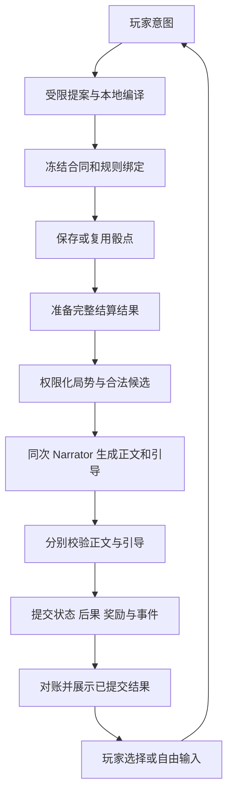

# Shine-TRPG 第七阶段建设方案

**主题：三宝书的可玩内容建设、原著命运改写与回合结算后的路径引导**

| 项目 | 内容 |
|---|---|
| 文档版本 | 1.0，建设设计稿 |
| 编写日期 | 2026-10-04（Asia/Shanghai） |
| 产品 / 仓库 | Shine-TRPG / `anjingdtl/ShineWord` |
| 核验基线 | `main@8648d4da61db81a1237a9b25f4e20428bf1d992e` |
| 当前协议 | V0.6.0 / versionCode 60000；SQLite schema 31；`shineword-save-7`；世界包 schema 2/3 |
| 工作区状态 | 编写前 `git status --short` 为空 |
| 文档性质 | 后续施工与验收依据；本文新增设计尚未实施、测试或发布 |
| 本次交付 | 仅编写本方案，不修改应用代码、数据库、版本号或历史建设报告 |

## 1. 已确认的产品方向

用户已确认以下方向，作为第七阶段建设依据：

1. 玩家以原著世界为基础开展冒险，可以改变关键事件和人物命运。
2. 三宝书需要支撑实际行动、人物互动和持续后果；条目数量与事实覆盖只是基础指标。
3. 每个已结算回合都应向玩家说明局势变化，并提供适合当前状态的下一步方向。
4. 重大变故发生后，LLM 应给出更清楚的指导性路径，让玩家理解可以做什么、为什么值得做，以及已知的取舍。
5. 路径选择与自由输入并存，玩家可以修改建议或提出自己的办法。
6. 本地规则继续决定资格、骰点、消耗、效果和权威状态；LLM 负责理解、提出受限候选与表达。

本期的产品目标是：玩家能够理解世界、找到改变局势的办法，并在后续故事中看到这些改变持续产生影响。

### 1.1 用户应得到的体验

- 开局就能接触至少一个有目标、有阻力、有介入办法的局面，人物具有可区分的互动特点。
- 行动结算后，清楚看到本次变化、眼下机会与压力，以及几条具体的下一步路径。
- 路径体现玩家的技能、物品、关系、已知情报与既有计划；不同角色能得到不同办法。
- 救人、追查、求援、撤离、训练、交易与关系发展都有适用情境和持续后果。
- 原著人物被救下、事件被阻止或阵营关系被改变后，后续内容尊重已经提交的战役事实。
- 失败可以改变局势、增加代价或形成新目标；是否终局由明确规则决定。
- 在重大变故之后得到足够指导，在平静时期也有探索、关系和成长方向。

### 1.2 目标与既有硬约束

| 维度 | 本期目标 | 保留的约束 |
|---|---|---|
| 世界可信 | 原著规律、身份、能力与关系有依据 | 引文、来源、推断和设计补全分类继续有效 |
| 命运改写 | 战役可偏离原著未来 | 原著 canon 与不可变世界包保留，不把战役变化写回源事实 |
| 实际选择 | 多种办法具有不同条件和后果 | LLM 不编写权威数值、直接执行效果或保证成功 |
| 结算引导 | 每个可决策结算点都有下一步入口 | 已提交行动不因建议生成失败而重做，已保存骰点不重掷 |
| 秘密与发现 | 主持侧利用秘密推动局势 | 玩家、Narrator 和按钮只获得各自被允许的信息 |
| 持续构建 | 优先补齐当前玩法需要的资料 | 不自动扫描全书，不让后台成果改写历史人物和回合 |
| 请求成本 | 普通叙述回合合并正文与路径生成 | 统一预算、限流、优先队列、账本及 unknown 恢复规则 |
| 恢复与存档 | 路径与后果跨重启、回退和导入保持一致 | 版本绑定、事务、分支隔离和完整快照继续生效 |

### 1.3 本期范围

建设三宝书可交互内容、局面与条件事件、有限的战役后果状态、按行动组织的上下文、结构化路径引导、重大变故展示，以及相关构建、恢复和验收链路。

首批采用受限条件和有限效果，不要求全书知识图谱、任意自然语言程序、完整经济模拟、无限分支预生成、额外中心服务或每回合多智能体长链。现有轻量规则继续使用；规则与数据协议的必要扩展在 P7-0 明确版本。

## 2. 当前实现复核与建设落点

以下为本地源码和交付资料核验结果，不代表本期功能已具备。

| 当前能力 | 核验落点 | 第七阶段建设内容 |
|---|---|---|
| 三书共享同一条目、来源与引用 | `src/domain/content/types.ts`、`worldPackage/publish.ts` | 延续同源视图，增加可交互局面与字段级知识边界 |
| 自动映射技能、约束、人物、物品和 lore | `worldPackage/buildPackageFromCanon.ts` | 增加局面、事件成立条件、行动办法和后果的受限编译 |
| 自动城主指南目录主要为约束、审核摘要、人物和物品 | `buildPackageFromCanon.ts::buildSections` | 增加人物动机、事件条件、压力、失败发展和后果关联 |
| 快速开局人物使用基础规则参数，技能/能力可暂为空 | `worldPackage/compileOpeningActors.ts` | 为当前互动人物补齐有依据的差异与玩法依赖，保持快速开局预算 |
| 原著时间锚点与条目可见性 | `world/opening.ts`、`campaign/recruitment.ts`、`campaign/segmentKnowledge.ts` | 增加战役因果投影，防止后续原著状态覆盖分支已经改变的命运 |
| 关系、发现、任务、物品和完整战役快照 | `domain/state/types.ts`、`campaign/session.ts`、`ports/turnStore.ts` | 复用权威状态，补充有限局面状态、事件抑制和承诺记录 |
| 受限 Planner 提案、本地合同与确定性检定 | `domain/turns/proposal.ts`、`game/v2Compile.ts`、`game/v2Turn.ts` | 路径只提交下一步意图，新增结果由本地规则编译 |
| Narrator 输出正文，校验冻结结果等级 | `game/v2Turn.ts::NarrativeCandidate`、`ports/narrativeStore.ts` | 版本化增加可选结构化引导，正文与引导分开验证和恢复 |
| 弹性上下文与 Planner/Narrator 分离 | `application/context/*`、`campaign/session.ts` | 相关人物、局面、关系与办法进入安全上下文，必要规则保持必需项 |
| 现有快捷行动为本地固定候选，两处截取前三项 | `useContextualActions.ts`、`ActionChoices.tsx` | 增加 LLM 路径投影与取舍展示，统一排序、数量和去重政策 |
| 历史只呈现已提交叙述，缺叙述时用安全兜底 | `campaign/storyEntry.ts` | 路径与局势摘要也遵守提交状态和玩家知识过滤 |
| NPC 自动行动有持久操作日志与玩家决策边界 | `usePlayController.ts::progressAutomaticActors` | 微步骤合并展示，在玩家真正可行动时校验并提供有效路径 |
| 小段需求、不可变成果、分支采用与 save7 | `segmentBuild/*`、`worldPackage/*`、`export/saveFile.ts` | 按玩法依赖补建，扩展新状态与路径的保存、回退和导入 |

第六阶段最新证据以 [验收矩阵](reviews/phase6/ACCEPTANCE_MATRIX.md) 和对应设备记录为准。已取证范围包括真实回合、部分停留/支线、分段采用与存档恢复；本期需要独立验证“同一局面采取不同办法，产生不同持久后果”以及更长的命运改写旅程。不能继承工程测试数量作为第七阶段内容可玩性的验收结果。

施工开始时重新记录 HEAD、分支、工作区、迁移最大编号和协议版本。本文基线之后已有变更时，应更新差异记录并复用最新能力。

## 3. 三宝书的产品职责

三宝书共享同一套版本化定义；阅读页、角色卡、行动规则和主持上下文使用相同 ID 与来源。

| 书 | 应解决的问题 | 需要建设的内容 | 玩家可见范围 |
|---|---|---|---|
| 玩家手册 | 我能做什么？需要什么条件？有什么代价？ | 技能与能力的适用场景、物品用法、成长条件、已知交互办法 | 公共规则和已经发现的内容 |
| 城主指南 | 各方想做什么？局势怎样发展？玩家介入后怎样变化？ | 动机、局面、成立条件、压力、事件依赖、失败发展和后果 | 编辑/主持视图；玩家只收到安全投影 |
| 怪物图鉴 | 对手和人物怎样行动？怎样应对？ | 行为目标、策略、退让/撤退条件、交涉筹码、可观察特点与有依据的弱点 | 已知资料；完整数值和秘密受权限控制 |

### 3.1 玩家手册：把能力接到办法

每个当前可用核心技能至少解释一类适用行动、必要条件和边界。数值与效果引用既有定义，不另存一份文字数值。技能可用于对应的调查、救治、追踪、交涉、移动或冲突；使用方式受本地规则支持范围限制。

发现能力、秘籍或工具后，应能连接到使用、学习、训练或交换机会。尚未获得的技能不能因为世界包存在就自动加入角色。学习条件与成长奖励明确为规则映射或设计补全，并经发布验证。

### 3.2 城主指南：把事件接到条件

对当前核心事件说明参与者、各方目标、触发条件、玩家可介入的窗口、可观察征兆、拖延压力和可能发展。后续事件引用前置状态；玩家改变前置条件时，重新评估事件资格。

失败发展表达为受限条件与本地效果。例如线索中断、目标转移、承诺违约或追击压力上升。任何状态变化都要有对应的合法规则支持，不能只在正文中写“被追杀”而数据库与后续调用毫无变化。

### 3.3 怪物图鉴：把性格接到应对

人物目标和行为需要影响可行办法。惜命逐利者与忠于职责者可以有不同交涉条件；有证据的弱点和可观察行为可以带来不同战术。

主持侧隐藏诉求、未发现弱点与招募秘密，不能直接出现在玩家路径的标题、理由或风险说明中。玩家可以依据可见异常开展调查，成功发现后再获得新办法。

## 4. 原著基线与战役事实

### 4.1 原著信息与战役事实分别管理

| 类型 | 含义 | 权威来源与更新规则 |
|---|---|---|
| 世界规律 | 世界中稳定的规则、能力边界和制度 | 已发布规则/约束，按规则版本与明确例外执行 |
| 开局基线 | 选定起点上已成立的身份、位置、关系和事件 | 有证据的时间切片，创建战役时绑定 |
| 原著发展参考 | 原著在其条件下发生的后续事件及状态 | 原著 canon 保留；转换成条件事件，不能自动成为分支现状 |
| 战役事实 | 玩家与 NPC 已经结算的行为及其后果 | 当前分支的提交事件、完整快照与本地规则 |

战役分歧本身不构成原著抽取冲突。原文说某人在后续死亡、战役中该人被救下，可以同时成立于各自语境。原著引文不被修改，也不能用未来原著状态把当前人物强制改回死亡。

### 4.2 读取与优先级

读取顺序为：已采用内容与开局基线 → 当前分支已提交事实 → 有效条件事件 → 查看者知识投影。

同一人物的战役生命状态、位置、持有物、已发生关系变化和已解决事件，由分支状态决定。后续构建增加背景、技能定义或条件事件时，通过受限 reconciliation 接纳，不隐式重建既有角色卡。

原著来源顺序 `worldTimeOrder`、世界时钟和战役因果进度分别使用。不能把第 N 回合或已经过去的分钟数直接当作原著第 N 个事件已发生。进度从已提交的事件和已验证条件推导。

### 4.3 事件资格与状态

拟新增有限条件事件状态：`dormant / eligible / active / resolved / suppressed`。具体命名在 P7-0 冻结。

- `dormant`：前置条件尚未满足；未知条件按 unknown 处理。
- `eligible`：条件已经成立，可由明确触发规则激活。
- `active`：局面正在进行，有压力与可介入办法。
- `resolved`：按某种受限结果完成，记录结果与源回合。
- `suppressed`：因分支事实使原著发展参考不再成立，保留原因与审计。

条件采用白名单表达式，初版支持 `all / any / not`、人物生命/在场状态、物品归属、已知线索、关系门槛、任务/事件状态以及规则时钟。参数指向稳定 ID；禁止 `eval`、任意脚本、动态 SQL 或自然语言直接执行。

明确区分“条件为 false”和“所需资料/状态未知”。资料缺失触发适当补建或保持未激活，不能默认为 true。条件依赖成环时需拒绝非法循环或采用有界求值；每个提交事件有去重身份和触发上限。

局面结果、压力变化和 NPC 反应必须引用已发布的受限规则。需要扩展引擎效果时，只允许本地编译器产生新的 engine-only 操作，更新规则版本和校验器；Planner 仍不能提交效果数组。会影响当前检定后果的各等级规则，在掷骰前随合同或依赖绑定冻结，不能看见失败骰点后临时补造惩罚。

### 4.4 持续后果

优先复用关系、发现、任务、物品、生命状态和世界时钟。必要新增的局面计数、压力和承诺，保存在分支快照内，并由同一回合事务更新。

第一版支持有界状态，不建设完整阵营模拟：

- 有限局面计数与截止时刻；
- 原著参考事件的激活、解决或抑制记录；
- 明确承诺的对象、履行条件、期限与状态；
- 与既有关系、任务和资源关联的受限后果。

每个后果记录 `sourceTurnId`、来源规则/局面版本和幂等键。创建、履行、违约、奖励和 NPC 反应均由本地规则产生。文本不能自行增加承诺、转移物品或改变关系数值。

## 5. 构建单位：可介入的局面

### 5.1 局面最小定义

一个局面需要回答以下问题：

1. 当前冲突或机会是什么，玩家为什么可能在意？
2. 哪些人物参与，他们的目标与阻力是什么？
3. 哪些条件已经成立，哪些资料仍未知？
4. 玩家有哪些介入办法，各自需要什么？
5. 拖延、成功、部分成功和失败如何改变局势？
6. 结果怎样连接到后续事件、关系或成长机会？

拟新增 `situation` 内容定义，包含：稳定 ID、地点/参与者引用、原著依据、激活条件、已知征兆、压力规则、办法模板、结果转换和后续依赖。它属于既有世界包内容域，不能另建一套脱离 canon 的故事事实库。

### 5.2 办法模板

办法模板包括目标、首步行动、技能/物品/关系/情报要求、适用条件、受限结果引用、公开说明和知识条件。

模板描述的是尝试方式。多步骤路线的按钮提交第一步，例如先找落脚点、询问中间人或检查伤者；不能一次点击就完成整条救人、求援或追查路线。

两条办法的差异至少来自目标、投入资源、时间、人物关系、信息策略或后续状态之一。仅改动措辞的同义按钮需要去重。有限条件与结果规则支持玩家自由输入的变体，不预生成所有剧情分支。

允许候选集合由已发布办法模板、当前合法基础行动和已知资源的受限组合形成。LLM 可以选择、排序和解释这些办法，候选首步的目标/技能/物品等结构引用由本地核对。建议与自由输入都需要识别实际动作与适用办法；不能仅凭相同文字标题授予某个局面结果。

### 5.3 原著依据与游戏补全

- 原著身份、能力、事件、地点和有依据的动机保留证据；动机推断标 `inferred`。
- 原著缺少数值时，门槛、时间、消耗与奖励标 `rule_mapping`。
- 为游戏组织增加的互动窗口、压力规则、路径和条件结果标 `design_fill`，明确依据与边界。
- 改写后的新发展保存在战役事件与局面状态中，不标为原著 `explicit`。
- 编译器不能为凑路径数量创造原著没有的技能、人物、入口或秘密。

### 5.4 发布与可玩性门禁

既有证据、至少 20 条可映射事实、人物/地点/事件、行动依赖闭包、冲突与引用验证继续保留。新增“玩法准备度”与来源覆盖分开报告。

新建开局至少提供一个可介入局面、明确目标/机会、有效参与者，以及能合法尝试的行动。正常有选择的核心局面应至少有两种不同办法；受困、垂危等场景可暂时只有一种办法，需要说明原因并记录内容缺口，不能伪造第二条。

关键人物的互动特点可以来自动机、关系、能力或信息，无需强行为每个普通人物生成战斗技能。当前情境确实依赖某能力时，该能力的定义、角色归属和执行路径必须完整。

玩法门禁应用于新建内容。旧包不会因为缺少新定义而失去原有游玩能力；采用兼容适配与本地安全引导。

### 5.5 构建预算与增量策略

原文 → 已验证 canon → 相关事实/依赖选择 → 局面与人物互动映射 → 受限编译 → 校验/审查 → 不可变发布 → 分支安全采用。

开局优先构建一个足够完整的当前局面；更深资料按行动依赖补齐。复用既有抽取、映射检查点与本地规则，不在每个小段重写全体人物、规则和局面。

默认近期缓冲仍有界。只有玩家实际选择的路径或当前局面确定需要的依赖进入较高优先级；其他可见路线最多形成少量低优先级候选。不能把所有建议都转成付费预构建任务。

快速开局目标继续保留。首场玩法增强的输入、输出与推理预算单独测量；若不达标，优化必要依赖与编译过程，不靠降低原有质量门禁过关。

## 6. 上下文调用与权限

### 6.1 按当前行动组织资料

每回合根据地点、参与者、目标、玩家意图、已提交改变和有效局面选择资料。相关性包含结构化关联和条件依赖，文本关键词仅作辅助。

| 材料 | 调用策略 |
|---|---|
| 本次动作所需规则、资格、资源和合同协议 | 必需项，预算不足时明确失败，不裁掉关键边界 |
| 当前局面、人物目标与已知关系 | 高优先相关项，按知识投影提供 |
| 当前行动所需线索、物品用法与办法 | 按引用和实际状态选择 |
| 承诺、已改变命运与相关历史 | 通过结构化状态和既有长期记忆召回 |
| 环境、背景和原著表达 | 可选项，按预算裁剪 |

“说服守卫放人”优先使用守卫职责、玩家已知诉求、双方关系、已有筹码和交涉规则。未发现的私密把柄不进入玩家可见提案材料。

### 6.2 主持侧与公开侧

1. 本地主持逻辑可读取已采用、时机有效的秘密条件与 NPC 目标。
2. 本地条件与效果编译器据此决定合法事件和反应，并生成公开表现。
3. Planner 接收行动资格所需材料和允许其使用的知识；继续受限提案。
4. Narrator 接收冻结结果、公开局势、已知人物特点与安全候选办法。
5. 玩家收到正文、局势变化和通过校验的路径。

现有 Narrator 不接收整本三宝书、全量原著或 GM 底稿。本期增加明确的 `PublicSituationPacket`，逐字段说明来源、可见条件和预算地位。不能为了让叙述更自然直接复制 Planner 的完整上下文。

### 6.3 秘密和自然语言校验

路径的行动引用、标题、理由、风险、地点名、人物名和准备条件都属于玩家载荷。候选在进入 LLM 前先过权限过滤，输出再做引用、实体和字段校验。

秘密带来的机会需要先形成允许观察的表现。例如可以提示“调查院中的异常动静”，已知条件不足时不能提示“抓住藏在院中的叛徒”。

结构校验和关键词拦截不能证明所有自由文本语义安全。验收必须加入独立标注、诱导输出和隐藏标记负例；语义不确定的标题/理由采用本地安全模板或丢弃，不扩大知识权限。

## 7. 回合结算后的路径引导

### 7.1 展示结构

每个玩家可决策的结算点展示：

1. **这次变化**：依据已结算状态说明取得的进展、实际代价和可见变化。
2. **眼下局势**：可见机会、压力、同伴需求与已经知道的时机。
3. **下一步路径**：具体目标、首步行动、已知取舍与必要准备。

普通回合默认两三条；重大变故通常三四条并展开取舍；数量受真正有效的候选和空间限制。没有足够依据时显示实际可行项，保留自由输入和查看已知资料入口。

“查看资料/查看目标”属于阅读入口，与会推进状态的行动路径在数据和界面上明确区分。不能用三个阅读按钮满足“三条不同玩法路径”的验收。

### 7.2 路径内容

| 字段 | 含义与限制 |
|---|---|
| 标题 | 短目标，例如“先救同伴” |
| 行动意图 | 下一步实际提交的第一步，不能包含多步自动执行 |
| 为什么现在考虑 | 已知线索、局势或角色优势，具有安全引用 |
| 已知取舍 | 时间、资源、关系或机会的真实条件与可能影响 |
| 准备条件 | 当前已经满足或需要先完成的准备 |
| 可尝试状态 | 本地检查后的 `available / needs_preparation`；不代表成功保证 |
| 关联资料 | 玩家可见的技能、物品、人物或线索引用 |

已知固定消耗由本地规则注入展示；不确定后果用“可能”并给出依据。LLM 不自由编造成功率、伤害、消耗、期限或奖励数字。未知敌情不借风险说明泄露。

`needs_preparation` 路径提供查看准备或可执行的准备步骤。资料未建齐时进入既有 readiness 流程，不把未验证动作标为可执行。

### 7.3 数量、排序和个性化

- 先选真正不同的办法，再压缩到适当数量；不固定要求攻击/逃跑/交涉三件套。
- 根据当前目标、玩家近期计划、资源、技能、关系和已知信息排序。
- 长期连续执行某计划时，给出推进、调整或暂缓该计划的办法。
- 平静局面允许关系、成长、探索和交易；不每回合制造危机。
- 不默认替玩家选中、自动提交或将某条路线永久标成最优。
- 允许折叠引导、修改建议和继续自由输入；初版不增加复杂设置页。

### 7.4 重大变故识别

重大程度由本地已提交事件和状态差异识别，不依据 LLM 正文中的惊叹语气。

初版覆盖：核心人物死亡/失能、重要人物成功获救、关键任务成功/失败、关键物品得失、已支持的关系立场重大变化、局面压力到期、主要冲突结束，以及原著发展参考因玩家介入被抑制。

阈值与关键人物/物品标记来自已发布配置。普通小伤、每次移动或轻微资源变化不统一升级成重大变故。一个操作内多个事件在玩家决策边界合并，避免连续弹出多组路径。

### 7.5 点击与提交

默认点击可执行路径即明确提交该条下一步行动；同时提供编辑入口，沿用自由输入提交机制。查看准备与阅读入口仅打开对应界面。

提交前重新核对分支、状态、内容绑定、玩家角色、决策资格及必要资源。状态过期则刷新建议并保留草稿，不自动执行旧路径。所有路径经现有 interaction/action 日志、Planner/本地编译和检定管线执行。

多次点击只产生一个逻辑操作；进入后台、强停、切分支或回退后，恢复原已授权操作，不代选新的路径。路径 ID 仅用于来源和去重，不成为直接授予效果的权限令牌。

路径首步可附带非权威 `guidanceRef / methodRef`，用于定位候选来源和解释上下文。编译器仍核对动作匹配、条件与内容版本；用户编辑后重新匹配，不继承原路线尚未满足的效果。Planner 若需要返回办法引用，必须明确升级提案协议与白名单；自由输入具有相同的办法识别与结算能力。

## 8. 引导生成与回合事务接线

### 8.1 现有时序必须先复核

当前 `runV2Turn` 是：Planner → 编译/冻结合同 → 保存骰点 → Narrator 候选 → 计算 settlement → 原子提交 → 标记叙述已提交。

因此“结算后引导”不能简单使用 Narrator 原来的回合前上下文，否则会推荐已经耗尽的物品、已经失能的角色或已经解决的目标。也不能先提交一半状态，再用另一个写入补齐后果。

### 8.2 普通叙述回合的默认方案

1. 冻结本回合合同、依赖内容和规则版本。
2. 保存或复用骰点，得到确定结果。
3. 用纯本地归约器准备一次 `PreparedTurnResolution`：包含将提交的完整 nextState、settlement、规则事件和后果；只准备数据，不写权威状态、不发奖励。
4. 从该准备结果构建玩家安全局势包和有界候选办法，冻结输入摘要与哈希。
5. 同一个 Narrator 请求输出正文与结构化路径候选。
6. 正文按现有裁定约束验证，路径单独按权限、引用和准备状态验证。
7. 在同一权威提交事务中应用准备结果、关系/奖励/局面变化与事件，并核对版本、内容、操作 fence 和输入哈希。
8. 正文及引导候选只有在对应回合已经提交后才允许显示；其提交标记按现有恢复机制对账。

准备与提交必须使用同一归约器和相同数据，禁止 `updateCommittedState` 或奖励函数在两条路径各运行一次产生不同结果。Prepared 结果要能从已冻结合同、骰点和绑定规则恢复；必要持久化具体结构由 P7-0 冻结。

### 8.3 自动 NPC 与本地动作

“每个结算回合都有导引”指每个已结算且玩家可以做下一步决定的时点。NPC 连续微步骤仍记录历史，路径在玩家可行动的边界合并呈现。

- NPC 行动使状态变化后，旧路径立即失效；不继续显示为可提交。
- 在玩家决策点先显示最新状态对应的本地合法候选。
- 已有 Narrator 能覆盖最终状态时，与其合并生成 LLM 引导。
- 短休、训练、物品整理等本地动作，以及自动 NPC 结束后确实缺少最终引导的情况，可在本地提交后安排一次异步附属 Narrator 引导请求；每个决策点去重，玩家不必等待它才能行动。
- 网络或预算不足时使用本地引导；恢复网络不自动重放每个历史微步骤，也不因附属任务失败撤销已结算动作。

异步任务开始/结束都核对决策点身份；玩家已继续行动、项目已删除或分支已切换时，迟到结果不能替换当前建议。尚未发送的过期任务取消；已经发送的尝试保留账本记录，不通过改 ID 自动重复请求。

### 8.4 正文与引导分别降级

| 情况 | 行为 |
|---|---|
| 正文有效、路径缺失/畸形/含非法引用 | 保留正文候选，丢弃非法路径，使用本地引导；不为修路径重发整次 Narrator |
| 部分路径有效 | 保留合法项、去重排序；实际不足时显示少量项并记录诊断 |
| 整个响应无法解析或正文裁定不一致 | 沿用现有有限恢复与账本规则，骰点/冻结合同保留 |
| 已提交后引导标记未完成 | 本地对账恢复，不重结算、不新调 LLM |
| 附属引导请求失败或结果未知 | 已结算动作保持完成，本地引导继续可用；unknown 按既有精确恢复流程处理 |
| 内容新采用但状态版本未变化 | 核对内容/知识/决策绑定并刷新，不只比较 `stateVersion` |

### 8.5 请求预算

普通成功的自由行动回合默认仍为 Planner + Narrator 两个业务调用；路径增加输出需求，不默认增加第三个请求。现有有限错误恢复单独计量。

附属引导只用于缺少对应 Narrator 的新玩家决策点，通过 M6 统一预算、推理、队列和账本。它低于正在执行的玩家行动请求，不能占掉游玩保留额度；角色按既有体系映射并在 P7-0 冻结。

附属请求逻辑身份由分支、决策点和冻结输入语义确定，API/模型指纹保存在冻结配置与成功缓存身份中。切换 API 不产生绕过原 unknown 的新逻辑身份；同一决策点的重入、页面刷新与冷启动不新增请求。

LLM 最多返回六个有界候选，本地普通展示两三条、重大展示三四条。输出正文、局势摘要和路径分别设预算；先满足裁定忠实的正文与必要信息，路径不足时本地降级。精确字符/Token 上限在代表样本中校准，不设置统一超大输出。

## 9. 拟新增合同与数据归属

下表名称为建议，P7-0 冻结字段和版本；不是当前已存在接口。

| 合同 | 核心信息 | 所属域 |
|---|---|---|
| `SituationDefinitionV1` | 参与者、成立条件、知识条件、办法、压力和结果转换 | 版本化世界内容 |
| `BranchSituationStateV1` | 活动局面、结果、计数、承诺、抑制原因、处理事件键 | 权威分支快照 |
| `PreparedTurnResolutionV1` | 冻结输入、完整将提交状态、settlement、事件、哈希 | 既有回合管线 |
| `PublicSituationPacketV1` | 可见变化、机会/压力、已知人物特点、允许的候选引用 | 权限化派生投影 |
| `NextStepCandidateV1` | 候选引用、首步意图、目标/理由/取舍文字 | 非权威 LLM 输出 |
| `TurnGuidanceV1` | 决策点绑定、已校验选项、本地资格与来源 | 叙述附属记录 / 派生投影 |

### 9.1 决策点绑定

路径至少绑定 `campaignId / branchId / playerActorId / sourceTurnId / decisionPointId / stateVersion / contentBindingHash / knowledgeHash / contextHash / guidanceVersion`。

资格验证使用当前真实状态；哈希只是冻结身份，不替代权限检查。候选行动引用必须在该局势包的允许集合内，不能让模型自由添加主持秘密或不存在的规则 ID。

### 9.2 持久化边界

- 原著 canon、世界内容、构建成果和请求账本继续由既有模块所有者维护。
- 局面与后果写入既有回合事务、状态快照和历史事件；不能单独维护仅当前值、回退后无法恢复的表。
- 正文与引导候选作为同一版本化渲染结果持久化，允许引导为空；candidate/committed 对账必须可恢复。
- 最新路径是派生内容，可以失效或本地重建；已提交历史的正文、原路径和实际选择保留，历史按钮不可执行。
- 临时草稿与当前选项属于 UI/操作域，不提升成战役事实。
- 记忆模块从已提交结构化事件得到变化，不把 LLM 风险预测当成已发生经历。

### 9.3 协议与迁移

新增内容 kind 和状态字段需版本化。建议新内容使用 `world-package-4` 或等价显式能力版本；P7-0 选定唯一方案，禁止把新结构冒充旧 schema。

SQLite 下一可用迁移编号与新存档协议在施工时核验后确定，预计需要 save8；本文不提前修改版本。迁移同时更新 SQL 文件、内置迁移和移动加载路径，覆盖克隆、提交、回退、存档导入导出和世界包往返。

旧包缺新定义时按旧玩法加载；旧存档缺局面状态时从空值开始，不根据原著未来补造战役经历。新存档含局面状态/引导时校验来源、哈希和引用，旧应用明确报告不支持，不能静默丢弃影响命运的字段。

已有战役引入新局面定义时，通过显式、版本化的分支采用初始化，并只读取该分支当时已有状态。定义依赖的过去事件无法确认时保持 unknown；不追溯发放奖励、补记债务或判定人物死亡。原有快照不补写新字段，当前采用结果进入新的安全状态边界。

存档导入新战役或回退分叉后，重新绑定分支与操作身份，保留相同历史含义；旧路径不能在新分支直接提交。不得为兼容重写原有合同哈希、骰点和已提交文本。

### 9.4 职责与代码落点

以下新增路径为建议，施工时以职责为准；共享文件的改动按依赖顺序集成。

| 职责 | 主要复用落点 | 建议新增落点 |
|---|---|---|
| 条件、局面与后果规则 | `domain/content`、`domain/state`、`domain/turns` | `domain/situations`，纯数据/规则，不依赖 UI 或数据库 |
| 三书映射与发布 | `application/worldPackage`、`worldBuild` | 在既有 Mapper/Validator 内增加 situation 编译和门禁 |
| 分支因果投影与结算 | `application/campaign`、`game/v2Compile.ts`、`turns/commitTurn.ts` | `application/situations`，通过既有状态/回合端口写入 |
| 路径候选与验证 | `application/context`、`campaign/playProjection.ts` | `application/guidance`，集中资格、去重和决策绑定 |
| 正文/引导请求与保存 | `game/v2Turn.ts`、`ports/narrativeStore.ts`、`application/llm` | 扩展既有叙述端口与 M6 合同，保留唯一请求账本 |
| 数据与兼容 | `infra/sqlite`、`application/export`、`mobile/src/database.ts` | 对应迁移、快照和存档适配，不另建当前状态真相库 |
| 移动展示与提交 | `PlayScreen.tsx`、`features/play`、既有 interaction 日志 | 路线卡和核心投影适配；组件不持有裁定逻辑 |

`GameStateSnapshot`、`ActionContract`、Planner 协议、迁移、存档、`runtime.ts` 和 `session.ts` 属于共享接线范围。新增业务优先收进独立模块，通过端口和组合入口使用，避免继续把条件求值、LLM 验证和 UI 状态都堆入 `session.ts`。

## 10. 页面与交互

### 10.1 游玩页

正文之后展示简短“这次变化”和“接下来”区域。普通路径用短标题与一行理由，取舍可展开；重大变故展示更完整的路线卡。自由输入保持直接可用。

将当前两处 `slice(0, 3)` 收口为核心投影的统一数量政策；UI 不再次截断导致重要路线丢失。固定战斗动作、阅读入口和叙事路径统一去重，但按真实用途呈现。

每条路径具备可访问名称、稳定测试 ID、清楚的操作类型和适合移动端的触控区域。验证四主题、小屏、长标题、键盘、字体放大与滚动，不让新区域遮住输入或主要操作。

### 10.2 三书阅读与发现

- 玩家手册可以从已知能力进入适用办法与合法条件。
- 城主编辑视图可以检查局面、条件事件、来源和补全依据；玩家视图保持秘密过滤。
- 图鉴已知页呈现可观察应对特点，隐藏精确秘密和未发现弱点。
- 新发现确实打开新办法时，在玩家可见回合中简短提示，并可链接对应已知条目。
- “已构建、已采用、已发现、当前能用”分别呈现，不把世界资料存在等同于角色拥有能力。

### 10.3 等待与过期

路径需要补建时，保留玩家选择的首步意图，展示真实 readiness。玩家可查看已知资料、编辑意图或选择现有可行办法。任务完成不会未经授权提交新的行动。

切分支、回退、同伴离场或物品变化后，当前路径核对失效并刷新。历史路径以记录形式保留；不调用模型为历史重新编写建议。

## 11. 分阶段施工

每阶段执行：实现 → 针对性验证 → 审查 → 修复 → 阶段报告。依赖顺序为 P7-0 至 P7-7；在未冻结共享协议前不扩展多个消费方。

### P7-0：基线、合同与固定验收夹具

**目标：**明确权限、事务、版本和玩法语义。

1. 重核当前代码、未提交改动、协议与迁移编号。
2. 冻结 §9 合同、条件/效果白名单、角色权责与正文/引导验证规则。
3. 明确现有 settlement、发现、奖励和 NPC 操作接入 Prepared 结果的时序。
4. 定义三个不同玩法场景的固定证据夹具：追查/救援、交涉/关系、探索/成长。
5. 在夹具中标出原著基线、未来参考、秘密、设计补全、合法路径和预期持久后果。
6. 冻结新包/存档兼容政策、附属请求账本身份及决策点失效条件。

**出口：**同一“救下原著会死的人”场景能明确写出旧未来事件何时抑制、人物何时仍存活，以及下一步路径的允许引用。协议有可执行验证样例。

### P7-1：战役因果状态与事务结算

**目标：**后果真实落库，原著未来不会覆盖玩家改变。

1. 增加有限局面状态、条件求值和事件幂等。
2. 接入人物命运、承诺/压力与参考事件抑制，复用已有关系/任务/物品。
3. 实现共享的 Prepared 归约与原子提交；结果、奖励、成长和后果只有一次写入。
4. 更新完整快照克隆、恢复、分叉和历史读取。
5. 明确未知依赖、循环触发和时间边界；后果不得在 UI 中直接写表。

**出口：**相同起点的救援与未救援路线得到不同事件资格；回退后恢复原条件；失败发展与承诺后果具有数据库证据。

### P7-2：三宝书可玩内容编译

**目标：**构建结果包含可介入局面和角色差异。

1. 扩展 Mapper 与本地编译器，生成有来源的局面、人物交互条件、办法和后果定义。
2. 把当前必要技能/物品/人物关系接到合法行动，不用通用技能填充替代有依据的核心能力。
3. 增加字段级 provenance、引用闭包、秘密检查和玩法准备度诊断。
4. 扩展三书目录和阅读投影，保留同源定义。
5. 复用第六阶段小段、检查点、变化映射和分支采用。

**出口：**固定局面至少两种不同合法办法；同一规则在书、卡和行动中一致；不同题材的核心办法具有证据支持的差异。

### P7-3：安全局势上下文与候选资格

**目标：**按当前行动调用相关资料，并提供可验证候选。

1. 建立状态差异、重大程度、局面和人物关联选择。
2. 构建主持侧事件输入与 `PublicSituationPacket`，逐字段权限化。
3. 本地生成有界允许候选与资格检查，处理能力、资源、距离、知情和行动阶段。
4. 优化六 Board 分配，必要条件不被背景裁掉。
5. 秘密、未来、分队与未知资料负例进入正式回归。

**出口：**角色优势和既有计划改变候选集合；同一秘密在主持逻辑可用、玩家和 Narrator 输入不可见；不会推荐已经失能者执行动作。

### P7-4：LLM 引导与恢复协议

**目标：**结算叙述附带有根据的下一步路线。

1. 版本化 Narrator 输出，在同一请求中生成正文和路径候选。
2. 正文、局势摘要与路径独立验证；局势事实以本地投影为准。
3. 持久化渲染候选、决策绑定和已提交状态，对账恢复。
4. 接入自动 NPC/本地动作决策点的附属引导任务，按 §8.3 去重与降级。
5. 所有请求进入既有预算、推理、队列和账本；记录输出增量与额外请求原因。

**出口：**普通成功回合仍为两个业务调用；合法正文加坏路径不触发整次重发；附属引导 unknown 不影响已提交动作，换 API 不绕过旧 unknown。

### P7-5：移动体验与玩法依赖补建

**目标：**玩家能理解、选择、编辑并执行不同路线。

1. 普通结尾与重大变故卡接线，统一候选数量、排序、阅读/行动分类和去重。
2. 路径点击走既有操作日志；防重复、过期、跨分支与非玩家行动阶段提交。
3. 提供首步意图编辑、自由输入、准备条件和玩家可见资料链接。
4. 按实际选择建立高优先依赖，其他路线仅有界低优先预取。
5. 完成四主题、键盘、小屏、长文本和可访问性验证。

**出口：**重大变故后可选择不同路线；两路线都能走完首步并继续；等待补建保留意图，完成后不代选或自动启动新动作。

### P7-6：兼容、故障与资源验收

**目标：**新玩法不破坏已有事务、存档和资源治理。

覆盖迁移、旧世界包/旧存档、新存档往返、回退、导入新分支、内容采用、取消/删除迟到、NPC 微步骤、断网、429、预算不足、JSON 畸形、正文有效而引导非法、unknown 与强停恢复。

核验冻结合同与准备结果、骰点、角色资源、任务/承诺、奖励幂等、秘密投影和操作日志。不因单元测试通过就关闭未做的设备验收。

**出口：**核心/移动类型与适当回归通过；关键协议故障有 SQLite 和设备证据；旧玩法可继续，新字段导入/回退不丢失。

### P7-7：内容可玩性与持续旅程验收

**目标：**证明玩家改变能影响后续，引导确实增加选择价值。

1. 三类固定场景分别执行至少两条路线，比较条件、消耗、关系/信息与后续状态。
2. 一个相同开局建立至少两条 10～20 个玩家决策点的完整旅程，关键路线选择不同。
3. 至少一个旅程救下原著未来会死的人，并走到其后续仍存活、参考事件被正确抑制/调整的时点。
4. 至少一个失败旅程有可执行的后续发展，且保留实际代价。
5. 使用当前已配置且获授权的真实模型完成端上闭环；模型和设备分别记录，不能以合成响应代替内容生成质量。
6. 独立标注路径差异、取舍支持、人物一致性、裁定忠实、秘密和长期回应。

**出口：**工程、内容、设备与性能结论分别给出证据、样本量与未验项。若资源不足保留明确未验状态，不把方案或固定夹具当成真实游玩完成报告。

## 12. 验收矩阵

| ID | 验收事项 | 必需证据 |
|---|---|---|
| A01 | 原著基线 / 未来参考 / 战役事实分离 | 同一人物原著未来死亡与分支存活同时保留，世界 canon 未改写 |
| A02 | 因果资格与未知条件 | 前置改变抑制后续参考事件；unknown 不激活；时钟与原著顺序不混用 |
| A03 | 可介入局面 | 目标、参与者、条件、压力、办法和后果引用完整；至少两种不同办法的夹具 |
| A04 | 核心人物与能力差异 | 书→人物/卡→技能/物品→实际动作的来源和执行贯通 |
| A05 | 后果持续与失败发展 | 不同路线有不同持久状态；失败仍有合法后续，代价没有被叙述抹去 |
| A06 | 每个玩家决策点的导引 | 普通/重大/平静/本地动作/自动 NPC 后都有有效引导或明确本地兜底 |
| A07 | 路径语义与多步限制 | 目标、首步、取舍可读；同义去重；点击不自动完成整条路线 |
| A08 | 资格、状态和内容绑定 | 失能/缺物/未知线索/距离/回合阶段/同版本新内容使旧项失效 |
| A09 | 隐私与知识 | 正文、输入、路径标题/理由/风险均无 GM-only/future/未发现标记；语义人工核验 |
| A10 | 本地裁定权限 | LLM 权威数值/效果被拒绝；固定消耗由规则注入；无虚构成功保证 |
| A11 | 正文与引导独立降级 | 好正文坏引导仍提交一次；兜底可用；没有为了路径自动重发正文 |
| A12 | 事务、Prepared 一致性与奖励 | 预投影与提交一致；回滚零半状态；重放不重复奖励、承诺或事件 |
| A13 | 请求与 unknown | 普通两业务调用；附属请求有原因/去重；跨 API unknown 保留；无微步骤请求风暴 |
| A14 | 强停与操作恢复 | 已保存骰点、正文候选、引导候选与最终提交对账；只执行已授权意图 |
| A15 | 回退、分支与存档 | 原分支历史保留；旧/新存档往返；局面/承诺/命运与来源保持，路径重新绑定 |
| A16 | 增量构建 | 选中路径触发真实依赖；其他路线预取有界；停留不全书扫描；旧人物状态不覆盖 |
| A17 | 移动可用性 | 重大四路径可读可点，普通入口合理；四主题/键盘/字体放大/小屏不遮挡 |
| A18 | 自由输入与角色个性 | 建议可编辑；自由办法通过同一规则；能力与关系改变路线，而非仅改文字 |
| A19 | 长期玩法旅程 | 同起点两条 10～20 决策点旅程，至少一条改写命运、一条体现失败后的发展 |
| A20 | 内容与性能统计 | 原始样本/失败/缓存/设备/模型分列；按 §13 报告，不用条目数替代玩法质量 |

## 13. 质量和性能测量

### 13.1 工程硬门禁

- 已发布必需引用悬空数为 0，非法条件/效果执行数为 0。
- 受测路径的无授权状态写入、重复奖励和分支串写均为 0。
- 受测秘密负例与人工标注样本的泄漏为 0；明确样本范围，不推断为所有生成绝对安全。
- 有效正文但非法引导场景新增修引导请求为 0。
- 普通成功自由行动的业务调用默认两次；附属引导、错误恢复和后段构建另列。
- 已保存 RollRecord 的恢复重掷次数为 0。

### 13.2 内容可玩性样本

建议验收集至少包括三个局面、六条不同路线、两条持续旅程和 50 条模型路径候选。该规模用于发现问题，不代表总体质量的统计保证。

人工标注记录：

| 指标 | 定义 | 首批目标 |
|---|---|---|
| 可尝试路径比例 | 原始候选经人工/本地复核确有合法首步的比例 | ≥90%；展示项必须全部通过本地资格检查 |
| 取舍支持率 | 理由与风险能由已知材料或合法规则支撑的比例 | ≥90%；无依据项目修复或降级 |
| 实质差异率 | 同一组路径在目标、投入或后续状态上确有差异的组占比 | 正常核心局面 ≥90% |
| 角色一致性 | 路径与能力、关系、人物行为和既有计划一致 | 每项记录评分与反例，不只给总均分 |
| 长期回应 | 已确认的命运/承诺改变在规定后续点被正确读取 | 固定因果夹具 100%；真实旅程逐项核验 |
| 玩家可理解性 | 能说明每条路径第一步做什么和已知取舍 | 记录人工观察；不能用点击率直接代替理解 |

阈值为本期验收目标，尚未达成。自动校验后的输出与模型原始质量分别报告，不用过滤后的 100% 冒充原始模型准确率。主线推进、人物关系与成长价值也需要叙述和状态共同评估。

### 13.3 性能对照

固定小说哈希、起点、内容覆盖、模型、推理档位、设备和预算，对比第六阶段基线与第七阶段：

- 首次玩法就绪时间及首次人物/局面质量；
- 玩家行动到正文/路径可用的时间；
- 因引导增加的输入/输出 Token 与实际物理请求；
- 后段补建等待、队列归因与附属引导滞后；
- 本地预投影、候选校验、快照和 UI 的 CPU/内存开销；
- 无效/过期任务数量与取消效果。

首批建议普通回合可用时间中位数相对同条件基线增幅不超过 15%，但必须同时报告样本量、失败、冷/热及缓存，不以少量样本宣称稳定达标。P95 只在足够样本且方法注明时报告。若延迟明显增加，先压缩可选解释和候选量、减少附属调用，保留必要裁定与权限信息。

## 14. 贯通验收示例

以下为设计夹具，不宣称来自当前导入小说。正式材料应替换为可合法使用的原著证据。

**起点：**师门遭袭，同伴受伤，信物被夺。玩家已知院外有追踪线索、城中有可接触的援助者；刺客身份和幕后关系属于未发现信息。

| 路线 | 按钮提交的首步 | 条件与已知取舍 | 应留下的后果 |
|---|---|---|---|
| 先救同伴 | 检查同伴伤势，实施当前可用的救治 | 有救治能力/工具；花费规则时间，追踪窗口可能缩小 | 同伴生命/伤势、实际消耗、追踪压力，后续关系按规则处理 |
| 追赶夺物者 | 检查已知踪迹，确定追踪方向 | 追踪技能与可见线索；同伴暂未得到照料 | 新发现/失去踪迹、位置/时间，救治压力继续存在 |
| 寻求援助 | 联系当前已知且能接触的援助者 | 有关系/筹码；求援结果不保证，承诺需后续明确成立 | 实际关系变化、已成立的承诺、获得或失去的机会 |
| 带人撤离 | 为同伴寻找当前可到达的安全处 | 运输/移动条件合法；暂缓追回信物 | 人物位置、保留资源、未完成目标与后续追查机会 |

验收至少覆盖：

1. 救治成功后，同伴不会因原著未来死亡被自动移除；相关参考事件重新评估。
2. 追赶失败仍可求援或整顿，但时间和失去的机会实际保留。
3. 未发现幕后身份时，路径不会提前给出身份或秘密弱点。
4. 不具备救治条件的角色得到先找工具/求助的准备步骤，不能直接使用未拥有技能。
5. 同伴死亡或离场后，旧“救同伴”路径不能执行；局势和路线按真实状态变化。
6. 选择求援仅执行联系首步；未达成交易前没有自动扣物、加关系或生成债务。
7. 从同一历史点回退分叉，路线和后果各自隔离；存档导入后保持相同命运与承诺含义。

## 15. 交付物与完成定义

施工最终交付：

1. 版本化内容、局面/后果合同、受限编译和对应迁移。
2. 三宝书构建、阅读与角色/行动贯通；按玩法依赖补建。
3. 安全局势上下文、LLM 路径输出、本地资格与降级恢复。
4. 普通回合和重大变故的移动引导、自主选择与自由输入。
5. 旧/新世界包和存档兼容、分支/回退、故障与权限验证。
6. `docs/reviews/phase7/` 下逐阶段报告、验收矩阵、工程结果、设备证据、内容人工标注和性能样本。
7. 实际运行的同起点不同路线旅程，以及未验范围与复测条件。

本期完成的判断：用户导入原著后，能够在同一个可靠世界中用不同办法介入局势；每个玩家决策点得到有依据的路线引导；已经改变的人物命运、关系和机会被后续读取，并在重启、回退和存档中保持一致。

版本升级、提交、合并与发布遵循施工时的用户授权和 [版本管理规范](VERSIONING.md)。本方案编写本身不触发任何代码建设或发布动作。
