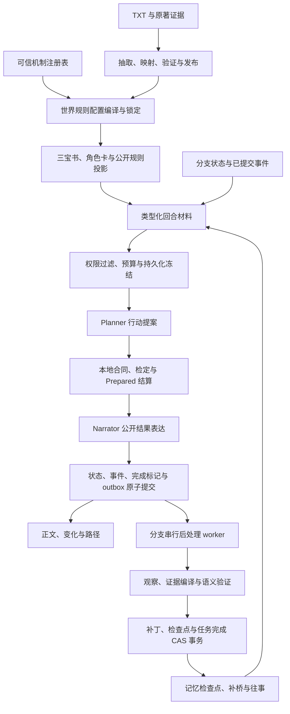

# Shine-TRPG 第八阶段建设方案

**主题：通用规则核心、可组合机制模块、世界规则配置，以及回合上下文与长期记忆的完整闭环**

| 项目 | 内容 |
|---|---|
| 文档版本 | 1.0，建设设计稿 |
| 编写日期 | 2026-10-04（Asia/Shanghai） |
| 产品 / 仓库 | Shine-TRPG / `anjingdtl/ShineWord` |
| ShineWord 核验基线 | `main@756ccf665e336682dd2629d878c3e523b022cadd` |
| TAVO-MINI 参考基线 | `cf278b315eb54595f7118de912aff6b6739de3f9`；本地展示版本 V3.0.8 |
| 当前应用与协议 | V0.7.0 / versionCode 70000；SQLite 迁移最大编号 32；`shineword-save-8`；世界包 schema 2/3/4 |
| 当前规则 | `shineword-core@0.2.0`；受限 Planner Proposal V2；本地 ActionContract `protocolVersion=1.0` |
| 当前记忆 | Story Memory V2、补丁链、本地 Episodic 检索；已有弹性请求预算与物理请求账本 |
| 工作区状态 | 编写前 `git status --short` 为空 |
| 文档性质 | 后续施工和验收依据；新增设计尚未实施、测试或发布 |
| 本次交付范围 | 只新增本方案；不修改应用源码、数据库、产品版本、历史方案和验收报告 |

> 第八阶段同时处理规则组合与上下文、记忆的接驳。先完成回合闭环的可靠性基础，再接入机制模块。已有第七阶段的局面、条件事件、命运改写、Prepared 结算和路径引导继续复用。
>
> “三模块”指三类架构职责，不指三个客户端、三个独立服务或三个必须分别调用的模型。系统继续在现有 Android App 与本地 SQLite 中运行，文本理解和叙事使用用户配置的 LLM。
>
> **用户已确认开发期舍弃旧版项目兼容。** 本期采用单一当前协议，不建设旧规则适配器、旧存档读取器、历史包转换器或双轨运行时。旧开发数据按第 18 节的新基线政策处理；本文编写不实际删除任何文件或数据库。同一当前协议下的回合恢复、历史回退、分支隔离和存档往返仍是必做项。

阅读路径：第 5–8 节定义规则组合与三宝书；第 9–16 节定义每回合写作、提交与记忆闭环；第 17–18 节定义当前存档与开发基线；第 20–25 节用于排期和验收。源码发现、踩坑记录及出处见第 2–3 节与附录 A。

## 0. 建设结论与成功定义

本期将项目收束为以下组合：

```text
通用规则核心 + 可组合机制模块 + 每个世界自己的规则配置
                         ↓
             本地编译、检定、效果与结算
                         ↓
        一个回合材料来源，多种权限与角色投影
                         ↓
     已提交回合 → 持久化后处理 → 一个长期故事记忆
                         ↓
       检查点 + 待整理回合补桥 + 相关往事召回
```

完整成功需要同时满足：

1. 不同题材可以使用不同机制组合；关闭战斗的世界不产生战斗专属行动和成长要求。
2. 世界配置只能选择受支持机制和合法参数；TXT 与模型输出不能变成任意执行代码。
3. 每个真实回合使用明确的规则、内容、状态、知识和记忆边界；恢复不静默换资料。
4. 普通叙事、战斗、休息、训练、人物载入、队伍变化等权威提交统一进入回合后处理。
5. 所有已提交经历都有可追溯覆盖；后台记忆落后不导致承诺、线索或关键事件悄然消失。
6. 长期记忆准确维护人物、关系和主线生命周期，不能仅凭 HTTP 200、JSON 合法或覆盖版本增长宣称质量通过。
7. 当前协议下回退、分叉、重启和存档往返保持规则和事实一致；保存过的骰点不重掷。
8. 三宝书、角色卡、行动资格、本地执行与模型上下文使用同一套已发布定义和能力声明。

不把“完整复刻 AD&D”作为验收目标。AD&D 可以作为某些奇幻机制的设计参考，但不能成为所有导入世界必须服从的世界观和职业结构。

## 1. 产品范围与建设边界

### 1.1 本期用户体验

- 导入世界后，可以看到适用的规则配置、已启用机制及其依据；未确认的映射和设计补全继续显示来源分类。
- 人物、技能、能力、条件、成长和行动成本能从三宝书直接对应到当前可执行行为。
- 不同题材使用自己的名称、资源与能力目录；玩家不必把日常、悬疑或仙侠都理解成 D&D 职业。
- 下一回合尊重已发生经历；记忆整理中仍能继续安全行动，真正缺失历史时得到明确诊断。
- 重启后可以恢复原行动、资料和结果；后台记忆任务可继续处理，未知云端结果有明确处理入口。
- 普通回合维持 Planner / Narrator 的现有职责，新增基础设施不默认增加一条每回合独立记忆或审阅请求。

### 1.2 本期必做

| 建设面 | 必须落地的内容 |
|---|---|
| 规则组合 | 可信模块注册、依赖与互斥验证、配置编译、执行能力表、不可变规则绑定 |
| 现有玩法重构 | 提炼可复用算法，全部生产入口切换新合同；移除旧规则分派与旧执行路径 |
| 三宝书与构建 | 机制相关章节、结构化规则展示、映射输出约束、发布能力闭包 |
| 上下文 | 类型化候选、连续性覆盖计划、逐项弹性装配、角色投影、最终请求预算校验 |
| 冻结与恢复 | 持久化回合材料、内容哈希、请求关联、不可静默重冻结、恢复验证 |
| 回合后处理 | 提交与 outbox 同事务、分支串行 worker、幂等、租约与 fencing、冷启动恢复 |
| 长期记忆 | 证据化观察编译、时间边界、语义质量、CAS 原子合并、局部失败与诊断 |
| 单版本与治理 | 新开发数据基线、当前协议回退分叉与存档、观测、端到端验收和可重放缺陷资产 |

### 1.3 明确延后

- 任意第三方脚本插件、在线下载执行代码、世界 TXT 自定义函数。
- 完整 AD&D 职业、THAC0、法术位、经验表和全部怪物生态的复刻。
- 任意属性维度、任意骰制的无边界扩展；首期保持当前稳定内部属性 ID，允许显示名称与映射配置。
- 完整修炼境界模拟、科技制造树、无限经济模拟等题材专属大系统。
- 端上大模型、外部向量数据库、中心服务、每回合多智能体长链。
- 因导入小说很长而自动构建全书、预生成无限剧情分支。

首期证明至少三种机制组合和一个新增可选机制真实可运行，不以“所有题材都能完整模拟”为承诺。

## 2. 当前源码复核与改造落点

本表是源码审计发现，不是本期已经通过的测试。施工开始时必须重新核对基线，并用失败用例确认仍存在的问题。

| 编号 | 当前实现与缺口 | 源码落点 | 本期处理 |
|---|---|---|---|
| B01 | 普通回合已有六类材料预算，Planner / Narrator 分离，本地先结算 | `context/*`、`campaign/session.ts`、`game/v2Turn.ts` | 保留内核与职责，统一材料协议与阶段投影 |
| B02 | 入口加入 `【当前局面】`，字符串标签收集器没有对应映射，材料被漏装 | `session.ts`、`candidateCollector.ts` | 先复现，再改为类型化候选；禁止未知材料静默丢弃 |
| B03 | `planMemoryCoverage()` 有实现与单测，生产回合装配未调用；近期文字与相关召回不保证连续覆盖 | `storyMemoryPolicy.ts`、`session.ts` | 接入检查点资格与 Pending Bridge，逐版本记录覆盖 |
| B04 | 记忆读取主要检查 clean 和落后不超过 8；缺完整的版本上界、指纹及权限一致性合同 | `session.ts::buildTurnContextBundle` | 冻结资格判断，禁止未来记忆进入当前请求 |
| B05 | 故事记忆整体变成一个 preferred whole-item；近期文本在预算前按字符截断 | `session.ts`、`storyMemoryCompiler.ts` | 逐实体竞争预算，保护必要叙事骨架，取消无依据的提前截断 |
| B06 | FrozenTurnContext 主要保存在 `lastTurnContexts`；contextId 不含实际候选文本哈希 | `contextSnapshot.ts`、`session.ts` | 持久化内容与请求指纹，恢复用原材料 |
| B07 | 所有 BudgetInfeasibleError 被转入 legacy 全量上下文，包括必需项超窗 | `contextPlanner.ts`、`requestBudgetKernel.ts` | 按错误码分流，必需项不可行时停止发送 |
| B08 | 普通叙事回合直接启动后台异步任务；其他本地提交没有统一后处理 | `session.ts`、`encounterService.ts`、`commitTurn.ts` | 将 durable handoff 放到共同提交边界 |
| B09 | insertPatch、saveState、markPatchApplied 分开执行；saveState 覆盖写没有数据库 CAS | `storyMemoryMaintenance.ts`、`storyMemoryRepository.ts` | 同一事务比较基指纹、写补丁与检查点 |
| B10 | evidenceTurnIds 证明引用存在，不证明具体内容；多类实体时间写为批次终点 | `storyMemoryValidator.ts`、`storyMemoryMerger.ts` | 具体证据锚点与本地时间推导 |
| B11 | maxAttempts 外层控制批次，内层另有 repair / reasoning recovery；不能直接称物理请求总上限 | `storyMemoryMaintenance.ts` | 共用逻辑批次物理请求预算，实际 HTTP 计数 |
| B12 | 世界包接受的 ability effect 比执行编译器支持的更多；声明与执行能力可能不一致 | `content/types.ts`、`game/v2Compile.ts` | 发布门禁以已锁定机制的能力表为准 |
| B13 | 世界限制部分依赖文本匹配；缺少机制组合注册与参数合同 | `game/v2Compile.ts`、`rules/ruleset.ts` | 将硬资格编译为受限规则条件，文本保留为解释 |
| B14 | save-8 携带旧 memories，没有 Story Memory V2 检查点 / 补丁链和 Episodic 索引 | `export/saveFile.ts` | 直接替换为唯一新存档；携带记忆与证据，索引本地重建；拒绝旧存档 |
| B15 | forkStoryMemory 查询补丁时未将 applied 状态作为明确过滤条件 | `storyMemoryRepository.ts::forkStoryMemory` | 只回放已应用且不越过分叉点的有效链 |

第七阶段最新收尾依据为 `docs/reviews/phase7/ACCEPTANCE_CLOSEOUT.md`，不能只引用较早 FINAL_REPORT 的结论。该报告已说明真实旅程的覆盖边界，且部分主机旅程未接入移动端 StoryMemory / Episodic 后台组合；本期必须独立证明完整闭环。

## 3. TAVO-MINI 踩坑记录与强制约束

| 经验编号 | 已记录的问题 | ShineWord 对应约束与回归 |
|---|---|---|
| T01 | 冻结信封损坏被 catch 后视为未冻结，读取 live DB 继续生成 | 已有冻结但解析 / hash 失败时显式失败；保留信封；零 LLM 调用 |
| T02 | 分层弹性只在 Preview 生效，生产 Draft 未传预算版本和策略 | Preview / Send 同源；真实入口发送消息逐项比对 |
| T03 | 配置上限被当成实际需求；自动预算修改真实模型窗口 | demand 来源于材料；能力声明与预算策略分离；模拟不修改能力 |
| T04 | 主线当前目标未在模板中明确输出；几十章整理成功但主线长期空 | 有变化 / 无变化语义明确；known-change 必须形成正确状态变化 |
| T05 | 活跃主线打成一个 preferred 大块，压力下整块被删除 | 当前目标与必要骨架保护；人物、关系、线索逐项装配 |
| T06 | whole-item 装不下第一项就 break，后面的可装小项被饿死 | 跳过不可装项继续选择；回收未使用额度；整项不截断结构 |
| T07 | Evidence 通过后先写摘要，随后 Ref 失败，拒绝观察仍污染摘要 | 只有最终接受观察才能生成派生摘要或状态 |
| T08 | 未通过证据的 N-key 提前登记，产生悬空依赖；证据跨章节 | 定义接受后登记；引用必须同回合 / 同事件；未来与无效依赖拒绝 |
| T09 | 批量时间被 through 终点压平；slice 前三条证据丢掉最新变化 | 时间来自具体证据；压缩保留最早、最晚和必要中间边界 |
| T10 | Fresh Retry 恢复 Full State，破坏 compact 预算 | 重试只使用冻结材料池重新规划，预算与变化都留痕 |
| T11 | 100/300/1000 压力测试每轮重建空状态；HTTP 200 / 空观察被算成功 | 使用累积状态；known-change 经生产解析、编译、合并、DB、下一回合消费验证 |
| T12 | Resume 全量 UPSERT 清空冻结字段，已付费阶段无法复用 | 恢复使用职责单一的更新；成功产物及冻结字段保持 |
| T13 | 按章节猜 latest candidate；正文修订后旧 Memory / PostWriting 身份未同步 | 精确 turn / run / revision / hash；历史与当前投影分别管理 |
| T14 | outcome_unknown 被当安全失败，或计数遗漏 formatter / retry / auxiliary | 沿用统一物理账本；未知结果不自动重发；分层统计真实 HTTP |

主要参考资产：

- [README.md](<F:/ClaudeWorkSpace/projects/TAVO-MINI/qa/generation-regressions/REG-001-corrupt-envelope-silent-refreeze/README.md>)。
- `docs/optimization/Context-Budget-V3-Final-Pipeline-Closure-Verification-20260812.md`。
- `docs/superpowers/specs/2026-07-22-story-memory-mainline-reliability-spec.md`。
- `docs/optimization/Story-Memory-Protocol-V2-Closure-Verification-20260811.md`。
- `docs/optimization/Story-Memory-Protocol-V2-Final-Seal-Verification-20260811.md`。
- `docs/optimization/TAVO-MINI_ONE-Flow_Phase1_ONE-Memory_实施与验收_20260818.md` 与 Phase2 ONE-Context 报告。
- `docs/optimization/TAVO-MINI_第二期_Pipeline-Behavior_Final-Seal_验收报告_20260821.md`。
- `docs/optimization/phase4-iv13u-final-report-20260901.md`。

除第一条完整路径外，上述参考路径均相对 TAVO-MINI 仓库。历史 PASS 只证明其记录的样本和版本，不继承为 ShineWord 本期验收结果。借鉴合同和缺陷回归，不整仓复制旧业务链路。

## 4. 权威边界与全局不变量

### 4.1 权威按领域确定

不采用一条“Canon 永远高于其他信息”的全局排序。不同信息由不同权威负责：

| 信息域 | 权威 | 其他材料如何使用 |
|---|---|---|
| 行动是否合法、消耗、骰点、伤害、恢复、时钟 | 已锁定规则组合 + 本地编译 / 结算 | 模型只能理解和表述 |
| 当前分支生命、物品、位置、队伍、任务和局面 | 已提交事件与对应 GameStateSnapshot | 原著未来、记忆、正文不能覆盖 |
| 开局基线、稳定世界规律与出处 | 已采用世界包、来源证据及适用时间边界 | 原著发展参考需条件成立才成为分支事件 |
| 玩家 / 角色知道什么 | 查看者知识投影与公开事件 | GM 秘密不能通过召回权重、别名或标题间接泄漏 |
| 情绪、承诺、叙事关系、线索和剧情弧 | 经验证的故事记忆派生状态 | 冲突时先核对提交事件、出处与权限 |
| 文风、视角、节奏 | 冻结风格配置 | 不授权新事实或数值变化 |

### 4.2 全局不变量 I01–I16

1. **I01 一个执行权威**：模型、世界配置与记忆均不能直接写数值状态。
2. **I02 一个提交边界**：状态、事件、奖励、回合完成与后处理 handoff 原子提交。
3. **I03 规则确定性**：同规则绑定、状态、行动与骰点产生相同结算。
4. **I04 RNG 唯一**：由本地随机与持久化 journal 管理，模块不私自取随机数。
5. **I05 冻结不可漂移**：已冻结来源与权限不因后台更新、实时配置或重启变化。
6. **I06 预算不可绕过**：所有最终发送消息通过同一预算核；必需材料超窗不发送。
7. **I07 事实先提交**：未提交候选、失败提案和原著未来不成为玩家经历。
8. **I08 后台可恢复**：每个 handoff durable、幂等、有状态、可重放和可诊断。
9. **I09 记忆 CAS**：旧基指纹或过期 worker 不能覆盖新检查点。
10. **I10 连续覆盖**：未整理区间每个提交都有显式覆盖或缺口记录。
11. **I11 一个叙事长期记忆**：补桥、Episodic 与摘要是同一事实链的消费面；移除旧摘要维护链和兼容投影。
12. **I12 证据对应**：每个被接受变化有匹配回合 / 事件、主体、时间和权限依据。
13. **I13 分支隔离**：回退点之后的记忆、事件、知识和规则变化不进入新分支。
14. **I14 未知结果不自动重发**：冷启动沿用请求账本的 outcome_unknown 规则。
15. **I15 能力闭包**：发布、展示、提案、编译和执行对支持能力保持一致。
16. **I16 证据诚实**：工程通过、真实模型质量、自动世界映射、设备闭环分别结算。

另设单版本门禁：生产代码只能注册当前 core、合同、世界包、记忆与存档协议；不保留 legacy fallback、历史解析器和旧版本路由。未知版本明确拒绝，并引导创建当前协议项目。

## 5. 目标架构与模块职责



### 5.1 一个数据域一个写入所有者

| 数据域 | 所有者 | 其他模块获得的权限 |
|---|---|---|
| 世界原文 / canon | 既有 Source / World 构建与发布层 | 只读、有边界的查询 |
| 世界规则定义与组合 | Rule Configuration Compiler / 发布层 | 不可变读取 |
| 游戏状态、奖励与模块状态 | 共用 Turn Commit / Reducer | 提供合法计划，不能独立落库 |
| 冻结材料与请求投影 | Turn Context / Request 编译层 | 读取、验证、创建关联的后续快照 |
| LLM 物理请求与费用 | 既有 Request Ledger / Scheduler | 关联逻辑任务，不另算一套成功次数 |
| 后处理任务 | Turn PostProcessing Coordinator | claim、完成、重试与恢复 |
| 长期故事记忆 | Story Memory Compiler / CAS Repository | 提交观察；读取权限化投影 |
| Episodic 索引 | 本地派生索引层 | 从已提交证据重建，可验证覆盖 |

`CampaignSession` 保留用户操作入口与编排职责，逐步把资料收集、记忆维护和规则配置解析移出巨型方法。不得通过改目录名制造“模块化完成”。

## 6. 通用规则核心与可组合机制

### 6.1 核心保留什么

核心负责稳定身份与版本、行动生命周期、条件求值、随机 journal、资源与效果基础语义、结算事务、规则绑定以及可追溯结果。现有六属性、技能骰和四档结果作为首期默认规则解析策略继续保留。

题材不进入核心判定。例如“是否存在魔法”“是否消耗法力”“是否有战斗”“怎样训练”由模块和配置决定；不能在通用核心中靠仙侠 / 科幻关键词分支实现。

首期内部属性 ID、rank 与 RollGrade 保持稳定。世界可设置显示名称和有出处的技能映射；自定义任意维度与新随机协议需要后续独立版本。

### 6.2 可信机制接口

以下为拟定合同骨架；实际类型、枚举与版本在 P8-0 冻结，不能直接当成当前源码 API：

```ts
interface MechanismManifest {
  moduleId: string;
  version: string;
  requires: ReadonlyArray<{ moduleId: string; version: string }>;
  conflicts: readonly string[];
  capabilities: readonly string[];
  ownedFields: readonly string[];
  parameterSchemaId: string;
  stateSchemaVersion: number;
}

interface MechanismModule {
  manifest: MechanismManifest;
  validateConfig(config: unknown): ValidationResult;
  compileContribution(input: Readonly<MechanismCompileInput>): ContributionPlan;
  projectPublicRules(input: Readonly<RuleProjectionInput>): RuleProjection;
  deriveMemorySignals(input: Readonly<CommittedEvidence>): readonly MemorySignal[];
}
```

- 注册表只包含随应用发布的可信实现，世界包只能选择 ID、版本与受限参数。
- 模块返回资格、成本、结果和事件贡献计划；不修改输入状态，不调用 SQL / Provider / UI，不持有 API Key。
- effects 经共同校验器与 Reducer 执行；保留一个写入路径。
- 模块声明字段、效果、行动与事件的所有权；同一字段的冲突贡献必须有明确组合政策。
- 依赖图有固定顺序和循环检测；排序不能依赖 Map 插入顺序或异步完成顺序。
- 可选组合策略仅支持预先定义的 add、cap、exclusive、ordered 等；未定义冲突在发布前阻断。
- 模块缺失、版本不支持、状态 schema 不匹配时明确诊断，不能跳过模块继续游戏。

### 6.3 首期机制清单

| 机制 | 来源 / 职责 | 首期范围 |
|---|---|---|
| `skill_actions` | 既有技能资格、默认检定与行动编译 | 提炼算法，统一使用新模块合同 |
| `resources_conditions` | 资源上限、消耗恢复、条件与冷却 | 统一单位、持续时间与支持效果 |
| `exploration_discovery` | 地点移动、调查、线索与知识 | 复用现有投影与发现事件 |
| `social_relationships` | 交谈、关系与招募 | 保留本地门槛，文字关系不反写数值 |
| `combat_zones` | 战区、轮次、先攻、救援与撤退 | 复用既有战斗实现，可在新配置中关闭 |
| `growth_rest` | 训练、休息、奖励与防刷 | 配置启用项；关闭战斗不强迫按击杀成长 |
| `situations_causality` | P7 局面、压力、条件事件与命运分歧 | 复用条件 AST 与 Prepared 结算 |
| `pressure_track` | 新增可选紧张 / 警戒 / 负担轨道 | 有界本地数值、明确触发与缓解；证明可插拔与存档恢复 |

模块 ID 为拟定命名，不占用已发布协议。`pressure_track` 不承担整个题材的专属模拟；不得用名称替换把一个压力条宣称成完整修炼系统。

### 6.4 执行时序

固定顺序：验证绑定 → 资格与引用 → 组合编译成本和结果分支 → 冻结合同 → journal 检定 → 单次 Prepared 归约与结算 → 公开结果投影 → 正文 → 原子提交。

模块的结算贡献在同一 Prepared 计划中完成。规则事件只在提交后成为已发生证据；不能在 Narrator 返回后再运行一次规则归约或补发奖励。

## 7. 世界规则配置与不可变绑定

### 7.1 配置合同

```ts
interface WorldRuleConfiguration {
  schemaVersion: 'world-rule-config-1';
  worldId: string;
  revision: number;
  core: { id: 'shineword-core'; version: string };
  modules: ReadonlyArray<{ moduleId: string; version: string; parameters: unknown }>;
  vocabulary: Readonly<Record<string, string>>;
  constraints: readonly TypedRuleConstraint[];
  provenance: readonly RuleConfigProvenance[];
  configHash: string;
}

interface RuleBinding {
  coreId: string;
  coreVersion: string;
  configurationHash: string;
  moduleVersions: ReadonlyArray<{ moduleId: string; version: string }>;
  executableCapabilitiesHash: string;
}
```

规则配置覆盖能力与资源定义、资格、消耗、时间、成长方式、失败后果和公开术语。参数由模块 schema 校验；限制采用既有有界条件 AST 或明确版本化扩展，不使用 eval / SQL / 自由脚本。

### 7.2 配置编译与启用

1. Mapper 提交受限选择与映射建议，并标注 explicit / inferred / rule_mapping / design_fill / user_override。
2. 本地解析模块依赖、参数、动作、效果、资源、单位与实体引用。
3. 生成执行能力表与公开规则摘要，验证三宝书、角色卡和行动依赖闭包。
4. 通过既有内容发布流程形成不可变配置；新战役锁定它。
5. 后续构建可以在当前执行能力内增加内容，但不得自动替换进行中回合的规则配置。

当前协议的新战役在创建时锁定组合。首期进行中的战役不支持切换组合；修改世界配置发布新 revision 后，通过新战役使用它，避免本期引入运行中规则迁移系统。当前能力范围内的内容增量仍按既有明确采用边界加入。

### 7.3 三种验收配置

| 配置样本 | 组合 | 必须证明的差异 |
|---|---|---|
| 奇幻冒险 | 默认技能、资源、探索、关系、战斗、成长、局面 | 保留当前战斗与能力结果，规则解释有出处 |
| 现代悬疑 | 技能、探索、关系、局面、可选压力轨道 | 无战斗入口；调查、承诺、线索和压力正常推进 |
| 日常关系 | 技能、关系、探索、局面；关闭战斗及战斗奖励 | 不靠击杀获取成长；休整与社交用各自配置 |

这些是可复现工程样本，不是自动判定所有小说题材的万能预设。真实小说配置需验证证据与映射质量；不强行补出原文不存在的超自然机制。

### 7.4 单一新规则基线

新组合执行语义建议使用 `shineword-core@0.3.0`，版本在 P8-0 确认后再实施。0.2 的六属性、技能骰和四档结果算法可以直接复用；规则分派、合同、状态和存档只保留当前新版本。

不建设 0.1 / 0.2 战役读取或继续游玩能力，不为旧 ActionContract、旧世界包和旧存档补默认字段。开发期旧数据不转换为新规则数据。保留版本号与哈希是为了验证当前资料身份与拒绝错误输入，不意味着运行多个历史协议。

开发数据切换必须有可追溯的新基线、明确提示和操作记录；不把旧项目无声改写成新规则项目。本文只规定施工政策，不执行清库或删除。

## 8. 三宝书、世界构建与其他业务模块修订

### 8.1 三宝书保留产品入口，调整内部职责

现有三宝书继续承担玩家查阅、世界资料组织与构建成果展示。升级重点是让内容与执行定义对齐，而不是把书的长文本每回合全部发送给模型。

| 资料类型 | 本期结构变化 | 回合消费方式 |
|---|---|---|
| 世界背景、地点、势力、人物 | 保留出处，补适用分支、时间、可见性与稳定 ID | 按场景、主体与已知范围选择条目 |
| 能力、技能、资源、条件 | 引用模块能力与受限参数，列明成本、资格、目标、时间单位 | 本地编译执行；给模型公开解释投影 |
| 遭遇、局面、成长和路径 | 引用当前启用机制、条件 AST、奖励与事件定义 | 冻结当前适用内容；未满足条件的未来发展不视为事实 |
| 规则摘要与术语 | 从已发布配置生成；显示映射依据与设计补全 | 使用版本化简表，避免从正文重新推断规则 |

书中解释文字不能成为第二套规则；可执行字段不能只藏在 prose 中。一个能力只有通过当前配置的执行能力验证，才可显示为可用行动。未实现设想留在构建诊断中，不能以正常可用能力发布。

### 8.2 能力发布能力闭包

发布验证必须覆盖：

1. module / skill / ability / actor / resource / condition / item 引用存在且稳定。
2. 目标种类、目标数量、距离、区域、被动触发与持续方式有真实执行支持。
3. 每个成本和四档结果的 effect 都在已锁定能力表内，字段与单位完整。
4. 资格、前置条件、冷却与可用次数可本地计算；模型不能通过文本解释绕过限制。
5. 不存在“schema 接受但编译器忽略”的效果；不支持项形成可定位诊断，阻止发布。
6. 关闭机制后，书中行动、角色初始资源、奖励与路径不再引用该机制。

首期优先收束当前执行语义。不要求把 schema 中所有设想 effect 一次实现；应先删除无法执行的发布选项，再按已验收模块扩展。区域、被动与持续效果只有全链路完成后才进入支持表。

### 8.3 TXT → 世界配置的构建流水线

```text
原文索引与证据 → 世界事实抽取 → 机制选择 / 参数映射建议
              → 本地 schema、引用、能力闭包与规则冲突验证
              → 展示明确映射与设计补全 → 用户采用 → 发布不可变世界包
```

Mapper 的输出使用有限枚举和结构化字段。明确原文事实、合理推断与玩法补全的区别；缺证据时可以返回待确认，不能凭小说题材标签自动生成完整规则。

配置预览提供“启用什么、为什么启用、哪些行动可执行、哪些材料未支持”的说明。验证错误归到具体条目，支持重新映射该条目；不能失败后整体退回无约束模型生成。

### 8.4 角色、行动与状态需要共同修订

- **角色卡**：稳定内部属性 ID 保持，显示名称与资源标签按配置投影；角色初始值和上限经模块 schema 校验。
- **行动入口**：从执行能力与当前状态生成允许动作，Planner Proposal 只选合法 ID 和目标；自由输入仍经本地资格检查。
- **合同**：增加完整 RuleBinding、模块贡献、成本与单位、预期状态、目标与证据身份；使用唯一新合同版本。
- **Prepared**：扩展结果和模块状态共同归约；所有机制共享防重复结算与奖励键。
- **规则显示**：UI、路径建议、三宝书和 Narrator 读取同一个公开规则投影。
- **时钟与冷却**：区分世界时间秒数、战斗轮次、行动次数、提交版本。任何持续量必须带单位与触发点，禁止把 stateVersion 当通用时间。重新制定新基线初值，不解释或迁移旧字段。
- **条件**：现有有界 AST 继续复用。硬条件进入资格与编译；纯叙事限制有明确提示，但不假装已拥有可执行裁决。
- **路径引导**：使用冻结来源和当前合法行动，不默认切换成战斗策略；生成建议不能写状态。

## 9. 类型化回合材料与连续性覆盖

### 9.1 统一材料合同

本节类型为设计示意；P8-0 定义完整 schema，使用有判别字段的联合类型。不要继续依靠 `【某某标签】` 字符串识别材料。

```ts
interface TurnMaterialCandidate {
  id: string;
  kind: TurnMaterialKind;
  source: MaterialSourceIdentity;
  authorityDomain: AuthorityDomain;
  visibility: VisibilityScope;
  coverage?: CommittedEvidenceRange;
  entityIds: readonly string[];
  retention: 'mandatory' | 'preferred' | 'optional';
  renderPolicy: 'whole_item' | 'evidence_excerpt' | 'structured_projection';
  relevance: number;
  dependencies: readonly string[];
  payload: Readonly<TypedMaterialPayload>;
  contentHash: string;
}
```

必须支持规则摘要、场景 / 局面、可用行动、角色当前状态、已知世界条目、当前目标 / 剧情弧、人物 / 关系、Pending Bridge、近期原文、相关往事、风格与任务要求。未知 kind 必须报诊断，不能直接落空。

`source` 至少定位 world / campaign / branch、来源类型、记录 ID、revision、版本范围及 evidence hash。payload 由可信 renderer 生成提示文本；来源内容作为资料区呈现，不能拼接成高权限系统指令。

### 9.2 装配顺序

读取一致的分支快照 → 选择符合资格的记忆检查点 → 计算未覆盖提交 → 收集场景与主体相关材料 → 权限过滤 → 类型校验和去重 → 计算实际 demand → 分层分配 → 角色投影 → 冻结。

去重依据稳定来源身份、覆盖与内容哈希，不按整段文字相似就删除。跨材料存在同一事件时，保留权威结构化结果和必要叙事信息；优先缩减重复表述，不能删掉唯一证据。

### 9.3 权限先于相关性和预算

每次候选生成都锁定 viewer、当前已知实体与知识版本。未公开秘密不能进入候选列表、标题、别名、搜索词扩展或命中诊断后再寄希望于 Narrator 不写出来。

内部规划确需 GM 资料时采用独立权限投影与受限输出合同；玩家 Narrator 只接收公开结果和允许叙述的材料。Planner 的私有正文、推理或秘密引用不能直接拷贝进 Narrator。

### 9.4 连续覆盖计划

把“记忆太旧”改成覆盖事实问题，不再只用 `落后 ≤ 8` 判断可用。

- 检查点覆盖到 `C`，当前已提交状态到 `B`，检查点必须处于同一分支可证明历史且 `C ≤ B`。
- 从分支 seed / origin 开始枚举真实提交，不假定 stateVersion 必须从 0 连续编号。
- 对 `(C, B]` 每个权威提交列出 raw / public event / 本地摘要 / 不可覆盖四类状态，以及来源身份。
- recent top-N 和相关召回只优化阅读与关联，不能代替上述完整列表。
- 未整理区间先由公开结构化事件与短本地摘要形成 Pending Bridge；正文细节按相关性补充。
- 缺口必须显式标记，不能把“没有检索命中”解释成“没有发生”。

Pending Bridge 的覆盖 manifest 始终可审计。进入提示的内容经预算规划；过长时优先生成有出处的本地事件合并摘要。若关键行动依赖的证据仍不能进入预算，明确阻断相关请求或要求补齐资料，不能宣称完整连续性后悄悄丢弃尾部。

## 10. 弹性上下文核心与最终请求预算

### 10.1 一个预算内核

保留现有 RequestBudgetKernel 和真实模型能力来源，扩展其材料合同与分层分配。Preview、真实 Send、恢复、修复与推理恢复使用同一内核；不得再保留 legacy 全量发送路径。

预算约束：

```text
可用输入 = 模型真实上下文窗口 − 本次输出额度 − 固定消息开销 − 安全余量
所有 mandatory 实际渲染成本 ≤ 可用输入
最终 wire messages 的估计成本 + 输出额度 + 余量 ≤ 真实窗口
```

上下文窗口和推理模式是模型能力事实，必须来自已验证配置；分配比例只是策略。不能自动写大窗口来消除超限。能力未知时阻断生产发送，并引导补充配置；模拟预算只作用于预览。

### 10.2 按实际需求的分层分配

建议以规则 / 当前场景、连续性、人物关系与线索、世界条目、相关往事、风格等板块组织，但板块比例是软目标，不是强制固定占位。

1. 计算每个 item 的实际渲染需求和最小安全投影，先放必要任务合同和 mandatory。
2. 使用场景相关性、主体相关性、连续性缺口与用户当前意图排序；确定性同分排序。
3. 板块按实际需求领取额度，低需求余额回公共池。
4. preferred / optional 按整项或合法投影竞争；whole-item 装不下则跳过，继续检查后续项。
5. 回收未渲染额度再分配，不能让“分配了但被丢弃”的 item 空占预算。
6. 重新渲染与计数，校验依赖完整；删除 item 时一并处理依赖，禁止悬空。

初期借鉴 TAVO 的 soft / burst 和需求回收方法，不直接照搬其小说章节比例。比例、上限与安全余量由实际回合样本校准；保留固定策略版本以便解释差异。

### 10.3 角色投影

| 角色 / 请求 | 必要内容 | 主要压缩点 |
|---|---|---|
| Planner | 当前意图、合法行动、状态、规则、场景、目标、关键未整理事件 | 去掉长文风说明和纯修辞性近期原文 |
| Narrator | 已冻结公开 Prepared 结果、因果、允许知识、必要连续性、风格 | 不重复内部编译细节；不携带可改结果的候选分支 |
| 路径引导 | 合法后续行动、公开局面、目标和约束 | 优先有用选项，不复制整套世界资料 |
| Memory observation | 合格基检查点的 compact 投影、准确批次证据、更新协议 | 不发送完整历史正文和全部 archive |
| 格式修复 / 推理恢复 | 原任务合同、冻结相关材料、具体错误与原候选 | 重新计入新增消息；不重取 live DB 扩大来源池 |

同源不表示所有角色共用一份完整 prompt。每个请求有独立预算和只读投影，但不能绕过同一来源、权限与冻结合同。

### 10.4 最终请求校验与错误处理

最终校验必须发生在所有指令、输出 schema、Prepared packet、引导文字、修复提示和候选回答都加入之后。保留现有 Narrator wire packet 校验能力，将其推广到全部生产请求。

尚未产生 Prepared 的界面预估必须标为预估。精确发送预算来自最终请求快照；不能用前一阶段的 Preview 数值冒充 Narrator 实际 wire 成本。

| 错误类别 | 处理 |
|---|---|
| 可选项导致超限 | 从同一冻结池缩减，重新规划并记录 dropped reason |
| mandatory 超限 / 输出额度不可能 | 明确失败；不发送 HTTP；展示最小需求与可用窗口 |
| 能力未知 / 推理配置不匹配 | 阻断并诊断配置；不伪造模型能力 |
| renderer / schema / 依赖不完整 | 暴露具体材料与错误，修复资料或代码 |
| Provider 格式错误 | 在剩余物理预算内修复；保留原响应和冻结身份 |

字符上限不能当作 token 精确预算。使用现有估计策略并记录 estimator 版本、安全系数与实测误差；结构化对象不按字符切半，证据引用不切掉来源标识。

## 11. 持久化冻结与恢复合同

### 11.1 冻结分为来源根与请求视图

`RootFrozenTurnMaterials` 保存当前回合的只读来源、知识边界、规则绑定、状态基线、记忆资格结果、覆盖 manifest、材料 payload / hash 和策略身份。权限不同的视图有独立声明，根材料不能被任意输出端直接读取。

`FrozenRoleRequest` 保存实际发出的 role、stage、attempt、指令、输出合同、模型能力、分配结果、rendered messages 及内容哈希。Prepared 产生后创建关联的 Narrator 派生快照，记录父根、合同、roll journal 和 Prepared hash；不修改根快照。

根快照应保存恢复所需实际 payload。只保存 ID、预算 plan 或 DB 查询参数不能称为冻结，因为内容和权限可能已经改变。

### 11.2 哈希与身份

内容哈希覆盖规范化后的实际内容、来源 revision、规则配置与执行能力、branch / baseVersion、知识、记忆指纹、模型能力、策略及指令版本。请求另记录最终消息 hash 和输出 schema 身份。

planId、数据库记录 ID 和“候选 ID + allocation”是追踪身份，不能冒充实际内容完整性校验。稳定序列化须有字段排序、数组次序、数值和 Unicode 规范，哈希行为纳入回归。

至少关联：campaignId、branchId、turnId、logicalRequestId、physicalAttemptId、role、stage、attempt、rootSnapshotId、requestSnapshotHash、contractHash、preparedHash、bodyRevisionHash。采用一份关联结构，避免每个模块自创不相通的 request ID。

### 11.3 写入和恢复

- 新回合完成本地资料校验后先持久化冻结，再登记 physical request，再发送。
- 已有冻结解析失败、缺字段、hash 错、规则不一致或权限边界不成立时返回明确错误，保留原记录，零 LLM 调用。
- 恢复不得 catch 后当“没有快照”重新读取数据库；只有明确的新回合才创建新根快照。
- 恢复已有 Proposal、合同、骰点、Prepared、正文候选时复用对应成功产物；阶段专用更新不得清空其他冻结列。
- 明确取消的未提交回合不会进入游戏记忆；取消与后续新行动使用不同 turnId。
- 修复请求可缩减冻结池内材料或追加已保存的错误 / 响应，记录父 attempt 与变更；不得偷换世界、记忆或状态来源。

### 11.4 并发边界

后台记忆合并、世界内容发布或 UI 设置变化均不能改正在执行的冻结回合。提交时校验 expectedStateVersion、branch 与 interaction fence；状态已变化则拒绝提交原计划，展示冲突并保留已付费产物。不能沿用旧骰点却悄悄换一套新合同结算。

## 12. 每回合生产流程与原子提交

### 12.1 普通回合

1. 接收意图并建立 turnId，确认分支可行动、当前规则绑定有效。
2. 读取一致状态和资料边界，校验记忆检查点，建立 Pending Bridge 与候选。
3. 预算规划、权限化投影、冻结 Planner 请求；必要材料不可行时零调用失败。
4. Planner 返回受限 Proposal；本地检查动作、引用、资格与世界限制。
5. 编译唯一 ActionContract 并冻结，journal 骰点；无检定行动也明确记录执行方式。
6. 单次生成 Prepared 结果，含机制效果、事件、奖励、时钟与公开结果投影。
7. 从同一根冻结材料和 Prepared 生成 Narrator 请求；正文只表达已确定结果。
8. 保存正文候选及其精确身份；执行既有结果一致性检查和本地输出检查。
9. 在唯一提交事务内写状态、turn、events、奖励去重、正文采用 / 完成标记与 outbox。
10. 事务完成后更新 UI，唤醒后处理 worker；用户后续回合使用已提交事实。

任何阶段失败都有独立状态、可复用产物与诊断。不能通过返回一个看似正常的正文把尚未完成的提交标为成功。

### 12.2 纯本地与内部提交

休息、训练、救援、队伍变化、人物状态载入、遭遇内部行动和条件事件，只要改变权威分支状态，都进入同一 commit + outbox 边界。不强迫它们额外调用 Planner 或 Narrator。

没有正文的提交生成确定性的公开事件摘要，明确行动主体、目标、变化和时间。战斗内部多个提交可以合并为一次记忆批次，但覆盖列表保留每个真实提交；不能只整理玩家点击回合而遗漏 NPC 结果。

### 12.3 提交事务

同一 SQLite 事务要求：

```text
比较分支版本 / interaction fence
→ 写新状态及模块状态
→ 写权威回合、事件和防重复奖励记录
→ 采用精确正文候选并标记回合完成（如有）
→ 写唯一 outbox handoff
→ commit
```

outbox 插入失败则整笔事务回滚。原冻结、骰点、Prepared 和正文候选可用于再次本地提交；不得因此再掷骰、再付费生成正文或重复发奖。

这需要把当前“commit 后再 markNarrativeCommitted”的边界纳入事务重构，不能只给异步 IIFE 外面加一个 try / catch。

### 12.4 Handoff 身份与去重

handoff 至少包含 eventId、branchId、turnId、committedStateVersion、ruleBindingHash、publicEvidenceHash、bodyRevisionHash / 无正文标记、任务 schema 与创建时间。

唯一键绑定已提交回合和采用修订。后处理使用它读取准确证据，不按 `最新正文` 猜目标。如果以后支持修改已采用正文，必须明确创建新 revision、失效旧派生索引与记忆，并重建受影响链；不能让当前正文与记忆指纹分别指向两个版本。本期不额外建设任意历史正文编辑器。

## 13. 持久化后处理与调度

### 13.1 一个分支协调器

将目前普通回合的异步后台块替换为共同 `TurnPostProcessingCoordinator`。一个分支同时只允许一个推进故事记忆的 worker；其他分支可在全局 Scheduler 允许下执行，复用当前前台优先级和物理请求账本。

本地 Episodic 建索引与记忆整理是不同子任务。索引失败可独立重建，记忆 Provider 失败也不阻止已提交回合被本地索引；两者均不能阻塞已经完成的 UI 提交。

### 13.2 状态、租约与接管

| 状态 | 含义 / 允许动作 |
|---|---|
| pending | durable，尚未 claim；可以合并连续待处理区间 |
| running | 有 leaseOwner、leaseExpiresAt、单调 fencingToken 与冻结批次 |
| retryable_failed | 确认可安全重试；按退避和剩余物理预算处理 |
| outcome_unknown | 已发送、结果未确认；暂停该批次，等待明确解决 |
| blocked | 来源缺失、协议错误、预算不可行或语义门禁不满足；保留诊断 |
| succeeded | 子任务和所需 CAS 提交完成，覆盖来源可查 |
| superseded / cancelled | 未完成任务因分支失效或明确取消结束；不当作覆盖成功 |

claim 与 lease 更新在数据库中条件写入。接管获得新 fencingToken；旧 worker 即使晚收到响应，也不能更新任务、记忆或成功状态。失败状态同样条件写入，防止旧异常处理把已成功任务覆盖成 failed。

本地 lease 过期不证明网络未发送。接管先核对物理账本；`sent` 但无终态的请求进入 outcome_unknown，不自动重发。

### 13.3 合并策略与频率

先以当前 `每批最多 8 个待处理提交` 为可调基线，按实际证据需求拆批。批次成员和来源 hash 一经冻结不得因为新回合到达而替换。空证据提交仍记录覆盖身份；不制造空 LLM 批次。

整理触发可采用提交数量、输入需求、关键承诺 / 目标变化或用户手动整理；本地信号只能决定优先级和批次，不能伪装语义整理完成。前台游戏请求优先，后台不会无限追赶或抢占整个限流槽位。

### 13.4 物理调用预算

- **一个逻辑记忆批次首期最多 3 次实际 HTTP 发送**，包括首次、格式修复、语义修复、推理模式恢复及 Provider 备用路径。
- 每次发送前共享预算核占用额度并 durable 登记 attempt；停止应用后计数仍保留。
- 额度预留与实际发送分别记账；预留但未发出不能统计成已知 HTTP。写入 sent 与网络发送之间无法原子化，崩溃时保守保留未知结果，不靠推测重发。
- 本地缩减预算、解析、验证或重读已有响应不消耗 HTTP 次数。
- `maxBatchesPerRun`、每批材料上限、物理 attempt 上限分别命名与统计，不能互相替代。
- 预算耗尽进入可诊断终态；用户明确重新启动新尝试时关联原任务与新增账本，不悄悄重置计数。
- Provider 不支持幂等 / 查询结果时，未知 outcome 无法靠客户端判断“肯定没收费”；保留已有未知结果政策。

进入后台、锁屏、冷启动或打开战役，不因此新建付费任务或重置预算。既有授权任务先本地协调，再按剩余额度与调度规则恢复；未知网络结果不自动重发。新导入的待整理区间不自动发送，需要进入正常整理入口；数据库重置也不触发模型重建记忆。

## 14. 一个长期故事记忆与覆盖资格

### 14.1 分层但不并行维护多份真相

| 层 | 保存内容 | 权威与重建 |
|---|---|---|
| World baseline | 世界稳定设定、开局原文证据、配置 | 发布内容权威，不代表原著未来在当前分支发生 |
| Committed evidence | 状态事件、采用正文、时间与公开事实 | 记忆变化的事实依据，不允许摘要覆盖数值 |
| Story Memory checkpoint | 人物叙事状态、关系、承诺、线索、剧情弧与目标 | 经证据编译的派生状态，唯一叙事长期记忆 |
| Applied patch chain | 接受观察及其合并、证据和指纹 | 审计、当前协议回退 / 分叉的重放依据 |
| Pending Bridge | 尚未纳入合格检查点的提交 | 当回合连续性补桥，可从 committed evidence 重建 |
| Episodic index | 相关原文 / 事件索引 | 本地派生检索，不独立修改人物关系或主线 |
| Prompt projection | 按角色、权限和预算选出的 compact 视图 | 请求消费层，不当作完整数据库状态 |

现有旧 memories 写入链应删除。暂未重构的调用方直接使用新服务合同；不保留“旧摘要兼容镜像”。一个 writer 对长期记忆负责，其他层提供证据或视图。

### 14.2 检查点资格是有判别的结果

```ts
type CheckpointEligibility =
  | { usable: true; checkpoint: StoryCheckpoint; coverage: CoverageManifest }
  | { usable: false; code: CheckpointRejectionCode; diagnostics: CheckpointDiagnostics };
```

不合格返回诊断，不在同一对象里附带可被调用方误用的 memory body。

资格至少检查：

1. schema、数值边界、完整性 hash、applied 链与检查点指纹成立。
2. status 为可消费状态；不是 pending、dirty、rejected 或失败中间产物。
3. branch / origin / seed 正确，`origin ≤ through ≤ 当前 baseVersion`，无未来证据。
4. 规则绑定与来源内容身份可证明；采用正文修订未发生未处理失效。
5. 数据权限和当前查看者可投影；不能用未来知识或其他视角秘密填补历史。
6. 资格判定和消费来自同一读取快照，不能检查 A、随后读取已更新 B。

最新检查点不可用时，可寻找同一当前协议下更早的合格检查点，并明确补桥范围。不存在合格检查点时使用分支 seed 与提交证据；缺历史则显示缺口，不自动调用模型“修好”。

### 14.3 叙事语义与生命周期

记忆结构必须能表达：

- 人物当前叙事状态、近期变化、承诺、所知线索与稳定 entityId。
- 有方向的关系、变化原因和证据；模型文字不反写游戏关系数值。
- unresolved → progressed → resolved / abandoned / invalidated 的冲突和承诺。
- 剧情弧的开启、推进、关闭与替换；当前目标为空时有明确无目标原因。
- currentObjective 与局面状态协调，不把系统任务、原著未来与玩家当前意图混为一谈。
- firstSeen、lastChanged、resolvedAt 来自具体证据，允许同批多次变化。

不要求每回合新增剧情弧。明确无变化是合法结果；有可观察变化的样本却输出空观察或保持所有字段不动时，不得按“覆盖推进了”宣称语义成功。

## 15. 观察协议、证据编译与原子合并

### 15.1 从覆盖证据生成观察，不让模型直接覆写状态

模型输出本期唯一 observation 协议，声明 upsert / transition / resolve / remove 等受限操作、主体、目标、变化和 evidence anchors。允许 `no_change`，需区分“无语义变化”和“材料不足”。清空字段必须使用明确操作，不以缺字段或空数组代表全部删除。

本地读取精确已提交批次，建立可引用证据表：

- 结构化事件：eventId、turnId、主体、目标、公开变化、数值单位、世界时间与提交版本。
- 采用正文：revision hash、UTF-16 offset、长度及对应原文片段；锚点由本地生成 / 验证。
- 稳定世界定义：只证明设定与身份，不能替代当前分支发生证据。

当前只把 effect 操作名当结果证据的做法需要升级。供模型的事件必须经过权限投影，但包含足够主体、对象、因果和时间信息；不发送完整秘密状态 JSON。

### 15.2 编译顺序与局部失败

```text
解析 schema
→ 校验证据确实存在、同回合 / 同事件、公开且主体匹配
→ 校验具体观察内容与证据关系
→ 接受有效定义并登记稳定引用
→ 按证据时间校验依赖与生命周期
→ 生成受限 patch
→ 只从最终接受的观察生成摘要与统计
```

定义可先做结构解析，但只有证据与语义通过才登记为可引用实体。参考名或局部 N-key 不能先写入全局 roster。即使整批定义集合含某个实体，发生更早的观察也不能引用尚未成立的定义；时间顺序由证据 offset / event order 决定。

局部拒绝保留 reason、raw observation、evidence 与依赖链。独立有效观察可继续合并；依赖被拒定义的观察随之拒绝。派生摘要、目标变化、索引材料和“接受数”只计算最终接受观察。

标题和模型别名不生成权威 entityId；已知人物以世界 / 分支 ID 解析，新叙事实体由本地建立稳定映射，改名不能重复创建同一人。

### 15.3 语义门禁

本地门禁能保证证据、权限、时序、引用、操作和权威冲突的确定性约束；不能仅靠结构验证保证所有文学意义判断正确。真实 LLM 样本需人工核对人物关系、主线和承诺质量。

硬事实与引擎事件冲突时拒绝观察；状态数值保持引擎权威。正文可支持情绪、意图、承诺等软变化，但具体 anchor 必须支持该表述，不接受把一句含糊叙述扩成确定死亡、永久联盟或任务完成。

材料中有确定性关键变化却所有相关观察缺失时，使用本地可证明信号标记漏提取；在同批剩余物理预算内允许一次针对性修复。不能每回合再增加一个独立完整 Checker 请求。

若局部失败不会破坏关键连续性，记录拒绝并应用有效观察，报告保留该局部质量缺口。未覆盖关键变化、空 patch 与不可信 no_change 不推进 clean 检查点；任务转 blocked 或等待修复，Pending Bridge 继续承接这段事实。

关键变化尚未通过时，其他已接受观察只暂存为候选诊断，不写 applied 链或覆盖检查点；待本批修复通过后一次 CAS 应用，避免“部分已写、覆盖未动”在恢复时重复应用。非关键局部拒绝不阻断整批的判断规则和已拒内容必须可审计，不能把所有错漏降级为非关键。确认为合法 no_change 的批次可有明确结果记录并推进覆盖。

### 15.4 时间与证据压缩

各实体时间从所属证据推导，不统一填批次 toVersion。对同一实体保留有序变化，不能把“产生承诺”和“兑现承诺”压成从未存在。

证据列表有物理上限时，保留首个、最新和必要生命周期边界；删除冗余中间证据须留下可检索链身份。禁止固定取前三条而丢弃本批最新变化。

### 15.5 CAS 事务

批次冻结 expectedCheckpointFingerprint、expectedThrough、evidenceHash 与 worker fencingToken。响应完成后先编译，随后在一个事务中：

1. 校验分支仍有效、lease / fencingToken 匹配、当前检查点等于 expected 基线。
2. 验证批次证据和采用 revision 未变化。
3. 插入 accepted patch 及观察诊断，应用到新状态。
4. 写 checkpoint、内容 hash、applied 标记和连续 coverage。
5. 写派生摘要及需要的检查点快照。
6. 更新后处理任务终态与消费进度。

任何 CAS 失败整笔回滚。旧 worker 不能覆盖新状态；已有响应可进入冲突诊断，不在新基线上直接重复同一 patch。必要时重新编译已保存观察并证明证据适用，涉及新网络尝试则另有明确预算身份。

计划 ID、链 fingerprint 和实际 memory body hash 分别有定义。指纹必须由真实状态与有效链生成，不能只把批次 ID 拼接后宣称内容相同。

## 16. 长期记忆的容量、压缩与消费

### 16.1 Prompt compact 与持久化容量分开治理

正文上下文不直接发送全部 `characters`、`relationships` 或累积 `archiveDigest`。使用稳定 roster 与当前主线必要骨架，相关人物、关系、线索和旧事逐项选择；当前目标作为必要语义材料，其最小安全投影单独计费。

Memory observation 的基状态也使用 compact 投影：稳定 ID、当前目标 / 弧、活跃承诺与冲突、批次涉及实体及可用关系。低相关归档按需引用，修复不恢复全量状态。

“限制每个人最多 6 条”不能控制总人物数。除单条列表上限外，必须记录并治理活跃实体总量、归档总量、单条文本、证据引用、序列化字节、实际 token demand 与数据库增长。

### 16.2 持久化保留政策

- committed evidence 和应用链承担可追溯历史；提示视图压缩不删除权威经历。
- 活跃实体按有界政策保留必要字段，关闭的目标 / 弧 / 冲突进入结构化归档记录。
- 不无限追加一个 `archiveDigest` 大字符串；以可检索归档条目、来源范围和 hash 组织。
- 合并长期摘要必须有固定输入边界与出处；本期优先本地事件投影，付费再摘要需要独立任务身份和预算。
- 冷数据归档、索引重建和窗口化读取避免整分支每回合加载全部 raw turns。
- 不以数据库裁剪强行“通过预算”；历史删除策略不是本期默认功能。

具体容量阈值在累积 100 / 300 / 1000 回合测量后冻结，不能用一组空记忆测试宣称无限扩展。阈值触发时选择归档、减少请求投影或明确阻断，不能静默忽略关键状态。

### 16.3 两类上下文必须区分

世界知识回答“这里是什么、规则是什么”；经历记忆回答“当前分支已经发生什么、谁承诺过什么、事情推进到哪里”。两者可以共同装配，来源和适用边界必须保留。

模块提供已提交 public events 与本地 MemorySignal，能辅助召回和漏提取检测；它不自行维护第二份人物情绪或主线库。关闭一个模块不会从历史记忆删除已经发生的事实；本期通过新战役使用新的组合。

## 17. 当前协议的回退、分叉与存档

本节处理同一当前协议下的可靠性，不处理旧用户项目兼容。

### 17.1 回退与分叉

- 以明确 forkVersion、分支 seed、规则绑定和当前协议状态建立子分支；完整保留模块状态、内容采用边界与知识。
- 游戏事件、采用正文、奖励键和骰点只复制 / 引用至分叉点；父分支未来不进入子分支。
- Story Memory 只重放已 applied 且完整证据范围不越过分叉点的 patch，pending / rejected 不进入重放。
- 记忆批次跨分叉点时，使用较早完整检查点和剩余公开事件补桥；禁止把整批 patch 截字段后猜出中间状态。
- Episodic 只索引子分支可访问证据；复制来源时保留 origin 身份并生成明确映射，不把父事件 hash 当新创作证据。
- 子分支有独立任务、lease 和 fencingToken；父分支 worker 不能写子分支，正常父任务也不因创建子分支被误取消。
- 子分支未来回合创建自己的新根冻结，不能把父分支后续请求信封作为恢复入口。

对于回退，优先复用既有分叉 / 激活分支模型。若直接截断原分支，则必须同事务处理未来提交、记忆、索引和任务失效；本期不另建一套“只改状态不改历史”的快捷入口。

### 17.2 新存档的内容

| 内容 | 保存政策 |
|---|---|
| 世界内容与规则 | 当前世界包、配置、模块身份、执行能力 hash、采用边界 |
| 分支状态 | seed、当前状态、模块状态、时钟、知识、队伍与所有现有权威字段 |
| 历史证据 | 已提交 turns、events、采用正文及 revisions、必要 journal 与奖励去重 |
| 故事记忆 | 合格 checkpoint、实际内容 hash、有效 applied chain、证据范围与归档引用 |
| 后处理覆盖 | 已覆盖区间、尚待整理区间、失败诊断；导入后可本地重建待处理任务 |
| Episodic | 保存重建所需来源与覆盖信息；索引可本地重建，无需重复付费 |
| Provider / 秘钥 / 租约 | 不保存 API Key、设备 keychain 内容和有效 live lease；不是存档的一部分 |

首期只支持稳定已提交头的导出。活动未提交回合、未决物理请求或 running 网络批次存在时，明确等待 / 处理后再导出；不隐式丢弃它们制造假稳定快照。尚未发送的记忆 pending 与已确认 failed 不影响稳定头，保存其覆盖缺口和诊断。

### 17.3 导入门禁

只接受本期唯一协议；旧 save-8 / 世界包 2、3、4 明确拒绝。首先在临时验证域校验 schema、规则和模块、哈希、引用闭包、分支时序、正文采用身份、记忆链和数值，再一次事务创建完整项目。

无效导入不留下半成品 campaign。ID 重映射必须保留稳定存档来源身份，所有引用一致更新；不能靠改 ID 绕过 hash 校验。导入不发送 LLM 请求，索引和覆盖重建均本地执行；需要付费整理时保留待处理状态并走正常授权 / 调度入口。

往返验收比较权威状态、模块状态、规则绑定、公开经历、记忆内容与后续相同行动结果，不只比较“页面能打开”。

## 18. 开发期单一协议切换与旧架构清理

### 18.1 明确舍弃的建设内容

按用户确认，本期不建设以下项目：

- 旧 core / ActionContract / Proposal / 世界包 / save 读取器与版本路由。
- 旧字段补默认值、旧状态自动转换、旧规则适配器和旧 memories 镜像。
- 同一业务同时跑新旧执行链、通过 feature flag 保留旧流程。
- legacy 全量上下文 fallback、冻结损坏后 live refreeze、旧版包的宽松发布。
- 为历史测试夹具维持旧生产入口；夹具重写为当前唯一协议。

基础能力仍复用：稳定算法、AST、RNG journal、SQLite 事务、Scheduler、请求账本、Prepared、世界证据与现有玩法。删除兼容层并不意味着重写所有正确算法。

### 18.2 新协议登记表

| 协议 | 当前基线 | 本期政策 |
|---|---|---|
| core | 0.2.0 | 建议 0.3.0，P8-0 确认，运行时只注册该版本 |
| 世界包 | schema 2 / 3 / 4 | 一个新 schema，包含配置与执行能力；不递归引用旧包 |
| ActionContract | 1.0 | 一个新合同，包含 RuleBinding 与模块贡献；移除旧解析器 |
| Proposal | V2 | 检查是否需要升级；最终只保留一个已登记版本 |
| Save | save-8 | 一个新协议；只读写该协议，拒绝历史输入 |
| Story Memory | V2 | 新观察 / checkpoint / patch 合同一组，统一事实与证据定义 |
| SQLite | migrations 至 32 | 新开发基线 schema，只需空库安装与当前基线启动 |
| 应用版本 | V0.7.0 / 70000 | 完成实际验收后再登记发布版本，不在设计文档中冒充已升级 |

除 core 的建议值外，具体新标识在 P8-0 一次登记，避免施工者各自猜 save-9、world-package-5 等号码。登记后更新类型、schema、夹具、UI 与文档同源引用，不能散落硬编码。

### 18.3 数据库与开发数据政策

1. 建立唯一新基线建库脚本 / schema，移除历史升级迁移链；新空库一次创建目标结构。
2. 本期不提供旧库升级算法。检测旧开发 schema 时，明确提示其不适用当前协议；通过开发重置 / 创建新项目切换。
3. 开发重置明确作用域，保留需要留作参考的导出 / 证据文件；不把参考文件读回新生产协议。
4. 世界 / 战役数据库重置和 API 配置、secure keychain 清理是不同操作，不以重建规则库为由误删用户密钥。
5. 每次切换记录旧 / 新基线、操作范围和结果；本方案编写阶段不执行任何清库。

新方案发布到测试环境后，基线 schema 指纹必须一致。版本校验用于拒绝错误数据；没有逐代 schema 兼容承诺。当前格式的事务恢复与内容完整性检查必须保留。

### 18.4 清理验收

生产入口不再引用被删除的旧协议解析器、legacy renderer 或双轨配置；无旧 flag 留待“以后再删”。旧测试和文档中的历史事实可保留作审计，但不包装成仍支持的运行能力。

构建扫描与代码审阅共同检查删除结果，不能仅凭全仓搜不到单词 `legacy` 宣称干净。当前模块版本和内容 revision 校验仍正常存在，不作为兼容架构删除。

## 19. 代码落点与职责拆分

以下路径是拟议施工位置，最终按现有目录边界调整；新文件现在尚不存在。优先提炼现有实现，避免同名新服务和旧服务继续并存。

| 拟议模块 / 路径 | 职责 | 对既有入口的处理 |
|---|---|---|
| `src/domain/rules/moduleRegistry.ts` | manifest、依赖、互斥、组合顺序 | 替换固定 ruleset 分派 |
| `src/domain/rules/worldRuleConfiguration.ts` | 参数 schema、绑定与稳定 hash | content / campaign 读取同一合同 |
| `src/domain/rules/modules/*` | 提炼当前机制，新增 pressure_track | 共用 effect 与 Reducer，不独立写状态 |
| `src/application/content/ruleConfigCompiler.ts` | 映射验证、能力闭包、公开规则投影 | 接入现有发布链，移除宽松旧包分支 |
| `src/application/context/turnMaterialCollector.ts` | 类型化来源、权限与连续性覆盖 | 替换字符串标签收集 |
| 现有 `context/*` 预算层 | 分层分配、actual demand、role projection、wire 校验 | 一个内核，删除 legacy fallback |
| `src/application/context/frozenTurnMaterials.ts` | 冻结根与请求视图、恢复验证 | 替换内存 `lastTurnContexts` 权威作用 |
| `src/application/game/turnPostProcessing.ts` | 提交 handoff、分支 worker、租约恢复 | 移除 session 异步 IIFE |
| 现有 `storyMemory*` domain / application | observation、evidence、生命周期、compact 与覆盖 | 升级唯一故事记忆，删除旧摘要写链 |
| SQLite repositories | frozen store、outbox、CAS、原子提交与分页 | 统一事务边界，禁止分步覆盖写 |
| 现有 save / fork 层 | 当前协议完整性与事实重放 | 替换旧读写；不保留转换器 |
| `mobile` 数据库 / UI 入口 | 新基线、规则预览、任务诊断与恢复 | 同生产合同，不另写移动端语义 |

必须逐入口核对普通 play、resume、休息、训练、遭遇 / NPC、角色载入、队伍变化、局面结算、命运分叉、存档导入与后台启动。核心测试夹具和移动端装配都要注入新的 StoryMemory / Episodic / outbox 组合，防止主机绿而 App 缺依赖。

建议用显式输入依赖和只读 DTO 缩小 `CampaignSession`。不要求同时改所有目录，也不因文件移动制造一次无法审阅的大重写。

## 20. 分期施工计划与依赖

### 20.1 分期总表

| 施工包 | 内容与产物 | 依赖 | 完成门禁 |
|---|---|---|---|
| P8-0 | 基线、范围、协议登记、证据合同、失败用例、开发数据切换说明 | 无 | 当前缺口可复现；新协议和职责明确 |
| P8-1 | 类型化候选、权限、记忆资格、Pending Bridge、分页读取 | P8-0 | 当前局面不漏；未来记忆拒绝；未覆盖提交逐项可查 |
| P8-2 | 分层弹性、compact、最终 wire、删除全量 fallback | P8-1 | Preview / Send 同源；超 mandatory 零发送；整项不饿死 |
| P8-3 | durable freeze、阶段视图、哈希、恢复与请求身份 | P8-2 | 重启不换资料；损坏零调用；已付费产物复用 |
| P8-4 | 共同提交事务、outbox、分支 worker、CAS 基础与物理预算 | P8-0、P8-3 | 本地和叙事提交全覆盖；租约过期不能覆盖；≤3 次物理发送 |
| P8-5 | 证据观察编译、生命周期、语义门禁、compact 记忆与原子合并 | P8-1、P8-4 | accepted-only 派生；批次时间准确；known-change 真更新 |
| P8-6 | 可信机制注册、当前玩法提炼、配置编译、新合同 / 状态 | P8-0、P8-3、P8-4 | 单新执行链；能力闭包；确定性与结果不重复 |
| P8-7 | 三宝书、Mapper、角色卡、规则预览、三题材配置、新可选模块 | P8-5、P8-6 | 不同组合可运行；不可执行定义发布失败 |
| P8-8 | 当前协议 fork / save、数据库新基线、彻底清理旧代码 | P8-5、P8-7 | 未来隔离；稳定头往返；旧输入拒绝；空库生产运行 |
| P8-9 | 累积长旅程、真实 LLM、移动端恢复、性能与费用核验 | P8-2 至 P8-8 | 全矩阵有证据，无开放阻断项 |
| P8-10 | 复核、文档 / 版本登记、构建产物与最终验收报告 | P8-9 | 精确源码与 APK 身份闭合，结论符合实际范围 |

阶段拆分只用于施工审阅，不建设阶段间用户数据兼容。开发基线可以在受控测试中替换，阶段终态必须清晰；最终产品只保留统一的新运行链。

### 20.2 每包施工原则

- **先缺陷回归后结构替换**：用当前局面漏装、未来检查点、三写非原子等最小资产验证问题，修复后永久保留当前协议用例。
- **先保证事实链再扩机制**：模块产生的新事件必须有可靠提交、覆盖和记忆消费路径，不能先增加大量状态再补后处理。
- **全入口切换后删除旧路**：施工中可以有短暂未接完状态，完成门禁不接受新旧生产并存。
- **合同先冻结再扩规模**：Protocol、模块版本、证据、时间与 ID 确定后再重写大批 fixture。
- **按本地变化运行对应检查**：用规则单测、事务故障测试、生产入口集成和设备证据分别验证，不以一次完整构建代替全部质量。

### 20.3 不能借范围缩减掩盖的必做项

真实任务失败或预算紧张时，可延后第二个题材专属新模块、UI 美化或更多预设。不能延后共同 commit / outbox、冻结恢复、权限过滤、CAS、证据时间与当前协议存档，把它们移入“后续优化”后宣称 P8 完成。

如果不能达到全部门禁，发布部分建设状态和阻断项；不把工程骨架完成改名为第八阶段全部验收。

## 21. 功能与故障验收矩阵

| 编号 | 场景 | 必须可观察的结果 | 主要证据 |
|---|---|---|---|
| A01 | `【当前局面】` 对应资料进入生产回合 | 类型化候选和实际消息含正确公开局面 | 候选 / wire trace |
| A02 | 未知 kind / renderer 或缺依赖 | 明确错误，无静默丢失 | 失败码与零发送计数 |
| A03 | 记忆 ahead、dirty、错误 branch / hash | 不返回 memory body；选较早合法 checkpoint 或补桥 | eligibility / coverage |
| A04 | 超过近期窗口且有未兑现承诺 | 原提交可查并进入相关回合补桥 | 完整覆盖与行为结果 |
| A05 | GM 秘密、隐藏别名、原著未来 | 不进入玩家候选、命中提示或正文 | 权限投影与对抗样本 |
| A06 | whole-item 第一项太大，后项小 | 跳过首项、后项可装，未用额度回收 | allocation / render |
| A07 | 低需求板块与高需求板块 | 余额共享，实际需求决定使用 | 分层预算记录 |
| A08 | mandatory 超窗、模型能力未知 | 明确阻断，HTTP 次数为 0 | kernel / ledger |
| A09 | Narrator 加 Prepared / repair 后超窗 | 最终消息再校验，缩减或阻断 | 最终 wire hash 与计数 |
| A10 | Preview、真实 Send 和恢复 | 同角色同输入下预算策略与消息一致 | 请求快照逐项比较 |
| A11 | 已冻结后记忆更新或设置变化 | 原根材料、规则、知识和消息不漂移 | 前后内容 hash |
| A12 | 冻结 JSON 损坏 / hash 不符 | 显式失败、保留原信封、零 LLM | REG-001 对应资产 |
| A13 | 骰点 / Prepared / 正文后强停 | 恢复复用产物，不重掷、重复生成或发奖 | journal / ledger / state |
| A14 | outbox 写失败与事务中断 | 状态 / 正文采用 / 奖励全回滚，可本地复交 | 故障注入 DB 快照 |
| A15 | 普通、休息、训练、NPC、队伍、局面 | 每个权威提交都有唯一 handoff 和覆盖项 | 入口矩阵与 SQL |
| A16 | 同一 handoff 重复消费 / 两 worker | 幂等；只有有效 lease / fence 能推进 | 并发 / claim trace |
| A17 | 请求 sent 后强停，lease 过期 | outcome_unknown，不自动重发 | 冷启动账本与网络计数 |
| A18 | repair + reasoning + fallback 组合 | 一个逻辑批次累计 ≤3 HTTP，重启不重置 | physical attempts |
| A19 | 两个基线不同的记忆合并 | 旧 CAS 整笔失败，新状态不被覆盖 | SQL 事务与 fingerprint |
| A20 | rejected evidence / ref / N-key | 不写状态、摘要或接受统计；依赖拒绝 | compiler 诊断 / DB |
| A21 | 跨回合 anchor、未来 key / 证据 | 拒绝；同批也遵守发生顺序 | 证据时间用例 |
| A22 | 多回合 first / last / resolve | 时间准确，最新变化证据保留 | merged state / anchors |
| A23 | 确定性变化却返回空 observation | 不标 clean 成功，触发受限修复 / blocked | known-change oracle |
| A24 | 合法 no_change 与字段清空 | 前者显式推进；清空只经受限操作 | protocol / patch |
| A25 | 100 / 300 / 1000 累积经历 | 实际状态增长、归档与 prompt 受控，无假空态压力 | 性能 / 状态曲线 |
| A26 | 模块缺失、循环、冲突、参数越界 | 世界发布失败，错误对应具体项 | 配置编译诊断 |
| A27 | 三种世界组合和关闭战斗 | 可用行动、奖励、资源、正文对应各自机制 | 真实旅程与配置 hash |
| A28 | 新 pressure_track 机制 | 开启可触发 / 缓解、关闭无入口，恢复 / save 一致 | 模块状态与事件 |
| A29 | schema 能表达但执行不支持 | 发布阻断，不能模型解释后继续 | capability closure |
| A30 | 相同绑定、状态、行动、roll | 相同 Prepared 和事件；结果仅提交一次 | 确定性重放 |
| A31 | 分叉点前后 / 跨点记忆批次 | 只带已 applied 合法历史，父未来不泄漏 | 分支状态 / memory / index |
| A32 | 当前稳定头 save → import | 完整规则、经历与记忆一致，导入零调用 | 规范化对比 |
| A33 | 旧协议、缺模块、损坏 hash 导入 | 明确拒绝，无部分项目落库 | 导入事务与错误码 |
| A34 | 新空库 / 旧开发库 | 新库完整运行；旧库提示开发重置，无转换 | App 启动与 schema |
| A35 | 核心夹具与移动端依赖装配 | 都使用同一新 Memory / Episodic / outbox 组合 | composition root 检查 |
| A36 | 故障后的 UI 与报告 | 不把 paid candidate、unknown 或 blocked 显示成已采用 / 已整理 | UI、账本与 DB 对照 |

所有 A 项在最终报告中标明 PASS / FAIL / NOT RUN 和证据位置；NOT RUN 不计入通过。失败用例必须验证零副作用或允许的精确副作用，而不是只断言抛异常。

## 22. 测试设计、真实旅程与设备证据

### 22.1 本地确定性与故障测试

保留有实质价值的规则回归，并围绕新合同补以下测试：

- 模块依赖 / 冲突、参数边界、动作能力闭包、效果顺序、成本与时间单位。
- 权限、来源去重、资格判定、连续覆盖、whole-item 回收、最终 wire 与各错误码。
- 冻结序列化 / hash、阶段产物复用、取消 / 重启、expectedStateVersion 冲突。
- 提交事务各写入点故障，outbox 唯一键、lease 接管、晚响应和条件失败更新。
- 观察 evidence / ref / 时序 / lifecycle、accepted-only 摘要、合法 no_change、显式清空。
- CAS 冲突与事务中断、应用链重放、跨分叉点批次、完整当前存档往返。

SQLite 相关门禁至少用真实 SQLite 事务验证；纯 Map 仓库或 mock 成功不能替代原子性证据。相同测试合同在 mobile composition root 接线，确认 App 也使用生产实现。

### 22.2 累积 100 / 300 / 1000 回合

压力资产连续推进同一分支，按 100、300、1000 三个检查点测量；不能每轮重建空 state。至少包括多人物、关系、承诺、目标推进与关闭、旧线索召回、模块事件、局部拒绝和后台落后。

本地主压力使用确定性事件与已保存、可审计的响应 fixture，走生产解析、编译、合并、CAS 和下一回合读取。记录真实状态的实体数、归档、证据数、数据库字节、候选需求和最终请求成本。

这证明结构与规模，不证明 1000 次真实 LLM 文学质量。真实 LLM 的费用与质量另列，不用 fixture 的 PASS 冒充模型通过。

### 22.3 三题材真实 LLM 旅程

初始门禁为第 7 节三种组合各一条至少 20 次权威提交的旅程；每种组合至少 3 个有效整理批次，收尾可主动整理不足 8 条的尾批。真实 API 次数、修复、失败和未知结果全部记录。

样本素材使用已有授权测试材料或原创 TXT，明确标记来源。世界映射质量、规则执行质量、记忆语义质量分别评分：人工配置能运行，不等于从任意小说自动映射已通过。

预先制定 known-change 检查点：人物状态、关系变化、承诺 / 冲突、目标推进 / 关闭四类，每类至少 3 个可核对变化；覆盖开启和结束，以及跨整理批次的召回。验收至少核对：

1. 采用正文与结构化事件中的变化确实存在。
2. 生产 parser 解析的 observation 非假空态，且对应证据成立。
3. compiler 接受 / 拒绝符合预期，不产生来源之外的新硬事实。
4. DB checkpoint 和 patch 实际变化，时间与来源准确。
5. 下一回合 frozen materials 和实际正文消费到正确记忆。

仅 HTTP 200、返回 JSON、UI 显示“整理成功”或 throughVersion 增长均不满足这个门禁。人工发现错漏须记录类别与严重度，不只选展示效果最好的章节。

### 22.4 移动端恢复闭环

使用最终同一 APK、同一源码基线执行：进入后台、Home、锁屏、发送前强停、发送后强停、骰点后强停、正文后提交前强停、记忆响应后 CAS 前强停，以及冷启动恢复。

对每个故障点比对 App UI、SQLite、request ledger、freeze / prepared hash、outbox 与网络真实计数。检验未知结果入口、已完成阶段复用、防重复奖和后台任务不丢失。

模拟器证据至少覆盖最终候选构建；真机若未执行则标 NOT RUN，不能写“全设备稳定”。测试前清楚区分当前协议新项目与旧开发数据库，避免拿开发重置成功代替恢复成功。

### 22.5 构建与命令范围

当前仓库已有以下检查入口，施工时按变更运行；新增针对性测试纳入现有体系：

```powershell
npm run verify:core
npm --prefix mobile run typecheck
npm run verify:version
npm run apk:debug
git diff --check
```

设备安装和长旅程使用项目实际测试环境，记录构建 APK 的 SHA-256、版本、源码 revision 和测试 runId。已运行证据保持原身份；修改源码后不能把旧 APK 报告改标题当成新证据。

本次只写 MD，不执行以上应用检查、不生成 APK、不调用真实 LLM；交付核验仅包括文档结构、引用、单协议一致性和工作区变更范围。

## 23. 观测、容量与费用目标

### 23.1 同源诊断

Preview、发送、调试 trace 和验收报告读取同一冻结 / 请求记录，避免 UI 自算另一份预算。至少保存：

| 观测域 | 字段 |
|---|---|
| 规则 | configurationHash、core / module 身份、执行能力、资格拒绝原因 |
| 来源 | 候选来源、实际内容 hash、权限决策、实体和覆盖范围 |
| 预算 | 能力来源、window、output、fixed overhead、estimator / policy、实际 demand、allocation、render cost、drop reason |
| 记忆 | eligibility、checkpoint hash、through、pending / uncovered、接受 / 拒绝与 no_change 结果 |
| 请求 | 逻辑任务、primary / repair / recovery、物理 attempt、冻结消息 hash、Provider outcome |
| 提交 | turn、stateVersion、contract / roll / prepared / body 身份、事务结果、outbox |
| 后台 | queue age、覆盖 lag、lease / fence、批次范围、CAS conflict、blocked reason |
| 规模 | 活跃实体 / 归档 / 证据数、序列化字节、查询读取量、各步骤耗时 |

玩家默认看到结果、记忆整理状态和可操作错误，不在正常游戏流程展示大量内部 ID。完整材料和原响应只在明确调试范围可查看；不把秘密内容放到通用日志，不打印 Key / Authorization。诊断导出使用脱敏策略。

### 23.2 硬目标与待校准目标分开

硬门禁：mandatory / 最终 wire 不超声明窗口，未知能力不发送；冻结损坏零调用；每逻辑记忆批次 ≤3 HTTP；权威提交 handoff 覆盖率 100%；接受观察证据可定位率 100%；未来 / 非公开资料泄漏为 0；CAS 失败无覆盖副作用。

质量硬门禁由第 22 节 known-change 定义：关键承诺、目标和硬事实无开放严重错漏，下一回合消费可证明。一般软推断的准确率作为单独测量项，不能用结构约束宣称所有推断 100% 正确。

性能、compact 节约比例和后台延迟先测基线再冻结目标，不凭 TAVO 的某个样本比例承诺 ShineWord 同样数值。P8-0 定义参考设备、模型能力和样本；P8-2 / P8-5 提交实际输入成本、p50 / p95 和对照原因。

后处理不得增加前台网络关键路径；原子提交只增加必要本地写入。收集来源不再整分支每回合扫描所有正文；窗口化、索引、覆盖元数据和查询计划必须有实测读取量。

### 23.3 费用统计

区分一次玩家行动、一个逻辑角色请求、一个逻辑记忆批次和一次物理 HTTP。报告展示首次、修复、推理恢复、失败、取消、unknown，以及 Provider 返回 usage；usage 缺失时标未知，不按成功次数估算成精确账单。

比较改造前后使用同类输入和已登记模型能力；减少 token 不得以删掉唯一历史证据、人物目标或完整规则合同为代价。费用优化达成率独立记录，不影响事实完整性门禁。

## 24. 风险、处理政策与发布门禁

| 风险 | 处理政策 | 阻断条件 |
|---|---|---|
| 规则组合扩散成任意脚本平台 | 只支持随 App 发布的可信模块与有界参数 | 配置可执行任意代码或绕过 Reducer |
| 规则和三宝书各维护一套定义 | 发布生成能力表与公开投影，稳定引用 | 展示可用但编译忽略 / 拒绝 |
| 长期记忆慢于游戏 | durable queue + Pending Bridge，关键证据预算保护 | 漏提交、无覆盖却标完整、关键内容超窗仍发送 |
| 过度保护 mandatory | 保护最小结构和依赖，整项细节按需 | 真正不可行时走全量 fallback |
| 模型抽取合法但无意义 | known-change、accepted-only、人工语义核验 | 关键变化反复遗漏而标 clean |
| 本地 worker 并发 / 晚响应 | lease、fence、CAS 与条件失败写 | 旧任务覆盖新记忆或成功任务 |
| 冻结与长历史占用空间 | 有界投影、分页、结构归档、可审计保留 | 以删权威历史 / 破坏恢复通过容量门禁 |
| 新协议切换误伤 API 配置 | 数据作用域独立，新基线操作可追溯 | 重置世界数据库时误删 secure keychain |
| 验收只测 core 没测 App | composition root、同 APK 设备证据 | mobile 未接入 queue / memory 或未验证恢复 |
| 范围过大拖延施工 | 严格 P8-0 范围，延后额外机制和美化 | 将核心可靠性移到后续却宣称全阶段完成 |

发布前所有 A01–A36 有结论与证据，硬门禁全部通过，严重错漏与数据破坏问题关闭。不能仅凭已有 P7 PASS、TAVO 历史 PASS 或全套单测绿宣布完成。

真实 LLM、设备和性能证据若有限，最终报告明确限制；不扩大结论。第三种世界只经过人工配置时，应写“人工配置组合通过，自动映射未验证”。

## 25. 交付物与验收报告合同

本次交付仅为本 MD。以下为正式施工需要产出的资产，不代表现在已经建立：

1. **协议与规则清单**：唯一版本登记、模块能力 / 冲突 / 参数、世界配置 schema、时间与证据语义。
2. **当前实现**：新执行链、三宝书发布与消费、typed context、durable freeze、共同 commit / outbox、ONE Memory 与当前 save / fork。
3. **回归资产**：覆盖 T01–T14 的可重放用例，精确说明输入、故障点、预期和零副作用。
4. **三题材工程样本**：TXT 来源、配置 hash、启用模块、能力映射证据、真实旅程与 known-change 清单。
5. **规模资产**：累积 100 / 300 / 1000 提交生成器、状态 / 预算曲线、查询读取量、实际 archive 与证据统计。
6. **设备证据**：最终 APK / 源码身份、冷启动和各强停点、DB 与账本对照。
7. **开发基线说明**：新建库、旧开发数据不转换、重置作用域、旧读写清理清单。
8. **验收报告**：A01–A36 状态、证据、真实覆盖范围、未完成项与费用统计。

建议正式施工文档归档到 `docs/reviews/phase8/`，包括 `PROTOCOL_BASELINE.md`、`IMPLEMENTATION_PROGRESS.md`、`ACCEPTANCE_MATRIX.md`、`FINAL_REPORT.md` 和 `ACCEPTANCE_CLOSEOUT.md`；无需在开工前创建大量空 PASS 文件。

每条关键证据记录 source revision、APK hash（如适用）、world / rule hash、model capability、task / run / turn 身份、数据规模、时间和产物位置。最终 closeout 指向实际采用的源码与产物，早期报告保持历史身份。

### 25.1 需求追踪

| 用户关切 | 方案章节 | 验收 |
|---|---|---|
| 不同 TXT 世界不硬套 AD&D | 6–8 | A26–A30、三题材旅程 |
| 通用核心 + 模块 + 世界配置 | 5–8、19–20 | 模块依赖、能力闭包与确定性 |
| 三宝书和其他模块配合升级 | 8、19 | A15、A27–A29、A35 |
| 每回合多材料有清晰写作流水线 | 9–12 | A01–A14 |
| 弹性上下文真正用于生产 | 10–11、23 | A06–A12、最终 wire 证据 |
| 故事长期记忆与 TAVO 踩坑借鉴 | 3、13–16、22 | A15–A25、T01–T14 回归 |
| 开发期舍弃旧版兼容 | 7.4、17–18 | A32–A34、生产入口清理 |
| 可完整施工和验收 | 20–25 | 分包门禁、A01–A36、最终 closeout |

## 26. 开工顺序与完成定义

正式开始实施时，第一包按以下顺序执行：

1. 复核源码、工作区和 P7 最新验收边界，保存当前基线。
2. 冻结单协议编号、模块 manifest、规则绑定、证据 / 时间 / ID、commit 与 worker 所有权。
3. 建立当前局面漏装、未来记忆、冻结损坏、outbox 回滚、CAS 覆盖、空观察六类最小回归。
4. 确认新数据库基线与开发数据作用域，再进入 P8-1；不先铺大量新题材机制。
5. 每施工包提交可审阅实现、对应证据和开放项；按依赖推进至 P8-10。

第八阶段完成意味着：一个 TXT 世界采用合法配置后，规则与书一致；一个行动使用冻结材料和本地结果；一个提交 durable 地成为历史；一段记忆有证据、时间、权限和 CAS；下一回合能够正确消费；当前格式保存、分叉和重启维持同样事实。只有这条完整链路及其故障门禁成立，才算组合引擎建设完成。

## 附录 A：源码与参考资产索引

本附录列的是审计基线实际存在的文件，区别于第 19 节的拟议新文件。下列路径均为本机绝对路径；施工时仍需复核对应 revision。

### A.1 ShineWord

| 文件 | 本期核对职责 |
|---|---|
| [ruleset.ts](<F:/ClaudeWorkSpace/projects/ShineWord/src/domain/rules/ruleset.ts>) | core 版本、属性与默认检定定义 |
| [roll.ts](<F:/ClaudeWorkSpace/projects/ShineWord/src/domain/rules/roll.ts>) | 四档结果算法 |
| [types.ts](<F:/ClaudeWorkSpace/projects/ShineWord/src/domain/content/types.ts>) | 世界包、能力、资源与证据 schema |
| [conditions.ts](<F:/ClaudeWorkSpace/projects/ShineWord/src/domain/situations/conditions.ts>) | 有界条件 AST |
| [v2Compile.ts](<F:/ClaudeWorkSpace/projects/ShineWord/src/application/game/v2Compile.ts>) | 成本、资格、能力效果编译 |
| [v2Turn.ts](<F:/ClaudeWorkSpace/projects/ShineWord/src/application/game/v2Turn.ts>) | 合同、roll、Prepared、正文与恢复 |
| [session.ts](<F:/ClaudeWorkSpace/projects/ShineWord/src/application/campaign/session.ts>) | 回合装配、记忆读取与后台调用 |
| [encounterService.ts](<F:/ClaudeWorkSpace/projects/ShineWord/src/application/campaign/encounterService.ts>) | 内部战斗与角色提交入口 |
| [commitTurn.ts](<F:/ClaudeWorkSpace/projects/ShineWord/src/application/turns/commitTurn.ts>) | 共用提交合同 |
| [sqliteTurnStore.ts](<F:/ClaudeWorkSpace/projects/ShineWord/src/infra/sqlite/sqliteTurnStore.ts>) | 状态、回合、奖励与事务边界 |
| [candidateCollector.ts](<F:/ClaudeWorkSpace/projects/ShineWord/src/application/context/candidateCollector.ts>) | 当前字符串标签收集 |
| [contextPlanner.ts](<F:/ClaudeWorkSpace/projects/ShineWord/src/application/context/contextPlanner.ts>) | 现有预算规划与 legacy fallback |
| [contextSnapshot.ts](<F:/ClaudeWorkSpace/projects/ShineWord/src/application/context/contextSnapshot.ts>) | 当前内存冻结与 ID |
| [requestBudgetKernel.ts](<F:/ClaudeWorkSpace/projects/ShineWord/src/application/llm/requestBudgetKernel.ts>) | 模型能力、预算与错误码 |
| [requestBudget.ts](<F:/ClaudeWorkSpace/projects/ShineWord/src/application/guidance/requestBudget.ts>) | 最终 Narrator packet 校验 |
| [storyMemoryPolicy.ts](<F:/ClaudeWorkSpace/projects/ShineWord/src/application/memory/storyMemoryPolicy.ts>) | 当前覆盖策略定义 |
| [storyMemoryMaintenance.ts](<F:/ClaudeWorkSpace/projects/ShineWord/src/application/memory/storyMemoryMaintenance.ts>) | 整理、修复与批次调用 |
| [storyMemoryCompiler.ts](<F:/ClaudeWorkSpace/projects/ShineWord/src/application/memory/storyMemoryCompiler.ts>) | 当前提示材料编译 |
| [storyMemoryValidator.ts](<F:/ClaudeWorkSpace/projects/ShineWord/src/application/memory/storyMemoryValidator.ts>) | 当前结构与 evidenceTurnIds 验证 |
| [storyMemoryMerger.ts](<F:/ClaudeWorkSpace/projects/ShineWord/src/application/memory/storyMemoryMerger.ts>) | 时间、生命周期与 archive 合并 |
| [storyMemoryRepository.ts](<F:/ClaudeWorkSpace/projects/ShineWord/src/application/memory/storyMemoryRepository.ts>) | patch / state / applied 与 fork |
| [saveFile.ts](<F:/ClaudeWorkSpace/projects/ShineWord/src/application/export/saveFile.ts>) | 当前 save-8 |
| [database.ts](<F:/ClaudeWorkSpace/projects/ShineWord/mobile/src/database.ts>) | mobile 装配、账本恢复与 SQLite |
| [ACCEPTANCE_CLOSEOUT.md](<F:/ClaudeWorkSpace/projects/ShineWord/docs/reviews/phase7/ACCEPTANCE_CLOSEOUT.md>) | P7 最新结论与测试边界 |

### A.2 TAVO-MINI：借鉴实现合同

| 文件 | 借鉴点 |
|---|---|
| [oneFlowContract.ts](<F:/ClaudeWorkSpace/projects/TAVO-MINI/src/services/writing/flow/oneFlowContract.ts>) | 明确写作、Persist 与 PostWriting 的闭环 |
| [buildFrozenWritingContext.ts](<F:/ClaudeWorkSpace/projects/TAVO-MINI/src/services/writing/context/buildFrozenWritingContext.ts>) | 收集、预算、投影与冻结装配 |
| [freezeWritingContext.ts](<F:/ClaudeWorkSpace/projects/TAVO-MINI/src/services/writing/context/freezeWritingContext.ts>) | 实际来源与渲染内容 hash |
| [chapterTruthProjection.ts](<F:/ClaudeWorkSpace/projects/TAVO-MINI/src/services/writing/contracts/chapterTruthProjection.ts>) | 精确来源 revision / hash |
| [stageContextProjection.ts](<F:/ClaudeWorkSpace/projects/TAVO-MINI/src/services/writing/context/stageContextProjection.ts>) | 从冻结池派生阶段视图 |
| [hierarchicalContextAllocator.ts](<F:/ClaudeWorkSpace/projects/TAVO-MINI/src/services/context/hierarchicalContextAllocator.ts>) | 逐板块 / 逐项需求、余额回收 |
| [storyMemoryCheckpointEligibility.ts](<F:/ClaudeWorkSpace/projects/TAVO-MINI/src/services/storyMemory/storyMemoryCheckpointEligibility.ts>) | 不可用记忆不暴露 body |
| [storyMemoryCoverage.ts](<F:/ClaudeWorkSpace/projects/TAVO-MINI/src/services/storyMemory/storyMemoryCoverage.ts>) | 逐章节覆盖和 pending seams |
| [storyMemoryObservationCompiler.ts](<F:/ClaudeWorkSpace/projects/TAVO-MINI/src/services/storyMemory/storyMemoryObservationCompiler.ts>) | evidence / ref / 时序与 accepted-only |
| [storyMemoryEvidenceAnchors.ts](<F:/ClaudeWorkSpace/projects/TAVO-MINI/src/services/storyMemory/storyMemoryEvidenceAnchors.ts>) | 具体原文 anchor 与 offset |
| [storyMemoryObservationMaterials.ts](<F:/ClaudeWorkSpace/projects/TAVO-MINI/src/services/storyMemory/storyMemoryObservationMaterials.ts>) | compact roster、当前目标与整项选择 |
| [storyMemoryAttemptBudget.ts](<F:/ClaudeWorkSpace/projects/TAVO-MINI/src/services/storyMemory/storyMemoryAttemptBudget.ts>) | 实际 HTTP 前 shared attempt budget |
| [outlinePostWritingClosure.ts](<F:/ClaudeWorkSpace/projects/TAVO-MINI/src/services/writing/flow/outlinePostWritingClosure.ts>) | 正文采用身份与 durable handoff |
| [memoryAuthority.ts](<F:/ClaudeWorkSpace/projects/TAVO-MINI/src/services/writing/memory/memoryAuthority.ts>) | 权威合同思路；TRPG 按领域调整排序 |

### A.3 TAVO-MINI：历史缺陷与验证报告

第 3 节 T01–T14 的记录来源归档如下，便于施工者复查原始结论和限制：

| 文件 | 重点 |
|---|---|
| [README.md](<F:/ClaudeWorkSpace/projects/TAVO-MINI/qa/generation-regressions/REG-001-corrupt-envelope-silent-refreeze/README.md>) | 损坏信封禁止静默重冻结 |
| [Context-Budget-V3-Final-Pipeline-Closure-Verification-20260812.md](<F:/ClaudeWorkSpace/projects/TAVO-MINI/docs/optimization/Context-Budget-V3-Final-Pipeline-Closure-Verification-20260812.md>) | 生产装配与 Preview 闭合 |
| [2026-07-22-story-memory-mainline-reliability-spec.md](<F:/ClaudeWorkSpace/projects/TAVO-MINI/docs/superpowers/specs/2026-07-22-story-memory-mainline-reliability-spec.md>) | 主线空状态与生命周期缺口 |
| [Story-Memory-Protocol-V2-Closure-Verification-20260811.md](<F:/ClaudeWorkSpace/projects/TAVO-MINI/docs/optimization/Story-Memory-Protocol-V2-Closure-Verification-20260811.md>) | 证据、引用、拒绝污染与 compact |
| [Story-Memory-Protocol-V2-Final-Seal-Verification-20260811.md](<F:/ClaudeWorkSpace/projects/TAVO-MINI/docs/optimization/Story-Memory-Protocol-V2-Final-Seal-Verification-20260811.md>) | 时间边界、生产解析与 known-change |
| [TAVO-MINI_ONE-Flow_Phase1_ONE-Memory_实施与验收_20260818.md](<F:/ClaudeWorkSpace/projects/TAVO-MINI/docs/optimization/TAVO-MINI_ONE-Flow_Phase1_ONE-Memory_实施与验收_20260818.md>) | 记忆唯一权威与检查点 |
| [TAVO-MINI_ONE-Flow_Phase2_ONE-Context_实施与验收_20260818.md](<F:/ClaudeWorkSpace/projects/TAVO-MINI/docs/optimization/TAVO-MINI_ONE-Flow_Phase2_ONE-Context_实施与验收_20260818.md>) | 单上下文与阶段投影 |
| [TAVO-MINI_第二期_Pipeline-Behavior_Final-Seal_验收报告_20260821.md](<F:/ClaudeWorkSpace/projects/TAVO-MINI/docs/optimization/TAVO-MINI_第二期_Pipeline-Behavior_Final-Seal_验收报告_20260821.md>) | 恢复、付费产物与行为验收 |
| [phase4-iv13u-final-report-20260901.md](<F:/ClaudeWorkSpace/projects/TAVO-MINI/docs/optimization/phase4-iv13u-final-report-20260901.md>) | 精确 candidate / run 身份与最终采用 |

参考合同应按 ShineWord 的回合、分支、知识和本地执行特点重写。TAVO 历史兼容分支、章节特定业务、曾失败方案和旧阶段默认值不属于本期复用范围。
