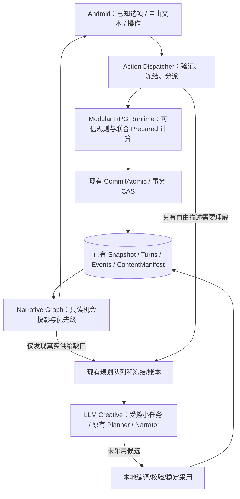

# Shine-TRPG 第 9.5 阶段建设改造方案 V2.0
## 第一性原理重构与对抗性审查版：Modular RPG Runtime × Narrative Graph Engine × LLM Creative Layer

> **状态：设计与验收合同草案；未实施、未发起模型请求、未修改远端。**  
> **修订日期：2026-10-10（Asia/Shanghai）**  
> **仓库：** https://github.com/anjingdtl/ShineWord  
> **已复核代码基线：** `main@89bb0c8d825d298b7b9dbb02e2f83322b23d6eb0`；2026-10-10 复查时为 HEAD。实施时必须再次读取 HEAD，不得假设不变。  
> **上一版：** `Shine-TRPG_PHASE9_5_MODULAR_GRAPH_RUNTIME_PLAN.md` V1.0（602 行）。本文是替代性 V2.0，不是对 V1.0 的补丁清单。  
> **定位：** Phase 9.5 为*有证据的架构收敛与纵向试验*，不是第九阶段 A01–A40 的完成报告，也不是引入另一个全功能 RPG 引擎。  
> **施工限制：** 仅在独立功能分支工作；不改写已提交回合/骰点/Canon/历史存档，不清理私有数据，不直推或 force push `main`；不使用第九阶段遗留物理请求余额开展 9.5 实验。

---

## 0. 最终裁决与 V1.0 重大修订

### 0.1 裁决

**保留用户确定的三层思想，但把“三个新引擎”收敛为“一个可信结算内核 + 两个薄适配边界”。**

1. **Modular RPG Runtime**：不是新建八份业务数据和八个服务，而是将已有规则注册表、ActionContract、roll journal、Prepared、settlement、atomic commit 组织为可重用的**唯一行动执行管线**。各领域模块只拥有其**规则函数或纯计算结果**；权威状态仍由已有分支快照和结算事务维护。
2. **Narrative Graph Engine**：首先是由 `CampaignPlan`、`Situation`、`Quest`、人物关系与当前快照**确定性派生的机会选择器**，不是独立状态机或“无限生成的剧情节点库”。只有实验证明现有内容模型表达不了必须的网状联系，才进入新的持久化协议评审。
3. **LLM Creative Layer**：首先缩小**每次请求的职责和材料**，而不是立即拆成四套服务、四套数据库、四个 Agent。既有 Planner/Narrator/`campaign_plan` 继续可用。优先消除能证明冗余的 Planner 请求；大型故事生成的拆段必须有成本与质量对照，不能仅凭小 JSON“看起来更稳定”。

**比 V1.0 更保守，也更有机会成功。** 首阶段只做一条可复现的「合法选项 → 冻结合同 → 确定性结算 → 正常叙事 → 下一步机会」纵向闭环，证伪后再扩展。

### 0.2 V1.0 的七项反向修订

| V1.0 隐含假设 | 对抗性反例 | V2.0 裁决 |
|---|---|---|
| 注册了八个 `moduleId` 就是八个可以独立执行的模块 | 当前 `moduleRegistry.ts` 主要提供 manifest/依赖/能力声明，具体执行分散于 Session、Effects、Combat、ProgressReducer | **不另建“八模块系统”**；先绘制真实调用链和单一写入权，逐步抽取薄接口 |
| 玩家点选 Method 就能无损跳过 Planner | `MethodFirstStep` 未承诺包含当前全部难度、证据、自由描述语义；Planner 可补 `difficultyBand`/`evidenceIds` | L1 仅对**静态信息闭合且编译结果可复核**的 Method 开放；不足则拒绝快路径，不能静默改为 normal 难度 |
| `executeDeterministicTurn()` 可以承接所有战役动作 | 它没有直接组合 `CampaignSession` 中的完整 discovery/quest/situation/campaign settlement 与叙事协议 | 保留既有 Prepared/commit 作为唯一主路径；先做桥接等价测试，再谈提取通用执行器 |
| Graph 独立持久化有利于模块化 | 它可能与 `CampaignRuntimeV1`、`SituationSnapshotEntry` 同时声称“已完成”，还引入 fork/save 历史绑定缺陷 | M1–M3 **零新权威 Graph 状态、零 DB 迁移**；机会视图可重建，图内容优先引用现有 Artifact |
| 预备 2–5 个节点就能解决“空转” | 五个空任务仍然是空转；高质量的一条故事机会可能已经足够 | 以“**有行动价值且产生可消费结果的机会**”为标准；节点库存数仅作为诊断数据 |
| 四类新 LLM 任务天然比一个大请求便宜可靠 | 小任务更多次、上下文反复发送、跨段校验与修复可能造成更高 token/延迟 | 先以**单一局部节点生成实验**比较 `accepted-and-used` 成本；未证明收益不拆更多接口 |
| 9.5 完成后可据此推进第九阶段 FAIL 转绿 | 代码全绿、Graph ready 不等于真实旅程质量 | 9.5 的 G 门独立；原 A15/A36/真实旅程必须用当前执行身份和真实证据单独复验 |

### 0.3 本次刻意不做

不实现第二份任务进度表、不重写所有战斗/背包/技能、不引入微服务/ECS/通用工作流平台、不安装另一套叙事 DSL 执行器、不启动全部世界内容预生成、不重构全部 `CampaignSession`、不在第 9.5 阶段要求无限动态 NPC 代理、不开启未经授权的真实模型长测。

---

## 1. 第一性原理：先问游戏必须成立什么

### 1.1 不依赖任何特定架构的最小可玩闭环

一个可持续的互动小说 RPG 回合，只需六件事成立：

1. **真实前提**：此刻的人、地、事、资源和原著约束可信；玩家看得到的内容没有泄露未来 Canon。
2. **真实选择**：至少存在一个与玩家当前目标或具体处境相关、可行动的机会；并非伪装成选择的重复通用动作。
3. **可解释规则**：玩家知道自己在做什么、主要风险和条件；成功率、限制和成本不由 Narrator 临时改写。
4. **可追溯结果**：规则根据同一冻结合同与骰点计算结果，原子提交；掉线/恢复后不重复执行。
5. **可消费后果**：重要决定在未来影响关系、物品、知识、代价、能力或下一步资格；没有实际消费的 `record_event` 不能冒充因果闭环。
6. **继续或结束**：能找到合理下一步，或者合理自然结束；没有内容时明确进入安全准备状态，不伪造新任务。

**推论 A：** 一回合即使 LLM 全离线，只要已存在合法 Method，游戏应能执行**机械结果**；是否能输出完整文学叙事属于另一个能力等级。  
**推论 B：** 为解决“无意义空转”，必须提高*有效行动机会的供给质量*，单纯扩大 Graph 节点数不是解法。  
**推论 C：** 大 JSON 的根本失败面是“一次模型调用承担过多互相依赖的职责”，而不只是 JSON 字符数；职责边界比格式选择更重要。  
**推论 D：** 叙事品质是产品目标，不是可为节省一次调用而任意丢弃的“装饰”。需要分别测量**体验、可靠性、调用/成本**三条轴。

### 1.2 目标函数与不可牺牲项

以“**每单位玩家等待和模型成本，产生多少真实而有趣的选择与可观察后果**”作为优化方向，不用单独的 TPS、JSON parse 成功率、测试数量或每回合 token 数代替体验。

| 目标 | 度量 | 不得通过什么方式作假 |
|---|---|---|
| 已知动作少依赖模型 | 符合 L1 资格的 Method 执行 **Planner 物理请求数 = 0** | 不删规则校验、不把 LLM 请求移到隐藏后台 |
| 结果可靠 | 合同、骰点、权威变更、业务事件与已批准基线一致；重复派发=0 | 不通过静默重骰、修改原存档、追加假事件达标 |
| 持续可玩 | 连续旅程有有意义的机会、替代办法、合法失败后的后续 | 不用加 counter、机械任务、延长已完成剧情凑次数 |
| 内容可信 | 原著锚点、角色身份/世界权限准确；后果被实际消费 | 不以纯文本因果叙述替代世界状态 |
| 玩家可感知 | 独立试玩者可解释目标、行动代价、改变和下一步 | 不用施工 Agent 自评替代玩家 |
| 效率实证 | 分层记录物理请求、token、总成本、P50/P95、成功使用率 | 不把局部少一次 Planner 直接宣称全流程成本下降 |

### 1.3 必须诚实承认的边界

确定性执行**只能**处理已经有合法、完整内容合同的动作。开放式玩家想象和世界创造仍需要 LLM。若一个 Method 本身没有有意义的效果与后续消费路径，“零 Planner”只能让空转更便宜，不能让剧情变好。因此本方案设置两个正交试验：**动作执行解耦**与**机会供给质量**，任何一条未通过都不能声称根因已解决。

---

## 2. 2026-10-10 远端真实代码及最新第九阶段状态

### 2.1 读码身份与路径

- `main` 最新核验为 `89bb0c8d825d298b7b9dbb02e2f83322b23d6eb0`，其上一生产提交 `eca160ad` 增加 `generationService.ts` 定点修复指导；最后的 `89bb0c8` 仅记录模拟器测试停止点。
- `35b8358` 增加 `campaign_plan` 结果未知后的显式预览/确认/关联新任务；`8ef1d53` 修复 Android XHR 增量 SSE 帧监视；`0036625` 修复后继 stage-only 候选被全局长后果门槛误拒的问题。
- 最新模拟器记录：独立 QA 账本 **78/200**，存在 **1 条 `outcome_unknown`**，本轮新开局成功但 `campaign_plan` 未形成可审查候选；用户已停止该轮测试。不能擅自恢复/重派。
- `ACCEPTANCE_MATRIX.md` 汇总仍为 **29 PASS / 2 FAIL / 9 NOT RUN**；最新局部测试报告不等于矩阵已终审，不推断第九阶段全 PASS。
- 工程日志最新报告 `verify:core 1250/1250` 是该轮提交记载，**本次设计审查没有在本地重新运行 CI**。

基线定位链接：

- [`v2Turn.ts`](https://github.com/anjingdtl/ShineWord/blob/89bb0c8/src/application/game/v2Turn.ts) — Planner/冻结合同/投骰/Prepared/Narrator/commit 状态机。
- [`v2Compile.ts`](https://github.com/anjingdtl/ShineWord/blob/89bb0c8/src/application/game/v2Compile.ts) — 已选 Method 首步会覆盖 Planner 提案形状；但 Planner 的难度/证据等仍可能参与。
- [`session.ts`](https://github.com/anjingdtl/ShineWord/blob/89bb0c8/src/application/campaign/session.ts) — 当前 Session 大聚合；在 `prepareResolution` 中串接 discovery、quest、situations、campaign settlement。
- [`commitTurn.ts`](https://github.com/anjingdtl/ShineWord/blob/89bb0c8/src/application/turns/commitTurn.ts) — 先 Prepared、原子 CAS，已提交重复返回。
- [`moduleRegistry.ts`](https://github.com/anjingdtl/ShineWord/blob/89bb0c8/src/domain/rules/moduleRegistry.ts) — 八类已注册机制和固定组合顺序；不是八个独立数据库。
- [`state/types.ts`](https://github.com/anjingdtl/ShineWord/blob/89bb0c8/src/domain/state/types.ts) — `GameStateSnapshot`、quest/skill/item/relationship/situation/campaign 权威状态。
- [`stagePreparation.ts`](https://github.com/anjingdtl/ShineWord/blob/89bb0c8/src/application/campaignPlan/stagePreparation.ts) — 最近后继预生成。
- [`unknownReplayRecovery.ts`](https://github.com/anjingdtl/ShineWord/blob/89bb0c8/src/application/campaignPlan/unknownReplayRecovery.ts) — 现有 `campaign_plan` 精确范围显式恢复，不是所有新请求的通用恢复 API。
- [`saveFile.ts`](https://github.com/anjingdtl/ShineWord/blob/89bb0c8/src/application/export/saveFile.ts) — `shineword-save-10`；老旧 save-2..9 明确拒绝。
- [`builtinMigrations.ts`](https://github.com/anjingdtl/ShineWord/blob/89bb0c8/src/infra/sqlite/builtinMigrations.ts) — 101 初始基线、102 未知恢复审批增量迁移。

### 2.2 权威机制与现有能力，按“谁真正写状态”审计

| 领域 | 已有代码 | 对抗性发现 | 9.5 处理 |
|---|---|---|---|
| 可信模块声明 | `moduleRegistry.ts`、`worldRuleConfiguration.ts` | Manifest/ownedFields 是政策约束，不代表所有写入已独立封装 | **保留**；新增模块边界测试，不重复配置中心 |
| 冻结合同/骰子 | `v2Compile.ts`、`resolveOrReuseRoll.ts` | Method ID 稳定，但签约时的难度、证据、目标仍需证明闭合 | 建立 typed compile readiness；不证明就不走 L1 |
| Prepared 与 Commit | `commitTurn.ts`、`v2Turn.ts` | Narrator 先于提交，直接“本地提交后再补叙事”会改变恢复语义 | 9.5 默认维持当前顺序，不自行拆异步叙事协议 |
| 本地确定性辅助 | `executeDeterministicTurn.ts` | 缺 Session 全套跨域回调，贸然复用会遗漏主线因果 | 不直接替换正式战役路径 |
| 关系/技能/物品 | `state/effects.ts`、`progression/growth.ts`、`session.ts` | 这些规则已有实现，但尚未统一为可替换模块执行接口 | 抽窄接口、保留唯一结算所有者 |
| 任务/战役状态 | `questProgress`、`progressReducer.ts`、`settlement.ts` | `CampaignRuntime` 已是主线完成权威 | Graph 只读投影，不允许第二套 completed 真相 |
| 可执行局面 | `SituationCondition`、`MethodTemplateV1`、`assessMethod` | 已有部分网状关系 (`nextNodeIds`,`followUpSituationIds`)，缺统一机会索引和玩家目标相关性选择 | 先建只读 opportunity selector |
| 后继准备 | `stagePreparation.ts`、`replanService.ts` | 已有后台单飞与最近后继，不需要另起预生成队列 | 复用队列与冻结，严禁双重派发 |
| 错误与预算 | `LedgeredProvider`、Freeze、XHR SSE、unknown 审批 | 显式恢复只覆盖现有合同范围；新 requestKind 不是“自动兼容” | 没有端到端 budget/unknown 接线就**不增加 LLM 任务种类** |
| 存档/分叉 | `save-10`、DB101/102、fork 复制历史代次 | R68 曾真实出现冻结内容依赖缺失；新图表可能重犯 | 优先零迁移；任何新持久产物须独立存档/fork 评审 |

---

## 3. GitHub 同类项目参照：只借机制，不移植整套框架

这里参考的是**已验证存在的仓库及其公开实现/文档**，不是宣称它们直接解决 LLM 内容生成。

| 项目 | 仓库与核实点 | 可以借鉴 | 不应照搬 |
|---|---|---|---|
| **foundryvtt/dnd5e** | https://github.com/foundryvtt/dnd5e — README 明确把 Actor、Item、骰子、规则机制和内容图鉴拆开 | “规则/可执行活动”和“可浏览内容定义”分离；数据驱动执行而非自然语言每回合重新创造技能 | Foundry 是桌面/网页 VTT、D&D5e 规则特定；不复制依赖 Foundry 内核的实现或 SRD 内容 |
| **inkle/ink** | https://github.com/inkle/ink — `WritingWithInk.md` 的 knots/diverts/branch & rejoin | 分支—汇合的**叙事内容组织**；不同路径合流时仍保留状态差异 | ink DSL 主要服务人工编排文本，不替代实时战斗和世界账本；不在 9.5 引入第二解释器 |
| **YarnSpinnerTool/YarnSpinner** | https://github.com/YarnSpinnerTool/YarnSpinner 及 [Storylets & Saliency](https://github.com/YarnSpinnerTool/YSDocs/blob/main/docs/write-yarn-scripts/advanced-scripting/storylets-and-saliency-a-primer.md) | 条件过滤 + saliency 选择 + 去重复的**机会排序**；玩家选项和游戏命令解耦 | “可选中”不等于内容有因果价值；随机优先级不应破坏存档可重现性 |
| **evennia/evennia** | https://github.com/evennia/evennia — 命令系统/对象属性/权限/定时 Script | 输入→命令解析→确定性执行；内容系统与命令系统各管各的 | 它是 Python 在线 MUD 服务端；不引入服务器、账户与常驻 Script/Ticker 的技术栈 |

**从这些项目得到的收敛结论：** ShineWord 最值得借鉴的是 Foundry 的*规则内核与内容定义分离*、ink 的*分支汇合*、Yarn 的*条件过滤与显著性选择*、Evennia 的*命令执行边界*。没有必要复制任何仓库的数据模型或运行时；引用协议思想即可。参考仓库版本会变化，施工时核对许可证和接口，不复制其源码或素材。

---

## 4. 对抗性审查：十二种可能导致 V2.0 再次失败的方式

> 每项都必须以可失败的 RED 用例、生产复现或经批准的真实样本来证明；不得以“理论上应该没问题”关闭。

| 攻击编号 | 故障注入/反例 | 后果 | 防线与否决条件 |
|---|---|---|---|
| T01 | `candidateRef` 合法但旧 Planner 曾给 `hard`，新快路径静默用 `normal` | 游戏更容易，奖励/技能成长变味 | **不具备已声明/可冻结的 difficulty policy 时 L1 不启用**；相同难度/骰点结果对照必须成立 |
| T02 | Method 首步缺 `evidenceIds`，快路径把空数组视作“不需要证据” | 原著/知识边界绕过 | 从既有绑定/可见性闭包推导合法引用；不可推导则禁用快路径，不伪造来源 |
| T03 | `executeDeterministicTurn` 直接 commit，遗漏 Campaign 的承诺、关系、知识、奖励 | 看似成功却没有下游回响 | 跑真实 Session Prepared 回调；逐字段对照跨域状态与事件，任意遗漏即 P0 FAIL |
| T04 | UI 连点 Method，在本地投骰前恰好有另一个管理采用改变 contentVersion | 并发跨版本执行 | 在冻结/提交边界重新检查 content/rule/state binding 与 fence；旧操作拒绝且不投新骰 |
| T05 | 玩家已收到骰点，Narrator 断网；新实现先 commit 并把回合标为完成 | 旧恢复语义被破坏、叙事缺失 | 默认沿用 Narrator→commit 协议；异步叙事需**单独设计变更和设备恢复证明** |
| T06 | 节点池 5 个全是无效果“打听/查看” | 便宜但仍不可玩 | 有效机会门：至少有**不同机制结果或可消费机会**；空库存如实报告，不刷节点数 |
| T07 | 新图把主线 node `succeeded`，旧 CampaignRuntime 仍 `active` | 分叉/结局冲突 | Graph 永不写业务完成状态；全部由权威快照导出；矛盾即拒绝发布/禁用新视图 |
| T08 | 长后果在 Graph 上“连到了”下一节点，但下游方法/条件不读取效果 | 伪因果 | 必须有 producer→committed effect→state→consumer 的实际闭环，Graph 边本身不计成功 |
| T09 | 新 Graph 调度和 R69 stagePreparation 都发现缺后继并分别派发 | 双倍请求、候选竞态 | 统一在现有 job owner 仲裁，同一冻结范围单飞；不在 Graph 内直接 HTTP |
| T10 | 把长计划拆成 5 次局部调用，每次重复原著上下文 | token/时延总成本上升 | 对照 accepted-and-used/总物理成本；无实测优势则保留原生成方式 |
| T11 | Graph 内容仅复制最新 content manifest，旧 v26 分叉缺历史代次 | 冷恢复/导出拒绝 | 零新 DB 为优先；新产物必须含完整历史依赖、fork/save/导入证据，不能读取父分支 live 填补 |
| T12 | 生成任务 `outcome_unknown` 后自动改 requestKind 重新发送 | 额外计费和重复任务 | 复用原冻结/账本/明确批准的受控恢复；原本不能覆盖的新任务类型必须先补设计，默认停派 |

**额外必须测试的两组攻击**：

- **信息权限**：不同世界/不同分支/未发生的原著未来/GM-only 人物/未发现线索/隐匿方法均不得进入 LLM Narrator、Graph 玩家视图或候选解析材料。
- **复杂度反噬**：新增 Graph 选择器后 100/300/1000 已提交回合内状态大小、队列数量、冷启动/低端 Android 投影成本受控；若引入显著性能回退却无真实质量提升，应回退 Graph 扩张。

---

## 5. 核心架构：三个逻辑层、一个权威写入管线



**注意图中箭头的权力差异：** 创作候选采用的是**内容版本**，不是直接提交玩家游戏状态；只有可信的 ActionContract/Settlement 经现有规则管线能提交游戏变化。Graph 排序/可见性是纯投影，不是写数据库的“世界控制器”。

### 5.1 权威与禁令

- 原著 Canon/世界包：世界事实、来源时间锚点、已发布内容的权威。
- 当前游戏事实：分支 `GameStateSnapshot`、`ActorCard`/对应归属投影、完整 committed 事件与精确历史绑定。
- 主线完成、结局与延迟后果：既有 `CampaignRuntimeV1`、`CampaignProgressReducer` 与 `settlement.ts` 权威。
- Method 机械结果：冻结的 `ActionContract` 四档、骰子与已编译 Campaign Effects 权威。
- Graph：**只读的 OpportunityProjection**；不另存 HP/亲密度/背包数值/任务完成结果。
- LLM：只能返回已知动作映射或**待验证内容候选**，不可直接执行代码、写 SQL、改骰、覆盖已确认状态。
- 所有模块采用同一 commit 边界；**禁止 A 模块写入数据库后再通知 B 模块补发奖励**。外部/异步投影可至少一次执行，但必须幂等，且不能重新结算权威状态。

### 5.2 模块划分不是按文件名强切，而是按“决策权”划分

| 领域 | 规则/纯函数边界 | 状态权威 | 9.5 改造动作 |
|---|---|---|---|
| 资源/状态 | `resources_conditions`、`applyEffects` | `actors.resources/conditions/...` | 只封装资格与效果，不另开存储 |
| 技能/成长 | `skill_actions`、`growth_rest` | skills/award keys/角色卡 | 公用资格检测、骰点冻结、奖励去重 |
| 人物关系 | `social_relationships`、现有关系结算 | `relationships` | 利用状态条件影响机会资格，不能直接让 Narrator 调数值 |
| 物品 | `itemOwners`、Item Definition 与效果操作 | `itemOwners`/来源数据 | 明确唯一道具转移/消耗、防重复 grant |
| 战斗 | `combat_zones`、Encounter 流程 | Encounter/战斗快照 | 第一批不改变战斗入口；用现有规则进行复验 |
| 任务 | `questProgress` 与现有 quest 逻辑 | Quest Snapshot | **不创建第二 Quest Engine**，只做查询/结算适配 |
| 世界/场景 | `exploration_discovery`、`situations_causality` | 场景/知识/因果时序 | Graph 基于时间锚点/可见性选择合格机会 |
| 延迟后果 | Campaign/Situation reducer | `campaignRuntime`、承诺/历史事件 | 原子 Producer→Consumer，保留有界闭包 |

---

## 6. 行动执行：先安全省掉一次 Planner，再谈完全离线

### 6.1 路由分层（资格不是仅检查 `methodRef` 是否存在）

| 路径 | 适用条件 | 模型职责 | 9.5 的完成线 |
|---|---|---|---|
| **L0 — 原有本地机制** | 已由 `rest`/training/encounter 等完整封装并具有合法规则合同 | 规则执行 0 LLM；可能有后续内容维护请求，需另计 | 保留旧服务、补统一审计与异常测试，不强行合并所有 API |
| **L1 — 静态闭合 Method** | 已发布、已可见、当前可用、所有动作参数/难度/证据可在本地合法确定，四档已冻结 | **Planner 0**；当前 Narrator 依用户体验策略仍可调用 | 先限少量 Method 类型，逐步增加通过率，不能空值猜测 |
| **L2 — 未闭合或自由文本** | 语义新组合、目标不明确、Method 不足、当前规则缺少动作参数 | Planner 或受限映射，仍由本地编译与结算 | 保留原来运行路径；不能因成本压力悄悄转成普通成功 |
| **内容供给** | 没有经资格和价值审查的合法机会 | 原有或试验性有界创作任务 | 不伪装成玩家行动、不从 Graph 独立派发 |

**硬边界**：L1 被明确选择后，如 `stateVersion` 或选项身份 stale，应**拒绝并提示刷新**，不是悄悄退化成会再次收费的 L2。只有玩家提供自由输入或明确同意解释模式时才可能使用 L2。

### 6.2 合同闭合判据 `LocalCompileReadiness`

拟新增**纯函数资格结果**，而不是将任意 Method 直接塞进伪造的 PlannerProposal：

```ts
// 拟议协议，不代表当前仓库已有此 API
interface LocalCompileReadiness {
  kind: 'ready' | 'needs_planner' | 'reject';
  reasonCode?:
    | 'missing_difficulty_policy'
    | 'unresolved_evidence'
    | 'ambiguous_target'
    | 'unsupported_method_shape'
    | 'unbound_rule_or_content'
    | 'stale_guidance'
    | 'permission_denied';
  // ready 时由唯一工厂产出：引用、证据、难度等都已确定
  frozenInput?: {
    methodRef: { situationId: string; methodId: string };
    expectedStateVersion: number;
    difficultyBand?: 'simple' | 'normal' | 'challenging' | 'hard' | 'extreme' | 'peak';
    evidenceIds: readonly string[];
    contentBindingHash: string;
    ruleBindingHash: string;
  };
}
```

**必须精确定位旧代码事实：** `compileSelectedProposal()` 已经按 `selectedMethodRef` 强制覆盖 `actionKind/skillId/abilityId/destinationId/targetId`，但 `difficultyBand` 仍可来自 Planner 提案；未指定时 `compileProposalBase()` 默认 `normal`；`evidenceIds` 仍从 Planner 提案透传。正因此，**不得未经证明把“默认 normal/空 evidence”当成所有既有方法的正确语义**。

资格策略：先选取合同参数原本就完全闭合的样本；未闭合项先回到当前 Planner 路径，**不为了覆盖率而偷偷填值**。如果确需后续扩展 MethodDefinition（显式 `difficultyPolicy`、证据引用），必须作为**新内容协议版本**，旧已采用 Method 仍按旧路径可玩。

### 6.3 与原 Session 管线等价，而不是重写一个近似版

针对同一冻结 `stateVersion/actor/content/rule/style`、同一合法动作语义和同一 RNG 预置序列，比较旧路径与 L1 新路径生成的：

`ActionContract` 的角色、行动类型、证据、难度、资源前提、时间、四档效果、MethodRef、OutcomeSetHash、ContentDependency、RuleBinding、样式快照、骰子规格；以及结算后的关系、知识、任务、Situation、Campaign、奖励、世界时钟、事件与存档绑定。

同一动作仅因 Planner 文案解释不同造成的无规则字段差异，可以记录为可接受差异；**任意权威规则字段不同须说明原因，未获批准则 L1 不可发布**。不允许通过修改旧夹具、旧骰点或删除字段来强行使两条路径一致。

### 6.4 提交顺序、崩溃恢复和叙事品质

- 原流程关键时序是**Prepared 计算、Narrator 候选、完整事务 commit、Narrator committed**；M1 默认保留这个时序及回合恢复，不把“先结算再出故事”作为小改动顺手引入。
- L1 的改变在于**不向 Planner 发物理请求**，不是去掉 Narrator。这样用户仍有原著风格叙述，不因性能优化突然变成机械日志。
- L0 已有机械动作继续使用其现存实现。若将来希望“离线 L1 可先得到规则结果、再补文学叙事”，必须另设 `narrative_pending`/已提交回合无叙事恢复规则、存档协议和设备 UI 测试，作为**9.5 后续设计变更**。
- 无有效冻结合同的自由动作绝不“本地默认成功”。若模型不可用，则明确不可处理此自由动作，同时保证既有本地可用规则操作仍可使用。

### 6.5 故障注入案例（必须保留 RED）

1. 同方法且同状态，旧 Planner 输出 `hard`，新本地缺规则难度：新路由必须 `needs_planner`，不得默认 `normal`。
2. Method 引用 NPC，NPC 已死亡或转移地点：刷新前的点击必须拒绝，0 投骰、0 Narrator 派发。
3. 同 Method 双击、后台冻结竞争：一个提交，唯一骰点/奖励；另一返回已提交结果或明确 stale。
4. 提供合法 `candidateRef`，但内容版本对应另一分支：拒绝，不猜测对应本地 Method。
5. Narrator 成功返回但 commit 前被杀：恢复同一候选与已冻结合同，不新投骰或新 Planner。
6. Narrator `outcome_unknown`：禁止自动重发；恢复政策由现有对应 requestKind 合同控制。

---

## 7. Narrative Graph：先将已存在的结构变成“可用机会选择器”

### 7.1 MVP 不新定义 `StoryNodeV1` 为第二权威

V1.0 直接定义新的 `StoryNode`/`StoryEdge` 持久化协议过早。V2.0 的最小实现从现有实体生成**可丢弃、可重建**的 `OpportunityProjection`：

```ts
// 纯投影，不保存玩家“完成”的第二份事实
interface OpportunityProjectionV1 {
  source: {
    kind: 'campaign_node' | 'situation' | 'quest';
    sourceId: string;
    contentVersion: number;
  };
  reason: 'current_goal' | 'available_followup' | 'side_consequence' | 'local_exploration';
  visible: boolean;
  eligible: boolean;
  actionableMethodRefs: readonly string[];
  blockers: readonly string[]; // 玩家版只显示允许解释的前置条件
  consumedEffectRefs: readonly string[]; // 只用于审查，不直接执行
  priorityKey: readonly (string | number)[]; // 固定、可重放的排序依据
}
```

索引：

- `CampaignPlanV1.nodes[].nextNodeIds` 与当前 `CampaignRuntimeV1.nodeStates`；
- `SituationDefinitionV1.followUpSituationIds`、现有 `SituationCondition` 和 `assessMethod`；
- 当前 `questProgress`、`relationships`、`itemOwners`、`discoveries`、promise 和已提交事件；
- 现有内容 Manifest、原著锚点、当前位置信息、GM/玩家可见性。

Graph 只输出“此时有哪些真实机会、应该优先呈现哪几个、供给哪里缺口”。**节点成功/失败只读原 reducer 状态，不得新建 GraphProgress 表**。未来若有无法由现有模型表达的持久替代关系，须先提交需求反例和存档成本对照再扩展协议。

### 7.2 机会选择顺序：先过滤，再排序，不凭空创造剧情

处理顺序固定：

1. **过滤合法性**：场景地点、角色在场/存活、玩家知情、任务状态、锚点时序、世界规则、内容发布版本与 Method 资格。
2. **过滤实际可行动性**：至少一个可用 Method；或明确已存在的可执行本地机制。单纯“可阅读一段文本”不视作可执行机会。
3. **标记因果价值**：该节点是否可以产生变化、解除阻碍、获得条件、改变代价/人物/知识或导向真实新机会。**没有即时效果但拥有可信后续条件**的调查仍可合法存在；不是强行要求每回合加数值。
4. **排序**：当前目标相关性 > 当前因果承诺/截止事件 > 空间可达性 > 最近重复惩罚 > 明确支线偏好。分数/排序项固定版本化、同状态可重放；不得由随机数无痕改动故事先后。
5. **呈现**：仅显示有限的当前玩家可见机会与其真实风险；局面缺少有效选择就公开“内容待准备/当前可自由探索但未发现新机会”，不塞三个空选项。

### 7.3 局部网状结构：先用“多种路线、条件汇合”证明有用

最小实验场景：

`帮助药师`、`购买情报`、`探索遗迹` 三条可选路径可以进入 `炼丹线索`，但前者改变人情，第二条消耗资源，第三条触发警觉。汇合后 `拜访炼丹师` 根据**实际已提交状态**显示不同方法/代价。测试重点是最终状态与后续消费，而不是 UI 图上画出了三条连线。

“强前置依赖”若构成不可突破循环应拒绝发布；“追踪/重试/周回”类环路可存在，但必须由已提交状态改变、次数/时间上限或外部终止条件约束，防止无限触发。对 `unknown` 条件，必须按当前条件引擎语义 fail-closed，不能擅自把未知当作可用。

### 7.4 与 R69 预生成的关系

- R69 的 `evaluateStagePreparationTarget()` **继续是最近主线后继的唯一原有预测责任者**。Graph MVP 只读显示机会缺口，并将建议交给现有 job owner 仲裁，绝不新增平行 `replan` 调度。
- 阶段切换已带准备内容时直接消费有效已采用情况；预生成完成但在途回合时遵循原 `candidate_ready`、稳定采用、stale/fence。
- 后继不存在时首先区分**合法自然结局**、**确无已发布素材**、**资格失败**、**内容生成失败/unknown**四种情况；不同原因对应不同 UI，不能笼统“继续探索”并自动烧请求。
- 不预生成遥远的结局/隐藏人物/全小说未来；不提前实例化 NPC、发奖励、消耗资源或泄露隐藏内容。

---

## 8. LLM Creative：先做一个受控局部节点实验，再决定是否拆分服务

### 8.1 旧路径保留，新增路径受试验门控制

当前 `campaign_plan` 仍负责已有计划格式和遗留战役；不要在尚无数据时一夜之间重写为 Director+Node Author+Intent Mapper+Narrator 四服务。**第一批只允许一个试验性局部候选生成入口**：对已有阶段 `provisional`、缺有效后继的合法范围，生成一个可验证的 Situation/Method 小候选，输出严格受控结构并交给现有 local compile/validation/manifest/adoption。

一个小候选通常只需要：`target`、经允许的 `sourceRefs`、局面摘要、既有方法模板/受限具体方法、必要后果引用；不得同时生成完整世界包、角色卡、战斗规则、十几个新阶段、全部结局与奖励体系。**产生一个候选不自动成为已发布场景**。

### 8.2 必须证明“生成成功”到“可玩”的四级漏斗

`物理请求 → 收到确定完整输出 → 通过来源和机械校验 → 安全采用 → 被玩家实际选择/产生后续消费`。

统计：

- `P(valid | request)`：合法结构与来源的比例；
- `P(adopted | valid)`：同一冻结意图下仍可采用的比例；
- `P(used | adopted)`：被真实玩家使用的比例；
- **`totalCost / adopted-and-used`**：物理请求与 token 按有用机会摊销的成本；
- 每层的 P50/P95 延迟及 unknown/invalid/stale 数量。

如果局部创作虽然 JSON parse 率提高，却因跨节点因果浅、采用时 stale 或额外调用而 `cost/adopted-and-used` 更差，则**否决全面迁移到局部任务**，继续在旧 `generationService` 上优化职责/上下文。

### 8.3 请求、账本和恢复保真

- 使用现有 `LlmProvider`、冻结根、`LedgeredProvider`、物理 attempt、SSE/timeout、租约、内容/模型身份和精确预算。不能让 Graph 调度层自行构造裸 HTTP。
- **新增 `requestKind` 不自动享有 `campaign_plan` 的 unknown 恢复语义**。如果第一批确需新增，请完整实现 `LlmRequestKind`、预算核、日志、序列化、恢复、Android 桥接和显式审批；若不能一轮完成，先使用现有**合法而非伪装**的阶段规划任务形态，不篡改账本分类。
- 未确定结果不得自动重发；确定收到 invalid 响应，才可在既有修复上限内定点修复。原候选、原响应与错误保留。
- 如果当前模型不支持可靠的 JSON/流式能力，应按实际 capability 分支并给出可检验的失败状态；不强行要求所有模型输出超长计划。
- Narrator 仍受 `styleSnapshot`、已提交事实、已冻结四档及 GM/玩家可见性限制；质量退化不应因为少调用 Planner 而被忽略。

---

## 9. 事务、一致性、存档和 Android 兼容

### 9.1 仅一个可变权威，领域事件是事实发生的记录

`GameCommand → 本地权限/内容资格 → 冻结 ActionContract → 复用骰点 → Prepared 全域结算草案 → Narrator/已存候选 → commitPreparedTurn(同一事务) → branch_events / outbox → 只读机会投影`。

跨模块反应应由**同一次 Prepared reducer**协调，而不是几个模块监听事件后各自 `db.execute` 改状态。后提交 outbox 只做派生索引、内容准备、记忆等可幂等外部工作，不能二次兑现角色奖励或推进主线。现有 `NODE_TRANSITION_BATCH_LIMIT`/`CONSEQUENCE_TRIGGER_LIMIT` 继续有效，新机会缓存不能使系统无限递归。

### 9.2 数据协议升级原则

- 当前 DB baseline `shineword-db-baseline-2`；**101 + 102**，102 为规划 unknown 审批；当前 Save **`shineword-save-10`**。
- M0–M3 **默认不新增持久化 Graph 表**、不变更 save schema，只读现有 snapshots/plan/artifacts 计算机会；不修改历史 migration 101/102。
- 只有发现现有 Artifact 无法无损表达某个*必须持久*的连接时，才提出 103+ 迁移设计；提供：回退/可读取策略、保存协议版本矩阵、历史分叉/同状态多代内容反例、失败原子回滚证据。
- 若新字段无法由 save-10 重建，必须明确 save-11 的**导出与 save-10 导入兼容**方案。不能先升级 schema 再以“旧数据不兼容”为由强迫玩家删档。确实无法安全转换时保持**旧 Runtime 只读/续玩**和清晰迁移限制，不做虚假兼容承诺。
- 旧开发期 save-2..9 被当前正式协议拒绝，这是仓库已有事实；9.5 不借机暗中“修复”或放宽这一规则。

### 9.3 身份与恢复矩阵

| 场景 | 规定行为 |
|---|---|
| 同一提交重入 | 返回相同回合和骰点，0 重复效果与 0 重发奖 |
| UI 选择后 plan/content 更新 | 旧 `candidateRef` 失效，拒绝旧动作，不重绑到新的同名方法 |
| 冻结根损坏/缺历史代次 | fail closed + 可定位诊断，绝不拿 live Catalog 代替 |
| 旧 unknown 物理请求 | 保留原状态/费用/attempt；没有本人确认不重放 |
| 成功采用节点，玩家尚未行动 | 不实例化未来人物、不给物品/经验、时间不推进 |
| fork 历史多个内容代次 | 精确复制并重绑分叉点之前的完整依赖；导出—导入—冷启动后仍一致 |
| Android 后台/断网/进程杀死 | 已有冻结合同与预算可复原；不因组件重挂载重复派发 |

### 9.4 Feature Flag 的使用

第一阶段只在**开发/受控 QA**启用 L1 和机会投影：

- `runtime.localMethodFastPath`: 默认关闭；旧战役永远保留旧路径可回退。
- `runtime.opportunityProjection`: 默认为只读诊断，不改变内容或状态。
- `creative.localNodePilot`: 单独受控开启，并且与旧规划队列互斥。

若新行为改变了历史规则语义、存档可读性或需要持久化玩法配置，则必须在新战役创建时明确冻结运行协议；**不能静默在已有进行中的战役切换规则**。纯内部本地实现优化不应为了“灰度”而无故修改现有保存 schema。

---

## 10. 施工顺序：风险从低到高的五个独立包

> 每包均先 RED 反例、后实现、再完整回归；只有退出证据有效才能进入下一包。任何 P0 反例未解决则停止扩大范围。**这不是授权 Agent 不停重试直至“绿色”**。

### M0 — 事实冻结与验证平台（无新生产功能；P0）

**完成内容**：

1. 读取当时最新 `main` SHA、树、CI/PR；对比本文基线并形成 `BASELINE_DRIFT.md`。
2. 输出 `MODULE_OWNERSHIP.md`：逐模块列出权威状态字段、纯领域函数、Session 真实调用、所有写入口、事务边界；明确 `moduleRegistry` 是声明还是已经实际解耦。
3. 输出 `ACTION_CONTRACT_GAPS.md`：提取现有已发布 Method 的难度、证据、目标、四档效果覆盖情况；不将“methodId存在”当作闭合。
4. 建立包含成功/失败/严重失败/automatic、知识/关系/奖励/承诺、branch/fork/unknown 的对照 fixture，固定随机源和冻结根；只在测试副本运行。
5. 冻结 Phase 9 两份独立账本和最近模拟器停止点，不请求旧 `outcome_unknown`，不重算或重置 spent。

**G0：** 全部事实可复现，列出可进入 L1 的有限 Method 类型和明确拒绝类型；原核心/移动/构建检查符合当前 HEAD 真实状态；无真实模型请求与私有数据外传。

### M1 — 安全 L1 快路径的“最小竖切”（P0）

**范围**：仅将**一个或一小类已经完全闭合**的 Method 从旧 Planner 路径转入本地合同工厂；同一 `CampaignSession` / `v2Turn` 的 Frozen、Prepared、Narrator、commit、恢复链路保持不变。对自由文本与不闭合 Method 仍使用原 Planner。不要为此引入泛型插件平台。

**必要反例**：难度缺失、空/越权 evidence、目标无效、stale content、同一 Method 多版本、exact dice 再入、Narrator unknown、Quest+Campaign+Situation 同次结算。

**G1：** 对列明的 L1 合格样本，**Planner 实际发送 0**、Rule/Contract/Effects 与旧合法基线等价；所有旧 Session 提交/存档/恢复回归仍通过。若找不到任何非玩具方法完全闭合，必须明确报告并回到协议设计，不许伪造 `normal` 和空 evidence 硬过门。

### M2 — 机会投影与对抗性玩家可玩性试验（P0）

**范围**：复用既有 `CampaignPlan + Situation + Quest` 计算当下机会；实施合法性过滤、统一目标相关性/重复惩罚、有界排序。**不加新 Graph 业务状态、不重建后继生成器**。保留旧 UI，只加易于关闭的机会展示/诊断数据。

**必测旅程**：同起点 fork A/B，A 选择人情路线、B 选择交易路线；二者在合流节点后有**可验证不同方法/条件/代价**；一条合法失败后能继续；玩家提前达成目标时正常结局；没有足够事实时明确供给不足而不是通用空转。

**G2：** 玩家视图不泄密；Graph 只读无新提交；至少一条真实机制意义的分支—汇合—后果消费链通过；同状态投影可重放；100/300/1000 回合不无界膨胀。

### M3 — 局部节点内容供给可行性实验（条件包；P1）

**启动条件**：M2 确实发现已发布内容机会不足，而第九阶段 R69 最近后继预生成/当前生成仍不能在可接受成本与时限内供给**有意义的**内容。若旧供给已足够，M3 可保持 NOT NEEDED，而不是强行创造新组件。

**范围**：复用现有候选/job/冻结/修复/采用机制，仅实现一类局部候选，与旧大计划在匹配样本上进行**成本与质量对照**；没有新请求 kind 的完整恢复/账本合同时不可发真实请求。

**G3：** 局部候选来源、效果闭包、保存/分叉引用、Android 恢复真实通过；与旧生成对比 `cost/adopted-and-used` 和 P95；若不能降低风险或成本，否决“全面拆分 LLM”并保留已有生成路径。

### M4 — 集成与灰度验收（P0）

**范围**：在受控 Android 真机/模拟器上完成版本化/分支冷恢复、性能与玩法质量配对；对第九阶段受影响链路明确重验，不把前次身份账本混入新架构证据。进行独立玩家试用。

**G4：** 核心与 Android CI 全绿（见 §11）；已闭合样本的 Planner 物理请求=0；关键因果链准确、没有 false-success 和泄密；选项选择/自由描述两种路径均能正常继续；没有旧存档破坏。只有 G0–G4 达标才申请进一步扩大 L1 覆盖或考虑持久 Graph、新内容协议。

### M5 — 可选的正式扩展设计（不是默认必须施工；P2）

仅当 M0–M4 证据证明必要时，提交独立 RFC：

- 显式 `difficultyPolicy/evidenceBinding` 的 Method 内容版本升级；
- 无法从现有事实投影的持久 Graph 内容定义；
- 异步 Narrator 事务语义；
- 更细粒度的 `director/node-author/free-intent` LLM 协议；
- DB 103+ / save-11 的精确兼容计划。

每项需独立反例、成本收益和迁移审批；**默认不进入本轮 9.5 必交付**，避免把工程数量当成成功。

---

## 11. 可证伪的验收矩阵

### 11.1 工程硬门（每个合并候选）

```bash
npm run verify:core
npm run typecheck
npm --prefix mobile run typecheck
npm run verify:version
npm --prefix mobile run apk:debug
git diff --check
```

同时读取实际 GitHub Actions `Core Verify` 和 `Android Verify`，不能以本地命令代替远端状态。构建通过≠Android 安装、LLM 可用、真实故事质量通过；需要分别登记。

### 11.2 必需证明与直接否决

| 验收 ID | 必须看到的证据 | 不通过的情况 |
|---|---|---|
| V95-01 | 生产路径 `CampaignSession→...→commit` 真实调用图、所有模块写入权 | 有第二个未审计状态写入口 |
| V95-02 | `LocalCompileReadiness` 对缺难度/证据/权限作安全区分 | 把字段缺失默认 `normal`/`[]` 当 L1 |
| V95-03 | L1 合格 Method 物理 Planner 数=0，Narrator 原样受限 | 隐藏后台追加 Planner 或绕过旧冻结 |
| V95-04 | 同合同、同骰流下结构化状态/事件等价 | 关系、任务、承诺、延迟后果遗漏 |
| V95-05 | 双击、杀进程、unknown、恢复与预算零重复派发 | 发生二次投骰、奖励、扣款或未批准重发 |
| V95-06 | OpportunityProjection 由当前权威事实派生，可重算 | Graph 单独记录第二份 succeeded |
| V95-07 | 分支—汇合后不同路径真实影响下一方法/代价 | 仅文字不同，没有权威状态差异 |
| V95-08 | 原著时间锚点与 GM 可见性不泄漏 | 未发生的原著未来成为已发生事实 |
| V95-09 | 内容不足表现为明确、可恢复的供给状态 | 自动循环发无结果“看看/打听”请求 |
| V95-10 | fork/save/import/cold-resume 历史绑定完整 | 旧同 stateVersion 多 contentVersion 丢失 |
| V95-11 | 局部创作与旧模式真实样本的成本/有效使用率对照（若 M3 启动） | 只报 JSON 通过率而没有使用率/总成本 |
| V95-12 | 独立玩家能说清目标、刚才变化、下一步及选择代价 | 施工者“自己觉得能玩”就宣布通过 |

### 11.3 性能评测方法与预算约束

- 先在匹配 `world/source scope/actor/state/model/reasoning/device` 的回合样本上分别评估 L0、**真正满足 L1 条件的子集**、L2、背景创作；不以有偏混合样本做简单百分比比较。
- 全量成本口径：`C_total = Σ cost(physical_attempt)`，每个物理 attempt **只计算一次**，再按 `requestKind` 与 `outcome_status` 两个正交维度分组。`unknown` 是结果状态，**不是再加一遍的费用类别**；应保留其物理派发、已知 usage/潜在计费区间，不因未返回文本就按 0 成本处理，也不把不确定金额冒充实扣款。
- 延迟独立统计：界面动作到规则结果、到完整可读叙事、后继首次可用三类 P50/P95；不要把异步/隐藏等待忽略。P95 只在样本量与试验环境足以支持时正式报告，否则列样本数、最大值与探索性分位数，不把少数样本的 P95 说成稳定性能保证。
- 工程基准：合格 L1 样本 100% Planner 派发 0；但不保证全部 Method 都符合 L1，须报告 `L1_eligible / publishedMethods` 分布，避免挑一个简单样本宣称全系统适用。
- 玩家体验：至少一个三路分支汇合、两条可消费因果链、失败后继续、自然提前结束、至少两种题材世界的受控现实样本；**不强制每个故事恰好 20 回合**。原第九阶段自己规定的 80 决定等独立合同仍保留，不能用 9.5 的新样本替代其历史验收。
- **预算隔离**：新 9.5 的真实模型调用必须有独立、明确批准的物理请求预算及 Ledger；不能从原 Phase 9 的 `1291/1500`、模拟器 `78/200` 擅自划拨，不能把两者相加或宣称有新的免费额度。

---

## 12. 施工治理、交付物和停工准则

### 12.1 建议分支与文件

```text
feat/phase9-5-evidence-driven-runtime

docs/Shine-TRPG_PHASE9_5_MODULAR_GRAPH_RUNTIME_PLAN.md     # 本 V2.0 目标路径

docs/reviews/phase9-5/
  BASELINE_DRIFT.md
  MODULE_OWNERSHIP.md
  ACTION_CONTRACT_GAPS.md
  L1_PARITY_REPORT.md
  OPPORTUNITY_REPLAY_REPORT.md
  ADVERSARIAL_TEST_MATRIX.md
  COST_AND_QUALITY_COMPARISON.md   # 仅启动 M3 时必需
  ANDROID_AND_SAVE_REPORT.md
  FINAL_DECISION.md
```

对应生产源码只按验证到的真实职责*最少增改*，不为了满足这个目录样式而创建空 Adapter、空 Registry、重复 `GameState` 类型和庞大的框架抽象。

### 12.2 Agent 必须遵守

- 开工先重查 `main` SHA、当前 Schema、SDK/Node、CI、原 Phase 9 正在使用的工作区与预算；有偏移先审计，不能拿本方案旧 SHA 编造现状。
- 先 RED 实验，再做**最小生产改动**和 GREEN，随后跑全量、Android 样本；逐包提交，保留失败证据和旧断言。
- 不复制或迁移用户 API 密钥/全文小说/真实 DB 到仓库；需要原始样本时使用受控副本及安全引用，不显示私密凭据。
- 不直接改 main，不 force push、重置未知历史或篡改 LLM 响应；数据库只使用正式接口和版本化迁移。
- 若要新增 LLM 调用、调整未知恢复权限、改变 narrator/commit 顺序、变更 save 协议、启用 Graph 权威状态，**先设计评审，不得 Agent 自行扩大需求**。
- 最终报告**分别列工程/真实模型/Android/玩家质量状态**。`NOT RUN` 不可说成 `PASS`；M3 未达到启动条件时可明确标为 `NOT NEEDED`，不应计为失败或伪完成。

### 12.3 强制中止/回退信号

任意出现以下情况，停止后续生产修改，只保留日志并修复或回滚本包：

1. 快路径使一次已知行动的机械难度、投骰、状态、后果或规则绑定与原有合法合同不一致；
2. 状态有双重权威、Graph 对已结束战役重新创建可玩任务，或跨分支/GM 泄漏；
3. 因缺失内容合约而自动制造伪行动/假成功；
4. 模型 `outcome_unknown` 自动重复派发、计费账本不一致；
5. 旧正式存档/分叉/冻结内容历史失效；
6. 为了改善指标删除旧测试、减配内容质量审查或伪造有效决定。

---

## 13. 最终决策：当证据不足时，应如何作出“不要重构”的决定

**Phase 9.5 应首先交付一个可信结果，而不是交付很多新模块名称。**

- **如果 G1 失败**：证明现有 Method 编译合同不足以脱离 Planner。正确动作是先提 `difficulty/evidence` 等内容协议演进 RFC，不是伪装零 Planner。
- **如果 G2 失败**：证明内容质量或后果定义，而不是节点排序，才是当下瓶颈。正确动作是完善现有 Situation/Outcome 模板和 producer→consumer 质量审查，不是继续扩张 Graph。
- **如果 G3 失败**：证明拆分节点并不比现有分段/规划更划算。正确动作是保持旧 LLM 生成管线，只做明确有效的有界请求与可靠性改进。
- **如果新旧机制都无法通过真实试玩**：宁可报告“工程安全但玩法未成立”，不要无限自循环 Closeout 或通过条件放宽获得全 PASS。

**最终目标架构依然是：** Modular RPG Runtime 负责可信规则与状态，Narrative Graph Engine 负责组织**真实可用**的故事机会，LLM Creative Layer 负责必须由模型创造或理解的内容。但其建设应服从第一性原理：**证明确实更可玩、更可靠、更经济，然后才增加抽象和持久化复杂度。**

---

## 附录 A：外部参考与核实范围

1. Foundry D&D5e [README](https://github.com/foundryvtt/dnd5e/blob/6.1.x/README.md)、[Active Effect Guide](https://github.com/foundryvtt/dnd5e/wiki/Active-Effect-Guide)；2026 年公开仓库显示 Actor、Item、骰子、规则和图鉴分离。**对 ShineWord 的价值是职责分离，不是 D&D 数值公式**。
2. ink [Writing With Ink](https://github.com/inkle/ink/blob/master/Documentation/WritingWithInk.md)：knots、diverts、branch/rejoin、变量与逻辑；**对 ShineWord 的价值是分支汇合，不是引入 ink 引擎**。
3. Yarn Spinner [核心仓库](https://github.com/YarnSpinnerTool/YarnSpinner)、[Storylets and Saliency](https://github.com/YarnSpinnerTool/YSDocs/blob/main/docs/write-yarn-scripts/advanced-scripting/storylets-and-saliency-a-primer.md)、[Saliency](https://github.com/YarnSpinnerTool/YSDocs/blob/main/docs/write-yarn-scripts/advanced-scripting/saliency.md)：过滤条件、不同优先级策略、去重复内容选择；**对 ShineWord 的价值是机会选择算法，不是随机剧情堆积**。
4. Evennia [项目说明](https://github.com/evennia/evennia)、[架构笔记](https://github.com/evennia/evennia/blob/main/.agents/docs/architecture.md)：command handler/command sets/objects/scripts；**对 ShineWord 的价值是命令层边界，不能照搬在线 Python 服务器**。
5. ShineWord [第九阶段独立诊断](https://github.com/anjingdtl/ShineWord/blob/89bb0c8/docs/reviews/phase9/INDEPENDENT_DIAGNOSIS_2026-10-09.md)、[最新模拟器停止记录](https://github.com/anjingdtl/ShineWord/blob/89bb0c8/docs/reviews/phase9/ANDROID_LONGRUN_CAMPAIGN_PLAN_REPAIR_2026-10-10.md)、[当前验收矩阵](https://github.com/anjingdtl/ShineWord/blob/89bb0c8/docs/reviews/phase9/ACCEPTANCE_MATRIX.md)。

**参考性质声明：** 本文对 GitHub 项目做了架构及机制层面的只读参照，没有复制第三方代码、资产或 SRD 内容，没有假设这些项目拥有 ShineWord 所需的 LLM 生成功能；所有建议均以本项目的实际代码与已记录缺陷为主。