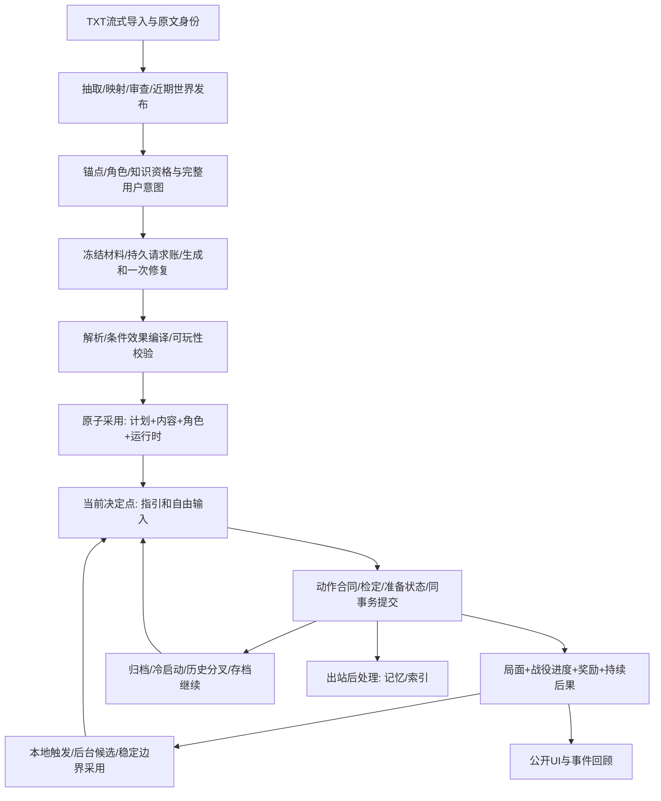

# Phase 9 全流程与模块复核

2026-10-07，按用户要求先通览数据流与合同，停止新增真实请求，再按模块审查。此记录不代替A01–A40。

权威边界：原文事实只能由审查后发布资料提供；未来设计不是已发生事实；行动合同和骰点先冻结；局面/角色/战役进度/奖励/事件必须在一次提交一致；模型只提出候选和叙事；公开UI不能承担修复权威状态的职责。原文增量与战役设计为两个命名空间，当前分支只消费已采用工件。

| 模块 | 入口/交接 | 本轮review重点 | 验证顺序 |
|---|---|---|---|
| M0导入/世界建设 | mobile/sourceImport、streamingTxtImport、worldBuild、worldPackage | 全TXT身份、部分覆盖真实性、审查/fence、ready可玩闭包 | 已有import/phase6与发布回归，真实世界证据复用 |
| M1开局资格/意图 | OpeningScreen、campaignPlanning、buildPlanningContext、createCampaign | 原始约束不裁剪、canon当前能力、NPC实际在场、同意图采用 | 意图/资格单测→采用事务 |
| M2冻结/请求 | candidateJob、jobFreeze、generationService、requestLedger | 响应先落盘、共享2请求、损坏0发送、未知不重放 | 故障注入→恢复集成 |
| M3解析/编译/门禁 | candidateModel、localCompile、planValidation | ID闭包、四档、结构无损归一、可执行内容覆盖 | 真实响应离线→编译回归 |
| M4采用/归档 | adoption、createCampaign、replanService、SqliteCampaignPlanStore | immutable hash、setup/job/state fence、半成品不可见 | 双击/取消/事务中断→重入 |
| M5内容/指引/回合 | contentResolver、CampaignSession、v2Compile、guidance | 主线/普通办法一致、选择资格、pre-roll效果、当前公开投影 | 点选/改写→四档→当回合证据 |
| M6本地动作/战斗 | rest/train/lifecycle、EncounterService、commitTurn | 所有提交路径是否同样结算进度/后果，NPC步骤不能被当玩家决定 | 每入口真实生产Session集成 |
| M7重规划 | evaluateReplanTriggers、runCandidateJob、adoptReplanCandidate | 旧终态不复活、当前材料、stable CAS、已准备节点激活 | 进度→排队→生成→采用→下一步 |
| M8恢复/分叉/存档 | playRecovery、fork、saveFile、SqliteTurnStore | 快照与投影同身份、只读历史、重绑碰撞、归档完整 | 强停→分叉→存档→继续 |
| M9Android展示 | usePlayController、CampaignProgressCard、OpeningScreen | rerender/前后台/分支fence，当前按钮与权威版本一致 | 最终APK UI→主题/字体/小屏 |

全局通览确认的跨模块问题：

- R01：普通回合的record_event没有进入当次求值，历史又存作recordEvent。已统一合同事件投影和历史业务名解释，生产Session验证当回合完成和奖励同版本入账。
- R02：rest/train/milestone/lifecycle漏战役结算。已共用prepareLocalAuthority与本地enqueue入口；休息兑现延迟后果、训练与里程碑、招募均验证同提交推进与0HTTP。
- R03：EncounterService的begin/join/mechanical commit漏战役结算。已接入Session预载与归约回调；开战/战斗轮次生产Session集成通过，原机械动作保持0HTTP。
- R04：已编译首局面仍带模型provisional，且当前available主线采用后不会升active。已本地修复并回归，最终设备证据待重跑。
- R05：完整consequences/rewards嵌在firstSituation时被忽略。已无损归一；双位置歧义/非法定义继续拒绝，不补造后果。已有真实响应离线证据和回归。
- R06：重规划首局面绑定已定局/退休节点会产生不可玩ready。新增编译门禁，复现验证初次加一次修复仍无效则invalid，保留原提交状态。
- R07：训练/生命周期整卡upsert覆盖主线技能与资源上限奖励；训练后准备态仍读取旧技能等级。已投影训练准备态、合并最终技能/上限，训练与晋级奖励同回合、SQL/快照/冷读取一致。
- R08：普通社交准备态已含关系增量，SQL又叠一次。改为持久最终值，社交成功与主线奖励组合各一次。主线曾自设-5..5，与既有0..100关系合同冲突；条件、提示和归约统一复用既有标度，6次实际社交后门槛6与奖励得到7。
- R09：本地结算只校验计划hash，缺失工件被跳过。补齐工件主体/身份/SQL hash与组合binding校验，损坏时休息和开战均不提交、不HTTP。
- R10：J3恢复样本首阶段引用新self里不存在的旧承诺，同时要求resolved但没有完成效果。新增situationId+promiseId闭包（已有提交或显式create），当前新局面完成的局面/计数/承诺至少有对应效果来源；all/any保留合法替代路线。这是必要结构门，不宣称完整可达性证明。旧承诺在原局面兑现的生产回归仍通过，不改真实样本内容。
- R11：四主题实际截图显示主线卡在三个深色皮肤用默认黑字。统一主线卡、开局提案、规划状态与项目建设提示的onRaised文字色；对应模块按最终APK实际截图复测，不用XML可见替代视觉可读性。
- R12：最终长篇J3在阶段失败后primary=null，post-commit重规划只检查当前primary，漏掉失败。补齐无主节点的失败/待准备触发，并在失败/取消的同次提交写公开反馈；生产Session验证失败、不奖励、只排一个任务、休息不发HTTP，也不因已接上新阶段重复触发旧失败。
- R13：超时会使局面resolved，裸resolved完成条件误授成功。新候选要求定时完成路径有独立成功证据；结算还排除pressure_deadline_passed作为正向resolved证据，防止已有部分进展再超时获奖。生产Session验证查看取得计数→长休到期→不成功、不授奖、0HTTP；all/any/not保留独立成功路径与真实否定语义。既有正常完成和终态保护仍通过。旧存档的超时结果UI标为待复核，不改历史快照。
- R14：320dp宽、1.3字体实际键盘截图显示输入框和行动按钮被遮住，XML仍报告可见。普通页面改由ScreenShell统一KeyboardAvoidingView避让，独立Modal由PlayPanel避让，输入时收起非输入区域，删除ActionComposer重复padding；目标编辑输入及提交可滚动到键盘上方。edge-to-edge技能的Compose迁移前提不适用于React Native，本轮未迁移UI框架。
- R15：动态字体变化重建Activity但复用RN host，留下旧文字测量并丢失游玩路由；manifest增加fontScale，让既有RN 0.85配置回调刷新metrics并重新布局（框架开关默认已开启，不新增覆盖）。配置变化后调用DeviceInfo既有字体缓存刷新，使JS Dimensions与原生字号一致，底部导航按字号和safe-area高度布局。大字号/矮窗口快捷行动随正文滚动，防止固定控件把正文挤得不足一行；关闭目标草稿同时关闭键盘与清除草稿，返回主线。最终字体/主题截图另存，不以XML替代视觉核验。
- R16：411dp目标草稿与键盘同时打开时，独立Modal没有顶端安全区，标题/关闭按钮进入状态栏，真实点击未关闭。PlayPanel给键盘避让容器预留top inset、底部sheet预留bottom inset，覆盖所有游玩面板。final10截图保留为失败；QA关闭与前后台断言改为检查Modal和IME确实消失，避免只凭背景标题误报通过。最终APK重新跑完整链。
- R17：真实J2候选多次复制生成提示里的连字符eventType，而生产解析器要求snake_case。修正consequences示例和明确事件名格式，保留严格拒绝；新增生产提示示例→候选解析回归，也验证连字符仍被拒绝。旧两任务invalid、第三在途停止留账，不继续使用旧提示派发。
- R18：冷启动字体布局正常，但前台1.3→2→1.3→2截图显示原文字测量被保留，字被裁切。已读取本机RN 0.85原生链：Fabric的fontScale在root measure更新，ParagraphShadowNode缓存旧文字内容。只重建显示子树或只请求根布局均不足，final12/13失败截图保留。MainActivity配置变化后对实际root强制measure，在一次global-layout之后刷新DeviceInfo；ScreenShell随后按fontScale重建显示子树，底部标签也重建，业务/导航状态在上层保留。final14三次实际切换均可读，正文视口426/412/426px，v24与路由一致；QA测量真正scrollable正文，未将覆盖整屏的非滚动容器算正文。
- R19：final14新J1生成加修复后，关系奖励只有fromActorId没有targetId，解析器把奖励数组直接强转，后续actorInScope对undefined调用startsWith，误归类为retryable_failed。真实响应离线复现后，补齐奖励kind/targetId/toActorId/rank/delta和策略nodeId校验，缺失ID不再String(undefined)；阶段/结局/后果/奖励中的null元素安全拒绝，actorInScope作运行时类型防护。提示明确关系奖励与relationship_shift效果的不同字段。新增非法形状与两物理响应后invalid/零发送重入生产回归；不补造目标人物或修改模型内容。修复前设备任务和响应保留，随后只按原响应恢复。
- R20：final15设备最后一份候选的生成/修复都把skill_rank.rank写成数字1，原提示与反馈未列出合法值。补齐字符串等级白名单，并在解析错误中列出untrained/novice/trained/expert/master和禁止数字的原因；关系奖励说明改成字段语义，避免JSON示例中的中文占位ID被照抄。新增读取实际生成与修复材料的生产任务回归：首响应数字rank→一次修复为novice→ready，总共两请求。硬门、骰点和模型响应内容均未被修改。
- R21：对同类解析边界集中复核，离线复现requires.skillId数组通过解析后在compileMethods调用replace抛异常。方法前置条件现在校验对象、ID、字符串等级、0..100关系门槛及成对字段；候选/条件/效果/行动/结局枚举拒绝数组冒充字符串。既有可选null表示无门槛/无目标的语义保留，不抹掉合法条件。新增两响应后invalid、原文保留、恢复零HTTP以及完整合法门槛/可选null回归。final16真实ready原响应未经改写，在final17重新解析、编译、校验均通过，plan contentHash逐字相同；显示模块源码仍与final14相同。

新增跨模块证据：tests/phase9-flow.test.cjs，最终16项生产Session/SQLite集成全部通过；最新domain/flow/turns组32项通过。原成功夹具缺少resolved效果，现在补上真实效果来源，未删断言或放宽门禁。存档集成发现测试与真实后台记忆worker竞态，测试现在等待running结束，保留生产stable-export拒绝规则。

变更后执行顺序：受影响模块回归→跨模块生产集成→完整核心/移动类型门禁→对应APK→有界真实旅程。首批核心995/995；第二批997/997；补充“部分成功再超时”后998/998；修正生成事件示例后999/999。随后移动布局变化重验typecheck及对应APK；R19奖励解析修复后完整核心1001/1001；R20明确技能等级合同后再次完整核心1002/1002（0失败0跳过）、移动typecheck和final16 APK。R21前置条件类型门及可选null兼容后全量1004/1004、移动typecheck和final17 APK通过。100/300/1000累积实际运行。模块问题先合并修复、再跑交接回归，不在未验证期间扩散请求。性能/内容门与工程门独立。

模块审查证据：M0由txt-import/多部导入/world-build/phase6-source-index与正式TXT世界样本覆盖；M1由opening与phase9-planning；M2由ledger/request-governance及phase9-closeout冻结/崩溃/损坏组；M3由phase9-domain、closeout真实响应归一及flow闭包；M4由phase9-sqlite、adoption幂等/fence组；M5由phase9-turns/guidance/current选择；M6由phase9-flow与phase2战斗/成长；M7由phase9-replan与closeout真实采用；M8由save-10/分叉/强停恢复与flow冷读取；M9为最终APK截图和ADB实测，XML只用于定位与断言。未齐的真实合同仍留在A01–A40。

final14设备显示复测：360/411dp × 1.3/2字号四组均完成冷启动、行动键盘、主线底部、目标键盘、关闭与前后台；另做前台1.3→2→1.3→2动态变化。未提交目标FontChangeDraft在字号变化后滚动可达、内容保留，关闭后无Modal/IME，个人页路由与主题入口保留。四主题各检查主线卡和展开面板实际截图，共八张；全过程旧分支v24不变、未派发HTTP。证据为reaccept-device/final14-layout.json、final14-dynamic.json、final14-font-draft.json、final14-themes.json及同前缀PNG。测试脚本最初把离屏输入当丢失、ADB按键未等待输入完成，已修定位与等待后复测，未因此修改产品状态或代码。

第二批修复：受影响flow/closeout/replan/turns共52项通过。round2首次全量两项planning夹具缺少超时与成功的区分，已补成功计数条件；同时出现100ms租约心跳测试超时，构建结束后独立完整997回归通过，旧失败日志保留。最新日志：reaccept-parser-flow-final17.log（解析/规划/flow 55项，可选null兼容另在完整核心覆盖）、reaccept-core-final17.log（1004项）、reaccept-mobile-final17.log、reaccept-apk-final17.log（35s）。最新身份reaccept-identity-final17.json；final17全部移动/原生显示源码逐文件与final14相同，final15实际恢复原奖励响应为invalid，该规划任务两次请求未重发。identity scope v2同时包含原生Android与构建输入，旧样本不被改写为最终身份。

## final19接手收尾

延续M0–M9交接审查，集中修复后再完整回归，R22–R25如下：

- R22：真实r2/r5与旧J3都允许success反复增加计数，completion却等full_success专属resolved/事件。提示已要求普通成功路径，但模型仍违约；新候选任务增加必要的效果来源门，all/any保持语义，已调度且触发有来源的延迟效果可参与闭包，未调度/循环/仅大成功调度不能补足普通成功缺失的标记。门只用于新生成候选的共享校验/一次修复，不重解释已经采用的归档。它不是完整可达性或文学质量证明；外部事实、资格和否定条件仍由既有门负责。生产两次success计数完成、修复后ready、两响应invalid/零发送重入、替代条件与延迟条件回归通过。
- R23：requires拒绝只说unsupported field，提示未列完整字段，模型无法可靠修正。解析与生成提示共用METHOD_REQUIREMENT_FIELDS；错误写出未知字段及允许字段，要求用支持的知识/物品/关系门槛或另一办法保留准备限制，不静默删除。实际生产修复从knowledge字段转为knowledgeEntryId、归档保留合法知识门，2请求ready。仍拒绝未支持的任意条件，不新增未经审查的引擎权限。
- R24：QA代理将任何错误合成503，丢失“上游可能完成”的语义。预留失败在派发前返回429；派发后异常关闭连接，生产账本记network_unknown/outcome_unknown并禁止重发；真实上游503及Retry-After原样转发。三个localhost真实HTTP+生产SQLite账本测试通过，测试不使用真实凭据或消耗共享预算。通用错误自动重试与无主线generic兜底已从私有UI驱动器移除。
- R25：接手记录将提交次数等同有效决定，撤销UI20+10完成声明。保留原JSONL/SQL证据，J1最后五次与J4新增十次不计。源码身份scope v3补入实际打包的mobile/src/version.json，旧scope v2身份保留，避免buildTime改变未被身份覆盖。

最终工程门：verify:core 1012/1012，0失败0跳过；跨模块/domain/turns/planning/replan/proxy组42/42；mobile typecheck、debug APK、verify:version、diff --check通过。日志reaccept-*-final19.log。当前设备复验使用reaccept-identity-final19.json对应APK，不将旧流水更名为最终流水。

## final21：以状态边界统一模块交接

重新核对M0–M9全局依赖后，本轮将根因落在M4/M5/M7的生命周期边界，没有在Android隐藏按钮或人工改写存档。

- R26：重新规划采用保留旧粗节点available/primary，新concrete首局面也available。共用progressReducer依据coverage和依赖选择可用具体阶段，保留活动具体阶段优先权与暂停语义；生产采用同提交的primary/publicObjective/节点状态一致。final19失败v29保存，final20原归档上短休v30激活，v31普通成功完成并兑现旧承诺，下一次自动采用v32也正确激活。
- R27：阶段可以由事件/承诺完成，而Situation仍active。完整历史目录被同时当作可选行动目录，且结算后指引沿用结算前定义，导致结局后旧方法与压力复现。contentResolver增加共用projectPlayableSituations，以输入runtime排除已定局阶段和结束战役的行动内容；完整归档仍供结算与跨阶段引用。Session的行动编译、Planner、准备态Narrator packet、提交即存指引、冷启动/本地动作指引全部消费同一投影；准备态使用prepared.nextState，当前指引使用当前提交态。contextHash随投影变化，旧同版本缓存本地失效。世界普通方法保留，暂停不强制改变可探索路径。

读写职责如下：

| 边界 | 唯一权威/输入 | 消费方 | 禁止的替代行为 |
|---|---|---|---|
| 规划归档 | 采用事务验证后的不可变plan/artifact/hash | 结算、恢复、旧承诺与后果引用 | 为修UI修改归档或复活旧节点 |
| 进度写入 | 同事务准备态事件与CampaignProgressReducer | snapshot/runtime、事件、奖励、publicObjective | 模型文字或UI按钮直接判阶段成功 |
| 可用行动读取 | 归档目录＋当前/准备态runtime的共用生命周期投影 | 编译、Planner、Narrator packet、公开指引 | 仅靠Situation.active判断旧阶段还可行动 |
| 缓存/UI | 内容/知识/上下文/版本绑定的当前指引 | Android按钮与恢复界面 | 结算后复用结算前定义或只在UI屏蔽 |

四项生命周期生产回归通过，包含普通事件完成但局面active、结束状态、准备态叙事与立即保存指引、同版本旧缓存更新、过期选择0HTTP、普通探索不附旧效果、旧承诺跨新阶段兑现、暂停/四种终态、归档字节/hash不变。完整verify:core1017/1017，0失败0跳过，移动typecheck与35s debug APK通过。final21模拟器v33实际截图、runtime、campaign_ending、最终叙事与归档一致，新增0决定/0HTTP。旧失败证据保留；A34PASS不外推完整80或成功救援。

## final23：准备条件与局面退出的统一合同

final21已提交为eb48daeb835b0a0939b9f41fe0526261bb24ba1a。继续从M1意图→M2规划请求→M3解析编译→M5资格/结算/指引→M7重规划的交互检查发现：

- R28：MethodRequirements已支持condition，但候选作者接口禁止它；snapshotConditionFacts也未提供承诺/计数/节点读取，只有进度归约器私有实现。现在作者接口允许有界现态条件，复用原条件解析和本地编译，统一self/玩家身份、引用范围与条件形状校验。指引和进度归约器共用snapshotConditionFacts。方法门槛不开放committed_event历史查询；未存在的承诺/计数仍为UNKNOWN，not不能绕过。生产Session/SQLite回归证明证据→履约→交付分三次提交，未满足门槛的选项0HTTP/0状态变化，冻结四档归档不变。
- R29：真实Android普通success复现“关系0→1、局面resolved、阶段要求15仍active”。现有stage_content_needed正确重规划到r2，恢复能力保留；但新提案不能把这种自动恢复当作首阶段完整可玩的证明。新增只用于候选作者的乐观效果上界：非关闭准备办法可供给条件，最多一个关闭办法结算；不能合并或反复执行已经resolved/suppressed的方法。有向关系取冻结现态基线，缺失从0开始，反向关系不替代。all/any分别检查并保留合法替代、预先准备、当前关系和延迟来源。它仍是必要条件分析，不能宣称全路径求解或内容质量通过。

七项准备/退出回归及全部核心1024/1024通过。真实final22原提案、原模型响应、v0/v1/r2记录保留；新门禁离线检查原始真实归档会拒绝该关闭后累积路线，没有修改设备SQLite或原归档。后续模拟器验收继续绑定新的源码与APK身份，不将此诊断旅程拼入最终80。
## final25：结局必须区分尚未完成与实际失败

- R30：final23真实J1普通成功阻止处决后，结局条件为n3成功且NOT town_support_gained。镇民协助在后续n5，n4持续安全尚可用、n5尚计划中，该条件却自动终止战役。新增候选作者专用validateEndingCompletionOrder，按next/statusDependencies追踪后续主目标，保留all/any/not极性，在后续目标未完成且尚无失败、取消、死亡或毁约的假设下检查提前结局是否仍可成立。OR分支不能借另一分支的损失标记绕过。保留真实失败结局、可选目标和退休节点；不改运行时布尔语义、不回写旧计划、不影响ready恢复。此门只覆盖可辨识的后续事件/节点否定依赖，不是完整条件可达性或语义质量证明。
- R31：final24真实J2的第二次响应把计数条件直接写为requires的根对象，严格解析正确invalid。现在生成提示给出完整requires.condition示例；针对误放的白名单AST明确要求包入condition并保留原字段/门槛，不静默转换或删除准备要求。final25的新J2任务经生成加一次修复ready；原失败任务和原响应保留。

R30五项回归覆盖前后阶段、实际损失门、OR旁路、嵌套极性、optional/retired及生产任务两次请求修复/ready重入零HTTP；R31另有精确结构反馈回归。完整verify:core1030/1030，移动类型、debug APK、版本及diff门通过。源码及APK身份见reaccept-identity-final25.json；真实完整旅程和内容质量继续独立验收，不能以结构门替代。
## final27：人物身份与作者字段的共同边界

- R32：final25救援候选按规划材料明确列出的npc-actor-canon-…在场身份选择罗兰，本地编译却只接收模板身份；进度条件、结算与指引均能识别该NPC。抽出actorReferenceInScope共供计划引用校验和办法编译，仅接受已有范围内模板对应的npc别名，未知/重复前缀仍拒绝。在关系准备门中也通过现有resolveMethodActor读取实际有向关系，模板与实卡身份保持一致，不使用反向关系补足门槛。三项回归包含未知身份拒绝、关系14/15与方向、生产Session点选和同义自由输入绑定同一冻结办法；原真实失败响应离线编译0HTTP通过且目标身份未改。
- R33：final26合作响应的四项proposal字段齐全，真正错误是tone 43字超过原40上限；“required”笼统错误使一次修复仍未修正。PROPOSAL_TEXT_LIMITS统一生成提示与解析边界，逐字段报告实际长度合同，不截断或丢弃目标。两项回归覆盖四字段最小/最大边界及生产两请求精准修复、意图保留和ready重入0HTTP。生成要求补充计数单位与首步成果一致，不能用一份证词+10绕过多份独立证据；这项仍由真实内容评分检验，不声称静态代码能判断所有叙事语义。

完整核心1035/1035通过，日志reaccept-core-final27.log；移动类型、34s debug APK、版本与diff通过，APK22fda466b027fb5d389bc635758dd9dbf36a9b2b5be549f92e2ce2534a0cdfc8已验证实际安装。此前final26并行构建时短lease定时用例失败，单项9/9及串行全量1033/1033通过，日志保留，不删除用例或放宽超时。

新增tools/phase9-journey-audit.cjs仅只读SQLite，支持指定分叉基点后的区间；资源耗费、时间、练习记账及管理行不代替持久事实，输出仍明确要求语义复核。实际旧J4 v27之后10次全部排除，final23救援4次保留为候选有效决定，均无隔两决定后果证明。工具不修改小说、模型响应、设备状态或已采用归档。

## final28：跨阶段完成证据与终局出口

final27三意图实际复验：J1生成加修复后因期限可能被当作成功而invalid，0决定；J2推进7项持久变化后，新修订的末端主节点没有终局引用，2请求后invalid；J3共有11次提交/状态差异候选，但work达到20后依然不能推进，实际只允许大成功兑现旧局面mine-aid-promise。其余counter增加未消除缺失的履约条件，不能计完整11个有效决定。

- R34：ordinary-success作者门原来只分析新工件自己的局面，漏掉completion中旧局面承诺的本地大成功专属producer。将冻结已提交situations作为CompletionBaseline传入，旧承诺/计数/状态若已经满足直接沿用；明确尚未满足且在新内容有producer时，必须有普通成功的可供给路径，并遵守当前局面关闭边界。无基线/缺失数据保持未知，不捏造“尚未完成”的事实。共享marker匹配和基线读取供两个必要门使用；没有修改旧档或骰点。
- R35：终局顺序门从“否定后续成功”扩展到可辨识的前序成功触发，无需出现NOT后续才检查；success/pyrrhic/open均不能自动剥夺后续必做main的行动机会。真实失败/取消/死亡/毁约门、合法替代路线、optional及retired仍保留。真正不属于完整目标的后日谈应由作者明确标optional，不由本地强行改角色或补造结局。仍是必要结构分析，不是完整可达性或语义评分。

四项跨阶段回归覆盖开放/已兑现/未知承诺、旧计数及关闭边界、旧状态、生产2请求修复后普通成功履约；终局另增裸前序成功/无失败否定/可选后日谈回归。原final27 J3采用工件离线被两个门同时识别，0HTTP、原数据库hash不变，证据final28-real-regression.json。完整核心1040/1040，0失败0跳过，33.094s，移动类型、33s Debug构建、版本及diff通过。

## final29：生成与恢复共用持久任务状态

final28高思考强度三意图对照均在300秒超时，opening_plan各1请求后outcome_unknown，没有修复/自动重发或玩家决定。设备恢复同一任务0HTTP、预算1160保持，但界面把账本的outcome_unknown显示成“提案校验未通过 / job outcome_unknown”，故障截图保留。

R36将开局桥接层的恢复结果改为PreparationView（proposal、phase、error），冷启动与显式恢复共用projectPreparation读取持久任务分类；OpeningScreen消费该结果，不将所有未ready情况强制降为failed。未知结果明确保留可能已计费及恢复不重发的信息，合法ready恢复、invalid校验失败仍分开。没有增加未知请求的重放入口、改写账本、增额或用新任务替换原冻结材料。两项生产SQLite/移动桥接回归覆盖重复未知恢复的0HTTP/输入与job不变、invalid分类、完整ready零HTTP恢复。

final29端上在同一未知job保留数据安装后，冷启动与显式恢复均正确显示未知，原意图完整、规划仍1请求；冷入口独立opening_goal 1次另记。实际360/411dp fontScale2补验提示与控件可达，恢复font1/密度420。原v33自然结局的显示、叙事与事件复验0决定/0HTTP，snapshot/runtime/归档hash、承诺及分叉不变。完整核心1042/1042（36.604s）、移动类型、35s Debug构建、版本与diff通过；证据final29-recovery-display.json、final29-ending-reacceptance.json。R28–R36工程收尾纳入本次本地提交，真实旅程及质量缺口仍保留。

## 2026-10-08 final33：长规划的传输、租约和物理预算

R37：opening/replan共用candidateJob，以owner+fence CAS续租覆盖排队、请求及修复；取消/接管/续租失败后不发布，已收到业务原文仍可持久化。R38：共用provider按冻结kind/tier给high规划900秒、max1200秒等待上限（不是吞吐预测）；支持streaming的高强度规划接收SSE，完整结束标记与finish_reason齐备才返回业务正文，思考绝不回填正文，断流保持未知且不重发；流式能力纳入profile身份，旧buffered指纹兼容。R39：GLM预设声明流式支持，高级设置、预算预览和store共用显式能力上限；设备正式UI保存后仍为1M/32768，content16384、high、Keychain引用未变。R40：生成、调度和ledger共用最多2物理请求，单次dispatch的maxPhysicalRequests=1；仅已知reasoning_only允许一次内核1.5倍预留重规划，仍保留档位/材料/模型声明上限。思考恢复与结构修复共享额度，未知不重试；重启消费原冻结根和剩余额度，异常时physicalRequests按durable ledger实派次数报告。

final30诊断分别为J2 Node fetch约307.035秒断开、J3去除该隐藏响应头时限后约329.597秒上游socket hang up；各1次网络未知、0候选/0决定，不重放。运行时Node v24.14.1 / Undici7.24.4的默认headersTimeout=300000，QA换用单总时限原生HTTP，并真实转发SSE头/分块，测试覆盖迟到headers、未结束body、未知断连与预算拒绝。final31流式调查诊断三次HTTP200分别612.381/568.535/622.607秒，三次wire均24576；思考几乎耗尽输出，0业务候选，最终retryable_failed。旧调度层同预算重复3次的实际证据触发R40，不能把它称作有界候选修复，也不能称通过两请求合同；未改写其历史账本。该诊断在构建/后续修复前启动，执行身份仍绑定原文件，不升级为final33配额。

生产scope v3源码1d0e6778c600e7c788c0d5fbcd4ba8c0cc09eb4c2a2e9b930a2fd7318c9ec3a7；Debug APK 3f51242ac7a6f89580d378c85b829444c2d74afe0d524773726d42cc7f1eb31b，109474379 bytes，V1.0.0 / 1000000，emulator-5556实际安装hash一致。完整核心1065/1065、0失败0跳过（reaccept-core-final33b.log，34.325s），移动typecheck、41s Debug构建、版本与diff通过。新增23项回归，所有前置RED日志保留。

final33正式Android救援任务job-setup-world-src-7f45fe0b11ea30ec-muwccd51-muyb1p8u在约523秒、返回前台时转为outcome_unknown（Network request failed）；此前后台约58秒，进程26168存活、崩溃缓冲无异常。代理上游随后在565.527秒收到HTTP200/5026703 bytes，晚于客户端失败，不能据此认定上游超时或固定原生读取时限；RN默认读取/调用时限为0。具体原生断连原因尚未证明，规划缺少Android执行生命周期保护，作为下一修复点。原意图、冻结high/stream/32768/物理额度2及1次账本保留，0候选/0决定，禁止未知重放。此前未知任务也未重发；独立opening_goal 1次单列，共享预算1168/1500，无重置/增额。证据final33-background-failure-proof.json、final33-background-events.log和final33-j1-after-background.json；当前代理18691、原库与AVD保留，尚未最终清理配置。

完整目标继续执行，阶段整体仍未通过；A01–A40维持29 PASS / 2 FAIL / 9 NOT RUN。新身份未完成J1/J2/J3各20及同基点双分支各10，没有把请求、管理、采用或旧身份诊断计入80；两项隔两次决定的持续后果、三计划及对应旅程六维全部≥3仍待实测。

证据：.tmp/phase9/reaccept-identity-final33.json、reaccept-device/identity.json、final30-host-J2/J3、final31-high-diagnostic-proof.json、final33-targeted.log、final33-budget-expanded.log、reaccept-core-final33b.log、reaccept-device/final32-profile-proof.json及final32-preset-explicit-ceiling.png、final33-j1-goal.json/.png、final33-j1-status.json。

## 2026-10-08 final34–final35：整个规划任务的生命周期与已知截断恢复

final34 是诊断身份：源码 c5ef62dd88afa74082a41b9c1be26459462386ca0cccd4465bf3d437a3826b2d，APK a8ff88de83c6754091b4f5194fd0508cc127d9480474fd696a2c72a674b96c84。1071/1071 核心、移动类型及构建通过。Android J1 两次 HTTP（369.968/187.095 秒）得到 ready 提案，前后台传输成功，但结束后服务/唤醒锁未释放；没有采用或玩家决定。主机 J2 两次后 reasoning_only→length，J3 一次 length，均无候选。J1 初稿还引用了未定义的知识 ID，结构修复后才 ready。原记录不追溯改为最终通过。

R41：开局与重规划共用 acquireExecution 端口，Android 使用不包含 job/文本/密钥的 opaque token；一个有界生命周期覆盖排队、全部两次请求、校验及最终事务。单 HTTP 保护仍覆盖完整 body，不能在修复间隙失去保护。SQL lease/fence 和 ledger 是唯一执行权威；原生服务与 headless task 不执行、不恢复、不重发业务任务。iOS/主机保持既有执行路径。

R42：补齐当前 RN TurboModule 桥中的 HeadlessJsTaskSupport 完成契约。JS Promise 结束后，框架完成相应任务；规划服务只清理自己的 task IDs 和独立唤醒锁，不释放世界构建的共享锁。0 HTTP 的不存在 runId 复现中，原先滞留的 WorldBuild 服务现在自动退出，ACQ/REL 间约 33ms，候选/采用/账本及预算不变。真实长规划也已自动释放。

R43：finish_reason=length 的非空正文明确记录 invalid_response/length，而非 http_client；部分 JSON 不成为候选。已知 reasoning_only 或 length 最多使用剩余的一次请求，依据持久 reasoning usage 下界与原策略重新经过预算内核和调度预留，恢复目标使用允许的业务输出余量；不称单条观测为 p95。模型声明上限、完整意图和冻结根不变，未知不重发，结构修复共享两 HTTP 上限。没有第三次请求。

final35 生产 scope v3 源码 aa1093a26d32b654d52aa64c483721c18d4a6d11dccb1208bcba9c1069ef138f；Debug APK 6c73d2d3cee1f1100cce281446a19406280bbd85c938f085700600d1c15e398f，109480639 bytes，V1.0.0/1000000，emulator-5556 实际安装 hash 一致。完整核心 1078/1078、0失败0跳过（32.687 秒），移动 typecheck、43秒构建、版本检查及 diff 通过。首轮全量仅两项移动夹具缺少新端口 mock，修夹具后全量通过；RED/首轮失败日志保留。新增 13 项核心回归。

同一 final35 身份的 high/stream 三意图真实诊断均完成，每个至多两 HTTP：

| 样本 | 实际 wire/用量和耗时 | 最终状态 |
|---|---|---|
| Android J1 救援 | 24576：思考24536，481.428秒；32768：思考29814，601.332秒 | retryable_failed，第二次正文 length，无候选 |
| 主机 J2 调查 | 24576：思考24523，493.369秒；32768：思考18628/输出24993，447.024秒 | invalid，完整正文引用未定义线索，安全 rejected |
| 主机 J3 合作 | 24576：思考24503，482.739秒；32768：思考25784，555.514秒 | retryable_failed，第二次正文 length，无候选 |

Android 自23:59:03 UTC观察到 HOME，至00:16:35 UTC代理收完第二次 body，连续后台至少17分32秒，跨两次请求/恢复/校验；lease持续续租，fence仍1。00:17:47 UTC进程29718仍存活，两服务均退出、唤醒锁为空、crash buffer无异常；返回前台保留真实失败。上游均HTTP200，不将200等同候选成功。主机配置端点/Keychain引用与Android不同，不作为匹配性能比较。success账本http_status仍null，200以代理/主机HTTP日志确认，这项元数据缺口保留。

共享预算1174→1181/1500，余319；三规划共6次，独立opening_goal 1次另记，无重置/增额。旧2个未知job、冻结根、attempt逐值不变；全部已采用plan/artifact/snapshot的hash未变。final34未采用ready提案通过正式“重新生成”失效（setup/job cancelled），保留候选原文；没有修改已采用归档。final35新增0玩家决定，不能把诊断凑入最终80。

尚未完成：32K声明下两项真实高强度正文仍截断；方案§7允许设计战役线索，但当前 artifact/resolver 只提供局面，未知知识ID被拒后没有合法的战役线索作者通道，需补齐独立命名空间、不可变定义、分支合成及获得/知识投影。另发现世界增量闭包遗漏已有条目、地点名称误当entryId、旧知识门被删除；隔离副本27项模块回归通过，生产尚未应用。神罚之石的无类型 block_effect 仍需合法机制定义，不能自动豁免审查。完整长旅程、两项隔至少两次决定的后果、三意图六维≥3、A02/A03/A06/A12及匹配性能仍未齐，独立试玩未验。A01–A40维持29 PASS/2 FAIL/9 NOT RUN；第九阶段整体未通过。

证据：.tmp/phase9/reaccept-identity-final34/35.json、reaccept-core-final34b/final35b.log、final35-budget-red/green-b.log、reaccept-device/final34-native-closeout-defect.json、final35-native-closeout-proof.json、final35-completed-in-background.json、final35-preservation-proof.json、final35-planning-failed-after-home.png，final35-host-J2/J3、final35-status.jsonl；原文/数据库均在忽略目录。当前 high 配置与QA代理18691保留供后续验收，尚未最终清理。已按用户授权本地提交R37–R40（a7d263b）；本批R41–R43提交ID见Git历史，未推送/发布。

## 2026-10-08 final36–final37：依赖闭包、战役线索与数据库绑定

共用边界：R44先合并真实旧新目录再校验并发布；R45作者别名→本地独立ID→不可变归档→快照绑定读者→成功提交知识→投影/重规划/存档；R46选定SQLite文件→原生身份持久绑定→通知/headless任务携带身份→JS权威控制写入。世界发布仍有一项未类型化约束审查，不予自动豁免。

身份、回归、实际复现与运行中请求详情见 [FINAL_REPORT](FINAL_REPORT.md)。完整阶段仍未验收通过。

final37 真实规划终态补录：J2/J3自动候选ready并采用，分别8/3条合法战役线索；Android J1第二次38036仍length。全部至多两HTTP，预算1188/1500，原未知任务和设备已采用归档保持。0新玩家决定，内容质量与完整长旅程仍未通过。移动世界书及已知面板的线索回看缺口待下一批修复。终态、用量、后台清理和保护证据见 [FINAL_REPORT](FINAL_REPORT.md)。

## 2026-10-08 final38：共用思考用量反馈（R48）

R48 接入按配置/档位/任务分类的真实账本反馈；完整响应与截断下界分别处理，在新战役、实际回合和记忆材料根冻结，恢复不读新历史。1108/1108核心、移动类型检查与Debug构建通过，Android同意图首次派发60921=48633+12288；候选仍在等待，不能记为旅程或阶段通过。旧归档及2个未知结果任务精确保留；预算1190/1500未重置。作用域、能力边界和证据详见[最新复验报告](FINAL_REPORT.md)。

final38 真实终态补录：2026-10-08 06:50:15 UTC只读复验，J1已 candidate_ready，仅1次 succeeded。实际 wire60921、思考34973、总输出43763（正文8790）、输入8661，可信原始用量，账本耗时777.290秒；无恢复请求。成功账本 http_status 仍为null，上游200另由代理日志确认。两项后台服务均已退出、crash buffer为空，准确释放时刻未采样。全部采用计划/归档/快照及2个旧未知任务、冻结根、attempt保持一致，预算1190/1500。仍未采用该候选、0新玩家决定；这一结果仅确认预算修复与完整候选通过，不能代替内容评分、长旅程或阶段验收。证据：.tmp/phase9/final38-status.jsonl、reaccept-device/final38-status.sqlite、final38-ready-job.json、proxy-final34.log。

## 2026-10-08 final39–final40：共用目录与线索正文回看（R47）

R47统一快照绑定的基础包/世界增量/段工件/战役归档目录与玩家权限。新增6项回归，完整1114/1114通过；final39真实UI失败后继续、获得证词并显示正文，final40保留安装后修复书籍滚动并精确重读同一正文。旧归档及2未知任务保持；跨身份诊断不拼入最终80，完整旅程/质量/审查仍待验收，预算1200/1500。范围、身份、前置失败和原始证据见[最新复验报告](FINAL_REPORT.md)。
