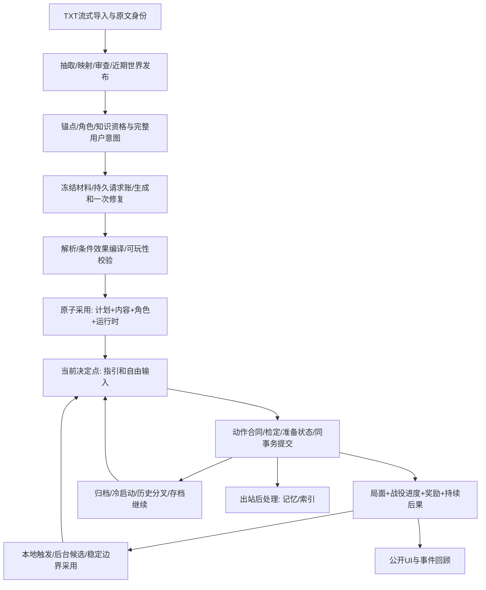

# Phase 9 全流程与模块复核

2026-10-07，按用户要求先通览数据流与合同，停止新增真实请求，再按模块审查。此记录不代替A01–A40。

权威边界：原文事实只能由审查后发布资料提供；未来设计不是已发生事实；行动合同和骰点先冻结；局面/角色/战役进度/奖励/事件必须在一次提交一致；模型只提出候选和叙事；公开UI不能承担修复权威状态的职责。原文增量与战役设计为两个命名空间，当前分支只消费已采用工件。

| 模块 | 入口/交接 | 本轮review重点 | 验证顺序 |
|---|---|---|---|
| M0导入/世界建设 | mobile/sourceImport、streamingTxtImport、worldBuild、worldPackage | 全TXT身份、部分覆盖真实性、审查/fence、ready可玩闭包 | 已有import/phase6与发布回归，真实世界证据复用 |
| M1开局资格/意图 | OpeningScreen、campaignPlanning、buildPlanningContext、createCampaign | 原始约束不裁剪、canon当前能力、NPC实际在场、同意图采用 | 意图/资格单测→采用事务 |
| M2冻结/请求 | candidateJob、jobFreeze、generationService、requestLedger | 响应先落盘、共享2请求、损坏0发送、未知不重放 | 故障注入→恢复集成 |
| M3解析/编译/门禁 | candidateModel、localCompile、planValidation | ID闭包、四档、结构无损归一、可执行内容覆盖 | 真实响应离线→编译回归 |
| M4采用/归档 | adoption、createCampaign、replanService、SqliteCampaignPlanStore | immutable hash、setup/job/state fence、半成品不可见 | 双击/取消/事务中断→重入 |
| M5内容/指引/回合 | contentResolver、CampaignSession、v2Compile、guidance | 主线/普通办法一致、选择资格、pre-roll效果、当前公开投影 | 点选/改写→四档→当回合证据 |
| M6本地动作/战斗 | rest/train/lifecycle、EncounterService、commitTurn | 所有提交路径是否同样结算进度/后果，NPC步骤不能被当玩家决定 | 每入口真实生产Session集成 |
| M7重规划 | evaluateReplanTriggers、runCandidateJob、adoptReplanCandidate | 旧终态不复活、当前材料、stable CAS、已准备节点激活 | 进度→排队→生成→采用→下一步 |
| M8恢复/分叉/存档 | playRecovery、fork、saveFile、SqliteTurnStore | 快照与投影同身份、只读历史、重绑碰撞、归档完整 | 强停→分叉→存档→继续 |
| M9Android展示 | usePlayController、CampaignProgressCard、OpeningScreen | rerender/前后台/分支fence，当前按钮与权威版本一致 | 最终APK UI→主题/字体/小屏 |

全局通览确认的跨模块问题：

- R01：普通回合的record_event没有进入当次求值，历史又存作recordEvent。已统一合同事件投影和历史业务名解释，生产Session验证当回合完成和奖励同版本入账。
- R02：rest/train/milestone/lifecycle漏战役结算。已共用prepareLocalAuthority与本地enqueue入口；休息兑现延迟后果、训练与里程碑、招募均验证同提交推进与0HTTP。
- R03：EncounterService的begin/join/mechanical commit漏战役结算。已接入Session预载与归约回调；开战/战斗轮次生产Session集成通过，原机械动作保持0HTTP。
- R04：已编译首局面仍带模型provisional，且当前available主线采用后不会升active。已本地修复并回归，最终设备证据待重跑。
- R05：完整consequences/rewards嵌在firstSituation时被忽略。已无损归一；双位置歧义/非法定义继续拒绝，不补造后果。已有真实响应离线证据和回归。
- R06：重规划首局面绑定已定局/退休节点会产生不可玩ready。新增编译门禁，复现验证初次加一次修复仍无效则invalid，保留原提交状态。
- R07：训练/生命周期整卡upsert覆盖主线技能与资源上限奖励；训练后准备态仍读取旧技能等级。已投影训练准备态、合并最终技能/上限，训练与晋级奖励同回合、SQL/快照/冷读取一致。
- R08：普通社交准备态已含关系增量，SQL又叠一次。改为持久最终值，社交成功与主线奖励组合各一次。主线曾自设-5..5，与既有0..100关系合同冲突；条件、提示和归约统一复用既有标度，6次实际社交后门槛6与奖励得到7。
- R09：本地结算只校验计划hash，缺失工件被跳过。补齐工件主体/身份/SQL hash与组合binding校验，损坏时休息和开战均不提交、不HTTP。
- R10：J3恢复样本首阶段引用新self里不存在的旧承诺，同时要求resolved但没有完成效果。新增situationId+promiseId闭包（已有提交或显式create），当前新局面完成的局面/计数/承诺至少有对应效果来源；all/any保留合法替代路线。这是必要结构门，不宣称完整可达性证明。旧承诺在原局面兑现的生产回归仍通过，不改真实样本内容。
- R11：四主题实际截图显示主线卡在三个深色皮肤用默认黑字。统一主线卡、开局提案、规划状态与项目建设提示的onRaised文字色；对应模块按最终APK实际截图复测，不用XML可见替代视觉可读性。
- R12：最终长篇J3在阶段失败后primary=null，post-commit重规划只检查当前primary，漏掉失败。补齐无主节点的失败/待准备触发，并在失败/取消的同次提交写公开反馈；生产Session验证失败、不奖励、只排一个任务、休息不发HTTP，也不因已接上新阶段重复触发旧失败。
- R13：超时会使局面resolved，裸resolved完成条件误授成功。新候选要求定时完成路径有独立成功证据；结算还排除pressure_deadline_passed作为正向resolved证据，防止已有部分进展再超时获奖。生产Session验证查看取得计数→长休到期→不成功、不授奖、0HTTP；all/any/not保留独立成功路径与真实否定语义。既有正常完成和终态保护仍通过。旧存档的超时结果UI标为待复核，不改历史快照。
- R14：320dp宽、1.3字体实际键盘截图显示输入框和行动按钮被遮住，XML仍报告可见。普通页面改由ScreenShell统一KeyboardAvoidingView避让，独立Modal由PlayPanel避让，输入时收起非输入区域，删除ActionComposer重复padding；目标编辑输入及提交可滚动到键盘上方。edge-to-edge技能的Compose迁移前提不适用于React Native，本轮未迁移UI框架。
- R15：动态字体变化重建Activity但复用RN host，留下旧文字测量并丢失游玩路由；manifest增加fontScale，让既有RN 0.85配置回调刷新metrics并重新布局（框架开关默认已开启，不新增覆盖）。配置变化后调用DeviceInfo既有字体缓存刷新，使JS Dimensions与原生字号一致，底部导航按字号和safe-area高度布局。大字号/矮窗口快捷行动随正文滚动，防止固定控件把正文挤得不足一行；关闭目标草稿同时关闭键盘与清除草稿，返回主线。最终字体/主题截图另存，不以XML替代视觉核验。
- R16：411dp目标草稿与键盘同时打开时，独立Modal没有顶端安全区，标题/关闭按钮进入状态栏，真实点击未关闭。PlayPanel给键盘避让容器预留top inset、底部sheet预留bottom inset，覆盖所有游玩面板。final10截图保留为失败；QA关闭与前后台断言改为检查Modal和IME确实消失，避免只凭背景标题误报通过。最终APK重新跑完整链。
- R17：真实J2候选多次复制生成提示里的连字符eventType，而生产解析器要求snake_case。修正consequences示例和明确事件名格式，保留严格拒绝；新增生产提示示例→候选解析回归，也验证连字符仍被拒绝。旧两任务invalid、第三在途停止留账，不继续使用旧提示派发。
- R18：冷启动字体布局正常，但前台1.3→2→1.3→2截图显示原文字测量被保留，字被裁切。已读取本机RN 0.85原生链：Fabric的fontScale在root measure更新，ParagraphShadowNode缓存旧文字内容。只重建显示子树或只请求根布局均不足，final12/13失败截图保留。MainActivity配置变化后对实际root强制measure，在一次global-layout之后刷新DeviceInfo；ScreenShell随后按fontScale重建显示子树，底部标签也重建，业务/导航状态在上层保留。final14三次实际切换均可读，正文视口426/412/426px，v24与路由一致；QA测量真正scrollable正文，未将覆盖整屏的非滚动容器算正文。
- R19：final14新J1生成加修复后，关系奖励只有fromActorId没有targetId，解析器把奖励数组直接强转，后续actorInScope对undefined调用startsWith，误归类为retryable_failed。真实响应离线复现后，补齐奖励kind/targetId/toActorId/rank/delta和策略nodeId校验，缺失ID不再String(undefined)；阶段/结局/后果/奖励中的null元素安全拒绝，actorInScope作运行时类型防护。提示明确关系奖励与relationship_shift效果的不同字段。新增非法形状与两物理响应后invalid/零发送重入生产回归；不补造目标人物或修改模型内容。修复前设备任务和响应保留，随后只按原响应恢复。
- R20：final15设备最后一份候选的生成/修复都把skill_rank.rank写成数字1，原提示与反馈未列出合法值。补齐字符串等级白名单，并在解析错误中列出untrained/novice/trained/expert/master和禁止数字的原因；关系奖励说明改成字段语义，避免JSON示例中的中文占位ID被照抄。新增读取实际生成与修复材料的生产任务回归：首响应数字rank→一次修复为novice→ready，总共两请求。硬门、骰点和模型响应内容均未被修改。
- R21：对同类解析边界集中复核，离线复现requires.skillId数组通过解析后在compileMethods调用replace抛异常。方法前置条件现在校验对象、ID、字符串等级、0..100关系门槛及成对字段；候选/条件/效果/行动/结局枚举拒绝数组冒充字符串。既有可选null表示无门槛/无目标的语义保留，不抹掉合法条件。新增两响应后invalid、原文保留、恢复零HTTP以及完整合法门槛/可选null回归。final16真实ready原响应未经改写，在final17重新解析、编译、校验均通过，plan contentHash逐字相同；显示模块源码仍与final14相同。

新增跨模块证据：tests/phase9-flow.test.cjs，最终16项生产Session/SQLite集成全部通过；最新domain/flow/turns组32项通过。原成功夹具缺少resolved效果，现在补上真实效果来源，未删断言或放宽门禁。存档集成发现测试与真实后台记忆worker竞态，测试现在等待running结束，保留生产stable-export拒绝规则。

变更后执行顺序：受影响模块回归→跨模块生产集成→完整核心/移动类型门禁→对应APK→有界真实旅程。首批核心995/995；第二批997/997；补充“部分成功再超时”后998/998；修正生成事件示例后999/999。随后移动布局变化重验typecheck及对应APK；R19奖励解析修复后完整核心1001/1001；R20明确技能等级合同后再次完整核心1002/1002（0失败0跳过）、移动typecheck和final16 APK。R21前置条件类型门及可选null兼容后全量1004/1004、移动typecheck和final17 APK通过。100/300/1000累积实际运行。模块问题先合并修复、再跑交接回归，不在未验证期间扩散请求。性能/内容门与工程门独立。

模块审查证据：M0由txt-import/多部导入/world-build/phase6-source-index与正式TXT世界样本覆盖；M1由opening与phase9-planning；M2由ledger/request-governance及phase9-closeout冻结/崩溃/损坏组；M3由phase9-domain、closeout真实响应归一及flow闭包；M4由phase9-sqlite、adoption幂等/fence组；M5由phase9-turns/guidance/current选择；M6由phase9-flow与phase2战斗/成长；M7由phase9-replan与closeout真实采用；M8由save-10/分叉/强停恢复与flow冷读取；M9为最终APK截图和ADB实测，XML只用于定位与断言。未齐的真实合同仍留在A01–A40。

final14设备显示复测：360/411dp × 1.3/2字号四组均完成冷启动、行动键盘、主线底部、目标键盘、关闭与前后台；另做前台1.3→2→1.3→2动态变化。未提交目标FontChangeDraft在字号变化后滚动可达、内容保留，关闭后无Modal/IME，个人页路由与主题入口保留。四主题各检查主线卡和展开面板实际截图，共八张；全过程旧分支v24不变、未派发HTTP。证据为reaccept-device/final14-layout.json、final14-dynamic.json、final14-font-draft.json、final14-themes.json及同前缀PNG。测试脚本最初把离屏输入当丢失、ADB按键未等待输入完成，已修定位与等待后复测，未因此修改产品状态或代码。

第二批修复：受影响flow/closeout/replan/turns共52项通过。round2首次全量两项planning夹具缺少超时与成功的区分，已补成功计数条件；同时出现100ms租约心跳测试超时，构建结束后独立完整997回归通过，旧失败日志保留。最新日志：reaccept-parser-flow-final17.log（解析/规划/flow 55项，可选null兼容另在完整核心覆盖）、reaccept-core-final17.log（1004项）、reaccept-mobile-final17.log、reaccept-apk-final17.log（35s）。最新身份reaccept-identity-final17.json；final17全部移动/原生显示源码逐文件与final14相同，final15实际恢复原奖励响应为invalid，该规划任务两次请求未重发。identity scope v2同时包含原生Android与构建输入，旧样本不被改写为最终身份。
