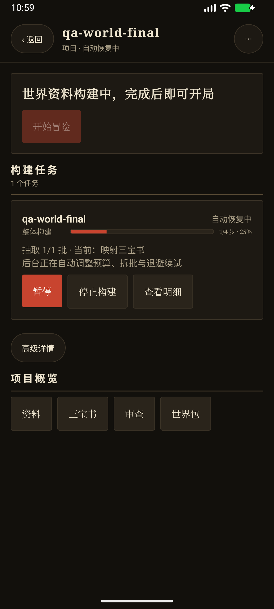
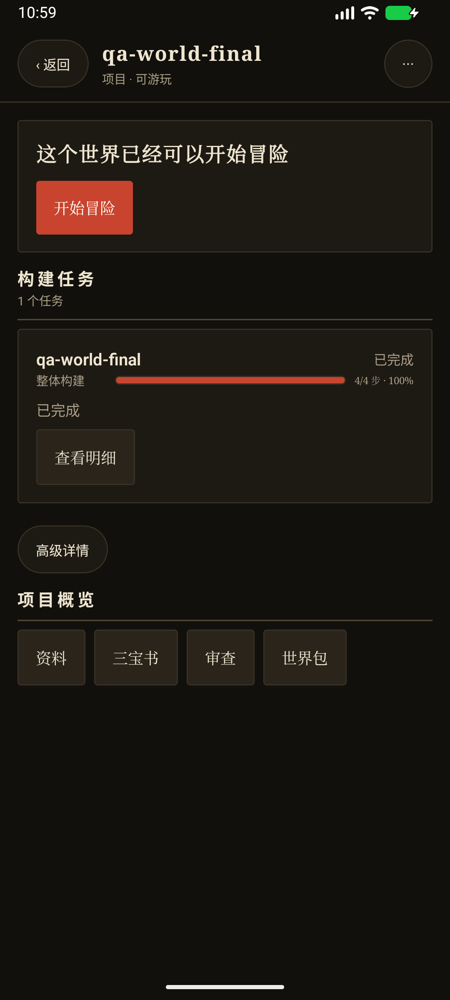
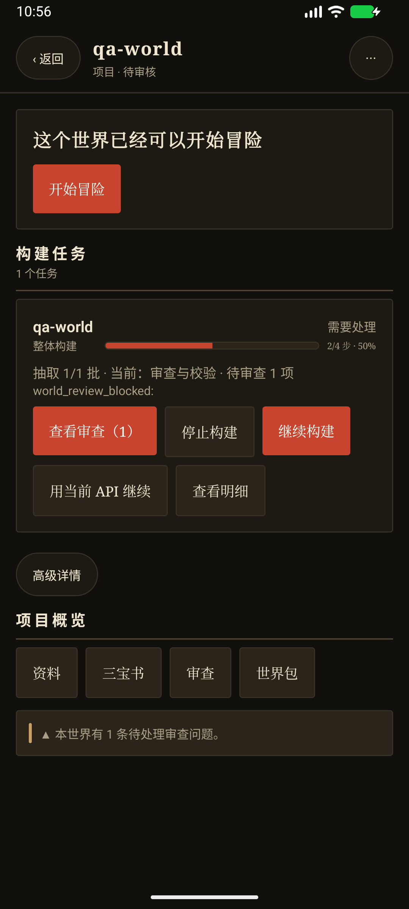
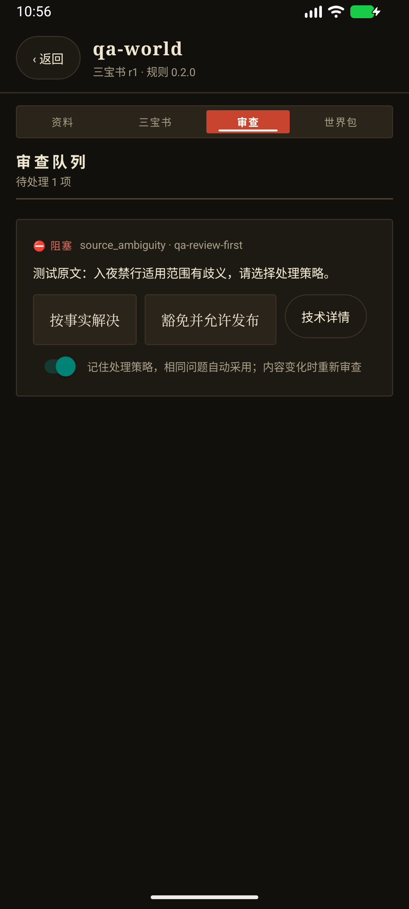
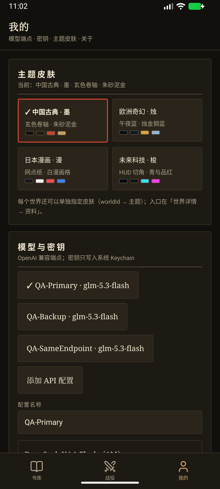

# V0.4.4 世界构建恢复与进度回归

日期：2026-10-01。版本：0.4.4 / versionCode 40400 / schema 27。

本次将映射截断、仅返回思考内容、输出预算不足和批次过大移出人工内容审查。后台自动提高预算、拆分批次、退避续试，保留已完成抽取及映射结果。多 API 记录、重复审查策略、完整构建进度同时落地。

## 自动化验证

| 检查 | 结果 |
|---|---|
| 根目录 TypeScript 类型检查 | 通过 |
| mobile TypeScript 类型检查 | 通过 |
| `node --test --test-concurrency=4 tests/*.test.cjs` | 606 / 606 通过 |
| `npm run verify:version` | 通过 |
| `git diff --check` | 通过 |
| `npm run apk:debug` | 通过，生成独立运行的 Debug APK |

关键回归位于 `tests/world-build-recovery.test.cjs`、`tests/phase2-package-build.test.cjs`、`tests/profile-store.test.cjs`、`tests/project-projection.test.cjs`、`tests/llm-provider.test.cjs`。覆盖真实移动端构建入口、后台恢复循环、停止、配置切换、映射检查点重放和进度门槛。

全量测试显式限制 4 并发。此前默认高并发运行曾使既有 120ms lease 计时用例失败；该用例单独运行及上述并发运行均通过。

## Android 模拟器验证

使用独立 AVD `ShineWord_WorldBuildQA36`，设备 `emulator-5558`，安装 V0.4.4 Debug 包并保留其测试数据。原有模拟器项目未用于这些故障测试。

通过实际导入 TXT、生产 HTTP 传输及本地合成响应端点验证。测试小说含 1 章、4 条有原文引用的事实；使用测试密钥。没有调用付费模型，不能据此保证任何真实供应商故障都能恢复。

### 映射截断及仅返回思考内容

本地端点前 6 个映射响应交替返回截断 JSON 与空正文/思考内容，均带 `finish_reason=length`；随后返回可用映射。端点记录见 [qa-api-trace.jsonl](qa-api-trace.jsonl)。

| 映射请求 | 输入事实数 | 请求输出 Token 上限 |
|---|---:|---:|
| 1 → 2 | 4 | 10096 → 18144 |
| 3 → 4 | 2 | 10096 → 18144 |
| 5 → 6 | 1 | 10096 → 18144 |
| 7、8、9 | 1、1、2 | 10096 |

观察结果：

- 只抽取一次；映射失败后自动增预算、拆分及等待 5 秒续试，无用户操作。
- 项目标题和任务卡显示“自动恢复中”，仅提供暂停/停止等任务控制。
- 抽取已经显示 1/1 时，整体仍为 1/4 步、25%；没有提前完成。
- 后台成功发布后，任务卡保留并显示 4/4 步、100%。
- 内容审查队列为空；没有生成 `mapping_failed` 人工审查项。
- 最终故障回归的 Android crash buffer 和 ReactNativeJS 错误日志为空。

### 内容审查及重复策略

在独立测试项目中注入合成的阻塞内容歧义，模拟等待审查的构建阶段：

- 构建卡显示 2/4 步、50%，并提供“查看审查（1）”，点击后直接进入审查标签页。
- “记住处理策略”开关默认开启；点击“豁免并允许发布”后保存策略。
- 使用生产 `SqliteWorldStore.saveReviewIssue` 写入相同内容、不同 issueId 的问题，新记录立即为 `waived`，开放队列仍为 0。
- 返回项目继续构建，重放已经保存的映射结果完成发布。
- 自动化测试另外确认：内容/严重性变化会重新审查；关闭记忆不会复用；实际原著事实冲突需处理证据。

### 多 API 记录

在应用界面保存主 API、备用 API，并验证冷启动后记录和选择均保留，点击记录会恢复其端点、模型及参数。另添加与主 API 相同端点/模型的独立账号，验证记录不覆盖。

自动化回归确认各记录使用独立 Keychain keyRef，普通存储没有密钥正文；新记录缺少自己的密钥时不能借用其他记录的密钥。正在运行且持有有效 lease 的任务不能切换冻结配置，暂停或失败任务可以明确选择“用当前 API 继续”。

## 持久化及恢复规则

- 映射按实际提示内容缓存结果，并保存拆分计划；恢复会重放提案构造完整世界包，不会仅凭 done 标志跳过数据。
- 后台失败波次采用 5 秒、10 秒退避，持续失败从第 3 波起等待 5 分钟。等待可暂停或停止，进程恢复会读取保存的重试时间。
- API 配置加载时自动迁移已有单条记录，保留原有 Keychain 引用。schema 27 将旧的映射工程阻塞转为可自动恢复任务，清理对应审查通知。
- 只有最终发布成功的任务会达到 100%。映射、审查校验、发布均计入已完成工作步骤；百分比不是耗时预测。

产物：`dist/apk/debug/ShineWord-V0.4.4-debug.apk`。本次未创建 Release、提交、推送或发布。

APK SHA-256：`A0FD58B068E08BF6E996C38C56E006CD7D0D08BDAA1AD730C940F419884CE1C8`。
